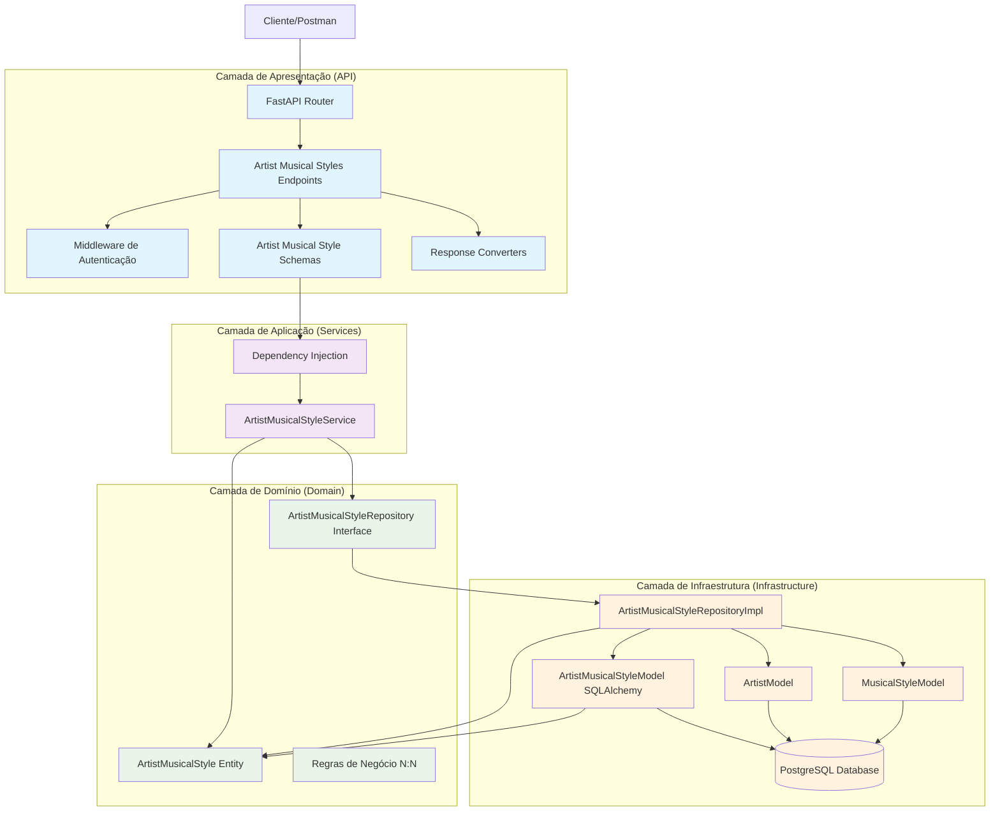
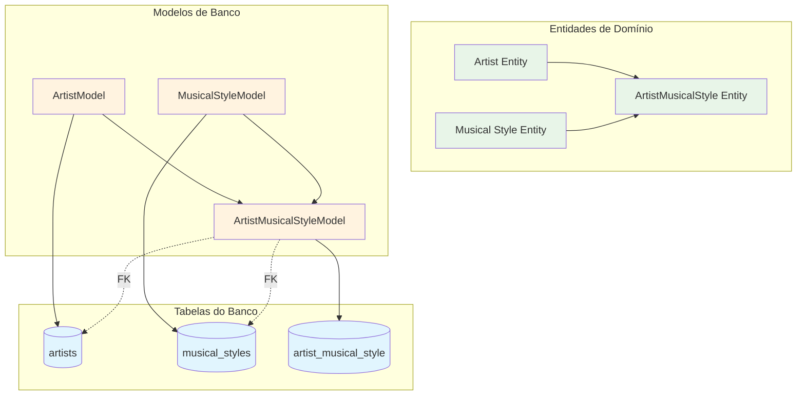
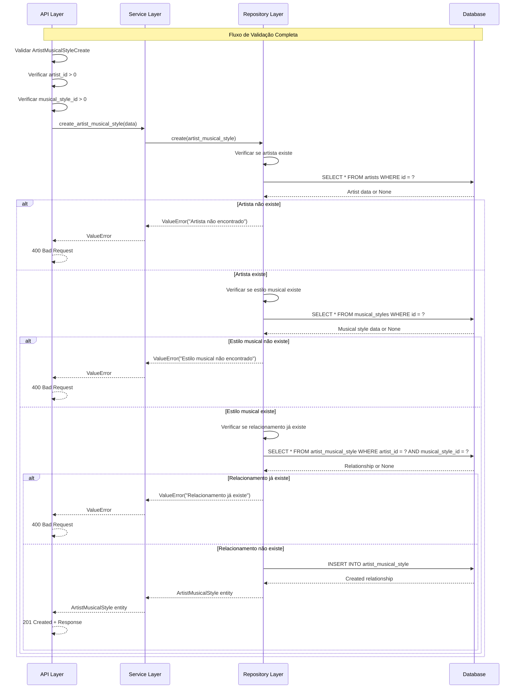
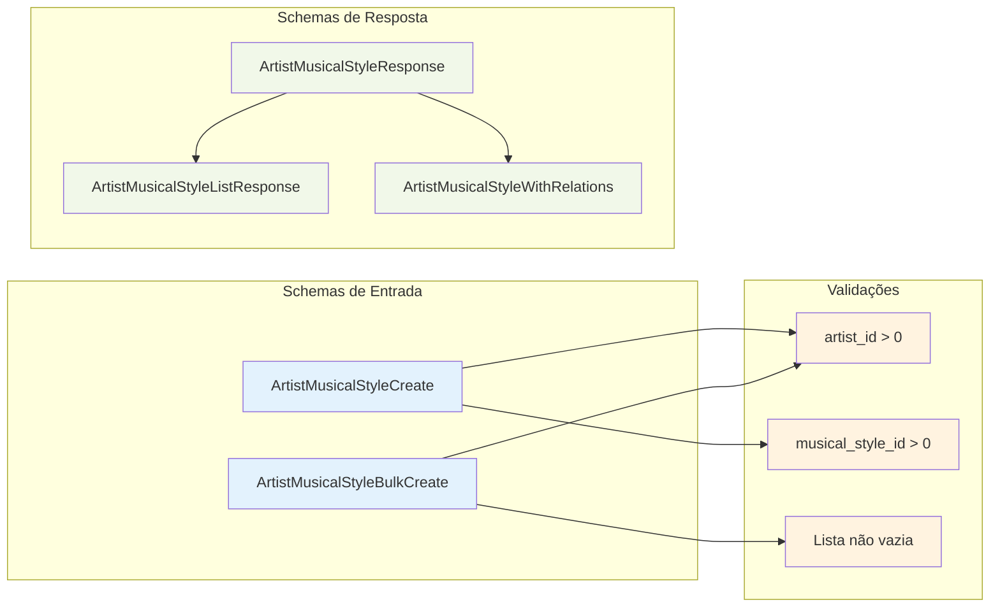
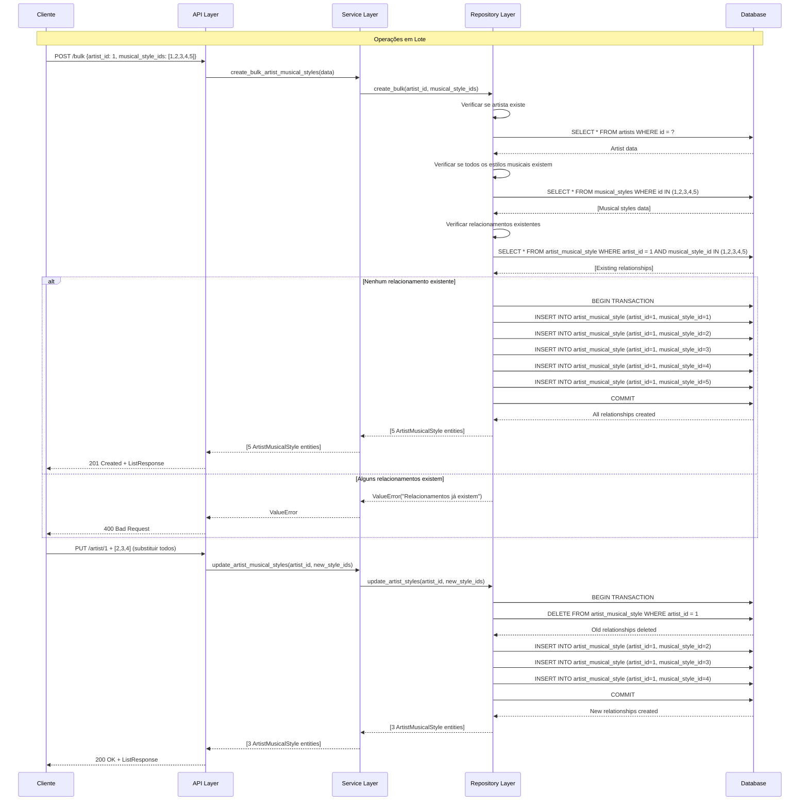

### **Arquitetura Implementada**

O endpoint artist_musical_styles implementa uma **arquitetura robusta para relacionamentos N:N** seguindo os princípios da **Clean Architecture**:

1. **Camada de Apresentação**: FastAPI com endpoints especializados para relacionamentos N:N, validação Pydantic e conversores de resposta
2. **Camada de Aplicação**: ArtistMusicalStyleService que orquestra operações de relacionamento
3. **Camada de Domínio**: Entidade ArtistMusicalStyle e interface de repositório para relacionamentos
4. **Camada de Infraestrutura**: Implementação de repositório com validações de integridade referencial

### **Características Principais**

- **Relacionamento N:N**: Gerencia relacionamentos muitos-para-muitos entre artistas e estilos musicais
- **Validação de Integridade**: Verifica existência de artistas e estilos musicais antes de criar relacionamentos
- **Operações em Lote**: Suporte a criação e atualização em lote de relacionamentos
- **Prevenção de Duplicatas**: Evita criação de relacionamentos duplicados
- **Conversores de Resposta**: Funções especializadas para converter entidades em schemas de resposta
- **Autenticação**: Todos os endpoints requerem autenticação

### **Endpoints Disponíveis**

1. **POST /artist-musical-styles/** - Criar relacionamento individual
2. **POST /artist-musical-styles/bulk** - Criar múltiplos relacionamentos para um artista
3. **GET /artist-musical-styles/artist/{id}** - Obter todos os estilos musicais de um artista
4. **GET /artist-musical-styles/musical-style/{id}** - Obter todos os artistas de um estilo musical
5. **PUT /artist-musical-styles/artist/{id}** - Atualizar todos os estilos musicais de um artista
6. **DELETE /artist-musical-styles/artist/{id}** - Deletar todos os relacionamentos de um artista
7. **DELETE /artist-musical-styles/musical-style/{id}** - Deletar todos os relacionamentos de um estilo musical
8. **GET /artist-musical-styles/{artist_id}/{musical_style_id}** - Obter relacionamento específico
9. **DELETE /artist-musical-styles/{artist_id}/{musical_style_id}** - Deletar relacionamento específico

### **Validações Implementadas**

- **Schema Validation**: Validação de IDs positivos via Pydantic
- **Integridade Referencial**: Verifica existência de artistas e estilos musicais
- **Prevenção de Duplicatas**: Evita relacionamentos duplicados
- **Validação em Lote**: Verifica todos os IDs em operações bulk

### **Operações Especiais**

- **Criação em Lote**: Permite associar múltiplos estilos musicais a um artista de uma vez
- **Atualização em Lote**: Substitui todos os estilos musicais de um artista por novos
- **Exclusão em Lote**: Remove todos os relacionamentos de um artista ou estilo musical
- **Transações**: Operações em lote são executadas em transações para garantir consistência

### **Estrutura de Dados**

- **Tabela de Relacionamento**: `artist_musical_style` com chaves estrangeiras para `artists` e `musical_styles`
- **Chave Primária Composta**: Combinação de `artist_id` e `musical_style_id`
- **Timestamp**: Campo `created_at` para rastreamento temporal

# Diagrama de Fluxo - Endpoint Artist Musical Styles

  

## Fluxo Detalhado da Arquitetura em Camadas

  

  

## Fluxo Detalhado por Operação

```mermaid

sequenceDiagram

participant C as Cliente

participant API as API Layer

participant Auth as Auth Middleware

participant Service as ArtistMusicalStyle Service

participant Repo as Repository

participant DB as Database

%% Criação Individual

Note over C,DB: POST /artist-musical-styles/ - Criar Relacionamento

C->>API: POST /artist-musical-styles/ {artist_id, musical_style_id}

API->>Auth: get_current_active_user()

Auth-->>API: User autenticado

API->>API: Validar ArtistMusicalStyleCreate schema

API->>Service: create_artist_musical_style(data)

Service->>Service: Criar ArtistMusicalStyle entity

Service->>Repo: create(artist_musical_style)

Repo->>Repo: Verificar se artista existe

Repo->>DB: SELECT * FROM artists WHERE id = ?

DB-->>Repo: Artist data

Repo->>Repo: Verificar se estilo musical existe

Repo->>DB: SELECT * FROM musical_styles WHERE id = ?

DB-->>Repo: Musical style data

Repo->>Repo: Verificar se relacionamento já existe

Repo->>DB: SELECT * FROM artist_musical_style WHERE artist_id = ? AND musical_style_id = ?

DB-->>Repo: Existing relationship or None

alt Relacionamento não existe

Repo->>DB: INSERT INTO artist_musical_style

DB-->>Repo: Created relationship

Repo-->>Service: ArtistMusicalStyle entity

Service-->>API: ArtistMusicalStyle entity

API->>API: Converter para response

API-->>C: 201 Created + ArtistMusicalStyleResponse

else Relacionamento já existe

Repo-->>Service: ValueError

Service-->>API: ValueError

API-->>C: 400 Bad Request

end

%% Criação em Lote

Note over C,DB: POST /artist-musical-styles/bulk - Criar Múltiplos

C->>API: POST /artist-musical-styles/bulk {artist_id, musical_style_ids}

API->>Auth: get_current_active_user()

Auth-->>API: User autenticado

API->>API: Validar ArtistMusicalStyleBulkCreate schema

API->>Service: create_bulk_artist_musical_styles(data)

Service->>Repo: create_bulk(artist_id, musical_style_ids)

Repo->>Repo: Verificar se artista existe

Repo->>DB: SELECT * FROM artists WHERE id = ?

DB-->>Repo: Artist data

Repo->>Repo: Verificar se todos os estilos musicais existem

Repo->>DB: SELECT * FROM musical_styles WHERE id IN (...)

DB-->>Repo: Musical styles data

Repo->>Repo: Verificar relacionamentos existentes

Repo->>DB: SELECT * FROM artist_musical_style WHERE artist_id = ? AND musical_style_id IN (...)

DB-->>Repo: Existing relationships

alt Nenhum relacionamento existente

Repo->>DB: INSERT INTO artist_musical_style (múltiplos)

DB-->>Repo: Created relationships

Repo-->>Service: [ArtistMusicalStyle entities]

Service-->>API: [ArtistMusicalStyle entities]

API->>API: Converter para response

API-->>C: 201 Created + ArtistMusicalStyleListResponse

else Relacionamentos existem

Repo-->>Service: ValueError

Service-->>API: ValueError

API-->>C: 400 Bad Request

end

%% Busca por Artista

Note over C,DB: GET /artist-musical-styles/artist/{id} - Estilos do Artista

C->>API: GET /artist-musical-styles/artist/1

API->>Auth: get_current_active_user()

Auth-->>API: User autenticado

API->>Service: get_musical_styles_by_artist(artist_id)

Service->>Repo: get_by_artist_id(artist_id)

Repo->>DB: SELECT * FROM artist_musical_style WHERE artist_id = ?

DB-->>Repo: [Relationships]

Repo-->>Service: [ArtistMusicalStyle entities]

Service-->>API: [ArtistMusicalStyle entities]

API->>API: Converter para response

API-->>C: 200 OK + ArtistMusicalStyleListResponse

%% Busca por Estilo Musical

Note over C,DB: GET /artist-musical-styles/musical-style/{id} - Artistas do Estilo

C->>API: GET /artist-musical-styles/musical-style/1

API->>Auth: get_current_active_user()

Auth-->>API: User autenticado

API->>Service: get_artists_by_musical_style(musical_style_id)

Service->>Repo: get_by_musical_style_id(musical_style_id)

Repo->>DB: SELECT * FROM artist_musical_style WHERE musical_style_id = ?

DB-->>Repo: [Relationships]

Repo-->>Service: [ArtistMusicalStyle entities]

Service-->>API: [ArtistMusicalStyle entities]

API->>API: Converter para response

API-->>C: 200 OK + ArtistMusicalStyleListResponse

%% Atualização

Note over C,DB: PUT /artist-musical-styles/artist/{id} - Atualizar Estilos

C->>API: PUT /artist-musical-styles/artist/1 + [musical_style_ids]

API->>Auth: get_current_active_user()

Auth-->>API: User autenticado

API->>Service: update_artist_musical_styles(artist_id, musical_style_ids)

Service->>Repo: update_artist_styles(artist_id, musical_style_ids)

Repo->>Repo: Verificar se artista existe

Repo->>DB: SELECT * FROM artists WHERE id = ?

DB-->>Repo: Artist data

Repo->>Repo: Verificar se todos os estilos musicais existem

Repo->>DB: SELECT * FROM musical_styles WHERE id IN (...)

DB-->>Repo: Musical styles data

Repo->>Repo: Deletar relacionamentos existentes

Repo->>DB: DELETE FROM artist_musical_style WHERE artist_id = ?

DB-->>Repo: Confirmação

Repo->>DB: INSERT INTO artist_musical_style (novos relacionamentos)

DB-->>Repo: New relationships

Repo-->>Service: [ArtistMusicalStyle entities]

Service-->>API: [ArtistMusicalStyle entities]

API->>API: Converter para response

API-->>C: 200 OK + ArtistMusicalStyleListResponse

%% Exclusão Individual

Note over C,DB: DELETE /artist-musical-styles/{artist_id}/{musical_style_id}

C->>API: DELETE /artist-musical-styles/1/2

API->>Auth: get_current_active_user()

Auth-->>API: User autenticado

API->>Service: delete_artist_musical_style(artist_id, musical_style_id)

Service->>Repo: delete(artist_id, musical_style_id)

Repo->>DB: SELECT * FROM artist_musical_style WHERE artist_id = ? AND musical_style_id = ?

DB-->>Repo: Relationship or None

alt Relacionamento existe

Repo->>DB: DELETE FROM artist_musical_style WHERE artist_id = ? AND musical_style_id = ?

DB-->>Repo: Confirmação

Repo-->>Service: true

Service-->>API: true

API-->>C: 200 OK + {"message": "Relacionamento deletado"}

else Relacionamento não existe

Repo-->>Service: false

Service-->>API: false

API-->>C: 404 Not Found

end

%% Exclusão em Lote por Artista

Note over C,DB: DELETE /artist-musical-styles/artist/{id} - Deletar Todos do Artista

C->>API: DELETE /artist-musical-styles/artist/1

API->>Auth: get_current_active_user()

Auth-->>API: User autenticado

API->>Service: delete_all_artist_musical_styles(artist_id)

Service->>Repo: delete_by_artist_id(artist_id)

Repo->>DB: SELECT * FROM artist_musical_style WHERE artist_id = ?

DB-->>Repo: [Relationships]

alt Existem relacionamentos

Repo->>DB: DELETE FROM artist_musical_style WHERE artist_id = ?

DB-->>Repo: Confirmação

Repo-->>Service: true

Service-->>API: true

API-->>C: 200 OK + {"message": "Todos os relacionamentos deletados"}

else Não existem relacionamentos

Repo-->>Service: false

Service-->>API: false

API-->>C: 404 Not Found

end

```

  

  

## Arquitetura de Relacionamento N:N

  

  

## Fluxo de Validação e Verificação

  

  

## Estrutura de Schemas e Respostas

  

  

## Operações de Lote (Bulk Operations)

  

