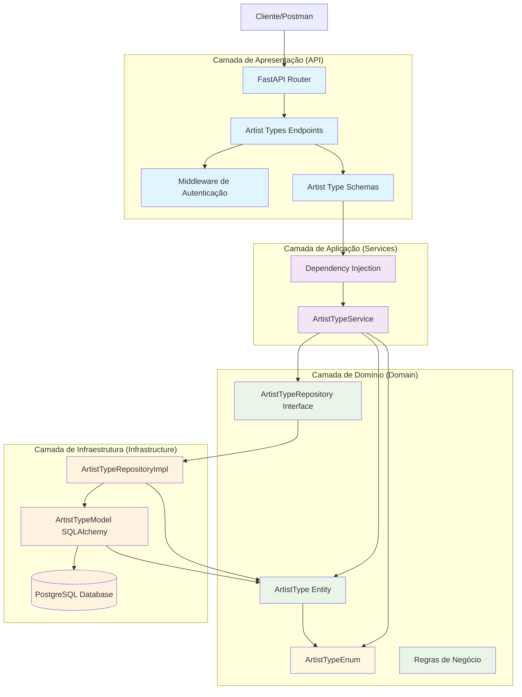
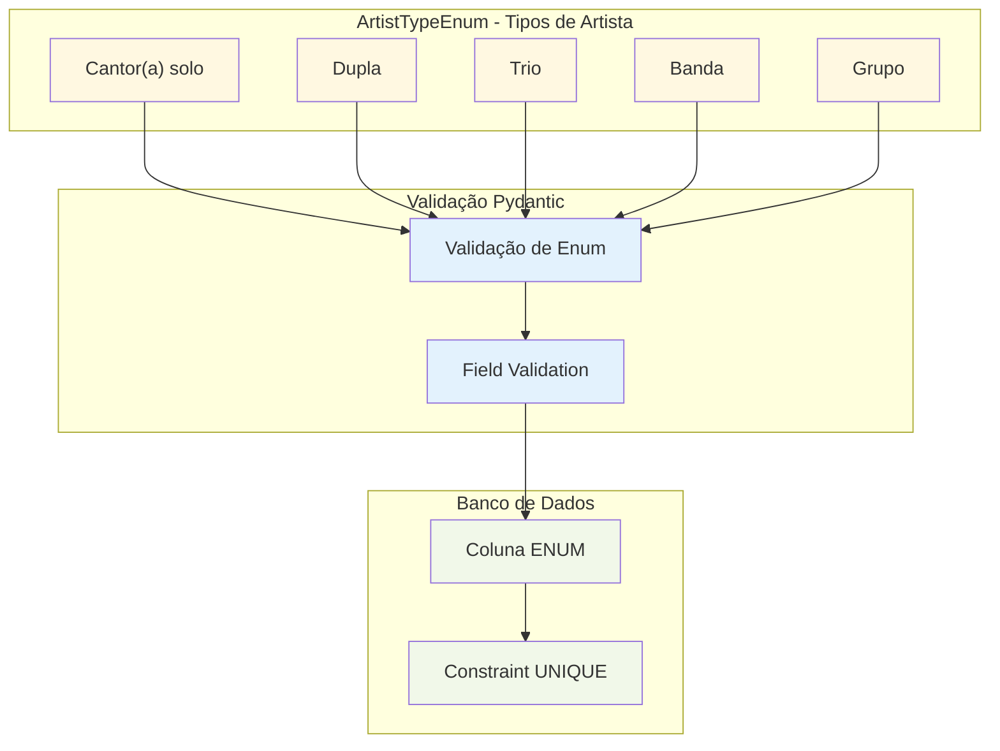
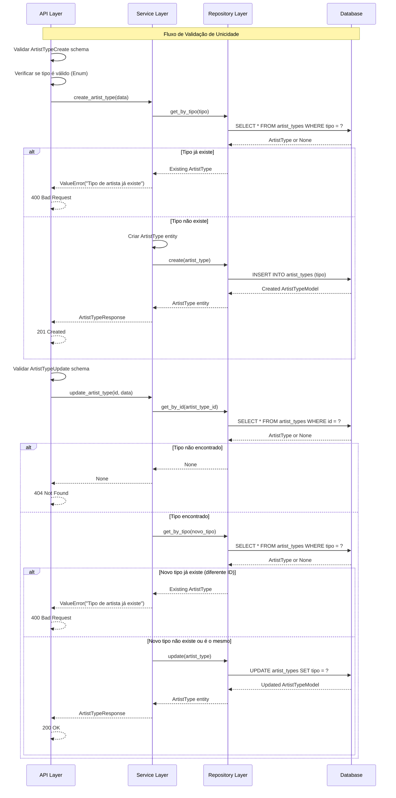
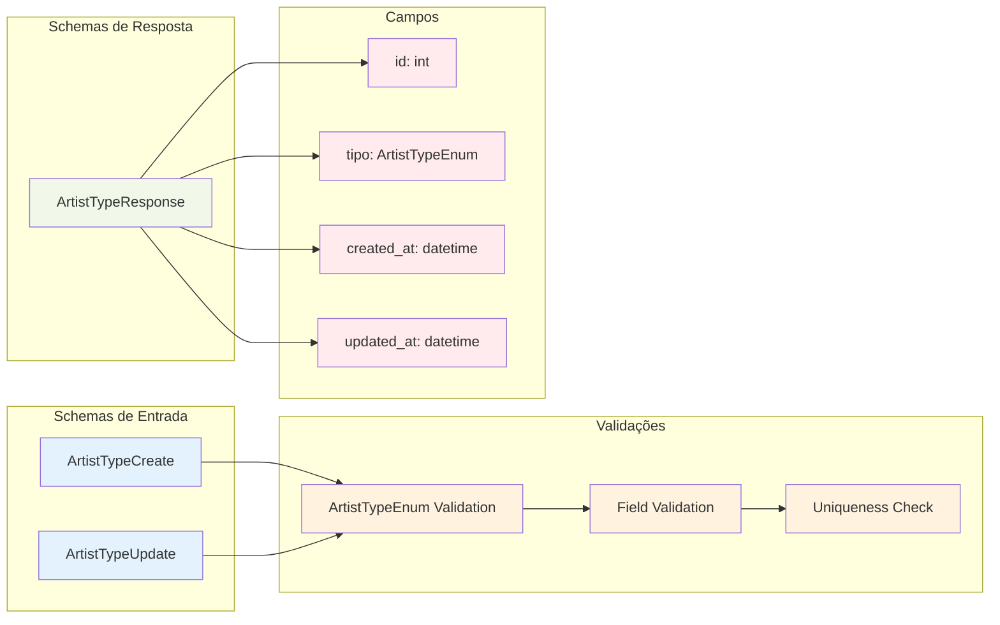
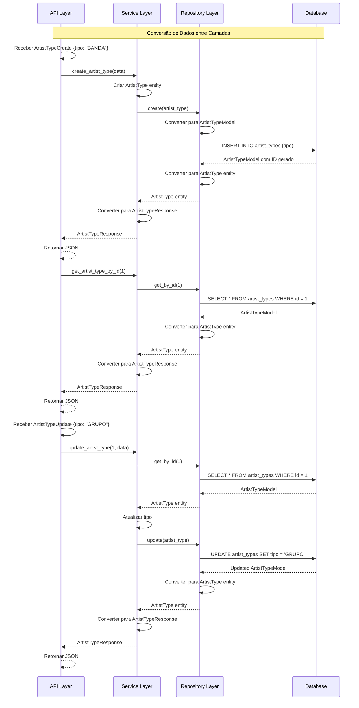

### **Arquitetura Implementada**

O endpoint artist_types implementa uma **arquitetura robusta para gerenciamento de tipos de artistas** seguindo os princípios da **Clean Architecture**:

1. **Camada de Apresentação**: FastAPI com endpoints CRUD, validação Pydantic e autenticação
2. **Camada de Aplicação**: ArtistTypeService que orquestra a lógica de negócio
3. **Camada de Domínio**: Entidade ArtistType com enum ArtistTypeEnum e interface de repositório
4. **Camada de Infraestrutura**: Implementação de repositório com validações de unicidade

### **Características Principais**

- **Enum Tipado**: ArtistTypeEnum com valores predefinidos (Cantor(a) solo, Dupla, Trio, Banda, Grupo)
- **Validação de Unicidade**: Garante que não existam tipos duplicados
- **Validação de Enum**: Pydantic valida se o tipo enviado é um valor válido do enum
- **Autenticação**: Todos os endpoints requerem autenticação
- **Paginação**: Suporte a listagem paginada
- **Timestamps**: Campos created_at e updated_at para rastreamento temporal

### **Endpoints Disponíveis**

1. **POST /artist-types/** - Criar novo tipo de artista
2. **GET /artist-types/** - Listar tipos de artista (com paginação)
3. **GET /artist-types/{id}** - Buscar tipo de artista por ID
4. **PUT /artist-types/{id}** - Atualizar tipo de artista
5. **DELETE /artist-types/{id}** - Deletar tipo de artista

### **Validações Implementadas**

- **Schema Validation**: Validação de enum via Pydantic
- **Unicidade**: Verifica se o tipo já existe antes de criar/atualizar
- **Existência**: Verifica se o tipo existe antes de atualizar/deletar
- **Integridade**: Constraints de banco de dados (UNIQUE, NOT NULL)

### **Estrutura de Dados**

- **Enum ArtistTypeEnum**: Define os tipos válidos de artistas
- **Tabela artist_types**: Armazena os tipos com constraint UNIQUE no campo tipo
- **Relacionamento**: Conecta com a tabela artists através de chave estrangeira

### **Tipos de Artista Disponíveis**

- **Cantor(a) solo**: Artista individual
- **Dupla**: Dois artistas
- **Trio**: Três artistas
- **Banda**: Grupo musical
- **Grupo**: Conjunto de artistas

### **Fluxos Especiais**

- **Validação de Unicidade**: Verifica duplicatas tanto na criação quanto na atualização
- **Conversão de Dados**: Conversão entre schemas, entidades e modelos de banco
- **Tratamento de Erros**: HTTP exceptions apropriadas para diferentes cenários

# Diagrama de Fluxo - Endpoint Artist Types

  

## Fluxo Detalhado da Arquitetura em Camadas

  



  

## Fluxo Detalhado por Operação

```mermaid

sequenceDiagram

participant C as Cliente

participant API as API Layer

participant Auth as Auth Middleware

participant Service as ArtistType Service

participant Repo as Repository

participant DB as Database

%% Criação de Tipo de Artista

Note over C,DB: POST /artist-types/ - Criar Tipo de Artista

C->>API: POST /artist-types/ {tipo: "BANDA"}

API->>Auth: get_current_active_user()

Auth-->>API: User autenticado

API->>API: Validar ArtistTypeCreate schema

API->>Service: create_artist_type(data)

Service->>Service: Verificar se tipo já existe

Service->>Repo: get_by_tipo(tipo)

Repo->>DB: SELECT * FROM artist_types WHERE tipo = ?

DB-->>Repo: ArtistType data or None

alt Tipo não existe

Service->>Service: Criar ArtistType entity

Service->>Repo: create(artist_type)

Repo->>DB: INSERT INTO artist_types (tipo)

DB-->>Repo: Created ArtistTypeModel

Repo-->>Service: ArtistType entity

Service-->>API: ArtistTypeResponse

API-->>C: 201 Created + ArtistTypeResponse

else Tipo já existe

Repo-->>Service: Existing ArtistType

Service-->>API: ValueError("Tipo de artista já existe")

API-->>C: 400 Bad Request

end

%% Listagem de Tipos de Artista

Note over C,DB: GET /artist-types/ - Listar Tipos

C->>API: GET /artist-types/?skip=0&limit=100

API->>Auth: get_current_active_user()

Auth-->>API: User autenticado

API->>Service: get_artist_types(skip, limit)

Service->>Repo: get_all(skip, limit)

Repo->>DB: SELECT * FROM artist_types LIMIT ? OFFSET ?

DB-->>Repo: [ArtistTypeModel]

Repo-->>Service: [ArtistType entities]

Service-->>API: [ArtistTypeResponse]

API-->>C: 200 OK + [ArtistTypeResponse]

%% Busca por ID

Note over C,DB: GET /artist-types/{id} - Buscar por ID

C->>API: GET /artist-types/1

API->>Auth: get_current_active_user()

Auth-->>API: User autenticado

API->>Service: get_artist_type_by_id(artist_type_id)

Service->>Repo: get_by_id(artist_type_id)

Repo->>DB: SELECT * FROM artist_types WHERE id = ?

DB-->>Repo: ArtistTypeModel or None

alt Tipo encontrado

Repo-->>Service: ArtistType entity

Service-->>API: ArtistTypeResponse

API-->>C: 200 OK + ArtistTypeResponse

else Tipo não encontrado

Repo-->>Service: None

Service-->>API: None

API-->>C: 404 Not Found

end

%% Atualização

Note over C,DB: PUT /artist-types/{id} - Atualizar Tipo

C->>API: PUT /artist-types/1 {tipo: "GRUPO"}

API->>Auth: get_current_active_user()

Auth-->>API: User autenticado

API->>API: Validar ArtistTypeUpdate schema

API->>Service: update_artist_type(artist_type_id, data)

Service->>Repo: get_by_id(artist_type_id)

Repo->>DB: SELECT * FROM artist_types WHERE id = ?

DB-->>Repo: ArtistTypeModel or None

alt Tipo encontrado

Service->>Service: Verificar se novo tipo já existe

Service->>Repo: get_by_tipo(novo_tipo)

Repo->>DB: SELECT * FROM artist_types WHERE tipo = ?

DB-->>Repo: ArtistType data or None

alt Novo tipo não existe ou é o mesmo

Service->>Service: Atualizar tipo

Service->>Repo: update(artist_type)

Repo->>DB: UPDATE artist_types SET tipo = ?, updated_at = ?

DB-->>Repo: Updated ArtistTypeModel

Repo-->>Service: ArtistType entity

Service-->>API: ArtistTypeResponse

API-->>C: 200 OK + ArtistTypeResponse

else Novo tipo já existe (diferente)

Repo-->>Service: Existing ArtistType

Service-->>API: ValueError("Tipo de artista já existe")

API-->>C: 400 Bad Request

end

else Tipo não encontrado

Repo-->>Service: None

Service-->>API: None

API-->>C: 404 Not Found

end

%% Exclusão

Note over C,DB: DELETE /artist-types/{id} - Deletar Tipo

C->>API: DELETE /artist-types/1

API->>Auth: get_current_active_user()

Auth-->>API: User autenticado

API->>Service: delete_artist_type(artist_type_id)

Service->>Repo: delete(artist_type_id)

Repo->>DB: SELECT * FROM artist_types WHERE id = ?

DB-->>Repo: ArtistTypeModel or None

alt Tipo encontrado

Repo->>DB: DELETE FROM artist_types WHERE id = ?

DB-->>Repo: Confirmação

Repo-->>Service: true

Service-->>API: true

API-->>C: 200 OK + {"message": "Tipo de artista deletado"}

else Tipo não encontrado

Repo-->>Service: false

Service-->>API: false

API-->>C: 404 Not Found

end

```

  



  

## Estrutura do Enum ArtistTypeEnum

  



  

## Arquitetura de Validação e Unicidade

  



  

## Estrutura de Schemas e Respostas

  



  

## Modelo de Banco de Dados

  

```mermaid

graph TD

subgraph "Tabela artist_types"

IdColumn[id: INTEGER PRIMARY KEY]

TipoColumn[tipo: ENUM UNIQUE NOT NULL]

CreatedAtColumn[created_at: TIMESTAMP]

UpdatedAtColumn[updated_at: TIMESTAMP]

end

subgraph "Constraints"

PrimaryKey[PRIMARY KEY (id)]

UniqueTipo[UNIQUE (tipo)]

NotNullTipo[NOT NULL (tipo)]

IndexTipo[INDEX (tipo)]

end

subgraph "Valores Enum"

CantorSolo["'Cantor(a) solo'"]

Dupla["'Dupla'"]

Trio["'Trio'"]

Banda["'Banda'"]

Grupo["'Grupo'"]

end

IdColumn --> PrimaryKey

TipoColumn --> UniqueTipo

TipoColumn --> NotNullTipo

TipoColumn --> IndexTipo

CantorSolo --> TipoColumn

Dupla --> TipoColumn

Trio --> TipoColumn

Banda --> TipoColumn

Grupo --> TipoColumn

%% Estilos

classDef column fill:#e1f5fe

classDef constraint fill:#f3e5f5

classDef enum fill:#fff8e1

class IdColumn,TipoColumn,CreatedAtColumn,UpdatedAtColumn column

class PrimaryKey,UniqueTipo,NotNullTipo,IndexTipo constraint

class CantorSolo,Dupla,Trio,Banda,Grupo enum

```

  

## Fluxo de Conversão de Dados

  

