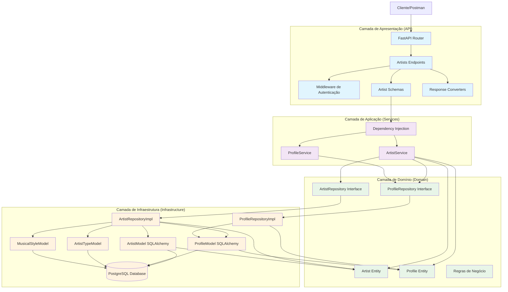
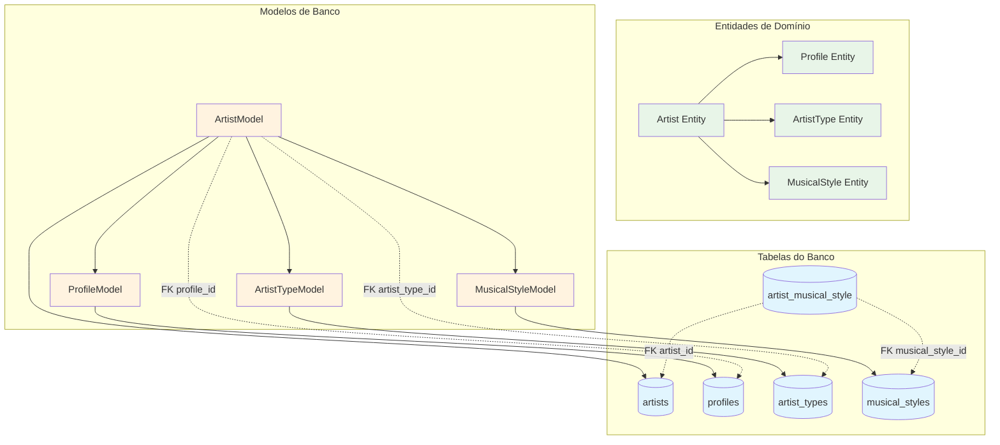
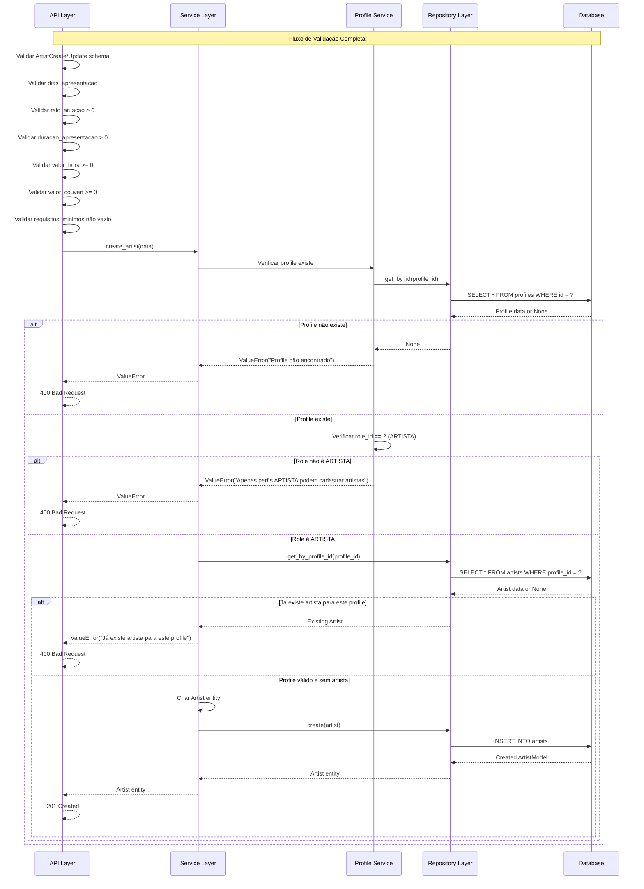
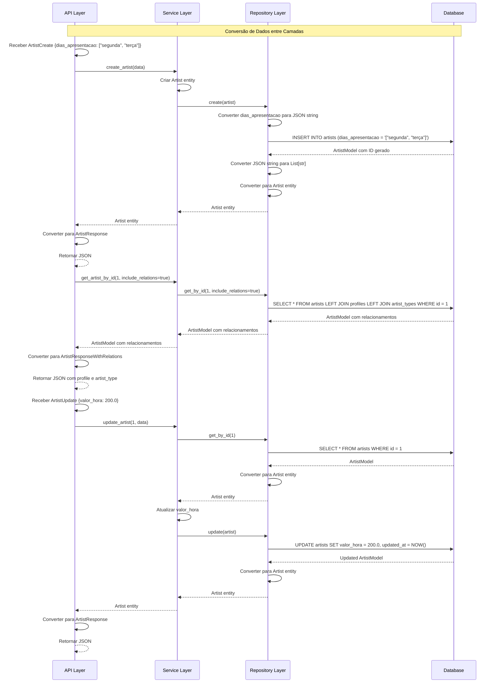

### **Arquitetura Implementada**

O endpoint artists implementa uma **arquitetura robusta para gerenciamento de artistas** seguindo os princípios da **Clean Architecture**:

1. **Camada de Apresentação**: FastAPI com endpoints CRUD, validação Pydantic, conversores de resposta e autenticação
2. **Camada de Aplicação**: ArtistService que orquestra a lógica de negócio e validações de profile
3. **Camada de Domínio**: Entidade Artist com regras de negócio e interfaces de repositório
4. **Camada de Infraestrutura**: Implementação de repositório com relacionamentos e conversão JSON

### **Características Principais**

- **Validação de Profile**: Verifica se o profile existe e tem role ARTISTA (role_id = 2)
- **Unicidade de Profile**: Garante que cada profile tenha apenas um artista
- **Relacionamentos**: Suporte a dados relacionados (profile, artist_type, musical_styles)
- **Conversão JSON**: Dias de apresentação são armazenados como JSON no banco
- **Validações Complexas**: Múltiplas validações de negócio e dados
- **Redes Sociais**: Suporte a múltiplas plataformas de redes sociais

### **Endpoints Disponíveis**

1. **POST /artists/** - Criar novo artista
2. **GET /artists/** - Listar artistas (com opção de incluir relacionamentos)
3. **GET /artists/{id}** - Buscar artista por ID
4. **GET /artists/profile/{profile_id}** - Buscar artista por profile ID
5. **GET /artists/type/{artist_type_id}** - Listar artistas por tipo
6. **PUT /artists/{id}** - Atualizar artista
7. **DELETE /artists/{id}** - Deletar artista

### **Validações Implementadas**

- **Schema Validation**: Validação de campos obrigatórios e tipos via Pydantic
- **Dias de Apresentação**: Validação de dias válidos da semana
- **Valores Numéricos**: Validação de raio, duração, valores (>= 0)
- **Requisitos Mínimos**: Validação de campo não vazio
- **Profile Role**: Verificação se profile tem role ARTISTA
- **Unicidade**: Verifica se profile já tem artista cadastrado

### **Estrutura de Dados**

- **Tabela artists**: Armazena dados do artista com relacionamentos
- **Dias de Apresentação**: Lista JSON de dias da semana
- **Redes Sociais**: Campos opcionais para diferentes plataformas
- **Relacionamentos**: FK para profiles, artist_types e musical_styles

### **Campos Principais**

- **profile_id**: Referência única ao profile (FK + UNIQUE)
- **artist_type_id**: Tipo do artista (FK)
- **dias_apresentacao**: Lista JSON de dias disponíveis
- **raio_atuacao**: Raio de atuação em km
- **duracao_apresentacao**: Duração em horas
- **valor_hora**: Valor por hora de apresentação
- **valor_couvert**: Valor do couvert artístico
- **requisitos_minimos**: Requisitos técnicos mínimos
- **Redes Sociais**: Instagram, TikTok, YouTube, Facebook, etc.

### **Fluxos Especiais**

- **Validação de Profile**: Verifica existência e role antes de criar artista
- **Conversão JSON**: Conversão entre List[str] e JSON string para dias
- **Relacionamentos**: Suporte a busca com dados relacionados
- **Atualização Parcial**: Atualização apenas de campos fornecidos
- **Validação de Unicidade**: Previne múltiplos artistas por profile

# Diagrama de Fluxo - Endpoint Artists

  

## Fluxo Detalhado da Arquitetura em Camadas

  



  

## Fluxo Detalhado por Operação

```mermaid

sequenceDiagram

participant C as Cliente

participant API as API Layer

participant Auth as Auth Middleware

participant Service as Artist Service

participant ProfileService as Profile Service

participant Repo as Repository

participant DB as Database

%% Criação de Artista

Note over C,DB: POST /artists/ - Criar Artista

C->>API: POST /artists/ {profile_id, artist_type_id, ...}

API->>Auth: get_current_active_user()

Auth-->>API: User autenticado

API->>API: Validar ArtistCreate schema

API->>Service: create_artist(data)

%% Validação de Profile

Service->>ProfileService: Verificar se profile existe e tem role ARTISTA

ProfileService->>Repo: get_by_id(profile_id)

Repo->>DB: SELECT * FROM profiles WHERE id = ?

DB-->>Repo: Profile data or None

alt Profile não existe

Repo-->>ProfileService: None

ProfileService-->>Service: ValueError("Profile não encontrado")

Service-->>API: ValueError

API-->>C: 400 Bad Request

else Profile existe mas não é ARTISTA

ProfileService->>ProfileService: Verificar role_id != 2

ProfileService-->>Service: ValueError("Apenas perfis ARTISTA podem cadastrar artistas")

Service-->>API: ValueError

API-->>C: 400 Bad Request

else Profile é ARTISTA

%% Verificar se já existe artista para este profile

Service->>Repo: get_by_profile_id(profile_id)

Repo->>DB: SELECT * FROM artists WHERE profile_id = ?

DB-->>Repo: Artist data or None

alt Já existe artista para este profile

Repo-->>Service: Existing Artist

Service-->>API: ValueError("Já existe artista para este profile")

API-->>C: 400 Bad Request

else Profile válido e sem artista

%% Criar artista

Service->>Service: Criar Artist entity

Service->>Repo: create(artist)

Repo->>Repo: Converter dias_apresentacao para JSON

Repo->>DB: INSERT INTO artists (...)

DB-->>Repo: Created ArtistModel

Repo->>Repo: Converter para Artist entity

Repo-->>Service: Artist entity

Service-->>API: Artist entity

API->>API: Converter para response

API-->>C: 201 Created + ArtistResponse

end

end

%% Listagem de Artistas

Note over C,DB: GET /artists/ - Listar Artistas

C->>API: GET /artists/?include_relations=true

API->>Auth: get_current_active_user()

Auth-->>API: User autenticado

API->>Service: get_artists(include_relations=true)

Service->>Repo: get_all(include_relations=true)

Repo->>DB: SELECT * FROM artists LEFT JOIN profiles LEFT JOIN artist_types

DB-->>Repo: [ArtistModel with relations]

Repo-->>Service: [ArtistModel with relations]

Service-->>API: [ArtistModel with relations]

API->>API: Converter para response com relacionamentos

API-->>C: 200 OK + ArtistListResponseWithRelations

%% Busca por ID

Note over C,DB: GET /artists/{id} - Buscar por ID

C->>API: GET /artists/1?include_relations=false

API->>Auth: get_current_active_user()

Auth-->>API: User autenticado

API->>Service: get_artist_by_id(artist_id, include_relations=false)

Service->>Repo: get_by_id(artist_id, include_relations=false)

Repo->>DB: SELECT * FROM artists WHERE id = ?

DB-->>Repo: ArtistModel or None

alt Artista encontrado

Repo->>Repo: Converter para Artist entity

Repo-->>Service: Artist entity

Service-->>API: Artist entity

API->>API: Converter para response

API-->>C: 200 OK + ArtistResponse

else Artista não encontrado

Repo-->>Service: None

Service-->>API: None

API-->>C: 404 Not Found

end

%% Busca por Profile ID

Note over C,DB: GET /artists/profile/{profile_id}

C->>API: GET /artists/profile/1

API->>Auth: get_current_active_user()

Auth-->>API: User autenticado

API->>Service: get_artist_by_profile_id(profile_id)

Service->>Repo: get_by_profile_id(profile_id)

Repo->>DB: SELECT * FROM artists WHERE profile_id = ?

DB-->>Repo: ArtistModel or None

alt Artista encontrado

Repo->>Repo: Converter para Artist entity

Repo-->>Service: Artist entity

Service-->>API: Artist entity

API->>API: Converter para response

API-->>C: 200 OK + ArtistResponse

else Artista não encontrado

Repo-->>Service: None

Service-->>API: None

API-->>C: 404 Not Found

end

%% Busca por Tipo de Artista

Note over C,DB: GET /artists/type/{artist_type_id}

C->>API: GET /artists/type/1?skip=0&limit=10

API->>Auth: get_current_active_user()

Auth-->>API: User autenticado

API->>Service: get_artists_by_type(artist_type_id, skip, limit)

Service->>Repo: get_by_artist_type(artist_type_id, skip, limit)

Repo->>DB: SELECT * FROM artists WHERE artist_type_id = ? LIMIT ? OFFSET ?

DB-->>Repo: [ArtistModel]

Repo->>Repo: Converter para [Artist entities]

Repo-->>Service: [Artist entities]

Service-->>API: [Artist entities]

API->>API: Converter para response

API-->>C: 200 OK + ArtistListResponse

%% Atualização

Note over C,DB: PUT /artists/{id} - Atualizar Artista

C->>API: PUT /artists/1 {valor_hora: 150.0, instagram: "..."}

API->>Auth: get_current_active_user()

Auth-->>API: User autenticado

API->>API: Validar ArtistUpdate schema

API->>Service: update_artist(artist_id, data)

Service->>Repo: get_by_id(artist_id)

Repo->>DB: SELECT * FROM artists WHERE id = ?

DB-->>Repo: ArtistModel or None

alt Artista encontrado

Service->>Service: Atualizar campos fornecidos

Service->>Service: Validar novos valores

Service->>Repo: update(artist)

Repo->>Repo: Converter dias_apresentacao para JSON

Repo->>DB: UPDATE artists SET valor_hora = ?, instagram = ?, updated_at = ?

DB-->>Repo: Updated ArtistModel

Repo->>Repo: Converter para Artist entity

Repo-->>Service: Artist entity

Service-->>API: Artist entity

API->>API: Converter para response

API-->>C: 200 OK + ArtistResponse

else Artista não encontrado

Repo-->>Service: None

Service-->>API: ValueError("Artista não encontrado")

API-->>C: 400 Bad Request

end

%% Exclusão

Note over C,DB: DELETE /artists/{id} - Deletar Artista

C->>API: DELETE /artists/1

API->>Auth: get_current_active_user()

Auth-->>API: User autenticado

API->>Service: delete_artist(artist_id)

Service->>Repo: delete(artist_id)

Repo->>DB: SELECT * FROM artists WHERE id = ?

DB-->>Repo: ArtistModel or None

alt Artista encontrado

Repo->>DB: DELETE FROM artists WHERE id = ?

DB-->>Repo: Confirmação

Repo-->>Service: true

Service-->>API: true

API-->>C: 200 OK + {"message": "Artista deletado"}

else Artista não encontrado

Repo-->>Service: false

Service-->>API: false

API-->>C: 404 Not Found

end

```

  



  

## Arquitetura de Relacionamentos

  



  

## Fluxo de Validação e Regras de Negócio

  



  

## Estrutura de Schemas e Respostas

  

```mermaid

graph LR

subgraph "Schemas de Entrada"

CreateSchema[ArtistCreate]

UpdateSchema[ArtistUpdate]

end

subgraph "Schemas de Resposta"

ResponseSchema[ArtistResponse]

ResponseWithRelations[ArtistResponseWithRelations]

ListResponse[ArtistListResponse]

ListResponseWithRelations[ArtistListResponseWithRelations]

end

subgraph "Validações"

DiasValidation[dias_apresentacao válidos]

RaioValidation[raio_atuacao > 0]

DuracaoValidation[duracao_apresentacao > 0]

ValorValidation[valores >= 0]

RequisitosValidation[requisitos não vazios]

end

subgraph "Campos"

IdField[id: int]

ProfileIdField[profile_id: int]

ArtistTypeIdField[artist_type_id: int]

DiasField[dias_apresentacao: List[str]]

RaioField[raio_atuacao: float]

DuracaoField[duracao_apresentacao: float]

ValorHoraField[valor_hora: float]

ValorCouvertField[valor_couvert: float]

RequisitosField[requisitos_minimos: str]

SocialFields[redes_sociais: Optional[str]]

end

CreateSchema --> DiasValidation

CreateSchema --> RaioValidation

CreateSchema --> DuracaoValidation

CreateSchema --> ValorValidation

CreateSchema --> RequisitosValidation

UpdateSchema --> DiasValidation

UpdateSchema --> RaioValidation

UpdateSchema --> DuracaoValidation

UpdateSchema --> ValorValidation

UpdateSchema --> RequisitosValidation

ResponseSchema --> IdField

ResponseSchema --> ProfileIdField

ResponseSchema --> ArtistTypeIdField

ResponseSchema --> DiasField

ResponseSchema --> RaioField

ResponseSchema --> DuracaoField

ResponseSchema --> ValorHoraField

ResponseSchema --> ValorCouvertField

ResponseSchema --> RequisitosField

ResponseSchema --> SocialFields

ResponseWithRelations --> ResponseSchema

ListResponse --> ResponseSchema

ListResponseWithRelations --> ResponseWithRelations

%% Estilos

classDef input fill:#e3f2fd

classDef output fill:#f1f8e9

classDef validation fill:#fff3e0

classDef field fill:#ffebee

class CreateSchema,UpdateSchema input

class ResponseSchema,ResponseWithRelations,ListResponse,ListResponseWithRelations output

class DiasValidation,RaioValidation,DuracaoValidation,ValorValidation,RequisitosValidation validation

class IdField,ProfileIdField,ArtistTypeIdField,DiasField,RaioField,DuracaoField,ValorHoraField,ValorCouvertField,RequisitosField,SocialFields field

```

  

## Modelo de Banco de Dados

  

```mermaid

graph TD

subgraph "Tabela artists"

IdColumn[id: INTEGER PRIMARY KEY]

ProfileIdColumn[profile_id: INTEGER FK UNIQUE]

ArtistTypeIdColumn[artist_type_id: INTEGER FK]

DiasColumn[dias_apresentacao: TEXT JSON]

RaioColumn[raio_atuacao: FLOAT]

DuracaoColumn[duracao_apresentacao: FLOAT]

ValorHoraColumn[valor_hora: FLOAT]

ValorCouvertColumn[valor_couvert: FLOAT]

RequisitosColumn[requisitos_minimos: TEXT]

InstagramColumn[instagram: TEXT]

TiktokColumn[tiktok: TEXT]

YoutubeColumn[youtube: TEXT]

FacebookColumn[facebook: TEXT]

SoundcloudColumn[soundcloud: TEXT]

BandcampColumn[bandcamp: TEXT]

SpotifyColumn[spotify: TEXT]

DeezerColumn[deezer: TEXT]

CreatedAtColumn[created_at: TIMESTAMP]

UpdatedAtColumn[updated_at: TIMESTAMP]

end

subgraph "Constraints"

PrimaryKey[PRIMARY KEY (id)]

UniqueProfile[UNIQUE (profile_id)]

NotNullProfile[NOT NULL (profile_id)]

NotNullArtistType[NOT NULL (artist_type_id)]

NotNullDias[NOT NULL (dias_apresentacao)]

NotNullRaio[NOT NULL (raio_atuacao)]

NotNullDuracao[NOT NULL (duracao_apresentacao)]

NotNullValorHora[NOT NULL (valor_hora)]

NotNullValorCouvert[NOT NULL (valor_couvert)]

NotNullRequisitos[NOT NULL (requisitos_minimos)]

end

subgraph "Relacionamentos"

FKProfile[FOREIGN KEY (profile_id) REFERENCES profiles(id)]

FKArtistType[FOREIGN KEY (artist_type_id) REFERENCES artist_types(id)]

end

IdColumn --> PrimaryKey

ProfileIdColumn --> UniqueProfile

ProfileIdColumn --> NotNullProfile

ProfileIdColumn --> FKProfile

ArtistTypeIdColumn --> NotNullArtistType

ArtistTypeIdColumn --> FKArtistType

DiasColumn --> NotNullDias

RaioColumn --> NotNullRaio

DuracaoColumn --> NotNullDuracao

ValorHoraColumn --> NotNullValorHora

ValorCouvertColumn --> NotNullValorCouvert

RequisitosColumn --> NotNullRequisitos

%% Estilos

classDef column fill:#e1f5fe

classDef constraint fill:#f3e5f5

classDef relationship fill:#e8f5e8

class IdColumn,ProfileIdColumn,ArtistTypeIdColumn,DiasColumn,RaioColumn,DuracaoColumn,ValorHoraColumn,ValorCouvertColumn,RequisitosColumn,InstagramColumn,TiktokColumn,YoutubeColumn,FacebookColumn,SoundcloudColumn,BandcampColumn,SpotifyColumn,DeezerColumn,CreatedAtColumn,UpdatedAtColumn column

class PrimaryKey,UniqueProfile,NotNullProfile,NotNullArtistType,NotNullDias,NotNullRaio,NotNullDuracao,NotNullValorHora,NotNullValorCouvert,NotNullRequisitos constraint

class FKProfile,FKArtistType relationship

```

  

## Fluxo de Conversão de Dados

  

