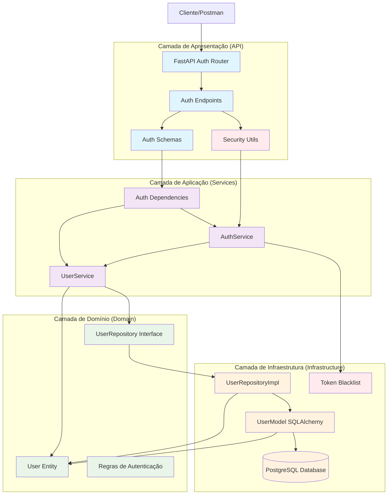
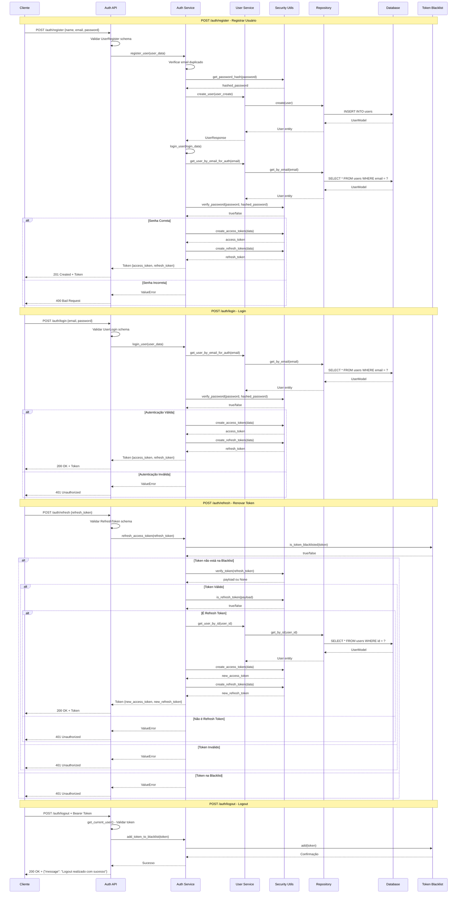
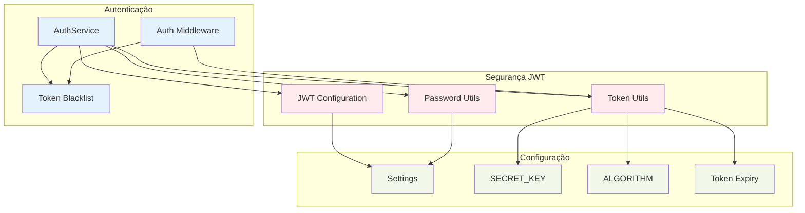
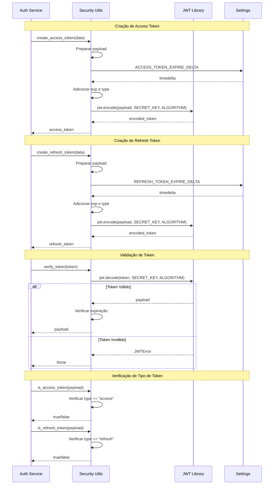
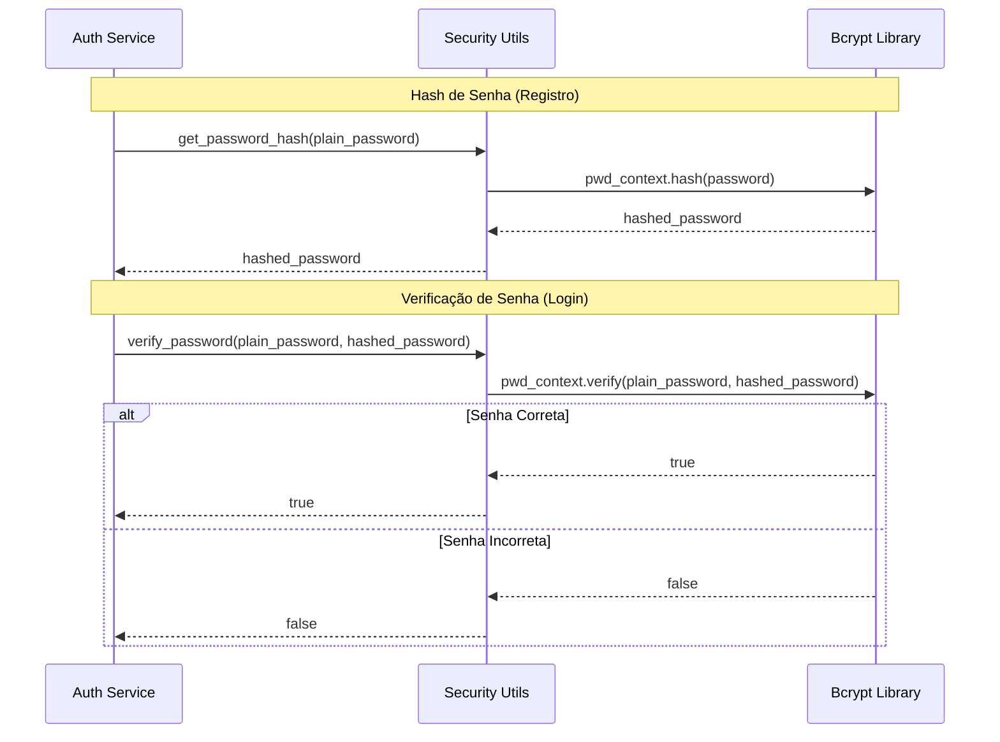
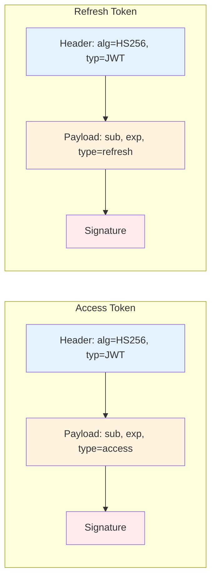

### **Arquitetura Implementada**

O endpoint auth implementa uma **arquitetura de autenticação robusta** seguindo os princípios da **Clean Architecture** com foco especial em segurança:

1. **Camada de Apresentação**: FastAPI com endpoints de autenticação, validação Pydantic e middleware de segurança
2. **Camada de Aplicação**: AuthService que orquestra toda a lógica de autenticação e UserService para operações de usuário
3. **Camada de Domínio**: Entidades de usuário e regras de negócio de autenticação
4. **Camada de Infraestrutura**: Implementações de persistência e sistema de blacklist de tokens

### **Características Principais**

- **Sistema JWT Completo**: Access tokens e refresh tokens com expiração configurável
- **Hash de Senhas Seguro**: Uso do bcrypt para criptografia de senhas
- **Blacklist de Tokens**: Sistema para invalidar tokens durante logout
- **Validação Robusta**: Schemas Pydantic para validação de entrada
- **Tratamento de Erros**: HTTP exceptions apropriadas para diferentes cenários de autenticação
- **Login Automático**: Após registro, o usuário é automaticamente autenticado

### **Endpoints Disponíveis**

1. **POST /auth/register** - Registrar novo usuário e fazer login automático
2. **POST /auth/login** - Fazer login com email e senha
3. **POST /auth/logout** - Fazer logout (invalidar token)
4. **POST /auth/refresh** - Renovar token de acesso usando refresh token

### **Segurança Implementada**

- **Tokens JWT**: Access tokens (30 min) e refresh tokens (7 dias) por padrão
- **Hash de Senhas**: Bcrypt com salt automático
- **Blacklist**: Sistema para invalidar tokens durante logout
- **Validação de Token**: Verificação de validade, expiração e tipo
- **Configuração Flexível**: Tempos de expiração configuráveis via variáveis de ambiente

### **Fluxo de Autenticação**

1. **Registro**: Cria usuário com senha hasheada e retorna tokens
2. **Login**: Valida credenciais e retorna tokens de acesso
3. **Refresh**: Renova tokens usando refresh token válido
4. **Logout**: Adiciona token à blacklist para invalidação

### **Configurações de Segurança**

- **SECRET_KEY**: Chave secreta para assinatura de tokens
- **ALGORITHM**: HS256 para assinatura JWT
- **ACCESS_TOKEN_EXPIRE_MINUTES**: 30 minutos (padrão)
- **REFRESH_TOKEN_EXPIRE_DAYS**: 7 dias (padrão)

# Diagrama de Fluxo - Endpoint Auth

## Fluxo Detalhado da Arquitetura em Camadas

  

  

## Fluxo Detalhado por Operação

  

  

## Arquitetura de Segurança

  

  

## Fluxo de Criação e Validação de Tokens

  

  

## Fluxo de Hash e Verificação de Senhas

  

  

## Estrutura de Tokens JWT

  

