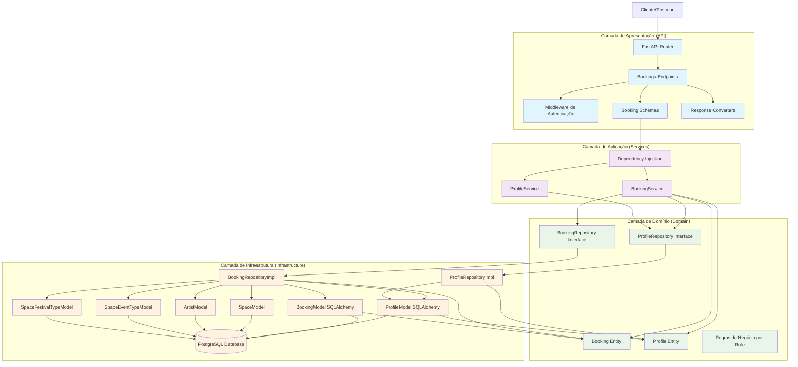
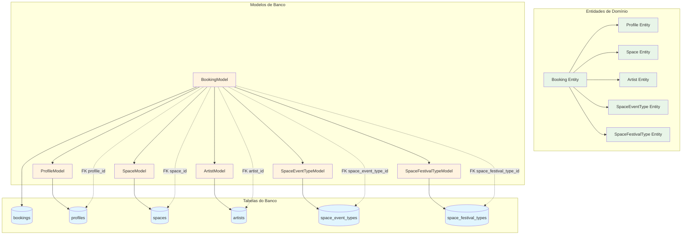
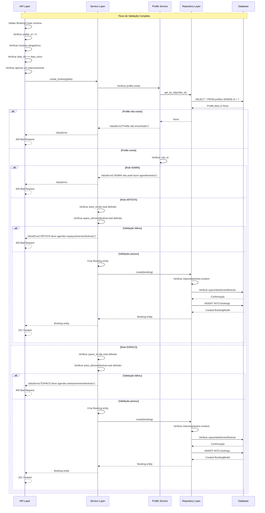
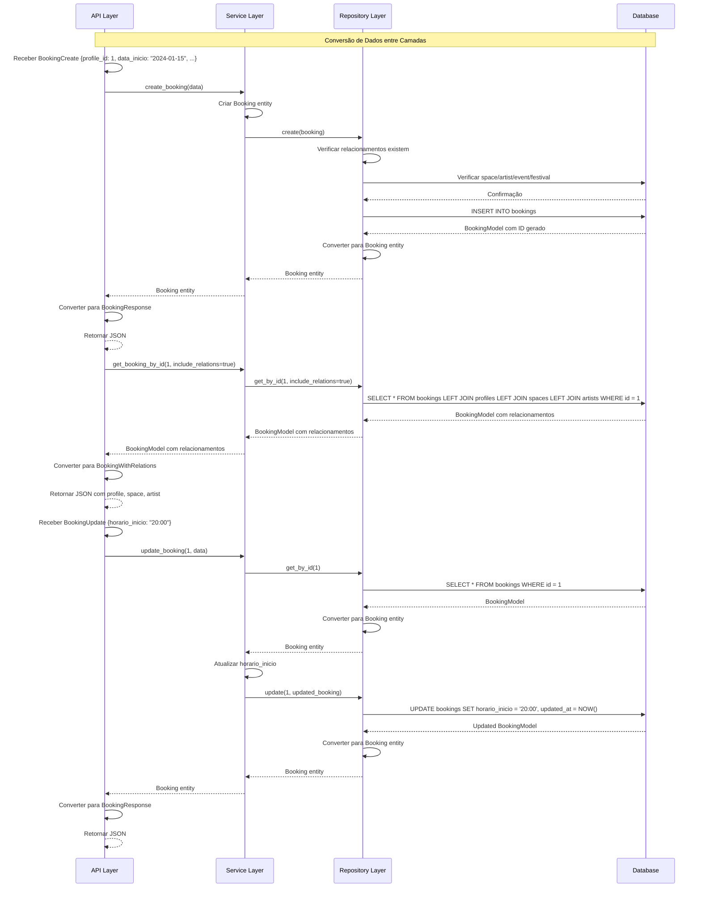

### **Arquitetura Implementada**

O endpoint bookings implementa uma **arquitetura robusta para gerenciamento de agendamentos** seguindo os princípios da **Clean Architecture**:

1. **Camada de Apresentação**: FastAPI com endpoints CRUD, validação Pydantic, conversores de resposta e autenticação
2. **Camada de Aplicação**: BookingService que orquestra a lógica de negócio com validações por role
3. **Camada de Domínio**: Entidade Booking com regras de negócio e interfaces de repositório
4. **Camada de Infraestrutura**: Implementação de repositório com múltiplos relacionamentos

### **Características Principais**

- **Regras de Negócio por Role**: Validações específicas baseadas no role do usuário
- **Múltiplos Relacionamentos**: Suporte a agendamentos de espaços, artistas, eventos e festivais
- **Validação de Datas e Horários**: Verificação de conflitos temporais
- **Relacionamentos Flexíveis**: Apenas um tipo de relacionamento por booking
- **Conversores de Resposta**: Suporte a dados relacionados opcionais
- **Busca por Período**: Filtros por data de início e fim

### **Endpoints Disponíveis**

1. **POST /bookings/** - Criar novo agendamento
2. **GET /bookings/** - Listar todos os agendamentos
3. **GET /bookings/profile/{id}** - Agendamentos por profile
4. **GET /bookings/space/{id}** - Agendamentos por espaço
5. **GET /bookings/artist/{id}** - Agendamentos por artista
6. **GET /bookings/space-event-type/{id}** - Agendamentos por tipo de evento
7. **GET /bookings/space-festival-type/{id}** - Agendamentos por tipo de festival
8. **GET /bookings/date-range** - Agendamentos por período
9. **GET /bookings/{id}** - Buscar agendamento por ID
10. **PUT /bookings/{id}** - Atualizar agendamento
11. **DELETE /bookings/{id}** - Deletar agendamento

### **Regras de Negócio por Role**

- **ADMIN (role_id = 1)**: NUNCA pode fazer agendamentos
- **ARTISTA (role_id = 2)**: Pode agendar apenas espaços, eventos ou festivais (NÃO artistas)
- **ESPACO (role_id = 3)**: Pode agendar apenas artistas, eventos ou festivais (NÃO espaços)

### **Validações Implementadas**

- **Schema Validation**: Validação de campos obrigatórios e tipos via Pydantic
- **Validação de Datas**: Verificação de data_fim >= data_inicio
- **Validação de Horários**: Verificação de horário_fim > horário_inicio
- **Relacionamentos**: Apenas um tipo de relacionamento por booking
- **Integridade Referencial**: Verificação de existência de entidades relacionadas
- **Validação por Role**: Regras específicas baseadas no role do usuário

### **Estrutura de Dados**

- **Tabela bookings**: Armazena agendamentos com múltiplos relacionamentos opcionais
- **Campos Temporais**: data_inicio, data_fim, horario_inicio, horario_fim
- **Relacionamentos**: FK para profiles, spaces, artists, space_event_types, space_festival_types
- **Timestamps**: Campos created_at e updated_at para rastreamento

### **Campos Principais**

- **profile_id**: Referência ao profile que fez o agendamento (FK obrigatório)
- **data_inicio/data_fim**: Datas de início e fim do agendamento
- **horario_inicio/horario_fim**: Horários de início e fim
- **space_id**: Referência ao espaço (FK opcional)
- **artist_id**: Referência ao artista (FK opcional)
- **space_event_type_id**: Referência ao tipo de evento (FK opcional)
- **space_festival_type_id**: Referência ao tipo de festival (FK opcional)

### **Fluxos Especiais**

- **Validação por Role**: Verificação de permissões baseada no role do usuário
- **Relacionamentos Múltiplos**: Suporte a diferentes tipos de agendamento
- **Busca por Período**: Filtros temporais para agendamentos
- **Conversão de Dados**: Suporte a dados relacionados opcionais
- **Validação de Conflitos**: Verificação de conflitos de horário (estrutura preparada)

# Diagrama de Fluxo - Endpoint Bookings

  

## Fluxo Detalhado da Arquitetura em Camadas

  



  

## Fluxo Detalhado por Operação

```mermaid

sequenceDiagram

participant C as Cliente

participant API as API Layer

participant Auth as Auth Middleware

participant Service as Booking Service

participant ProfileService as Profile Service

participant Repo as Repository

participant DB as Database

%% Criação de Booking

Note over C,DB: POST /bookings/ - Criar Booking

C->>API: POST /bookings/ {profile_id, data_inicio, horario_inicio, ...}

API->>Auth: get_current_active_user()

Auth-->>API: User autenticado

API->>API: Validar BookingCreate schema

API->>Service: create_booking(data)

%% Validação de Profile e Role

Service->>ProfileService: Verificar profile existe e role

ProfileService->>Repo: get_by_id(profile_id)

Repo->>DB: SELECT * FROM profiles WHERE id = ?

DB-->>Repo: Profile data or None

alt Profile não existe

Repo-->>ProfileService: None

ProfileService-->>Service: ValueError("Profile não encontrado")

Service-->>API: ValueError

API-->>C: 400 Bad Request

else Profile existe

ProfileService->>ProfileService: Verificar role_id

alt Role ADMIN (role_id = 1)

ProfileService-->>Service: ValueError("ADMIN não pode fazer agendamentos")

Service-->>API: ValueError

API-->>C: 400 Bad Request

else Role ARTISTA (role_id = 2)

Service->>Service: Verificar se artist_id está definido

alt artist_id está definido

Service-->>API: ValueError("ARTISTA não pode agendar artistas")

API-->>C: 400 Bad Request

else artist_id não está definido

Service->>Service: Verificar se space_id/event/festival está definido

alt Nenhum relacionamento definido

Service-->>API: ValueError("ARTISTA deve agendar espaços/eventos/festivais")

API-->>C: 400 Bad Request

else Relacionamento válido

%% Criar booking

Service->>Service: Criar Booking entity

Service->>Repo: create(booking)

Repo->>Repo: Verificar relacionamentos existem

Repo->>DB: Verificar space/artist/event/festival

DB-->>Repo: Confirmação

Repo->>DB: INSERT INTO bookings

DB-->>Repo: Created BookingModel

Repo-->>Service: Booking entity

Service-->>API: Booking entity

API->>API: Converter para response

API-->>C: 201 Created + BookingResponse

end

end

else Role ESPACO (role_id = 3)

Service->>Service: Verificar se space_id está definido

alt space_id está definido

Service-->>API: ValueError("ESPACO não pode agendar espaços")

API-->>C: 400 Bad Request

else space_id não está definido

Service->>Service: Verificar se artist_id/event/festival está definido

alt Nenhum relacionamento definido

Service-->>API: ValueError("ESPACO deve agendar artistas/eventos/festivais")

API-->>C: 400 Bad Request

else Relacionamento válido

%% Criar booking

Service->>Service: Criar Booking entity

Service->>Repo: create(booking)

Repo->>Repo: Verificar relacionamentos existem

Repo->>DB: Verificar space/artist/event/festival

DB-->>Repo: Confirmação

Repo->>DB: INSERT INTO bookings

DB-->>Repo: Created BookingModel

Repo-->>Service: Booking entity

Service-->>API: Booking entity

API->>API: Converter para response

API-->>C: 201 Created + BookingResponse

end

end

end

end

%% Listagem de Bookings

Note over C,DB: GET /bookings/ - Listar Bookings

C->>API: GET /bookings/?include_relations=true

API->>Auth: get_current_active_user()

Auth-->>API: User autenticado

API->>Service: get_all_bookings(include_relations=true)

Service->>Repo: get_all(include_relations=true)

Repo->>DB: SELECT * FROM bookings LEFT JOIN profiles LEFT JOIN spaces LEFT JOIN artists

DB-->>Repo: [BookingModel with relations]

Repo-->>Service: [BookingModel with relations]

Service-->>API: [BookingModel with relations]

API->>API: Converter para response com relacionamentos

API-->>C: 200 OK + BookingListWithRelations

%% Busca por Profile

Note over C,DB: GET /bookings/profile/{id} - Bookings por Profile

C->>API: GET /bookings/profile/1

API->>Auth: get_current_active_user()

Auth-->>API: User autenticado

API->>Service: get_bookings_by_profile(profile_id)

Service->>Repo: get_by_profile_id(profile_id)

Repo->>DB: SELECT * FROM bookings WHERE profile_id = ?

DB-->>Repo: [BookingModel]

Repo->>Repo: Converter para [Booking entities]

Repo-->>Service: [Booking entities]

Service-->>API: [Booking entities]

API->>API: Converter para response

API-->>C: 200 OK + BookingListResponse

%% Busca por Espaço

Note over C,DB: GET /bookings/space/{id} - Bookings por Espaço

C->>API: GET /bookings/space/1

API->>Auth: get_current_active_user()

Auth-->>API: User autenticado

API->>Service: get_bookings_by_space(space_id)

Service->>Repo: get_by_space_id(space_id)

Repo->>DB: SELECT * FROM bookings WHERE space_id = ?

DB-->>Repo: [BookingModel]

Repo->>Repo: Converter para [Booking entities]

Repo-->>Service: [Booking entities]

Service-->>API: [Booking entities]

API->>API: Converter para response

API-->>C: 200 OK + BookingListResponse

%% Busca por Artista

Note over C,DB: GET /bookings/artist/{id} - Bookings por Artista

C->>API: GET /bookings/artist/1

API->>Auth: get_current_active_user()

Auth-->>API: User autenticado

API->>Service: get_bookings_by_artist(artist_id)

Service->>Repo: get_by_artist_id(artist_id)

Repo->>DB: SELECT * FROM bookings WHERE artist_id = ?

DB-->>Repo: [BookingModel]

Repo->>Repo: Converter para [Booking entities]

Repo-->>Service: [Booking entities]

Service-->>API: [Booking entities]

API->>API: Converter para response

API-->>C: 200 OK + BookingListResponse

%% Busca por Período

Note over C,DB: GET /bookings/date-range - Bookings por Período

C->>API: GET /bookings/date-range?data_inicio=2024-01-01&data_fim=2024-01-31

API->>Auth: get_current_active_user()

Auth-->>API: User autenticado

API->>API: Validar data_fim >= data_inicio

API->>Service: get_bookings_by_date_range(data_inicio, data_fim)

Service->>Repo: get_by_date_range(data_inicio, data_fim)

Repo->>DB: SELECT * FROM bookings WHERE data_inicio >= ? AND data_fim <= ?

DB-->>Repo: [BookingModel]

Repo->>Repo: Converter para [Booking entities]

Repo-->>Service: [Booking entities]

Service-->>API: [Booking entities]

API->>API: Converter para response

API-->>C: 200 OK + BookingListResponse

%% Atualização

Note over C,DB: PUT /bookings/{id} - Atualizar Booking

C->>API: PUT /bookings/1 {horario_inicio: "20:00", horario_fim: "22:00"}

API->>Auth: get_current_active_user()

Auth-->>API: User autenticado

API->>API: Validar BookingUpdate schema

API->>Service: update_booking(booking_id, data)

Service->>Repo: get_by_id(booking_id)

Repo->>DB: SELECT * FROM bookings WHERE id = ?

DB-->>Repo: BookingModel or None

alt Booking encontrado

Service->>Service: Atualizar campos fornecidos

Service->>Repo: update(booking_id, updated_booking)

Repo->>Repo: Verificar relacionamentos se alterados

Repo->>DB: UPDATE bookings SET horario_inicio = ?, horario_fim = ?

DB-->>Repo: Updated BookingModel

Repo->>Repo: Converter para Booking entity

Repo-->>Service: Booking entity

Service-->>API: Booking entity

API->>API: Converter para response

API-->>C: 200 OK + BookingResponse

else Booking não encontrado

Repo-->>Service: None

Service-->>API: None

API-->>C: 404 Not Found

end

%% Exclusão

Note over C,DB: DELETE /bookings/{id} - Deletar Booking

C->>API: DELETE /bookings/1

API->>Auth: get_current_active_user()

Auth-->>API: User autenticado

API->>Service: delete_booking(booking_id)

Service->>Repo: delete(booking_id)

Repo->>DB: SELECT * FROM bookings WHERE id = ?

DB-->>Repo: BookingModel or None

alt Booking encontrado

Repo->>DB: DELETE FROM bookings WHERE id = ?

DB-->>Repo: Confirmação

Repo-->>Service: true

Service-->>API: true

API-->>C: 200 OK + {"message": "Booking deletado"}

else Booking não encontrado

Repo-->>Service: false

Service-->>API: false

API-->>C: 404 Not Found

end

```

  



  

## Arquitetura de Regras de Negócio por Role

  

```mermaid

graph TD

subgraph "Regras de Negócio por Role"

AdminRule[ADMIN (role_id=1): NUNCA faz agendamento]

ArtistRule[ARTISTA (role_id=2): Agenda apenas espaços/eventos/festivais]

SpaceRule[ESPACO (role_id=3): Agenda apenas artistas/eventos/festivais]

end

subgraph "Validações de Relacionamento"

ArtistValidation[ARTISTA: artist_id = null]

SpaceValidation[ESPACO: space_id = null]

AtLeastOneValidation[Pelo menos um relacionamento definido]

OnlyOneValidation[Apenas um relacionamento por booking]

end

subgraph "Tipos de Relacionamento"

SpaceRel[space_id: Agendamento de espaço]

ArtistRel[artist_id: Agendamento de artista]

EventRel[space_event_type_id: Agendamento de evento]

FestivalRel[space_festival_type_id: Agendamento de festival]

end

AdminRule --> ArtistValidation

AdminRule --> SpaceValidation

ArtistRule --> ArtistValidation

ArtistRule --> SpaceRel

ArtistRule --> EventRel

ArtistRule --> FestivalRel

SpaceRule --> SpaceValidation

SpaceRule --> ArtistRel

SpaceRule --> EventRel

SpaceRule --> FestivalRel

ArtistValidation --> AtLeastOneValidation

SpaceValidation --> AtLeastOneValidation

AtLeastOneValidation --> OnlyOneValidation

SpaceRel --> OnlyOneValidation

ArtistRel --> OnlyOneValidation

EventRel --> OnlyOneValidation

FestivalRel --> OnlyOneValidation

%% Estilos

classDef rule fill:#ffebee

classDef validation fill:#e3f2fd

classDef relationship fill:#e8f5e8

class AdminRule,ArtistRule,SpaceRule rule

class ArtistValidation,SpaceValidation,AtLeastOneValidation,OnlyOneValidation validation

class SpaceRel,ArtistRel,EventRel,FestivalRel relationship

```

  

## Arquitetura de Relacionamentos

  



  

## Fluxo de Validação e Regras de Negócio

  



  

## Estrutura de Schemas e Respostas

  

```mermaid

graph LR

subgraph "Schemas de Entrada"

CreateSchema[BookingCreate]

UpdateSchema[BookingUpdate]

end

subgraph "Schemas de Resposta"

ResponseSchema[BookingResponse]

ResponseWithRelations[BookingWithRelations]

ListResponse[BookingListResponse]

ListResponseWithRelations[BookingListWithRelations]

end

subgraph "Validações"

ProfileIdValidation[profile_id > 0]

HorarioValidation[horários obrigatórios]

DataValidation[data_fim >= data_inicio]

RelacionamentoValidation[apenas um relacionamento]

RoleValidation[validação por role]

end

subgraph "Campos"

IdField[id: int]

ProfileIdField[profile_id: int]

DataInicioField[data_inicio: datetime]

HorarioInicioField[horario_inicio: str]

DataFimField[data_fim: datetime]

HorarioFimField[horario_fim: str]

SpaceIdField[space_id: Optional[int]]

ArtistIdField[artist_id: Optional[int]]

EventTypeField[space_event_type_id: Optional[int]]

FestivalTypeField[space_festival_type_id: Optional[int]]

end

CreateSchema --> ProfileIdValidation

CreateSchema --> HorarioValidation

CreateSchema --> DataValidation

CreateSchema --> RelacionamentoValidation

CreateSchema --> RoleValidation

UpdateSchema --> ProfileIdValidation

UpdateSchema --> HorarioValidation

UpdateSchema --> DataValidation

UpdateSchema --> RelacionamentoValidation

ResponseSchema --> IdField

ResponseSchema --> ProfileIdField

ResponseSchema --> DataInicioField

ResponseSchema --> HorarioInicioField

ResponseSchema --> DataFimField

ResponseSchema --> HorarioFimField

ResponseSchema --> SpaceIdField

ResponseSchema --> ArtistIdField

ResponseSchema --> EventTypeField

ResponseSchema --> FestivalTypeField

ResponseWithRelations --> ResponseSchema

ListResponse --> ResponseSchema

ListResponseWithRelations --> ResponseWithRelations

%% Estilos

classDef input fill:#e3f2fd

classDef output fill:#f1f8e9

classDef validation fill:#fff3e0

classDef field fill:#ffebee

class CreateSchema,UpdateSchema input

class ResponseSchema,ResponseWithRelations,ListResponse,ListResponseWithRelations output

class ProfileIdValidation,HorarioValidation,DataValidation,RelacionamentoValidation,RoleValidation validation

class IdField,ProfileIdField,DataInicioField,HorarioInicioField,DataFimField,HorarioFimField,SpaceIdField,ArtistIdField,EventTypeField,FestivalTypeField field

```

  

## Modelo de Banco de Dados

  

```mermaid

graph TD

subgraph "Tabela bookings"

IdColumn[id: INTEGER PRIMARY KEY]

ProfileIdColumn[profile_id: INTEGER FK NOT NULL]

DataInicioColumn[data_inicio: TIMESTAMP NOT NULL]

HorarioInicioColumn[horario_inicio: STRING(50) NOT NULL]

DataFimColumn[data_fim: TIMESTAMP NOT NULL]

HorarioFimColumn[horario_fim: STRING(50) NOT NULL]

SpaceIdColumn[space_id: INTEGER FK NULL]

ArtistIdColumn[artist_id: INTEGER FK NULL]

SpaceEventTypeIdColumn[space_event_type_id: INTEGER FK NULL]

SpaceFestivalTypeIdColumn[space_festival_type_id: INTEGER FK NULL]

CreatedAtColumn[created_at: TIMESTAMP]

UpdatedAtColumn[updated_at: TIMESTAMP]

end

subgraph "Constraints"

PrimaryKey[PRIMARY KEY (id)]

NotNullProfile[NOT NULL (profile_id)]

NotNullDataInicio[NOT NULL (data_inicio)]

NotNullHorarioInicio[NOT NULL (horario_inicio)]

NotNullDataFim[NOT NULL (data_fim)]

NotNullHorarioFim[NOT NULL (horario_fim)]

end

subgraph "Relacionamentos"

FKProfile[FOREIGN KEY (profile_id) REFERENCES profiles(id)]

FKSpace[FOREIGN KEY (space_id) REFERENCES spaces(id)]

FKArtist[FOREIGN KEY (artist_id) REFERENCES artists(id)]

FKEventType[FOREIGN KEY (space_event_type_id) REFERENCES space_event_types(id)]

FKFestivalType[FOREIGN KEY (space_festival_type_id) REFERENCES space_festival_types(id)]

end

IdColumn --> PrimaryKey

ProfileIdColumn --> NotNullProfile

ProfileIdColumn --> FKProfile

DataInicioColumn --> NotNullDataInicio

HorarioInicioColumn --> NotNullHorarioInicio

DataFimColumn --> NotNullDataFim

HorarioFimColumn --> NotNullHorarioFim

SpaceIdColumn --> FKSpace

ArtistIdColumn --> FKArtist

SpaceEventTypeIdColumn --> FKEventType

SpaceFestivalTypeIdColumn --> FKFestivalType

%% Estilos

classDef column fill:#e1f5fe

classDef constraint fill:#f3e5f5

classDef relationship fill:#e8f5e8

class IdColumn,ProfileIdColumn,DataInicioColumn,HorarioInicioColumn,DataFimColumn,HorarioFimColumn,SpaceIdColumn,ArtistIdColumn,SpaceEventTypeIdColumn,SpaceFestivalTypeIdColumn,CreatedAtColumn,UpdatedAtColumn column

class PrimaryKey,NotNullProfile,NotNullDataInicio,NotNullHorarioInicio,NotNullDataFim,NotNullHorarioFim constraint

class FKProfile,FKSpace,FKArtist,FKEventType,FKFestivalType relationship

```

  

## Fluxo de Conversão de Dados

  

