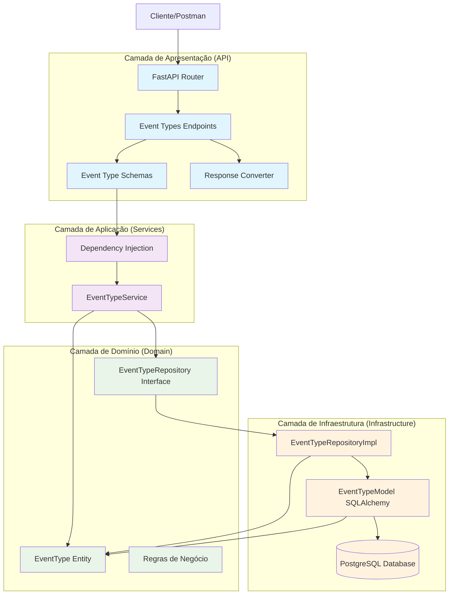
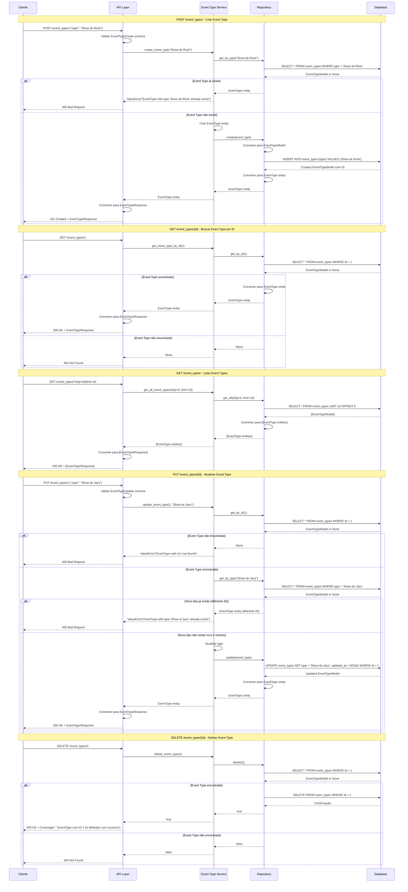
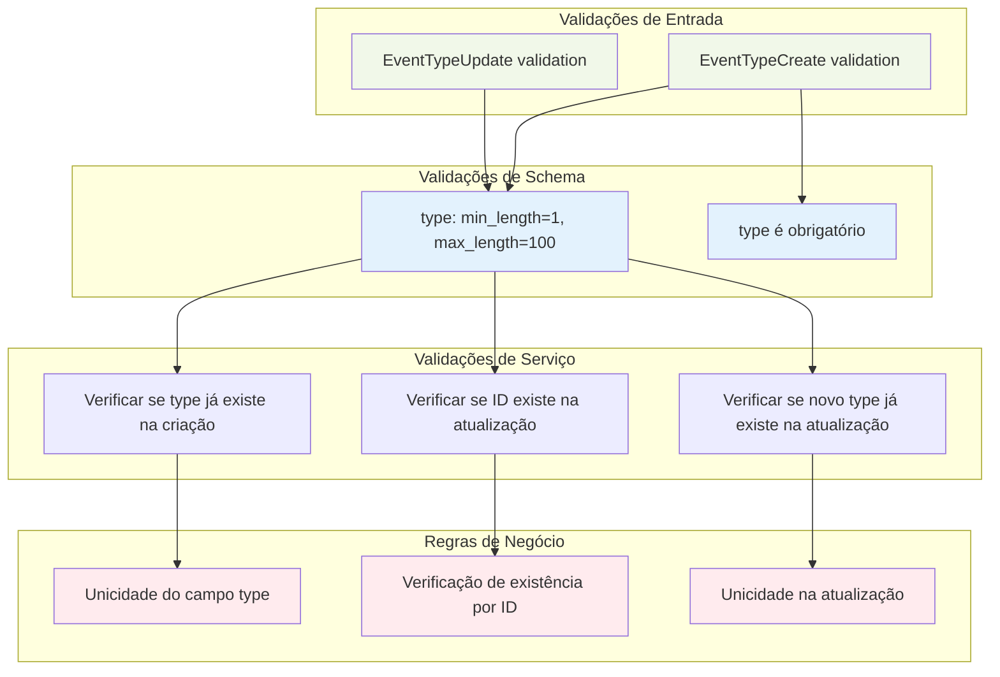
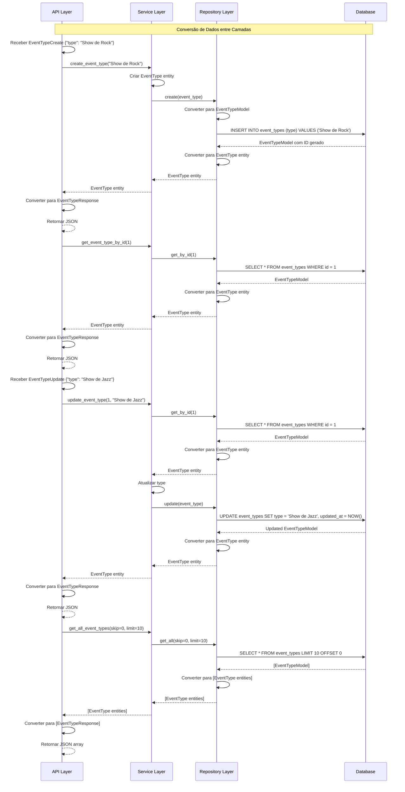

### **Arquitetura Implementada**

O endpoint event_types implementa uma **arquitetura simples e eficiente para gerenciamento de tipos de eventos** seguindo os princípios da **Clean Architecture**:

1. **Camada de Apresentação**: FastAPI com endpoints CRUD básicos e validação Pydantic
2. **Camada de Aplicação**: EventTypeService com lógica de negócio focada em unicidade
3. **Camada de Domínio**: Entidade EventType simples e interface de repositório
4. **Camada de Infraestrutura**: Implementação de repositório com SQLAlchemy

### **Características Principais**

- **Simplicidade**: Estrutura direta para gerenciamento de tipos de eventos
- **Unicidade**: Garantia de que cada tipo de evento seja único
- **Paginação**: Suporte a listagem paginada com skip e limit
- **Validação**: Verificações de existência e unicidade em operações
- **CRUD Completo**: Todas as operações básicas implementadas

### **Endpoints Disponíveis**

1. **POST /event_types/** - Criar novo tipo de evento
2. **GET /event_types/{id}** - Buscar tipo de evento por ID
3. **GET /event_types/** - Listar todos os tipos de evento (com paginação)
4. **PUT /event_types/{id}** - Atualizar tipo de evento
5. **DELETE /event_types/{id}** - Deletar tipo de evento

### **Regras de Negócio**

- **Unicidade**: O campo `type` deve ser único na tabela
- **Existência**: Verificação de existência antes de operações de atualização/exclusão
- **Validação de Entrada**: Campo `type` obrigatório com tamanho entre 1 e 100 caracteres
- **Integridade**: Verificação de unicidade na atualização (permitindo atualizar para o mesmo valor)

### **Validações Implementadas**

- **Schema Validation**: Validação de campos obrigatórios e tamanho via Pydantic
- **Unicidade**: Verificação de duplicatas antes de criar/atualizar
- **Existência**: Verificação de existência antes de operações
- **Paginação**: Parâmetros skip e limit para controle de listagem

### **Estrutura de Dados**

- **Tabela event_types**: Armazena tipos de eventos com campo único
- **Campo Principal**: `type` (VARCHAR UNIQUE NOT NULL)
- **Timestamps**: Campos created_at e updated_at para rastreamento
- **Relacionamentos**: Referenciado por space_event_types e bookings

### **Campos Principais**

- **id**: Chave primária auto-incrementada
- **type**: Nome/tipo do evento (único, obrigatório, 1-100 caracteres)
- **created_at**: Data/hora de criação
- **updated_at**: Data/hora da última atualização

### **Fluxos Especiais**

- **Validação de Unicidade**: Verificação antes de criar/atualizar
- **Paginação**: Controle de listagem com skip e limit
- **Conversão de Dados**: Transformação entre entidades, modelos e schemas
- **Tratamento de Erros**: Respostas específicas para diferentes cenários de erro

### **Relacionamentos**

- **space_event_types**: Referenciado pela tabela de tipos de eventos de espaços
- **bookings**: Referenciado pela tabela de agendamentos

# Diagrama de Fluxo - Endpoint Event Types

  

## Fluxo Detalhado da Arquitetura em Camadas

  



  

## Fluxo Detalhado por Operação

  



  

## Arquitetura de Validação e Regras de Negócio

  



  

## Estrutura de Dados e Modelo de Banco

  

```mermaid

graph TD

subgraph "Entidade de Domínio"

EventTypeEntity[EventType Entity]

IdField[id: Optional[int]]

TypeField[type: str]

CreatedAtField[created_at: datetime]

UpdatedAtField[updated_at: datetime]

end

subgraph "Schema Pydantic"

EventTypeBase[EventTypeBase]

EventTypeCreate[EventTypeCreate]

EventTypeUpdate[EventTypeUpdate]

EventTypeResponse[EventTypeResponse]

end

subgraph "Modelo SQLAlchemy"

EventTypeModel[EventTypeModel]

IdColumn[id: INTEGER PRIMARY KEY]

TypeColumn[type: STRING UNIQUE NOT NULL]

CreatedAtColumn[created_at: TIMESTAMP]

UpdatedAtColumn[updated_at: TIMESTAMP]

end

subgraph "Tabela do Banco"

EventTypesTable[(event_types)]

IdTableField[id: INTEGER PRIMARY KEY]

TypeTableField[type: VARCHAR UNIQUE NOT NULL]

CreatedAtTableField[created_at: TIMESTAMP DEFAULT NOW()]

UpdatedAtTableField[updated_at: TIMESTAMP DEFAULT NOW()]

end

%% Relacionamentos

EventTypeEntity --> IdField

EventTypeEntity --> TypeField

EventTypeEntity --> CreatedAtField

EventTypeEntity --> UpdatedAtField

EventTypeBase --> TypeField

EventTypeCreate --> EventTypeBase

EventTypeUpdate --> TypeField

EventTypeResponse --> EventTypeBase

EventTypeResponse --> IdField

EventTypeResponse --> CreatedAtField

EventTypeResponse --> UpdatedAtField

EventTypeModel --> IdColumn

EventTypeModel --> TypeColumn

EventTypeModel --> CreatedAtColumn

EventTypeModel --> UpdatedAtColumn

EventTypeModel --> EventTypesTable

IdColumn --> IdTableField

TypeColumn --> TypeTableField

CreatedAtColumn --> CreatedAtTableField

UpdatedAtColumn --> UpdatedAtTableField

%% Estilos

classDef entity fill:#e8f5e8

classDef schema fill:#fff3e0

classDef model fill:#e1f5fe

classDef table fill:#f3e5f5

class EventTypeEntity,IdField,TypeField,CreatedAtField,UpdatedAtField entity

class EventTypeBase,EventTypeCreate,EventTypeUpdate,EventTypeResponse schema

class EventTypeModel,IdColumn,TypeColumn,CreatedAtColumn,UpdatedAtColumn model

class EventTypesTable,IdTableField,TypeTableField,CreatedAtTableField,UpdatedAtTableField table

```

  

## Fluxo de Conversão de Dados

  



  

## Endpoints e Operações CRUD

  

```mermaid

graph LR

subgraph "Endpoints Disponíveis"

CreateEndpoint[POST /event_types/]

GetByIdEndpoint[GET /event_types/{id}]

GetAllEndpoint[GET /event_types/]

UpdateEndpoint[PUT /event_types/{id}]

DeleteEndpoint[DELETE /event_types/{id}]

end

subgraph "Operações CRUD"

CreateOp[Criar Event Type]

ReadOp[Ler Event Type]

ReadAllOp[Listar Event Types]

UpdateOp[Atualizar Event Type]

DeleteOp[Deletar Event Type]

end

subgraph "Validações por Operação"

CreateValidation[Validação de unicidade na criação]

ReadValidation[Verificação de existência na leitura]

UpdateValidation[Validação de existência e unicidade na atualização]

DeleteValidation[Verificação de existência na exclusão]

end

subgraph "Respostas"

CreateResponse[201 Created + EventTypeResponse]

ReadResponse[200 OK + EventTypeResponse]

ReadAllResponse[200 OK + [EventTypeResponse]]

UpdateResponse[200 OK + EventTypeResponse]

DeleteResponse[200 OK + message]

ErrorResponse[400/404 + error detail]

end

CreateEndpoint --> CreateOp

GetByIdEndpoint --> ReadOp

GetAllEndpoint --> ReadAllOp

UpdateEndpoint --> UpdateOp

DeleteEndpoint --> DeleteOp

CreateOp --> CreateValidation

ReadOp --> ReadValidation

UpdateOp --> UpdateValidation

DeleteOp --> DeleteValidation

CreateValidation --> CreateResponse

ReadValidation --> ReadResponse

ReadAllOp --> ReadAllResponse

UpdateValidation --> UpdateResponse

DeleteValidation --> DeleteResponse

CreateValidation --> ErrorResponse

ReadValidation --> ErrorResponse

UpdateValidation --> ErrorResponse

DeleteValidation --> ErrorResponse

%% Estilos

classDef endpoint fill:#e1f5fe

classDef operation fill:#f3e5f5

classDef validation fill:#fff3e0

classDef response fill:#e8f5e8

class CreateEndpoint,GetByIdEndpoint,GetAllEndpoint,UpdateEndpoint,DeleteEndpoint endpoint

class CreateOp,ReadOp,ReadAllOp,UpdateOp,DeleteOp operation

class CreateValidation,ReadValidation,UpdateValidation,DeleteValidation validation

class CreateResponse,ReadResponse,ReadAllResponse,UpdateResponse,DeleteResponse,ErrorResponse response

```

  

## Arquitetura de Paginação

  

```mermaid

graph TD

subgraph "Parâmetros de Paginação"

SkipParam[skip: int = 0]

LimitParam[limit: int = 100]

end

subgraph "Implementação no Repository"

OffsetQuery[OFFSET skip]

LimitQuery[LIMIT limit]

PaginationQuery[SELECT * FROM event_types LIMIT limit OFFSET skip]

end

subgraph "Validações de Paginação"

SkipValidation[skip >= 0]

LimitValidation[limit > 0]

MaxLimitValidation[limit <= 1000]

end

subgraph "Resposta Paginada"

EventTypesList[List[EventTypeResponse]]

TotalCount[Total de registros]

HasNext[Próxima página disponível]

HasPrevious[Página anterior disponível]

end

SkipParam --> SkipValidation

LimitParam --> LimitValidation

LimitParam --> MaxLimitValidation

SkipValidation --> OffsetQuery

LimitValidation --> LimitQuery

MaxLimitValidation --> LimitQuery

OffsetQuery --> PaginationQuery

LimitQuery --> PaginationQuery

PaginationQuery --> EventTypesList

PaginationQuery --> TotalCount

TotalCount --> HasNext

TotalCount --> HasPrevious

%% Estilos

classDef param fill:#e3f2fd

classDef query fill:#fff3e0

classDef validation fill:#ffebee

classDef response fill:#e8f5e8

class SkipParam,LimitParam param

class OffsetQuery,LimitQuery,PaginationQuery query

class SkipValidation,LimitValidation,MaxLimitValidation validation

class EventTypesList,TotalCount,HasNext,HasPrevious response

```

  

## Modelo de Banco de Dados

  

```mermaid

graph TD

subgraph "Tabela event_types"

IdColumn[id: INTEGER PRIMARY KEY]

TypeColumn[type: VARCHAR UNIQUE NOT NULL]

CreatedAtColumn[created_at: TIMESTAMP DEFAULT NOW()]

UpdatedAtColumn[updated_at: TIMESTAMP DEFAULT NOW() ON UPDATE NOW()]

end

subgraph "Constraints"

PrimaryKey[PRIMARY KEY (id)]

UniqueType[UNIQUE (type)]

NotNullType[NOT NULL (type)]

IndexType[INDEX (type)]

end

subgraph "Relacionamentos"

SpaceEventTypes[space_event_types.event_type_id]

Bookings[bookings.space_event_type_id]

end

subgraph "Operações"

InsertOp[INSERT INTO event_types (type) VALUES (?)]

SelectOp[SELECT * FROM event_types WHERE id = ?]

SelectByTypeOp[SELECT * FROM event_types WHERE type = ?]

SelectAllOp[SELECT * FROM event_types LIMIT ? OFFSET ?]

UpdateOp[UPDATE event_types SET type = ?, updated_at = NOW() WHERE id = ?]

DeleteOp[DELETE FROM event_types WHERE id = ?]

end

IdColumn --> PrimaryKey

TypeColumn --> UniqueType

TypeColumn --> NotNullType

TypeColumn --> IndexType

IdColumn --> SpaceEventTypes

IdColumn --> Bookings

PrimaryKey --> SelectOp

UniqueType --> SelectByTypeOp

IndexType --> SelectByTypeOp

PrimaryKey --> UpdateOp

PrimaryKey --> DeleteOp

%% Estilos

classDef column fill:#e1f5fe

classDef constraint fill:#f3e5f5

classDef relationship fill:#e8f5e8

classDef operation fill:#fff3e0

class IdColumn,TypeColumn,CreatedAtColumn,UpdatedAtColumn column

class PrimaryKey,UniqueType,NotNullType,IndexType constraint

class SpaceEventTypes,Bookings relationship

class InsertOp,SelectOp,SelectByTypeOp,SelectAllOp,UpdateOp,DeleteOp operation

```