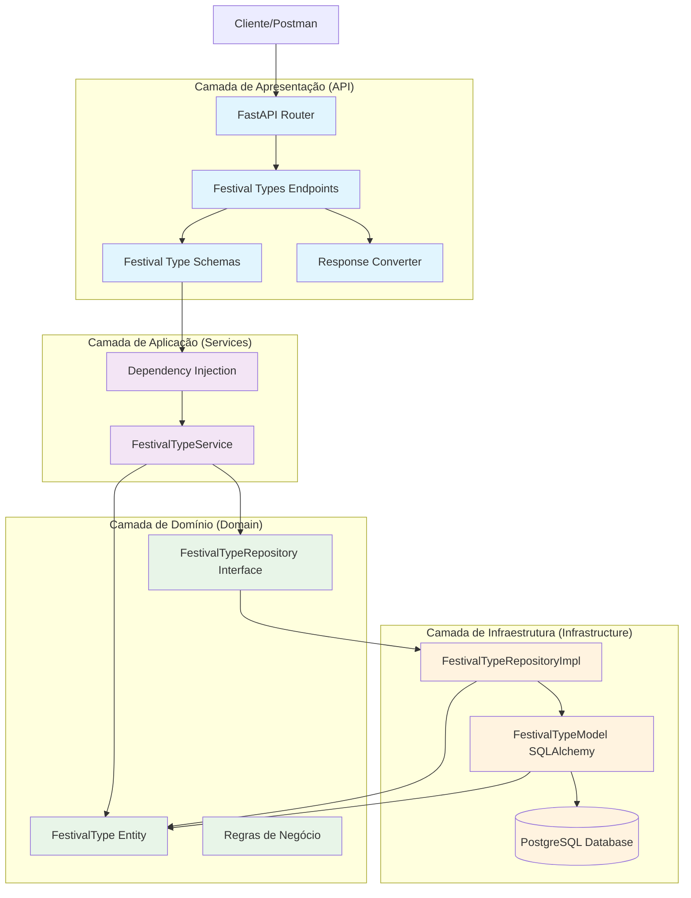
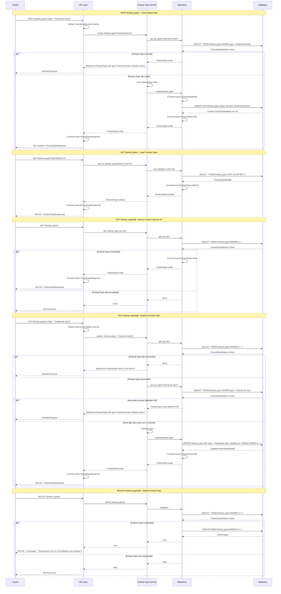
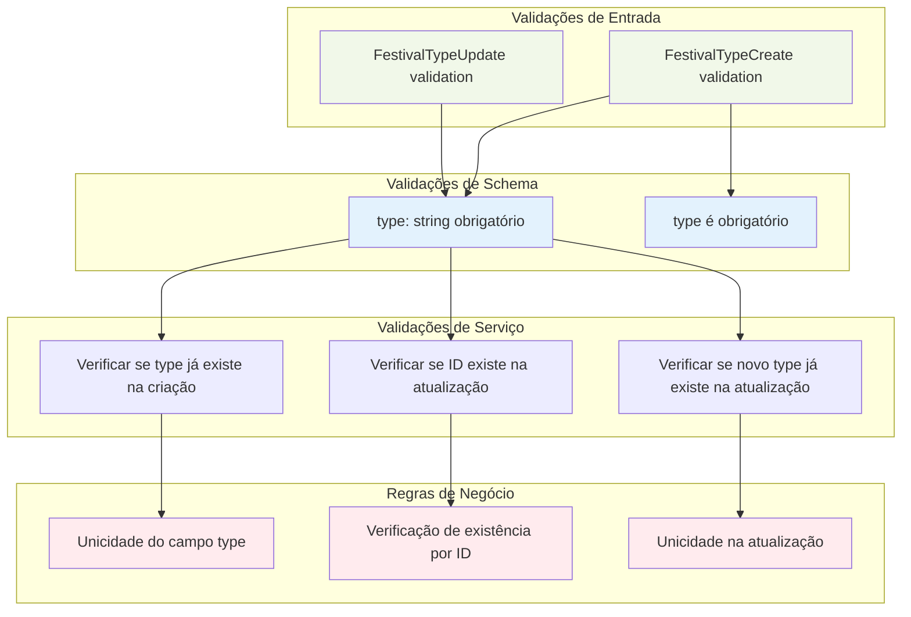
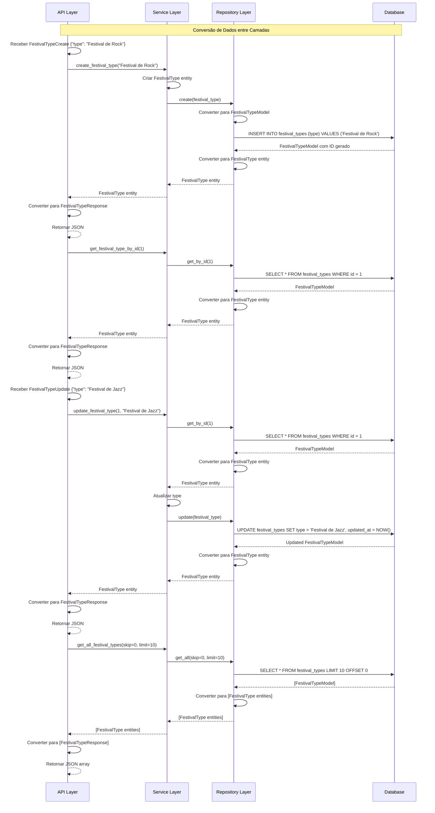
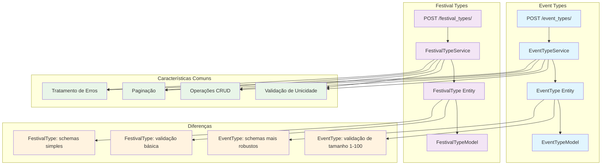

### **Arquitetura Implementada**

O endpoint festival_types implementa uma **arquitetura similar ao event_types** para gerenciamento de tipos de festivais, seguindo os princípios da **Clean Architecture**:

1. **Camada de Apresentação**: FastAPI com endpoints CRUD básicos e validação Pydantic
2. **Camada de Aplicação**: FestivalTypeService com lógica de negócio focada em unicidade
3. **Camada de Domínio**: Entidade FestivalType simples e interface de repositório
4. **Camada de Infraestrutura**: Implementação de repositório com SQLAlchemy

### **Características Principais**

- **Simplicidade**: Estrutura direta para gerenciamento de tipos de festivais
- **Unicidade**: Garantia de que cada tipo de festival seja único
- **Paginação**: Suporte a listagem paginada com skip e limit
- **Validação**: Verificações de existência e unicidade em operações
- **CRUD Completo**: Todas as operações básicas implementadas

### **Endpoints Disponíveis**

1. **POST /festival_types/** - Criar novo tipo de festival
2. **GET /festival_types/** - Listar todos os tipos de festival (com paginação)
3. **GET /festival_types/{id}** - Buscar tipo de festival por ID
4. **PUT /festival_types/{id}** - Atualizar tipo de festival
5. **DELETE /festival_types/{id}** - Deletar tipo de festival

### **Regras de Negócio**

- **Unicidade**: O campo `type` deve ser único na tabela
- **Existência**: Verificação de existência antes de operações de atualização/exclusão
- **Validação de Entrada**: Campo `type` obrigatório (validação básica)
- **Integridade**: Verificação de unicidade na atualização (permitindo atualizar para o mesmo valor)

### **Validações Implementadas**

- **Schema Validation**: Validação de campos obrigatórios via Pydantic
- **Unicidade**: Verificação de duplicatas antes de criar/atualizar
- **Existência**: Verificação de existência antes de operações
- **Paginação**: Parâmetros skip e limit para controle de listagem

### **Estrutura de Dados**

- **Tabela festival_types**: Armazena tipos de festivais com campo único
- **Campo Principal**: `type` (VARCHAR UNIQUE NOT NULL)
- **Timestamps**: Campos created_at e updated_at para rastreamento
- **Relacionamentos**: Referenciado por space_festival_types e bookings

### **Campos Principais**

- **id**: Chave primária auto-incrementada
- **type**: Nome/tipo do festival (único, obrigatório)
- **created_at**: Data/hora de criação
- **updated_at**: Data/hora da última atualização

### **Fluxos Especiais**

- **Validação de Unicidade**: Verificação antes de criar/atualizar
- **Paginação**: Controle de listagem com skip e limit
- **Conversão de Dados**: Transformação entre entidades, modelos e schemas
- **Tratamento de Erros**: Respostas específicas para diferentes cenários de erro

### **Relacionamentos**

- **space_festival_types**: Referenciado pela tabela de tipos de festivais de espaços
- **bookings**: Referenciado pela tabela de agendamentos

### **Comparação com Event Types**

O endpoint festival_types é **muito similar ao event_types**, com as principais diferenças:

1. **Validação de Schema**: Event types tem validação mais robusta (tamanho 1-100 caracteres), enquanto festival types tem validação básica
2. **Schemas**: Event types tem schemas mais detalhados com Field validators
3. **Funcionalidade**: Ambos implementam as mesmas operações CRUD e regras de negócio

### **Arquitetura de Dados**

- **Entidade**: FestivalType com campos id, type, created_at, updated_at
- **Schema**: FestivalTypeBase, FestivalTypeCreate, FestivalTypeUpdate, FestivalTypeResponse
- **Modelo**: FestivalTypeModel com constraints de unicidade e índices
- **Tabela**: festival_types com chave primária e campo type único

# Diagrama de Fluxo - Endpoint Festival Types

  

## Fluxo Detalhado da Arquitetura em Camadas

  



  

## Fluxo Detalhado por Operação

  



  

## Arquitetura de Validação e Regras de Negócio

  



  

## Estrutura de Dados e Modelo de Banco

  

```mermaid

graph TD

subgraph "Entidade de Domínio"

FestivalTypeEntity[FestivalType Entity]

IdField[id: Optional[int]]

TypeField[type: str]

CreatedAtField[created_at: datetime]

UpdatedAtField[updated_at: datetime]

end

subgraph "Schema Pydantic"

FestivalTypeBase[FestivalTypeBase]

FestivalTypeCreate[FestivalTypeCreate]

FestivalTypeUpdate[FestivalTypeUpdate]

FestivalTypeResponse[FestivalTypeResponse]

end

subgraph "Modelo SQLAlchemy"

FestivalTypeModel[FestivalTypeModel]

IdColumn[id: INTEGER PRIMARY KEY]

TypeColumn[type: STRING UNIQUE NOT NULL]

CreatedAtColumn[created_at: TIMESTAMP]

UpdatedAtColumn[updated_at: TIMESTAMP]

end

subgraph "Tabela do Banco"

FestivalTypesTable[(festival_types)]

IdTableField[id: INTEGER PRIMARY KEY]

TypeTableField[type: VARCHAR UNIQUE NOT NULL]

CreatedAtTableField[created_at: TIMESTAMP DEFAULT NOW()]

UpdatedAtTableField[updated_at: TIMESTAMP DEFAULT NOW()]

end

%% Relacionamentos

FestivalTypeEntity --> IdField

FestivalTypeEntity --> TypeField

FestivalTypeEntity --> CreatedAtField

FestivalTypeEntity --> UpdatedAtField

FestivalTypeBase --> TypeField

FestivalTypeCreate --> FestivalTypeBase

FestivalTypeUpdate --> TypeField

FestivalTypeResponse --> FestivalTypeBase

FestivalTypeResponse --> IdField

FestivalTypeResponse --> CreatedAtField

FestivalTypeResponse --> UpdatedAtField

FestivalTypeModel --> IdColumn

FestivalTypeModel --> TypeColumn

FestivalTypeModel --> CreatedAtColumn

FestivalTypeModel --> UpdatedAtColumn

FestivalTypeModel --> FestivalTypesTable

IdColumn --> IdTableField

TypeColumn --> TypeTableField

CreatedAtColumn --> CreatedAtTableField

UpdatedAtColumn --> UpdatedAtTableField

%% Estilos

classDef entity fill:#e8f5e8

classDef schema fill:#fff3e0

classDef model fill:#e1f5fe

classDef table fill:#f3e5f5

class FestivalTypeEntity,IdField,TypeField,CreatedAtField,UpdatedAtField entity

class FestivalTypeBase,FestivalTypeCreate,FestivalTypeUpdate,FestivalTypeResponse schema

class FestivalTypeModel,IdColumn,TypeColumn,CreatedAtColumn,UpdatedAtColumn model

class FestivalTypesTable,IdTableField,TypeTableField,CreatedAtTableField,UpdatedAtTableField table

```

  

## Fluxo de Conversão de Dados

  



  

## Endpoints e Operações CRUD

  

```mermaid

graph LR

subgraph "Endpoints Disponíveis"

CreateEndpoint[POST /festival_types/]

GetAllEndpoint[GET /festival_types/]

GetByIdEndpoint[GET /festival_types/{id}]

UpdateEndpoint[PUT /festival_types/{id}]

DeleteEndpoint[DELETE /festival_types/{id}]

end

subgraph "Operações CRUD"

CreateOp[Criar Festival Type]

ReadAllOp[Listar Festival Types]

ReadOp[Ler Festival Type]

UpdateOp[Atualizar Festival Type]

DeleteOp[Deletar Festival Type]

end

subgraph "Validações por Operação"

CreateValidation[Validação de unicidade na criação]

ReadValidation[Verificação de existência na leitura]

UpdateValidation[Validação de existência e unicidade na atualização]

DeleteValidation[Verificação de existência na exclusão]

end

subgraph "Respostas"

CreateResponse[201 Created + FestivalTypeResponse]

ReadAllResponse[200 OK + [FestivalTypeResponse]]

ReadResponse[200 OK + FestivalTypeResponse]

UpdateResponse[200 OK + FestivalTypeResponse]

DeleteResponse[200 OK + message]

ErrorResponse[400/404 + error detail]

end

CreateEndpoint --> CreateOp

GetAllEndpoint --> ReadAllOp

GetByIdEndpoint --> ReadOp

UpdateEndpoint --> UpdateOp

DeleteEndpoint --> DeleteOp

CreateOp --> CreateValidation

ReadOp --> ReadValidation

UpdateOp --> UpdateValidation

DeleteOp --> DeleteValidation

CreateValidation --> CreateResponse

ReadAllOp --> ReadAllResponse

ReadValidation --> ReadResponse

UpdateValidation --> UpdateResponse

DeleteValidation --> DeleteResponse

CreateValidation --> ErrorResponse

ReadValidation --> ErrorResponse

UpdateValidation --> ErrorResponse

DeleteValidation --> ErrorResponse

%% Estilos

classDef endpoint fill:#e1f5fe

classDef operation fill:#f3e5f5

classDef validation fill:#fff3e0

classDef response fill:#e8f5e8

class CreateEndpoint,GetAllEndpoint,GetByIdEndpoint,UpdateEndpoint,DeleteEndpoint endpoint

class CreateOp,ReadAllOp,ReadOp,UpdateOp,DeleteOp operation

class CreateValidation,ReadValidation,UpdateValidation,DeleteValidation validation

class CreateResponse,ReadAllResponse,ReadResponse,UpdateResponse,DeleteResponse,ErrorResponse response

```

  

## Arquitetura de Paginação

  

```mermaid

graph TD

subgraph "Parâmetros de Paginação"

SkipParam[skip: int = 0]

LimitParam[limit: int = 100]

end

subgraph "Implementação no Repository"

OffsetQuery[OFFSET skip]

LimitQuery[LIMIT limit]

PaginationQuery[SELECT * FROM festival_types LIMIT limit OFFSET skip]

end

subgraph "Validações de Paginação"

SkipValidation[skip >= 0]

LimitValidation[limit > 0]

MaxLimitValidation[limit <= 1000]

end

subgraph "Resposta Paginada"

FestivalTypesList[List[FestivalTypeResponse]]

TotalCount[Total de registros]

HasNext[Próxima página disponível]

HasPrevious[Página anterior disponível]

end

SkipParam --> SkipValidation

LimitParam --> LimitValidation

LimitParam --> MaxLimitValidation

SkipValidation --> OffsetQuery

LimitValidation --> LimitQuery

MaxLimitValidation --> LimitQuery

OffsetQuery --> PaginationQuery

LimitQuery --> PaginationQuery

PaginationQuery --> FestivalTypesList

PaginationQuery --> TotalCount

TotalCount --> HasNext

TotalCount --> HasPrevious

%% Estilos

classDef param fill:#e3f2fd

classDef query fill:#fff3e0

classDef validation fill:#ffebee

classDef response fill:#e8f5e8

class SkipParam,LimitParam param

class OffsetQuery,LimitQuery,PaginationQuery query

class SkipValidation,LimitValidation,MaxLimitValidation validation

class FestivalTypesList,TotalCount,HasNext,HasPrevious response

```

  

## Modelo de Banco de Dados

  

```mermaid

graph TD

subgraph "Tabela festival_types"

IdColumn[id: INTEGER PRIMARY KEY]

TypeColumn[type: VARCHAR UNIQUE NOT NULL]

CreatedAtColumn[created_at: TIMESTAMP DEFAULT NOW()]

UpdatedAtColumn[updated_at: TIMESTAMP DEFAULT NOW() ON UPDATE NOW()]

end

subgraph "Constraints"

PrimaryKey[PRIMARY KEY (id)]

UniqueType[UNIQUE (type)]

NotNullType[NOT NULL (type)]

IndexType[INDEX (type)]

end

subgraph "Relacionamentos"

SpaceFestivalTypes[space_festival_types.festival_type_id]

Bookings[bookings.space_festival_type_id]

end

subgraph "Operações"

InsertOp[INSERT INTO festival_types (type) VALUES (?)]

SelectOp[SELECT * FROM festival_types WHERE id = ?]

SelectByTypeOp[SELECT * FROM festival_types WHERE type = ?]

SelectAllOp[SELECT * FROM festival_types LIMIT ? OFFSET ?]

UpdateOp[UPDATE festival_types SET type = ?, updated_at = NOW() WHERE id = ?]

DeleteOp[DELETE FROM festival_types WHERE id = ?]

end

IdColumn --> PrimaryKey

TypeColumn --> UniqueType

TypeColumn --> NotNullType

TypeColumn --> IndexType

IdColumn --> SpaceFestivalTypes

IdColumn --> Bookings

PrimaryKey --> SelectOp

UniqueType --> SelectByTypeOp

IndexType --> SelectByTypeOp

PrimaryKey --> UpdateOp

PrimaryKey --> DeleteOp

%% Estilos

classDef column fill:#e1f5fe

classDef constraint fill:#f3e5f5

classDef relationship fill:#e8f5e8

classDef operation fill:#fff3e0

class IdColumn,TypeColumn,CreatedAtColumn,UpdatedAtColumn column

class PrimaryKey,UniqueType,NotNullType,IndexType constraint

class SpaceFestivalTypes,Bookings relationship

class InsertOp,SelectOp,SelectByTypeOp,SelectAllOp,UpdateOp,DeleteOp operation

```

  

## Comparação com Event Types

  

