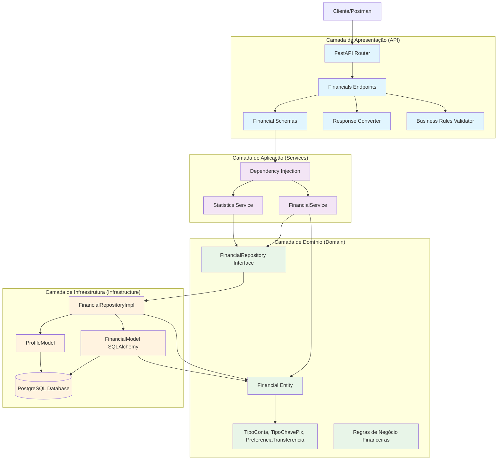
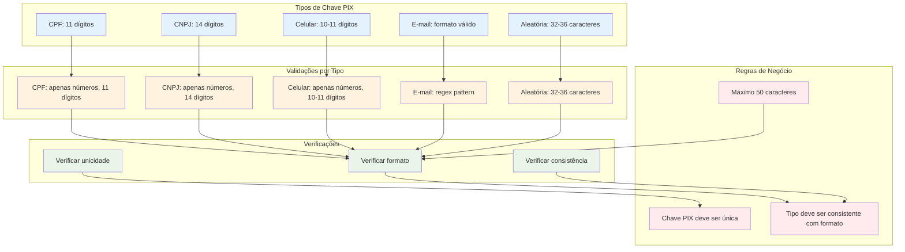
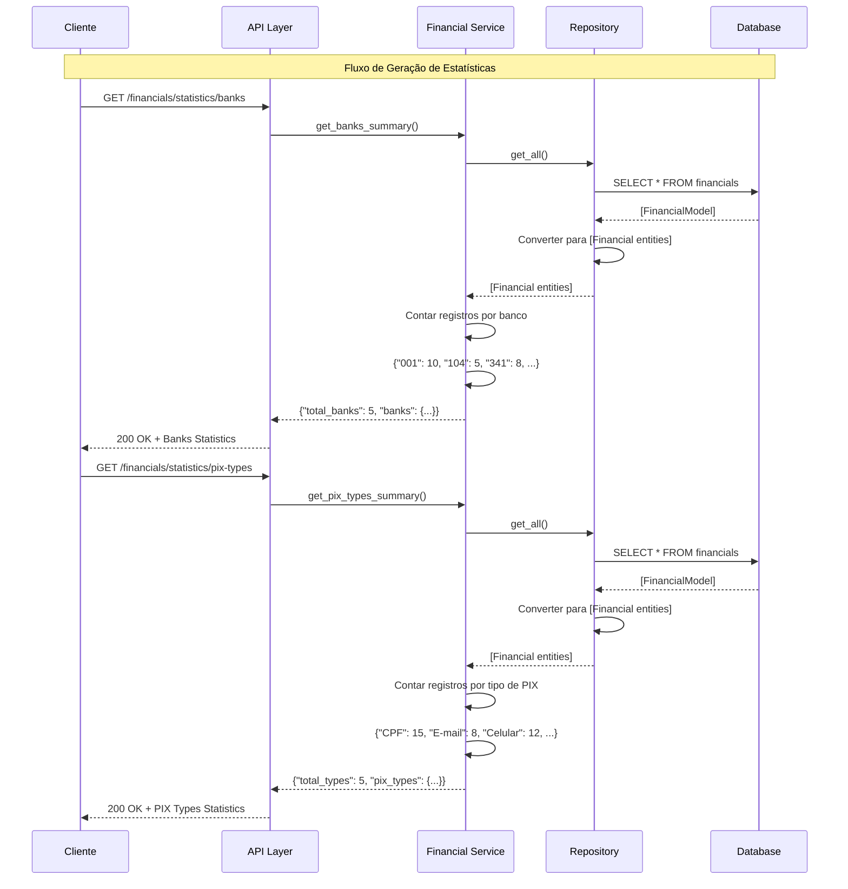

### **Arquitetura Implementada**

O endpoint financials implementa uma **arquitetura robusta para gerenciamento de dados financeiros/bancários** seguindo os princípios da **Clean Architecture**:

1. **Camada de Apresentação**: FastAPI com endpoints CRUD, busca especializada, verificação e estatísticas
2. **Camada de Aplicação**: FinancialService com lógica de negócio complexa e validações financeiras
3. **Camada de Domínio**: Entidade Financial com enums e validações específicas para dados bancários
4. **Camada de Infraestrutura**: Implementação de repositório com múltiplas consultas especializadas

### **Características Principais**

- **Dados Financeiros**: Gerenciamento completo de informações bancárias e PIX
- **Validações Complexas**: Validações específicas por tipo de chave PIX e dados bancários
- **Unicidade**: Garantia de unicidade da chave PIX
- **Busca Especializada**: Múltiplos endpoints de busca por diferentes critérios
- **Estatísticas**: Geração de relatórios e estatísticas
- **Verificação**: Endpoint para verificar disponibilidade de chave PIX

### **Endpoints Disponíveis**

#### **CRUD Básico:**
1. **POST /financials/** - Criar novo registro financeiro
2. **GET /financials/{id}** - Buscar registro financeiro por ID
3. **GET /financials/** - Listar todos os registros financeiros
4. **PUT /financials/{id}** - Atualizar registro financeiro
5. **DELETE /financials/{id}** - Deletar registro financeiro

#### **Busca Especializada:**
6. **GET /financials/profile/{id}** - Registros por profile
7. **GET /financials/banco/{banco}** - Registros por banco
8. **GET /financials/tipo-conta/{tipo}** - Registros por tipo de conta
9. **GET /financials/tipo-chave-pix/{tipo}** - Registros por tipo de chave PIX
10. **GET /financials/chave-pix/{chave}** - Registro por chave PIX
11. **GET /financials/preferencia/{pref}** - Registros por preferência
12. **GET /financials/cpf-cnpj/{cpf_cnpj}** - Registros por CPF/CNPJ

#### **Verificação e Estatísticas:**
13. **GET /financials/check-chave-pix/{chave}** - Verificar disponibilidade de chave PIX
14. **GET /financials/statistics/banks** - Estatísticas por banco
15. **GET /financials/statistics/pix-types** - Estatísticas por tipo de PIX

### **Regras de Negócio**

- **Unicidade da Chave PIX**: Cada chave PIX deve ser única no sistema
- **Validação de Profile**: Profile deve existir antes de criar registro financeiro
- **Consistência de Dados**: Tipo de chave PIX deve ser consistente com o formato
- **Validações Bancárias**: Código do banco, agência e conta com formatos específicos
- **Validações de CPF/CNPJ**: Formato correto conforme legislação brasileira

### **Validações Implementadas**

#### **Schema Validation:**
- **profile_id**: Deve ser maior que zero
- **banco**: String com exatamente 3 dígitos (001-999)
- **agencia**: Entre 3 e 10 caracteres
- **conta**: Entre 4 e 15 caracteres
- **cpf_cnpj**: 11 dígitos (CPF) ou 14 dígitos (CNPJ)
- **chave_pix**: Máximo 50 caracteres

#### **Validações Específicas por Tipo de Chave PIX:**
- **CPF**: 11 dígitos numéricos
- **CNPJ**: 14 dígitos numéricos
- **Celular**: 10 ou 11 dígitos numéricos
- **E-mail**: Formato de e-mail válido
- **Aleatória**: Entre 32 e 36 caracteres

### **Estrutura de Dados**

- **Tabela financials**: Armazena dados financeiros com relacionamento com profiles
- **Campos Principais**: banco, agencia, conta, tipo_conta, cpf_cnpj, tipo_chave_pix, chave_pix, preferencia
- **Enums**: TipoConta, TipoChavePix, PreferenciaTransferencia
- **Relacionamentos**: FK para profiles, referenciado por space_financials

### **Campos Principais**

- **profile_id**: Referência ao profile (FK obrigatório)
- **banco**: Código do banco (3 dígitos, 001-999)
- **agencia**: Número da agência (3-10 caracteres)
- **conta**: Número da conta (4-15 caracteres)
- **tipo_conta**: Poupança ou Corrente
- **cpf_cnpj**: CPF (11 dígitos) ou CNPJ (14 dígitos)
- **tipo_chave_pix**: CPF, CNPJ, Celular, E-mail ou Aleatória
- **chave_pix**: Chave PIX (única, máximo 50 caracteres)
- **preferencia**: PIX ou TED

### **Fluxos Especiais**

- **Validação de Chave PIX**: Verificação de unicidade e consistência com tipo
- **Busca Especializada**: Múltiplos critérios de busca
- **Verificação de Disponibilidade**: Endpoint para verificar se chave PIX está disponível
- **Estatísticas**: Geração de relatórios por banco e tipo de PIX
- **Conversão de Dados**: Transformação entre enums, entidades e modelos

### **Relacionamentos**

- **profiles**: Referenciado pela tabela financials (FK)
- **space_financials**: Referencia a tabela financials

# Diagrama de Fluxo - Endpoint Financials

  

## Fluxo Detalhado da Arquitetura em Camadas

  



  

## Fluxo Detalhado por Operação

```mermaid

sequenceDiagram

participant C as Cliente

participant API as API Layer

participant Service as Financial Service

participant Repo as Repository

participant DB as Database

%% Criação de Financial

Note over C,DB: POST /financials/ - Criar Financial

C->>API: POST /financials/ {profile_id, banco, agencia, conta, tipo_conta, cpf_cnpj, tipo_chave_pix, chave_pix, preferencia}

API->>API: Validar FinancialCreate schema

API->>Service: validate_business_rules(financial_data)

%% Validação de Regras de Negócio

Service->>Repo: check_chave_pix_exists(chave_pix)

Repo->>DB: SELECT * FROM financials WHERE chave_pix = ?

DB-->>Repo: FinancialModel or None

alt Chave PIX já existe

Repo-->>Service: true

Service-->>API: ["Chave PIX já está em uso"]

API-->>C: 400 Bad Request

else Chave PIX não existe

Repo-->>Service: false

Service->>Service: Criar Financial entity com validações

Service->>Repo: create(financial)

%% Verificar profile existe

Repo->>DB: SELECT * FROM profiles WHERE id = ?

DB-->>Repo: ProfileModel or None

alt Profile não existe

Repo-->>Service: ValueError("Profile não encontrado")

Service-->>API: ValueError

API-->>C: 400 Bad Request

else Profile existe

Repo->>Repo: Verificar chave PIX novamente

Repo->>DB: INSERT INTO financials (profile_id, banco, agencia, conta, tipo_conta, cpf_cnpj, tipo_chave_pix, chave_pix, preferencia)

DB-->>Repo: Created FinancialModel com ID

Repo->>Repo: Converter para Financial entity

Repo-->>Service: Financial entity

Service-->>API: Financial entity

API->>API: Converter para FinancialResponse

API-->>C: 201 Created + FinancialResponse

end

end

%% Busca por ID

Note over C,DB: GET /financials/{id} - Buscar Financial por ID

C->>API: GET /financials/1?include_relations=true

API->>Service: get_financial_by_id(1, include_relations=true)

Service->>Repo: get_by_id(1, include_relations=true)

Repo->>DB: SELECT * FROM financials LEFT JOIN profiles WHERE id = 1

DB-->>Repo: FinancialModel with relations or None

alt Financial encontrado

Repo->>Repo: Converter para Financial entity ou retornar modelo com relações

Repo-->>Service: Financial entity/FinancialModel

Service-->>API: Financial entity/FinancialModel

API->>API: Converter para FinancialResponse/FinancialWithRelations

API-->>C: 200 OK + FinancialResponse/FinancialWithRelations

else Financial não encontrado

Repo-->>Service: None

Service-->>API: None

API-->>C: 404 Not Found

end

%% Listagem

Note over C,DB: GET /financials/ - Listar Financials

C->>API: GET /financials/?include_relations=false

API->>Service: get_all_financials(include_relations=false)

Service->>Repo: get_all(include_relations=false)

Repo->>DB: SELECT * FROM financials

DB-->>Repo: [FinancialModel]

Repo->>Repo: Converter para [Financial entities]

Repo-->>Service: [Financial entities]

Service-->>API: [Financial entities]

API->>API: Converter para FinancialListResponse

API-->>C: 200 OK + FinancialListResponse

%% Busca por Banco

Note over C,DB: GET /financials/banco/{banco} - Financials por Banco

C->>API: GET /financials/banco/001

API->>API: Validar formato do banco (3 dígitos, 001-999)

API->>Service: get_financials_by_banco("001")

Service->>Repo: get_by_banco("001")

Repo->>DB: SELECT * FROM financials WHERE banco = '001'

DB-->>Repo: [FinancialModel]

Repo->>Repo: Converter para [Financial entities]

Repo-->>Service: [Financial entities]

Service-->>API: [Financial entities]

API->>API: Converter para FinancialListResponse

API-->>C: 200 OK + FinancialListResponse

%% Busca por Chave PIX

Note over C,DB: GET /financials/chave-pix/{chave_pix} - Financial por Chave PIX

C->>API: GET /financials/chave-pix/12345678901

API->>Service: get_financial_by_chave_pix("12345678901")

Service->>Repo: get_by_chave_pix("12345678901")

Repo->>DB: SELECT * FROM financials WHERE chave_pix = '12345678901'

DB-->>Repo: FinancialModel or None

alt Financial encontrado

Repo->>Repo: Converter para Financial entity

Repo-->>Service: Financial entity

Service-->>API: Financial entity

API->>API: Converter para FinancialResponse

API-->>C: 200 OK + FinancialResponse

else Financial não encontrado

Repo-->>Service: None

Service-->>API: None

API-->>C: 404 Not Found

end

%% Verificação de Chave PIX

Note over C,DB: GET /financials/check-chave-pix/{chave_pix} - Verificar Chave PIX

C->>API: GET /financials/check-chave-pix/12345678901?exclude_id=1

API->>Service: check_chave_pix_available("12345678901", exclude_id=1)

Service->>Repo: check_chave_pix_exists("12345678901", exclude_id=1)

Repo->>DB: SELECT * FROM financials WHERE chave_pix = '12345678901' AND id != 1

DB-->>Repo: FinancialModel or None

alt Chave PIX existe

Repo-->>Service: true

Service-->>API: false

API-->>C: 200 OK + {"available": false, "message": "Chave PIX já está em uso"}

else Chave PIX não existe

Repo-->>Service: false

Service-->>API: true

API-->>C: 200 OK + {"available": true, "message": "Chave PIX disponível"}

end

%% Estatísticas

Note over C,DB: GET /financials/statistics/banks - Estatísticas por Banco

C->>API: GET /financials/statistics/banks

API->>Service: get_banks_summary()

Service->>Repo: get_all()

Repo->>DB: SELECT * FROM financials

DB-->>Repo: [FinancialModel]

Repo-->>Service: [Financial entities]

Service->>Service: Contar por banco

Service-->>API: {"total_banks": 5, "banks": {"001": 10, "104": 5, ...}}

API-->>C: 200 OK + Banks Statistics

%% Atualização

Note over C,DB: PUT /financials/{id} - Atualizar Financial

C->>API: PUT /financials/1 {banco: "002", chave_pix: "98765432100"}

API->>API: Validar FinancialUpdate schema

API->>Service: update_financial(1, financial_data)

%% Verificar existência

Service->>Repo: get_by_id(1)

Repo->>DB: SELECT * FROM financials WHERE id = 1

DB-->>Repo: FinancialModel or None

alt Financial não encontrado

Repo-->>Service: None

Service-->>API: None

API-->>C: 404 Not Found

else Financial encontrado

Service->>Service: Criar Financial entity atualizada

Service->>Repo: update(1, updated_financial)

%% Verificar chave PIX se alterada

Repo->>Repo: Verificar se chave PIX foi alterada

Repo->>DB: SELECT * FROM financials WHERE chave_pix = '98765432100' AND id != 1

DB-->>Repo: FinancialModel or None

alt Nova chave PIX já existe

Repo-->>Service: ValueError("Chave PIX já está em uso")

Service-->>API: ValueError

API-->>C: 400 Bad Request

else Nova chave PIX não existe

Repo->>DB: UPDATE financials SET banco = '002', chave_pix = '98765432100', updated_at = NOW()

DB-->>Repo: Updated FinancialModel

Repo->>Repo: Converter para Financial entity

Repo-->>Service: Financial entity

Service-->>API: Financial entity

API->>API: Converter para FinancialResponse

API-->>C: 200 OK + FinancialResponse

end

end

%% Exclusão

Note over C,DB: DELETE /financials/{id} - Deletar Financial

C->>API: DELETE /financials/1

API->>Service: delete_financial(1)

Service->>Repo: delete(1)

Repo->>DB: SELECT * FROM financials WHERE id = 1

DB-->>Repo: FinancialModel or None

alt Financial encontrado

Repo->>DB: DELETE FROM financials WHERE id = 1

DB-->>Repo: Confirmação

Repo-->>Service: true

Service-->>API: true

API-->>C: 200 OK + {"message": "Financial deletado com sucesso"}

else Financial não encontrado

Repo-->>Service: false

Service-->>API: false

API-->>C: 404 Not Found

end

```

  



  

## Arquitetura de Validação e Regras de Negócio

```mermaid

graph TD

subgraph "Validações de Schema"

ProfileIdValidation[profile_id > 0]

BancoValidation[banco: 3 dígitos, 001-999]

AgenciaValidation[agencia: 3-10 caracteres]

ContaValidation[conta: 4-15 caracteres]

CpfCnpjValidation[cpf_cnpj: 11 ou 14 dígitos]

ChavePixValidation[chave_pix: max 50 caracteres]

end

subgraph "Validações Específicas por Tipo"

CpfValidation[CPF: 11 dígitos]

CnpjValidation[CNPJ: 14 dígitos]

CelularValidation[Celular: 10-11 dígitos]

EmailValidation[E-mail: formato válido]

AleatoriaValidation[Aleatória: 32-36 caracteres]

end

subgraph "Regras de Negócio"

UniquenessRule[Unicidade da chave PIX]

ProfileExistenceRule[Profile deve existir]

ConsistencyRule[Consistência tipo-chave PIX]

end

subgraph "Validações de Entrada"

CreateValidation[FinancialCreate validation]

UpdateValidation[FinancialUpdate validation]

end

subgraph "Validações de Serviço"

ChavePixUniquenessCheck[Verificar unicidade chave PIX]

ProfileExistenceCheck[Verificar existência do profile]

ConsistencyCheck[Verificar consistência tipo-chave]

end

CreateValidation --> ProfileIdValidation

CreateValidation --> BancoValidation

CreateValidation --> AgenciaValidation

CreateValidation --> ContaValidation

CreateValidation --> CpfCnpjValidation

CreateValidation --> ChavePixValidation

ChavePixValidation --> CpfValidation

ChavePixValidation --> CnpjValidation

ChavePixValidation --> CelularValidation

ChavePixValidation --> EmailValidation

ChavePixValidation --> AleatoriaValidation

ChavePixUniquenessCheck --> UniquenessRule

ProfileExistenceCheck --> ProfileExistenceRule

ConsistencyCheck --> ConsistencyRule

CreateValidation --> ChavePixUniquenessCheck

CreateValidation --> ProfileExistenceCheck

CreateValidation --> ConsistencyCheck

UpdateValidation --> BancoValidation

UpdateValidation --> AgenciaValidation

UpdateValidation --> ContaValidation

UpdateValidation --> CpfCnpjValidation

UpdateValidation --> ChavePixValidation

%% Estilos

classDef validation fill:#e3f2fd

classDef specificValidation fill:#fff3e0

classDef rule fill:#ffebee

classDef input fill:#f1f8e9

class ProfileIdValidation,BancoValidation,AgenciaValidation,ContaValidation,CpfCnpjValidation,ChavePixValidation validation

class CpfValidation,CnpjValidation,CelularValidation,EmailValidation,AleatoriaValidation specificValidation

class UniquenessRule,ProfileExistenceRule,ConsistencyRule rule

class CreateValidation,UpdateValidation input

```

  



  

## Estrutura de Dados e Modelo de Banco

  

```mermaid

graph TD

subgraph "Entidade de Domínio"

FinancialEntity[Financial Entity]

ProfileIdField[profile_id: int]

BancoField[banco: str]

AgenciaField[agencia: str]

ContaField[conta: str]

TipoContaField[tipo_conta: TipoConta]

CpfCnpjField[cpf_cnpj: str]

TipoChavePixField[tipo_chave_pix: TipoChavePix]

ChavePixField[chave_pix: str]

PreferenciaField[preferencia: PreferenciaTransferencia]

end

subgraph "Enums"

TipoContaEnum[TipoConta: Poupança, Corrente]

TipoChavePixEnum[TipoChavePix: CPF, CNPJ, Celular, E-mail, Aleatória]

PreferenciaEnum[PreferenciaTransferencia: PIX, TED]

end

subgraph "Schema Pydantic"

FinancialBase[FinancialBase]

FinancialCreate[FinancialCreate]

FinancialUpdate[FinancialUpdate]

FinancialResponse[FinancialResponse]

FinancialWithRelations[FinancialWithRelations]

end

subgraph "Modelo SQLAlchemy"

FinancialModel[FinancialModel]

IdColumn[id: INTEGER PRIMARY KEY]

ProfileIdColumn[profile_id: INTEGER FK NOT NULL]

BancoColumn[banco: STRING(3) NOT NULL]

AgenciaColumn[agencia: STRING(10) NOT NULL]

ContaColumn[conta: STRING(15) NOT NULL]

TipoContaColumn[tipo_conta: STRING(20) NOT NULL]

CpfCnpjColumn[cpf_cnpj: STRING(20) NOT NULL]

TipoChavePixColumn[tipo_chave_pix: STRING(20) NOT NULL]

ChavePixColumn[chave_pix: STRING(50) NOT NULL]

PreferenciaColumn[preferencia: STRING(10) NOT NULL]

end

subgraph "Tabela do Banco"

FinancialsTable[(financials)]

IdTableField[id: INTEGER PRIMARY KEY]

ProfileIdTableField[profile_id: INTEGER FK NOT NULL]

BancoTableField[banco: VARCHAR(3) NOT NULL]

AgenciaTableField[agencia: VARCHAR(10) NOT NULL]

ContaTableField[conta: VARCHAR(15) NOT NULL]

TipoContaTableField[tipo_conta: VARCHAR(20) NOT NULL]

CpfCnpjTableField[cpf_cnpj: VARCHAR(20) NOT NULL]

TipoChavePixTableField[tipo_chave_pix: VARCHAR(20) NOT NULL]

ChavePixTableField[chave_pix: VARCHAR(50) NOT NULL]

PreferenciaTableField[preferencia: VARCHAR(10) NOT NULL]

end

%% Relacionamentos

FinancialEntity --> ProfileIdField

FinancialEntity --> BancoField

FinancialEntity --> AgenciaField

FinancialEntity --> ContaField

FinancialEntity --> TipoContaField

FinancialEntity --> CpfCnpjField

FinancialEntity --> TipoChavePixField

FinancialEntity --> ChavePixField

FinancialEntity --> PreferenciaField

TipoContaField --> TipoContaEnum

TipoChavePixField --> TipoChavePixEnum

PreferenciaField --> PreferenciaEnum

FinancialBase --> ProfileIdField

FinancialBase --> BancoField

FinancialBase --> AgenciaField

FinancialBase --> ContaField

FinancialBase --> TipoContaField

FinancialBase --> CpfCnpjField

FinancialBase --> TipoChavePixField

FinancialBase --> ChavePixField

FinancialBase --> PreferenciaField

FinancialCreate --> FinancialBase

FinancialUpdate --> FinancialBase

FinancialResponse --> FinancialBase

FinancialWithRelations --> FinancialResponse

FinancialModel --> IdColumn

FinancialModel --> ProfileIdColumn

FinancialModel --> BancoColumn

FinancialModel --> AgenciaColumn

FinancialModel --> ContaColumn

FinancialModel --> TipoContaColumn

FinancialModel --> CpfCnpjColumn

FinancialModel --> TipoChavePixColumn

FinancialModel --> ChavePixColumn

FinancialModel --> PreferenciaColumn

FinancialModel --> FinancialsTable

IdColumn --> IdTableField

ProfileIdColumn --> ProfileIdTableField

BancoColumn --> BancoTableField

AgenciaColumn --> AgenciaTableField

ContaColumn --> ContaTableField

TipoContaColumn --> TipoContaTableField

CpfCnpjColumn --> CpfCnpjTableField

TipoChavePixColumn --> TipoChavePixTableField

ChavePixColumn --> ChavePixTableField

PreferenciaColumn --> PreferenciaTableField

%% Estilos

classDef entity fill:#e8f5e8

classDef enum fill:#fff3e0

classDef schema fill:#e1f5fe

classDef model fill:#f3e5f5

classDef table fill:#ffebee

class FinancialEntity,ProfileIdField,BancoField,AgenciaField,ContaField,TipoContaField,CpfCnpjField,TipoChavePixField,ChavePixField,PreferenciaField entity

class TipoContaEnum,TipoChavePixEnum,PreferenciaEnum enum

class FinancialBase,FinancialCreate,FinancialUpdate,FinancialResponse,FinancialWithRelations schema

class FinancialModel,IdColumn,ProfileIdColumn,BancoColumn,AgenciaColumn,ContaColumn,TipoContaColumn,CpfCnpjColumn,TipoChavePixColumn,ChavePixColumn,PreferenciaColumn model

class FinancialsTable,IdTableField,ProfileIdTableField,BancoTableField,AgenciaTableField,ContaTableField,TipoContaTableField,CpfCnpjTableField,TipoChavePixTableField,ChavePixTableField,PreferenciaTableField table

```

  

## Endpoints e Operações CRUD

  

```mermaid

graph LR

subgraph "Endpoints CRUD"

CreateEndpoint[POST /financials/]

GetByIdEndpoint[GET /financials/{id}]

GetAllEndpoint[GET /financials/]

UpdateEndpoint[PUT /financials/{id}]

DeleteEndpoint[DELETE /financials/{id}]

end

subgraph "Endpoints de Busca"

GetByProfileEndpoint[GET /financials/profile/{id}]

GetByBancoEndpoint[GET /financials/banco/{banco}]

GetByTipoContaEndpoint[GET /financials/tipo-conta/{tipo}]

GetByTipoChavePixEndpoint[GET /financials/tipo-chave-pix/{tipo}]

GetByChavePixEndpoint[GET /financials/chave-pix/{chave}]

GetByPreferenciaEndpoint[GET /financials/preferencia/{pref}]

GetByCpfCnpjEndpoint[GET /financials/cpf-cnpj/{cpf_cnpj}]

end

subgraph "Endpoints de Verificação"

CheckChavePixEndpoint[GET /financials/check-chave-pix/{chave}]

end

subgraph "Endpoints de Estatísticas"

BanksStatsEndpoint[GET /financials/statistics/banks]

PixTypesStatsEndpoint[GET /financials/statistics/pix-types]

end

subgraph "Operações"

CreateOp[Criar Financial]

ReadOp[Ler Financial]

ReadAllOp[Listar Financials]

UpdateOp[Atualizar Financial]

DeleteOp[Deletar Financial]

SearchOp[Buscar por Critérios]

VerifyOp[Verificar Disponibilidade]

StatsOp[Gerar Estatísticas]

end

subgraph "Validações"

CreateValidation[Validação de criação]

UpdateValidation[Validação de atualização]

SearchValidation[Validação de busca]

UniquenessValidation[Validação de unicidade]

end

CreateEndpoint --> CreateOp

GetByIdEndpoint --> ReadOp

GetAllEndpoint --> ReadAllOp

UpdateEndpoint --> UpdateOp

DeleteEndpoint --> DeleteOp

GetByProfileEndpoint --> SearchOp

GetByBancoEndpoint --> SearchOp

GetByTipoContaEndpoint --> SearchOp

GetByTipoChavePixEndpoint --> SearchOp

GetByChavePixEndpoint --> SearchOp

GetByPreferenciaEndpoint --> SearchOp

GetByCpfCnpjEndpoint --> SearchOp

CheckChavePixEndpoint --> VerifyOp

BanksStatsEndpoint --> StatsOp

PixTypesStatsEndpoint --> StatsOp

CreateOp --> CreateValidation

UpdateOp --> UpdateValidation

SearchOp --> SearchValidation

CreateOp --> UniquenessValidation

UpdateOp --> UniquenessValidation

%% Estilos

classDef crudEndpoint fill:#e1f5fe

classDef searchEndpoint fill:#f3e5f5

classDef verifyEndpoint fill:#fff3e0

classDef statsEndpoint fill:#e8f5e8

classDef operation fill:#ffebee

classDef validation fill:#f1f8e9

class CreateEndpoint,GetByIdEndpoint,GetAllEndpoint,UpdateEndpoint,DeleteEndpoint crudEndpoint

class GetByProfileEndpoint,GetByBancoEndpoint,GetByTipoContaEndpoint,GetByTipoChavePixEndpoint,GetByChavePixEndpoint,GetByPreferenciaEndpoint,GetByCpfCnpjEndpoint searchEndpoint

class CheckChavePixEndpoint verifyEndpoint

class BanksStatsEndpoint,PixTypesStatsEndpoint statsEndpoint

class CreateOp,ReadOp,ReadAllOp,UpdateOp,DeleteOp,SearchOp,VerifyOp,StatsOp operation

class CreateValidation,UpdateValidation,SearchValidation,UniquenessValidation validation

```

  

## Arquitetura de Validação de Chave PIX

  



  

## Modelo de Banco de Dados

  

```mermaid

graph TD

subgraph "Tabela financials"

IdColumn[id: INTEGER PRIMARY KEY]

ProfileIdColumn[profile_id: INTEGER FK NOT NULL]

BancoColumn[banco: VARCHAR(3) NOT NULL]

AgenciaColumn[agencia: VARCHAR(10) NOT NULL]

ContaColumn[conta: VARCHAR(15) NOT NULL]

TipoContaColumn[tipo_conta: VARCHAR(20) NOT NULL]

CpfCnpjColumn[cpf_cnpj: VARCHAR(20) NOT NULL]

TipoChavePixColumn[tipo_chave_pix: VARCHAR(20) NOT NULL]

ChavePixColumn[chave_pix: VARCHAR(50) NOT NULL]

PreferenciaColumn[preferencia: VARCHAR(10) NOT NULL]

CreatedAtColumn[created_at: TIMESTAMP DEFAULT NOW()]

UpdatedAtColumn[updated_at: TIMESTAMP DEFAULT NOW()]

end

subgraph "Constraints"

PrimaryKey[PRIMARY KEY (id)]

ForeignKeyProfile[FOREIGN KEY (profile_id) REFERENCES profiles(id)]

UniqueChavePix[UNIQUE (chave_pix)]

CheckBanco[CHECK (banco ~ '^[0-9]{3}$')]

CheckAgencia[CHECK (LENGTH(agencia) BETWEEN 3 AND 10)]

CheckConta[CHECK (LENGTH(conta) BETWEEN 4 AND 15)]

end

subgraph "Índices"

IndexProfileId[INDEX (profile_id)]

IndexBanco[INDEX (banco)]

IndexChavePix[INDEX (chave_pix)]

IndexCpfCnpj[INDEX (cpf_cnpj)]

end

subgraph "Relacionamentos"

ProfileRelation[profiles.id]

SpaceFinancials[space_financials.financial_id]

end

subgraph "Operações"

InsertOp[INSERT INTO financials (...)]

SelectOp[SELECT * FROM financials WHERE id = ?]

SelectByProfileOp[SELECT * FROM financials WHERE profile_id = ?]

SelectByBancoOp[SELECT * FROM financials WHERE banco = ?]

SelectByChavePixOp[SELECT * FROM financials WHERE chave_pix = ?]

UpdateOp[UPDATE financials SET ... WHERE id = ?]

DeleteOp[DELETE FROM financials WHERE id = ?]

end

IdColumn --> PrimaryKey

ProfileIdColumn --> ForeignKeyProfile

ChavePixColumn --> UniqueChavePix

BancoColumn --> CheckBanco

AgenciaColumn --> CheckAgencia

ContaColumn --> CheckConta

ProfileIdColumn --> IndexProfileId

BancoColumn --> IndexBanco

ChavePixColumn --> IndexChavePix

CpfCnpjColumn --> IndexCpfCnpj

ProfileIdColumn --> ProfileRelation

IdColumn --> SpaceFinancials

PrimaryKey --> SelectOp

ForeignKeyProfile --> SelectByProfileOp

IndexBanco --> SelectByBancoOp

IndexChavePix --> SelectByChavePixOp

PrimaryKey --> UpdateOp

PrimaryKey --> DeleteOp

%% Estilos

classDef column fill:#e1f5fe

classDef constraint fill:#f3e5f5

classDef index fill:#fff3e0

classDef relationship fill:#e8f5e8

classDef operation fill:#ffebee

class IdColumn,ProfileIdColumn,BancoColumn,AgenciaColumn,ContaColumn,TipoContaColumn,CpfCnpjColumn,TipoChavePixColumn,ChavePixColumn,PreferenciaColumn,CreatedAtColumn,UpdatedAtColumn column

class PrimaryKey,ForeignKeyProfile,UniqueChavePix,CheckBanco,CheckAgencia,CheckConta constraint

class IndexProfileId,IndexBanco,IndexChavePix,IndexCpfCnpj index

class ProfileRelation,SpaceFinancials relationship

class InsertOp,SelectOp,SelectByProfileOp,SelectByBancoOp,SelectByChavePixOp,UpdateOp,DeleteOp operation

```

  

## Fluxo de Estatísticas

  

