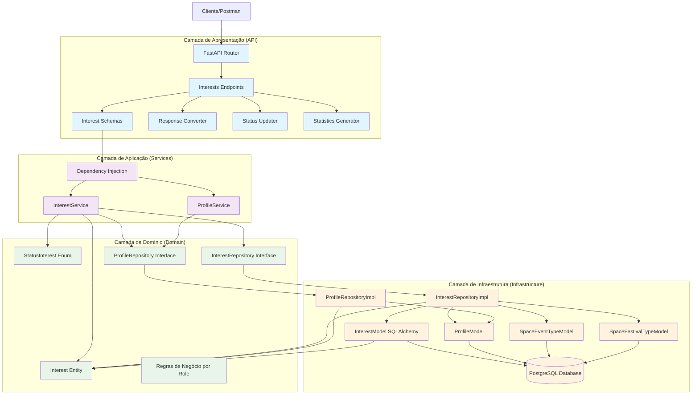
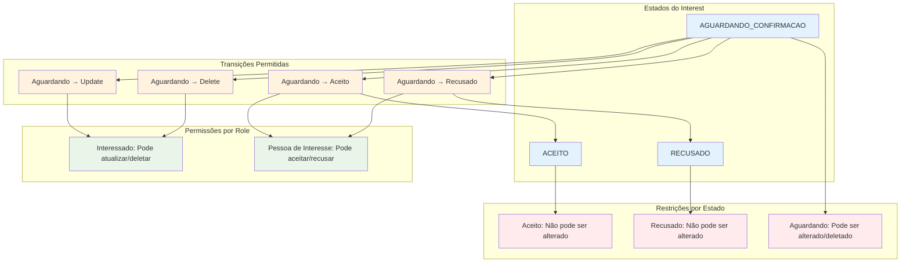
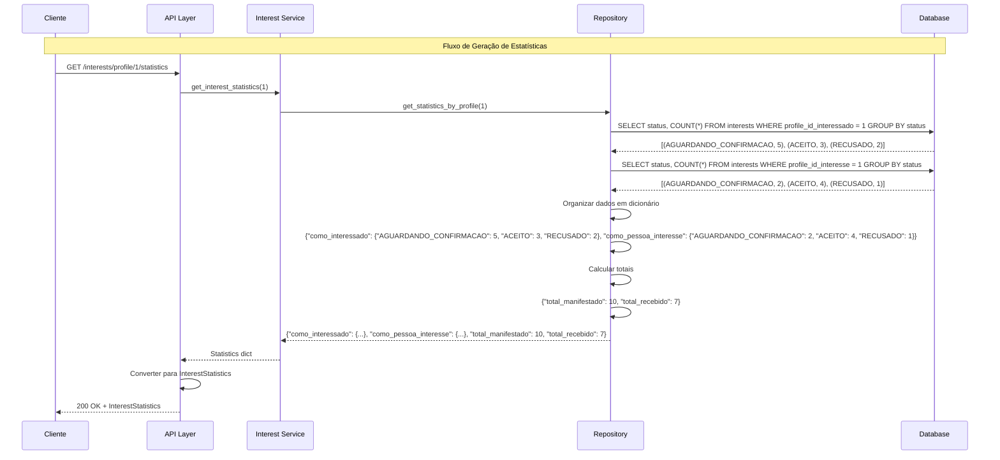

### **Arquitetura Implementada**

O endpoint interests implementa uma **arquitetura robusta para gerenciamento de manifestações de interesse** seguindo os princípios da **Clean Architecture**:

1. **Camada de Apresentação**: FastAPI com endpoints CRUD, busca especializada, gerenciamento de status e estatísticas
2. **Camada de Aplicação**: InterestService com lógica de negócio complexa e validações por role
3. **Camada de Domínio**: Entidade Interest com enum StatusInterest e validações específicas
4. **Camada de Infraestrutura**: Implementação de repositório com múltiplas consultas especializadas

### **Características Principais**

- **Manifestações de Interesse**: Sistema completo para gerenciar interesses entre profiles
- **Regras de Negócio por Role**: Validações específicas baseadas no role do usuário
- **Gerenciamento de Status**: Controle de estados (Aguardando, Aceito, Recusado)
- **Busca Especializada**: Múltiplos endpoints de busca por diferentes critérios
- **Estatísticas**: Geração de relatórios por profile
- **Permissões**: Controle de quem pode realizar cada ação

### **Endpoints Disponíveis**

#### **CRUD Básico:**
1. **POST /interests/** - Criar nova manifestação de interesse
2. **GET /interests/{id}** - Buscar manifestação por ID
3. **GET /interests/** - Listar todas as manifestações
4. **PUT /interests/{id}** - Atualizar manifestação
5. **DELETE /interests/{id}** - Deletar manifestação

#### **Busca Especializada:**
6. **GET /interests/profile/interessado/{id}** - Manifestações feitas por um profile
7. **GET /interests/profile/interesse/{id}** - Manifestações recebidas por um profile
8. **GET /interests/status/{status}** - Manifestações por status
9. **GET /interests/date-range/** - Manifestações por período
10. **GET /interests/space-event-type/{id}** - Manifestações por tipo de evento
11. **GET /interests/space-festival-type/{id}** - Manifestações por tipo de festival
12. **GET /interests/profile/{id}/pending** - Manifestações pendentes

#### **Gerenciamento de Status:**
13. **PATCH /interests/{id}/accept** - Aceitar manifestação
14. **PATCH /interests/{id}/reject** - Recusar manifestação
15. **PATCH /interests/{id}/status** - Atualizar status

#### **Estatísticas:**
16. **GET /interests/profile/{id}/statistics** - Estatísticas por profile

### **Regras de Negócio**

- **ADMIN (role_id = 1)**: NUNCA manifesta interesse nem recebe
- **ARTISTA (role_id = 2)**: Pode manifestar interesse apenas em ESPACO
- **ESPACO (role_id = 3)**: Pode manifestar interesse apenas em ARTISTA
- **Unicidade**: Não pode haver interesse pendente entre os mesmos profiles
- **Permissões**: Apenas interessado pode atualizar/deletar, apenas pessoa de interesse pode aceitar/recusar
- **Status**: Apenas interesses com status "AGUARDANDO_CONFIRMACAO" podem ser alterados

### **Validações Implementadas**

#### **Schema Validation:**
- **profile_id_interessado/profile_id_interesse**: Deve ser maior que zero e diferentes
- **data_inicial**: Data válida
- **horario_inicial**: Formato HH:MM
- **duracao_apresentacao**: Entre 0 e 24 horas
- **valor_hora_ofertado/valor_couvert_ofertado**: Números não negativos
- **mensagem**: Entre 10 e 1000 caracteres
- **resposta**: Máximo 500 caracteres

#### **Validações de Negócio:**
- **Compatibilidade de Roles**: Verificação de roles compatíveis
- **Existência de Profiles**: Verificação de existência dos profiles
- **Interesse Pendente**: Verificação de interesse pendente existente
- **Permissões**: Verificação de quem pode realizar cada ação
- **Status**: Verificação de status para permitir alterações

### **Estrutura de Dados**

- **Tabela interests**: Armazena manifestações de interesse com relacionamentos múltiplos
- **Campos Principais**: profile_id_interessado, profile_id_interesse, data_inicial, horario_inicial, duracao_apresentacao, valores, mensagem, resposta, status
- **Enums**: StatusInterest (AGUARDANDO_CONFIRMACAO, ACEITO, RECUSADO)
- **Relacionamentos**: FK para profiles, space_event_types, space_festival_types

### **Campos Principais**

- **profile_id_interessado**: Profile que manifesta interesse (FK obrigatório)
- **profile_id_interesse**: Profile que recebe o interesse (FK obrigatório)
- **data_inicial**: Data da apresentação (obrigatório)
- **horario_inicial**: Horário da apresentação (formato HH:MM)
- **duracao_apresentacao**: Duração em horas (0-24)
- **valor_hora_ofertado**: Valor por hora oferecido
- **valor_couvert_ofertado**: Valor do couvert oferecido
- **mensagem**: Mensagem do interessado (10-1000 caracteres)
- **resposta**: Resposta da pessoa de interesse (opcional, max 500 caracteres)
- **status**: Estado da manifestação (AGUARDANDO_CONFIRMACAO, ACEITO, RECUSADO)

### **Fluxos Especiais**

- **Validação por Role**: Verificação de compatibilidade entre roles
- **Gerenciamento de Status**: Controle de transições de estado
- **Permissões**: Verificação de quem pode realizar cada ação
- **Busca Especializada**: Múltiplos critérios de busca
- **Estatísticas**: Geração de relatórios por profile
- **Conversão de Dados**: Transformação entre enums, entidades e modelos

### **Relacionamentos**

- **profiles**: Referenciado pela tabela interests (FK duplo)
- **space_event_types**: Referenciado pela tabela interests (FK opcional)
- **space_festival_types**: Referenciado pela tabela interests (FK opcional)

# Diagrama de Fluxo - Endpoint Interests

  

## Fluxo Detalhado da Arquitetura em Camadas

  



  

## Fluxo Detalhado por Operação

```mermaid

sequenceDiagram

participant C as Cliente

participant API as API Layer

participant Service as Interest Service

participant ProfileService as Profile Service

participant Repo as Repository

participant DB as Database

%% Criação de Interest

Note over C,DB: POST /interests/ - Criar Interest

C->>API: POST /interests/ {profile_id_interessado, profile_id_interesse, data_inicial, horario_inicial, ...}

API->>API: Validar InterestCreate schema

API->>Service: create_interest(interest_data)

%% Validação de Profiles e Roles

Service->>ProfileService: Verificar profile_interessado existe

ProfileService->>Repo: get_by_id(profile_id_interessado)

Repo->>DB: SELECT * FROM profiles WHERE id = ?

DB-->>Repo: ProfileModel or None

alt Profile interessado não existe

Repo-->>ProfileService: None

ProfileService-->>Service: ValueError("Profile interessado não encontrado")

Service-->>API: ValueError

API-->>C: 400 Bad Request

else Profile interessado existe

Service->>ProfileService: Verificar profile_interesse existe

ProfileService->>Repo: get_by_id(profile_id_interesse)

Repo->>DB: SELECT * FROM profiles WHERE id = ?

DB-->>Repo: ProfileModel or None

alt Profile interesse não existe

Repo-->>ProfileService: None

ProfileService-->>Service: ValueError("Profile interesse não encontrado")

Service-->>API: ValueError

API-->>C: 400 Bad Request

else Profile interesse existe

Service->>Service: Verificar regras de negócio por role

alt Role ADMIN (role_id = 1)

Service-->>API: ValueError("ADMIN não pode manifestar interesse")

API-->>C: 400 Bad Request

else Role ARTISTA (role_id = 2) vs ESPACO (role_id = 3)

Service->>Service: Verificar se roles são compatíveis

alt Roles incompatíveis

Service-->>API: ValueError("Roles incompatíveis")

API-->>C: 400 Bad Request

else Roles compatíveis

Service->>Repo: Verificar interesse pendente existente

Repo->>DB: SELECT * FROM interests WHERE profile_id_interessado = ? AND status = 'AGUARDANDO_CONFIRMACAO'

DB-->>Repo: [InterestModel]

alt Interesse pendente já existe

Repo-->>Service: [InterestModel]

Service-->>API: ValueError("Já existe interesse pendente")

API-->>C: 400 Bad Request

else Nenhum interesse pendente

Service->>Service: Criar Interest entity

Service->>Repo: create(interest)

Repo->>Repo: Verificar relacionamentos existem

Repo->>DB: INSERT INTO interests (...)

DB-->>Repo: Created InterestModel com ID

Repo->>Repo: Converter para Interest entity

Repo-->>Service: Interest entity

Service-->>API: Interest entity

API->>API: Converter para InterestResponse

API-->>C: 201 Created + InterestResponse

end

end

end

end

end

%% Busca por ID

Note over C,DB: GET /interests/{id} - Buscar Interest por ID

C->>API: GET /interests/1?include_relations=true

API->>Service: get_interest_by_id(1, include_relations=true)

Service->>Repo: get_by_id(1, include_relations=true)

Repo->>DB: SELECT * FROM interests LEFT JOIN profiles LEFT JOIN space_event_types WHERE id = 1

DB-->>Repo: InterestModel with relations or None

alt Interest encontrado

Repo->>Repo: Converter para Interest entity ou retornar modelo com relações

Repo-->>Service: Interest entity/InterestModel

Service-->>API: Interest entity/InterestModel

API->>API: Converter para InterestResponse/InterestWithRelations

API-->>C: 200 OK + InterestResponse/InterestWithRelations

else Interest não encontrado

Repo-->>Service: None

Service-->>API: None

API-->>C: 404 Not Found

end

%% Busca por Profile Interessado

Note over C,DB: GET /interests/profile/interessado/{id} - Interests por Profile Interessado

C->>API: GET /interests/profile/interessado/1

API->>Service: get_interests_by_profile_interessado(1)

Service->>Repo: get_by_profile_interessado(1)

Repo->>DB: SELECT * FROM interests WHERE profile_id_interessado = 1

DB-->>Repo: [InterestModel]

Repo->>Repo: Converter para [Interest entities]

Repo-->>Service: [Interest entities]

Service-->>API: [Interest entities]

API->>API: Converter para InterestListResponse

API-->>C: 200 OK + InterestListResponse

%% Busca por Profile Interesse

Note over C,DB: GET /interests/profile/interesse/{id} - Interests por Profile Interesse

C->>API: GET /interests/profile/interesse/2

API->>Service: get_interests_by_profile_interesse(2)

Service->>Repo: get_by_profile_interesse(2)

Repo->>DB: SELECT * FROM interests WHERE profile_id_interesse = 2

DB-->>Repo: [InterestModel]

Repo->>Repo: Converter para [Interest entities]

Repo-->>Service: [Interest entities]

Service-->>API: [Interest entities]

API->>API: Converter para InterestListResponse

API-->>C: 200 OK + InterestListResponse

%% Busca por Status

Note over C,DB: GET /interests/status/{status} - Interests por Status

C->>API: GET /interests/status/AGUARDANDO_CONFIRMACAO

API->>Service: get_interests_by_status(StatusInterest.AGUARDANDO_CONFIRMACAO)

Service->>Repo: get_by_status(StatusInterest.AGUARDANDO_CONFIRMACAO)

Repo->>DB: SELECT * FROM interests WHERE status = 'AGUARDANDO_CONFIRMACAO'

DB-->>Repo: [InterestModel]

Repo->>Repo: Converter para [Interest entities]

Repo-->>Service: [Interest entities]

Service-->>API: [Interest entities]

API->>API: Converter para InterestListResponse

API-->>C: 200 OK + InterestListResponse

%% Busca por Período

Note over C,DB: GET /interests/date-range/ - Interests por Período

C->>API: GET /interests/date-range/?data_inicio=2024-01-01&data_fim=2024-01-31

API->>API: Validar data_fim >= data_inicio

API->>Service: get_interests_by_date_range(data_inicio, data_fim)

Service->>Repo: get_by_date_range(data_inicio, data_fim)

Repo->>DB: SELECT * FROM interests WHERE data_inicial >= ? AND data_inicial <= ?

DB-->>Repo: [InterestModel]

Repo->>Repo: Converter para [Interest entities]

Repo-->>Service: [Interest entities]

Service-->>API: [Interest entities]

API->>API: Converter para InterestListResponse

API-->>C: 200 OK + InterestListResponse

%% Estatísticas

Note over C,DB: GET /interests/profile/{id}/statistics - Estatísticas por Profile

C->>API: GET /interests/profile/1/statistics

API->>Service: get_interest_statistics(1)

Service->>Repo: get_statistics_by_profile(1)

Repo->>DB: SELECT status, COUNT(*) FROM interests WHERE profile_id_interessado = 1 GROUP BY status

DB-->>Repo: [(status, count)]

Repo->>DB: SELECT status, COUNT(*) FROM interests WHERE profile_id_interesse = 1 GROUP BY status

DB-->>Repo: [(status, count)]

Repo->>Repo: Organizar dados em dicionário

Repo-->>Service: {"como_interessado": {...}, "como_pessoa_interesse": {...}}

Service-->>API: Statistics dict

API->>API: Converter para InterestStatistics

API-->>C: 200 OK + InterestStatistics

%% Atualização de Status (Aceitar)

Note over C,DB: PATCH /interests/{id}/accept - Aceitar Interest

C->>API: PATCH /interests/1/accept?resposta="Aceito com prazer!"

API->>ProfileService: get_profile_by_user_id(current_user.id)

ProfileService->>Repo: get_by_user_id(user_id)

Repo->>DB: SELECT * FROM profiles WHERE user_id = ?

DB-->>Repo: ProfileModel

Repo-->>ProfileService: Profile entity

ProfileService-->>API: Profile entity

API->>Service: accept_interest(1, profile.id, resposta)

Service->>Service: Criar InterestStatusUpdate

Service->>Service: update_interest_status(1, status_update, profile.id)

%% Verificar permissões

Service->>Repo: get_by_id(1)

Repo->>DB: SELECT * FROM interests WHERE id = 1

DB-->>Repo: InterestModel

Repo->>Repo: Converter para Interest entity

Repo-->>Service: Interest entity

alt Usuário não é pessoa de interesse

Service-->>API: ValueError("Apenas pessoa de interesse pode aceitar")

API-->>C: 400 Bad Request

else Usuário é pessoa de interesse

alt Status não é AGUARDANDO_CONFIRMACAO

Service-->>API: ValueError("Apenas interesses pendentes podem ser aceitos")

API-->>C: 400 Bad Request

else Status é AGUARDANDO_CONFIRMACAO

Service->>Service: Atualizar status para ACEITO

Service->>Repo: update(1, updated_interest)

Repo->>DB: UPDATE interests SET status = 'ACEITO', resposta = ?, updated_at = NOW()

DB-->>Repo: Updated InterestModel

Repo->>Repo: Converter para Interest entity

Repo-->>Service: Interest entity

Service-->>API: Interest entity

API->>API: Converter para InterestResponse

API-->>C: 200 OK + InterestResponse

end

end

%% Atualização de Status (Recusar)

Note over C,DB: PATCH /interests/{id}/reject - Recusar Interest

C->>API: PATCH /interests/1/reject?resposta="Não disponível nesta data"

API->>ProfileService: get_profile_by_user_id(current_user.id)

ProfileService->>Repo: get_by_user_id(user_id)

Repo->>DB: SELECT * FROM profiles WHERE user_id = ?

DB-->>Repo: ProfileModel

Repo-->>ProfileService: Profile entity

ProfileService-->>API: Profile entity

API->>Service: reject_interest(1, profile.id, resposta)

Service->>Service: Criar InterestStatusUpdate

Service->>Service: update_interest_status(1, status_update, profile.id)

%% Verificar permissões

Service->>Repo: get_by_id(1)

Repo->>DB: SELECT * FROM interests WHERE id = 1

DB-->>Repo: InterestModel

Repo->>Repo: Converter para Interest entity

Repo-->>Service: Interest entity

alt Usuário não é pessoa de interesse

Service-->>API: ValueError("Apenas pessoa de interesse pode recusar")

API-->>C: 400 Bad Request

else Usuário é pessoa de interesse

alt Status não é AGUARDANDO_CONFIRMACAO

Service-->>API: ValueError("Apenas interesses pendentes podem ser recusados")

API-->>C: 400 Bad Request

else Status é AGUARDANDO_CONFIRMACAO

Service->>Service: Atualizar status para RECUSADO

Service->>Repo: update(1, updated_interest)

Repo->>DB: UPDATE interests SET status = 'RECUSADO', resposta = ?, updated_at = NOW()

DB-->>Repo: Updated InterestModel

Repo->>Repo: Converter para Interest entity

Repo-->>Service: Interest entity

Service-->>API: Interest entity

API->>API: Converter para InterestResponse

API-->>C: 200 OK + InterestResponse

end

end

%% Exclusão

Note over C,DB: DELETE /interests/{id} - Deletar Interest

C->>API: DELETE /interests/1

API->>ProfileService: get_profile_by_user_id(current_user.id)

ProfileService->>Repo: get_by_user_id(user_id)

Repo->>DB: SELECT * FROM profiles WHERE user_id = ?

DB-->>Repo: ProfileModel

Repo-->>ProfileService: Profile entity

ProfileService-->>API: Profile entity

API->>Service: delete_interest(1, profile.id)

%% Verificar permissões

Service->>Repo: get_by_id(1)

Repo->>DB: SELECT * FROM interests WHERE id = 1

DB-->>Repo: InterestModel

Repo->>Repo: Converter para Interest entity

Repo-->>Service: Interest entity

alt Usuário não é interessado

Service-->>API: ValueError("Apenas interessado pode deletar")

API-->>C: 400 Bad Request

else Usuário é interessado

alt Status não é AGUARDANDO_CONFIRMACAO

Service-->>API: ValueError("Apenas interesses pendentes podem ser deletados")

API-->>C: 400 Bad Request

else Status é AGUARDANDO_CONFIRMACAO

Service->>Repo: delete(1)

Repo->>DB: DELETE FROM interests WHERE id = 1

DB-->>Repo: Confirmação

Repo-->>Service: true

Service-->>API: true

API-->>C: 200 OK + {"message": "Interest deletado com sucesso"}

end

end

```

  



  

## Arquitetura de Regras de Negócio por Role

  

```mermaid

graph TD

subgraph "Regras de Negócio por Role"

AdminRule[ADMIN (role_id=1): NUNCA manifesta interesse nem recebe]

ArtistRule[ARTISTA (role_id=2): Manifesta interesse apenas em ESPACO]

SpaceRule[ESPACO (role_id=3): Manifesta interesse apenas em ARTISTA]

end

subgraph "Validações de Compatibilidade"

SameRoleValidation[Profiles não podem ter mesmo role]

ArtistSpaceValidation[ARTISTA só pode manifestar em ESPACO]

SpaceArtistValidation[ESPACO só pode manifestar em ARTISTA]

end

subgraph "Validações de Estado"

PendingValidation[Verificar interesse pendente existente]

StatusValidation[Status deve ser AGUARDANDO_CONFIRMACAO para alterações]

PermissionValidation[Verificar permissões por role]

end

subgraph "Permissões de Ação"

AcceptPermission[Apenas pessoa de interesse pode aceitar/recusar]

DeletePermission[Apenas interessado pode deletar]

UpdatePermission[Apenas interessado pode atualizar]

end

AdminRule --> SameRoleValidation

ArtistRule --> ArtistSpaceValidation

SpaceRule --> SpaceArtistValidation

SameRoleValidation --> PendingValidation

ArtistSpaceValidation --> PendingValidation

SpaceArtistValidation --> PendingValidation

PendingValidation --> StatusValidation

StatusValidation --> PermissionValidation

PermissionValidation --> AcceptPermission

PermissionValidation --> DeletePermission

PermissionValidation --> UpdatePermission

%% Estilos

classDef rule fill:#ffebee

classDef validation fill:#e3f2fd

classDef permission fill:#e8f5e8

class AdminRule,ArtistRule,SpaceRule rule

class SameRoleValidation,ArtistSpaceValidation,SpaceArtistValidation,PendingValidation,StatusValidation,PermissionValidation validation

class AcceptPermission,DeletePermission,UpdatePermission permission

```

  

## Estrutura de Dados e Modelo de Banco

  

```mermaid

graph TD

subgraph "Entidade de Domínio"

InterestEntity[Interest Entity]

ProfileInteressadoField[profile_id_interessado: int]

ProfileInteresseField[profile_id_interesse: int]

DataInicialField[data_inicial: date]

HorarioInicialField[horario_inicial: str]

DuracaoField[duracao_apresentacao: float]

ValorHoraField[valor_hora_ofertado: float]

ValorCouvertField[valor_couvert_ofertado: float]

MensagemField[mensagem: str]

RespostaField[resposta: Optional[str]]

StatusField[status: StatusInterest]

end

subgraph "Enum Status"

StatusEnum[StatusInterest]

AguardandoStatus[AGUARDANDO_CONFIRMACAO]

AceitoStatus[ACEITO]

RecusadoStatus[RECUSADO]

end

subgraph "Schema Pydantic"

InterestBase[InterestBase]

InterestCreate[InterestCreate]

InterestUpdate[InterestUpdate]

InterestResponse[InterestResponse]

InterestWithRelations[InterestWithRelations]

InterestStatusUpdate[InterestStatusUpdate]

InterestStatistics[InterestStatistics]

end

subgraph "Modelo SQLAlchemy"

InterestModel[InterestModel]

IdColumn[id: INTEGER PRIMARY KEY]

ProfileInteressadoColumn[profile_id_interessado: INTEGER FK NOT NULL]

ProfileInteresseColumn[profile_id_interesse: INTEGER FK NOT NULL]

DataInicialColumn[data_inicial: DATE NOT NULL]

HorarioInicialColumn[horario_inicial: STRING(5) NOT NULL]

DuracaoColumn[duracao_apresentacao: FLOAT NOT NULL]

ValorHoraColumn[valor_hora_ofertado: FLOAT NOT NULL]

ValorCouvertColumn[valor_couvert_ofertado: FLOAT NOT NULL]

MensagemColumn[mensagem: TEXT NOT NULL]

RespostaColumn[resposta: TEXT NULL]

StatusColumn[status: ENUM NOT NULL]

end

subgraph "Tabela do Banco"

InterestsTable[(interests)]

IdTableField[id: INTEGER PRIMARY KEY]

ProfileInteressadoTableField[profile_id_interessado: INTEGER FK NOT NULL]

ProfileInteresseTableField[profile_id_interesse: INTEGER FK NOT NULL]

DataInicialTableField[data_inicial: DATE NOT NULL]

HorarioInicialTableField[horario_inicial: VARCHAR(5) NOT NULL]

DuracaoTableField[duracao_apresentacao: FLOAT NOT NULL]

ValorHoraTableField[valor_hora_ofertado: FLOAT NOT NULL]

ValorCouvertTableField[valor_couvert_ofertado: FLOAT NOT NULL]

MensagemTableField[mensagem: TEXT NOT NULL]

RespostaTableField[resposta: TEXT NULL]

StatusTableField[status: ENUM NOT NULL]

end

%% Relacionamentos

InterestEntity --> ProfileInteressadoField

InterestEntity --> ProfileInteresseField

InterestEntity --> DataInicialField

InterestEntity --> HorarioInicialField

InterestEntity --> DuracaoField

InterestEntity --> ValorHoraField

InterestEntity --> ValorCouvertField

InterestEntity --> MensagemField

InterestEntity --> RespostaField

InterestEntity --> StatusField

StatusField --> StatusEnum

StatusEnum --> AguardandoStatus

StatusEnum --> AceitoStatus

StatusEnum --> RecusadoStatus

InterestBase --> ProfileInteressadoField

InterestBase --> ProfileInteresseField

InterestBase --> DataInicialField

InterestBase --> HorarioInicialField

InterestBase --> DuracaoField

InterestBase --> ValorHoraField

InterestBase --> ValorCouvertField

InterestBase --> MensagemField

InterestBase --> RespostaField

InterestBase --> StatusField

InterestCreate --> InterestBase

InterestUpdate --> InterestBase

InterestResponse --> InterestBase

InterestWithRelations --> InterestResponse

InterestStatusUpdate --> StatusField

InterestStatistics --> InterestBase

InterestModel --> IdColumn

InterestModel --> ProfileInteressadoColumn

InterestModel --> ProfileInteresseColumn

InterestModel --> DataInicialColumn

InterestModel --> HorarioInicialColumn

InterestModel --> DuracaoColumn

InterestModel --> ValorHoraColumn

InterestModel --> ValorCouvertColumn

InterestModel --> MensagemColumn

InterestModel --> RespostaColumn

InterestModel --> StatusColumn

InterestModel --> InterestsTable

IdColumn --> IdTableField

ProfileInteressadoColumn --> ProfileInteressadoTableField

ProfileInteresseColumn --> ProfileInteresseTableField

DataInicialColumn --> DataInicialTableField

HorarioInicialColumn --> HorarioInicialTableField

DuracaoColumn --> DuracaoTableField

ValorHoraColumn --> ValorHoraTableField

ValorCouvertColumn --> ValorCouvertTableField

MensagemColumn --> MensagemTableField

RespostaColumn --> RespostaTableField

StatusColumn --> StatusTableField

%% Estilos

classDef entity fill:#e8f5e8

classDef enum fill:#fff3e0

classDef schema fill:#e1f5fe

classDef model fill:#f3e5f5

classDef table fill:#ffebee

class InterestEntity,ProfileInteressadoField,ProfileInteresseField,DataInicialField,HorarioInicialField,DuracaoField,ValorHoraField,ValorCouvertField,MensagemField,RespostaField,StatusField entity

class StatusEnum,AguardandoStatus,AceitoStatus,RecusadoStatus enum

class InterestBase,InterestCreate,InterestUpdate,InterestResponse,InterestWithRelations,InterestStatusUpdate,InterestStatistics schema

class InterestModel,IdColumn,ProfileInteressadoColumn,ProfileInteresseColumn,DataInicialColumn,HorarioInicialColumn,DuracaoColumn,ValorHoraColumn,ValorCouvertColumn,MensagemColumn,RespostaColumn,StatusColumn model

class InterestsTable,IdTableField,ProfileInteressadoTableField,ProfileInteresseTableField,DataInicialTableField,HorarioInicialTableField,DuracaoTableField,ValorHoraTableField,ValorCouvertTableField,MensagemTableField,RespostaTableField,StatusTableField table

```

  

## Endpoints e Operações CRUD

  

```mermaid

graph LR

subgraph "Endpoints CRUD"

CreateEndpoint[POST /interests/]

GetByIdEndpoint[GET /interests/{id}]

GetAllEndpoint[GET /interests/]

UpdateEndpoint[PUT /interests/{id}]

DeleteEndpoint[DELETE /interests/{id}]

end

subgraph "Endpoints de Busca"

GetByInteressadoEndpoint[GET /interests/profile/interessado/{id}]

GetByInteresseEndpoint[GET /interests/profile/interesse/{id}]

GetByStatusEndpoint[GET /interests/status/{status}]

GetByDateRangeEndpoint[GET /interests/date-range/]

GetByEventTypeEndpoint[GET /interests/space-event-type/{id}]

GetByFestivalTypeEndpoint[GET /interests/space-festival-type/{id}]

GetPendingEndpoint[GET /interests/profile/{id}/pending]

end

subgraph "Endpoints de Status"

AcceptEndpoint[PATCH /interests/{id}/accept]

RejectEndpoint[PATCH /interests/{id}/reject]

UpdateStatusEndpoint[PATCH /interests/{id}/status]

end

subgraph "Endpoints de Estatísticas"

StatisticsEndpoint[GET /interests/profile/{id}/statistics]

end

subgraph "Operações"

CreateOp[Criar Interest]

ReadOp[Ler Interest]

ReadAllOp[Listar Interests]

UpdateOp[Atualizar Interest]

DeleteOp[Deletar Interest]

SearchOp[Buscar por Critérios]

StatusOp[Gerenciar Status]

StatsOp[Gerar Estatísticas]

end

subgraph "Validações"

RoleValidation[Validação por Role]

PermissionValidation[Validação de Permissões]

StatusValidation[Validação de Status]

DuplicateValidation[Validação de Duplicatas]

end

CreateEndpoint --> CreateOp

GetByIdEndpoint --> ReadOp

GetAllEndpoint --> ReadAllOp

UpdateEndpoint --> UpdateOp

DeleteEndpoint --> DeleteOp

GetByInteressadoEndpoint --> SearchOp

GetByInteresseEndpoint --> SearchOp

GetByStatusEndpoint --> SearchOp

GetByDateRangeEndpoint --> SearchOp

GetByEventTypeEndpoint --> SearchOp

GetByFestivalTypeEndpoint --> SearchOp

GetPendingEndpoint --> SearchOp

AcceptEndpoint --> StatusOp

RejectEndpoint --> StatusOp

UpdateStatusEndpoint --> StatusOp

StatisticsEndpoint --> StatsOp

CreateOp --> RoleValidation

CreateOp --> DuplicateValidation

UpdateOp --> PermissionValidation

UpdateOp --> StatusValidation

DeleteOp --> PermissionValidation

DeleteOp --> StatusValidation

StatusOp --> PermissionValidation

StatusOp --> StatusValidation

%% Estilos

classDef crudEndpoint fill:#e1f5fe

classDef searchEndpoint fill:#f3e5f5

classDef statusEndpoint fill:#fff3e0

classDef statsEndpoint fill:#e8f5e8

classDef operation fill:#ffebee

classDef validation fill:#f1f8e9

class CreateEndpoint,GetByIdEndpoint,GetAllEndpoint,UpdateEndpoint,DeleteEndpoint crudEndpoint

class GetByInteressadoEndpoint,GetByInteresseEndpoint,GetByStatusEndpoint,GetByDateRangeEndpoint,GetByEventTypeEndpoint,GetByFestivalTypeEndpoint,GetPendingEndpoint searchEndpoint

class AcceptEndpoint,RejectEndpoint,UpdateStatusEndpoint statusEndpoint

class StatisticsEndpoint statsEndpoint

class CreateOp,ReadOp,ReadAllOp,UpdateOp,DeleteOp,SearchOp,StatusOp,StatsOp operation

class RoleValidation,PermissionValidation,StatusValidation,DuplicateValidation validation

```

  

## Arquitetura de Validação de Status

  



  

## Modelo de Banco de Dados

  

```mermaid

graph TD

subgraph "Tabela interests"

IdColumn[id: INTEGER PRIMARY KEY]

ProfileInteressadoColumn[profile_id_interessado: INTEGER FK NOT NULL]

ProfileInteresseColumn[profile_id_interesse: INTEGER FK NOT NULL]

DataInicialColumn[data_inicial: DATE NOT NULL]

HorarioInicialColumn[horario_inicial: VARCHAR(5) NOT NULL]

DuracaoColumn[duracao_apresentacao: FLOAT NOT NULL]

ValorHoraColumn[valor_hora_ofertado: FLOAT NOT NULL]

ValorCouvertColumn[valor_couvert_ofertado: FLOAT NOT NULL]

SpaceEventTypeColumn[space_event_type_id: INTEGER FK NULL]

SpaceFestivalTypeColumn[space_festival_type_id: INTEGER FK NULL]

MensagemColumn[mensagem: TEXT NOT NULL]

RespostaColumn[resposta: TEXT NULL]

StatusColumn[status: ENUM NOT NULL]

CreatedAtColumn[created_at: TIMESTAMP DEFAULT NOW()]

UpdatedAtColumn[updated_at: TIMESTAMP DEFAULT NOW()]

end

subgraph "Constraints"

PrimaryKey[PRIMARY KEY (id)]

ForeignKeyInteressado[FOREIGN KEY (profile_id_interessado) REFERENCES profiles(id)]

ForeignKeyInteresse[FOREIGN KEY (profile_id_interesse) REFERENCES profiles(id)]

ForeignKeyEventType[FOREIGN KEY (space_event_type_id) REFERENCES space_event_types(id)]

ForeignKeyFestivalType[FOREIGN KEY (space_festival_type_id) REFERENCES space_festival_types(id)]

CheckHorario[CHECK (horario_inicial ~ '^([0-1]?[0-9]|2[0-3]):[0-5][0-9]$')]

CheckDuracao[CHECK (duracao_apresentacao > 0 AND duracao_apresentacao <= 24)]

CheckValores[CHECK (valor_hora_ofertado >= 0 AND valor_couvert_ofertado >= 0)]

end

subgraph "Índices"

IndexInteressado[INDEX (profile_id_interessado)]

IndexInteresse[INDEX (profile_id_interesse)]

IndexStatus[INDEX (status)]

IndexDataInicial[INDEX (data_inicial)]

end

subgraph "Relacionamentos"

ProfileInteressadoRelation[profiles.id]

ProfileInteresseRelation[profiles.id]

SpaceEventTypeRelation[space_event_types.id]

SpaceFestivalTypeRelation[space_festival_types.id]

end

subgraph "Operações"

InsertOp[INSERT INTO interests (...)]

SelectOp[SELECT * FROM interests WHERE id = ?]

SelectByInteressadoOp[SELECT * FROM interests WHERE profile_id_interessado = ?]

SelectByInteresseOp[SELECT * FROM interests WHERE profile_id_interesse = ?]

SelectByStatusOp[SELECT * FROM interests WHERE status = ?]

SelectByDateRangeOp[SELECT * FROM interests WHERE data_inicial BETWEEN ? AND ?]

UpdateOp[UPDATE interests SET ... WHERE id = ?]

DeleteOp[DELETE FROM interests WHERE id = ?]

end

IdColumn --> PrimaryKey

ProfileInteressadoColumn --> ForeignKeyInteressado

ProfileInteresseColumn --> ForeignKeyInteresse

SpaceEventTypeColumn --> ForeignKeyEventType

SpaceFestivalTypeColumn --> ForeignKeyFestivalType

HorarioInicialColumn --> CheckHorario

DuracaoColumn --> CheckDuracao

ValorHoraColumn --> CheckValores

ValorCouvertColumn --> CheckValores

ProfileInteressadoColumn --> IndexInteressado

ProfileInteresseColumn --> IndexInteresse

StatusColumn --> IndexStatus

DataInicialColumn --> IndexDataInicial

ProfileInteressadoColumn --> ProfileInteressadoRelation

ProfileInteresseColumn --> ProfileInteresseRelation

SpaceEventTypeColumn --> SpaceEventTypeRelation

SpaceFestivalTypeColumn --> SpaceFestivalTypeRelation

PrimaryKey --> SelectOp

ForeignKeyInteressado --> SelectByInteressadoOp

ForeignKeyInteresse --> SelectByInteresseOp

IndexStatus --> SelectByStatusOp

IndexDataInicial --> SelectByDateRangeOp

PrimaryKey --> UpdateOp

PrimaryKey --> DeleteOp

%% Estilos

classDef column fill:#e1f5fe

classDef constraint fill:#f3e5f5

classDef index fill:#fff3e0

classDef relationship fill:#e8f5e8

classDef operation fill:#ffebee

class IdColumn,ProfileInteressadoColumn,ProfileInteresseColumn,DataInicialColumn,HorarioInicialColumn,DuracaoColumn,ValorHoraColumn,ValorCouvertColumn,SpaceEventTypeColumn,SpaceFestivalTypeColumn,MensagemColumn,RespostaColumn,StatusColumn,CreatedAtColumn,UpdatedAtColumn column

class PrimaryKey,ForeignKeyInteressado,ForeignKeyInteresse,ForeignKeyEventType,ForeignKeyFestivalType,CheckHorario,CheckDuracao,CheckValores constraint

class IndexInteressado,IndexInteresse,IndexStatus,IndexDataInicial index

class ProfileInteressadoRelation,ProfileInteresseRelation,SpaceEventTypeRelation,SpaceFestivalTypeRelation relationship

class InsertOp,SelectOp,SelectByInteressadoOp,SelectByInteresseOp,SelectByStatusOp,SelectByDateRangeOp,UpdateOp,DeleteOp operation

```

  

## Fluxo de Estatísticas

  

