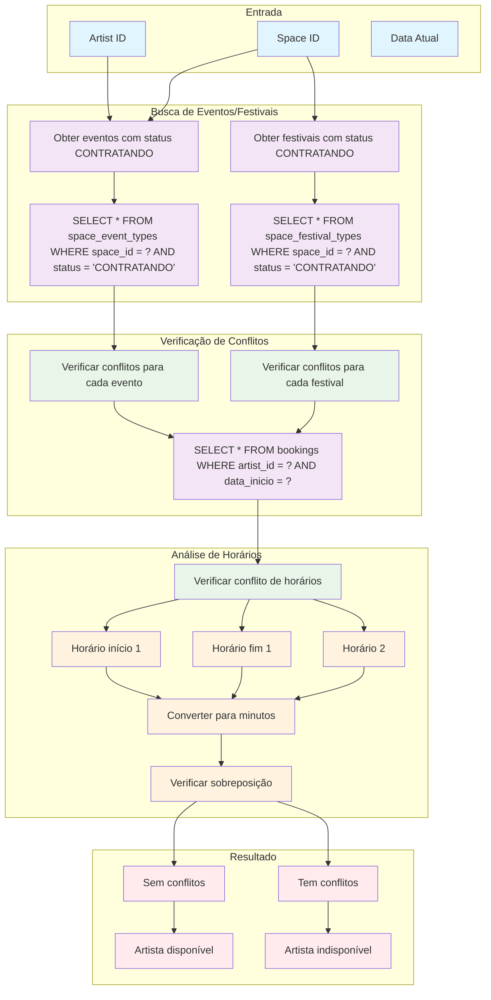

### **Arquitetura Implementada**

O endpoint location_search implementa uma **arquitetura especializada para busca geográfica** seguindo os princípios da **Clean Architecture**:

1. **Camada de Apresentação**: FastAPI com endpoints para busca por CEP, cidade/estado, coordenadas e busca especializada por role
2. **Camada de Aplicação**: LocationSearchService com lógica de busca geográfica e LocationUtils para cálculos
3. **Camada de Domínio**: Entidades de artist, space, profile, booking com validações específicas
4. **Camada de Infraestrutura**: Múltiplos repositórios e integração com API externa ViaCEP

### **Características Principais**

- **Busca Geográfica**: Sistema completo para busca por localização usando diferentes métodos
- **Cálculo de Distância**: Implementação da fórmula de Haversine para cálculo preciso de distâncias
- **Resolução de Coordenadas**: Sistema hierárquico para obter coordenadas (diretas → base local → ViaCEP)
- **Busca por Role**: Endpoints específicos para artistas buscarem espaços e espaços buscarem artistas
- **Validação de Disponibilidade**: Verificação de conflitos de horário para artistas
- **Cache de Coordenadas**: Otimização para evitar consultas repetidas

### **Endpoints Disponíveis**

#### **Busca por Localização:**
1. **GET /location-search/cep/{cep}** - Buscar localização por CEP
2. **GET /location-search/city/{city}/state/{state}** - Buscar localização por cidade/estado
3. **GET /location-search/coordinates** - Buscar localização por coordenadas

#### **Busca Especializada por Role:**
4. **GET /location-search/spaces-for-artist** - Buscar espaços para artista (role ARTISTA)
5. **GET /location-search/artists-for-space** - Buscar artistas para espaço (role ESPACO)
6. **POST /location-search/spaces-for-artist** - Versão POST da busca de espaços
7. **POST /location-search/artists-for-space** - Versão POST da busca de artistas

### **Regras de Negócio**

- **Validação por Role**: Apenas artistas (role_id = 2) podem buscar espaços, apenas espaços (role_id = 3) podem buscar artistas
- **Raio de Atuação**: Artistas só aparecem para espaços dentro do seu raio de atuação
- **Status CONTRATANDO**: Espaços só aparecem se tiverem eventos/festivais com status "CONTRATANDO"
- **Disponibilidade**: Artistas só aparecem se não tiverem agendamentos conflitantes
- **Coordenadas**: Sistema hierárquico de resolução de coordenadas

### **Validações Implementadas**

#### **Validação por Role:**
- **ARTISTA (role_id = 2)**: Pode buscar espaços
- **ESPACO (role_id = 3)**: Pode buscar artistas
- **ADMIN (role_id = 1)**: Não pode usar endpoints de busca

#### **Validações Geográficas:**
- **Coordenadas**: Verificação de existência e validade
- **Distância**: Cálculo preciso usando fórmula de Haversine
- **Raio de Atuação**: Verificação se está dentro do raio do artista

#### **Validações de Disponibilidade:**
- **Conflitos de Horário**: Verificação de agendamentos conflitantes
- **Status de Eventos**: Verificação de eventos/festivais com status "CONTRATANDO"

### **Estrutura de Dados**

#### **Schemas de Resposta:**
- **LocationSearchResponse**: Resposta principal com resultados e metadados
- **ArtistLocationResult**: Dados específicos de artistas encontrados
- **SpaceLocationResult**: Dados específicos de espaços encontrados
- **ProfileLocationResult**: Dados do profile (nome, cidade, CEP, etc.)

#### **Campos Principais:**
- **results**: Lista de resultados encontrados
- **total_count**: Total de resultados
- **search_radius_km**: Raio de busca utilizado
- **origin_cep**: CEP de origem da busca
- **distance_km**: Distância calculada para cada resultado

### **Fluxos Especiais**

#### **Busca de Espaços para Artista:**
1. Obter coordenadas do artista
2. Buscar todos os profiles de espaços (role_id = 3)
3. Calcular distância entre artista e cada espaço
4. Verificar se está dentro do raio de atuação do artista
5. Verificar se o espaço tem eventos/festivais com status "CONTRATANDO"
6. Retornar espaços que atendem aos critérios

#### **Busca de Artistas para Espaço:**
1. Obter coordenadas do espaço
2. Buscar todos os profiles de artistas (role_id = 2)
3. Calcular distância entre espaço e cada artista
4. Verificar se está dentro do raio de atuação do artista
5. Verificar se o artista não tem agendamentos conflitantes
6. Retornar artistas disponíveis

#### **Resolução de Coordenadas:**
1. **Prioridade 1**: Coordenadas diretas do profile (latitude/longitude)
2. **Prioridade 2**: Busca na base local por cidade/UF
3. **Prioridade 3**: ViaCEP + busca na base local

### **Cálculo de Distância**

- **Fórmula de Haversine**: Implementação precisa para cálculo de distância entre coordenadas
- **Raio da Terra**: 6371 km
- **Conversão de Unidades**: Graus para radianos
- **Resultado**: Distância em quilômetros

### **Otimizações Implementadas**

- **Cache de Coordenadas**: Evita consultas repetidas à base de dados
- **Normalização de Texto**: Remove acentos e converte para maiúsculas
- **Busca Parcial**: Permite encontrar cidades com nomes similares
- **Timeout Handling**: Tratamento de timeouts em chamadas externas
- **Limitação de Resultados**: Controle de quantidade máxima de resultados

### **Integração Externa**

- **ViaCEP API**: Para resolução de CEPs quando dados não estão na base local
- **Timeout**: 5 segundos para chamadas externas
- **Fallback**: Estratégia de fallback quando API externa falha

### **Tratamento de Erros**

- **Coordenadas não encontradas**: Log de warning e continuação do processo
- **API externa indisponível**: Fallback para base local
- **Dados inválidos**: Validação e tratamento apropriado
- **Timeouts**: Tratamento de timeouts em chamadas externas

# Diagrama de Fluxo - Endpoint Location Search

  

## Fluxo Detalhado da Arquitetura em Camadas

```mermaid

graph TB

%% Cliente

Client[Cliente/Postman]

%% Camada de Apresentação

subgraph "Camada de Apresentação (API)"

Router[FastAPI Router]

LocationEndpoints[Location Search Endpoints]

LocationSchemas[Location Search Schemas]

DependencyInjection[Dependency Injection]

AuthMiddleware[Authentication Middleware]

end

%% Camada de Aplicação

subgraph "Camada de Aplicação (Services)"

LocationSearchService[LocationSearchService]

LocationUtils[LocationUtils]

DistanceCalculator[Distance Calculator]

CoordinatesResolver[Coordinates Resolver]

end

%% Camada de Domínio

subgraph "Camada de Domínio (Domain)"

ArtistEntity[Artist Entity]

SpaceEntity[Space Entity]

ProfileEntity[Profile Entity]

BookingEntity[Booking Entity]

SpaceEventTypeEntity[SpaceEventType Entity]

SpaceFestivalTypeEntity[SpaceFestivalType Entity]

StatusEventType[StatusEventType Enum]

StatusFestivalType[StatusFestivalType Enum]

end

%% Camada de Infraestrutura

subgraph "Camada de Infraestrutura (Infrastructure)"

ArtistRepoImpl[ArtistRepositoryImpl]

SpaceRepoImpl[SpaceRepositoryImpl]

ProfileRepoImpl[ProfileRepositoryImpl]

BookingRepoImpl[BookingRepositoryImpl]

SpaceEventTypeRepoImpl[SpaceEventTypeRepositoryImpl]

SpaceFestivalTypeRepoImpl[SpaceFestivalTypeRepositoryImpl]

CepCoordinatesRepoImpl[CepCoordinatesRepositoryImpl]

Database[(PostgreSQL Database)]

ViaCepAPI[ViaCEP API]

end

%% Fluxo de Dados

Client --> Router

Router --> LocationEndpoints

LocationEndpoints --> LocationSchemas

LocationEndpoints --> DependencyInjection

LocationEndpoints --> AuthMiddleware

DependencyInjection --> LocationSearchService

AuthMiddleware --> LocationSearchService

LocationSearchService --> LocationUtils

LocationSearchService --> DistanceCalculator

LocationSearchService --> CoordinatesResolver

LocationSearchService --> ArtistRepoImpl

LocationSearchService --> SpaceRepoImpl

LocationSearchService --> ProfileRepoImpl

LocationSearchService --> BookingRepoImpl

LocationSearchService --> SpaceEventTypeRepoImpl

LocationSearchService --> SpaceFestivalTypeRepoImpl

LocationUtils --> CepCoordinatesRepoImpl

LocationUtils --> ViaCepAPI

ArtistRepoImpl --> Database

SpaceRepoImpl --> Database

ProfileRepoImpl --> Database

BookingRepoImpl --> Database

SpaceEventTypeRepoImpl --> Database

SpaceFestivalTypeRepoImpl --> Database

CepCoordinatesRepoImpl --> Database

%% Entidades

LocationSearchService --> ArtistEntity

LocationSearchService --> SpaceEntity

LocationSearchService --> ProfileEntity

LocationSearchService --> BookingEntity

LocationSearchService --> SpaceEventTypeEntity

LocationSearchService --> SpaceFestivalTypeEntity

%% Estilos

classDef apiLayer fill:#e1f5fe

classDef appLayer fill:#f3e5f5

classDef domainLayer fill:#e8f5e8

classDef infraLayer fill:#fff3e0

class Router,LocationEndpoints,LocationSchemas,DependencyInjection,AuthMiddleware apiLayer

class LocationSearchService,LocationUtils,DistanceCalculator,CoordinatesResolver appLayer

class ArtistEntity,SpaceEntity,ProfileEntity,BookingEntity,SpaceEventTypeEntity,SpaceFestivalTypeEntity,StatusEventType,StatusFestivalType domainLayer

class ArtistRepoImpl,SpaceRepoImpl,ProfileRepoImpl,BookingRepoImpl,SpaceEventTypeRepoImpl,SpaceFestivalTypeRepoImpl,CepCoordinatesRepoImpl,Database,ViaCepAPI infraLayer

```

  



  

## Fluxo Detalhado por Operação

```mermaid

sequenceDiagram

participant C as Cliente

participant API as API Layer

participant Service as LocationSearch Service

participant Utils as LocationUtils

participant ArtistRepo as Artist Repository

participant SpaceRepo as Space Repository

participant ProfileRepo as Profile Repository

participant BookingRepo as Booking Repository

participant EventTypeRepo as SpaceEventType Repository

participant FestivalTypeRepo as SpaceFestivalType Repository

participant CepRepo as CepCoordinates Repository

participant DB as Database

participant ViaCep as ViaCEP API

%% Busca de Espaços para Artista

Note over C,ViaCep: GET /location-search/spaces-for-artist - Buscar Espaços para Artista

C->>API: GET /location-search/spaces-for-artist?return_full_data=true&max_results=50

API->>API: Verificar autenticação (get_current_user)

API->>ProfileRepo: get_by_user_id(current_user.id)

ProfileRepo->>DB: SELECT * FROM profiles WHERE user_id = ?

DB-->>ProfileRepo: ProfileModel

ProfileRepo-->>API: Profile entity

alt Profile não encontrado

API-->>C: 404 Not Found

else Profile encontrado

alt Role não é ARTISTA (role_id != 2)

API-->>C: 403 Forbidden

else Role é ARTISTA

API->>Service: search_spaces_for_artist(artist_profile_id, return_full_data, max_results)

%% Obter dados do artista

Service->>ProfileRepo: get_by_id(artist_profile_id)

ProfileRepo->>DB: SELECT * FROM profiles WHERE id = ?

DB-->>ProfileRepo: ProfileModel

ProfileRepo-->>Service: Profile entity

Service->>ArtistRepo: get_by_profile_id(artist_profile_id)

ArtistRepo->>DB: SELECT * FROM artists WHERE profile_id = ?

DB-->>ArtistRepo: ArtistModel

ArtistRepo-->>Service: Artist entity

%% Obter coordenadas do artista

Service->>Utils: get_coordinates_from_profile(artist_profile)

Utils->>Utils: Verificar latitude/longitude do profile

alt Coordenadas diretas disponíveis

Utils-->>Service: (latitude, longitude)

else Coordenadas não disponíveis

Utils->>Utils: Buscar por cidade/UF na base local

Utils->>CepRepo: get_by_cidade_uf(cidade, uf)

CepRepo->>DB: SELECT * FROM cep_coordinates WHERE cidade = ? AND uf = ?

DB-->>CepRepo: CepCoordinatesModel

CepRepo-->>Utils: Coordinates

alt Coordenadas encontradas na base local

Utils-->>Service: (latitude, longitude)

else Coordenadas não encontradas

Utils->>ViaCep: GET /ws/{cep}/json/

ViaCep-->>Utils: JSON response

Utils->>Utils: Extrair cidade/UF da resposta

Utils->>CepRepo: get_by_cidade_uf(cidade, uf)

CepRepo->>DB: SELECT * FROM cep_coordinates WHERE cidade = ? AND uf = ?

DB-->>CepRepo: CepCoordinatesModel

CepRepo-->>Utils: Coordinates

Utils-->>Service: (latitude, longitude)

end

end

%% Obter profiles de espaços

Service->>ProfileRepo: get_by_role_id(role_id=3)

ProfileRepo->>DB: SELECT * FROM profiles WHERE role_id = 3

DB-->>ProfileRepo: [ProfileModel]

ProfileRepo-->>Service: [Profile entities]

%% Processar cada espaço

loop Para cada space_profile

Service->>Utils: get_coordinates_from_profile(space_profile)

Utils->>Utils: Obter coordenadas do espaço

Utils-->>Service: (latitude, longitude)

Service->>Utils: calculate_distance(artist_lat, artist_lng, space_lat, space_lng)

Utils->>Utils: Aplicar fórmula de Haversine

Utils-->>Service: distance_km

alt Distância <= raio_atuacao

Service->>SpaceRepo: get_by_profile_id(space_profile.id)

SpaceRepo->>DB: SELECT * FROM spaces WHERE profile_id = ?

DB-->>SpaceRepo: [SpaceModel]

SpaceRepo-->>Service: [Space entities]

Service->>Service: _check_contracting_events(space.id)

Service->>EventTypeRepo: get_by_space_id_and_status(space_id, CONTRATANDO)

EventTypeRepo->>DB: SELECT * FROM space_event_types WHERE space_id = ? AND status = 'CONTRATANDO'

DB-->>EventTypeRepo: [SpaceEventTypeModel]

EventTypeRepo-->>Service: [SpaceEventType entities]

alt Tem eventos contratando

Service->>Service: Criar SpaceLocationResult

Service-->>API: SpaceLocationResult

else Não tem eventos contratando

Service->>FestivalTypeRepo: get_by_space_id_and_status(space_id, CONTRATANDO)

FestivalTypeRepo->>DB: SELECT * FROM space_festival_types WHERE space_id = ? AND status = 'CONTRATANDO'

DB-->>FestivalTypeRepo: [SpaceFestivalTypeModel]

FestivalTypeRepo-->>Service: [SpaceFestivalType entities]

alt Tem festivais contratando

Service->>Service: Criar SpaceLocationResult

Service-->>API: SpaceLocationResult

else Não tem festivais contratando

Service->>Service: Pular este espaço

end

end

else Distância > raio_atuacao

Service->>Service: Pular este espaço

end

end

Service->>Service: Criar LocationSearchResponse

Service-->>API: LocationSearchResponse

API->>API: Converter para schema de resposta

API-->>C: 200 OK + LocationSearchResponse

end

end

%% Busca de Artistas para Espaço

Note over C,ViaCep: GET /location-search/artists-for-space - Buscar Artistas para Espaço

C->>API: GET /location-search/artists-for-space?return_full_data=true&max_results=50

API->>API: Verificar autenticação (get_current_user)

API->>ProfileRepo: get_by_user_id(current_user.id)

ProfileRepo->>DB: SELECT * FROM profiles WHERE user_id = ?

DB-->>ProfileRepo: ProfileModel

ProfileRepo-->>API: Profile entity

alt Profile não encontrado

API-->>C: 404 Not Found

else Profile encontrado

alt Role não é ESPACO (role_id != 3)

API-->>C: 403 Forbidden

else Role é ESPACO

API->>Service: search_artists_for_space(space_profile_id, return_full_data, max_results)

%% Obter dados do espaço

Service->>ProfileRepo: get_by_id(space_profile_id)

ProfileRepo->>DB: SELECT * FROM profiles WHERE id = ?

DB-->>ProfileRepo: ProfileModel

ProfileRepo-->>Service: Profile entity

Service->>SpaceRepo: get_by_profile_id(space_profile_id)

SpaceRepo->>DB: SELECT * FROM spaces WHERE profile_id = ?

DB-->>SpaceRepo: [SpaceModel]

SpaceRepo-->>Service: [Space entities]

%% Obter coordenadas do espaço

Service->>Utils: get_coordinates_from_profile(space_profile)

Utils->>Utils: Obter coordenadas do espaço

Utils-->>Service: (latitude, longitude)

%% Obter profiles de artistas

Service->>ProfileRepo: get_by_role_id(role_id=2)

ProfileRepo->>DB: SELECT * FROM profiles WHERE role_id = 2

DB-->>ProfileRepo: [ProfileModel]

ProfileRepo-->>Service: [Profile entities]

%% Processar cada artista

loop Para cada artist_profile

Service->>ArtistRepo: get_by_profile_id(artist_profile.id)

ArtistRepo->>DB: SELECT * FROM artists WHERE profile_id = ?

DB-->>ArtistRepo: ArtistModel

ArtistRepo-->>Service: Artist entity

Service->>Utils: get_coordinates_from_profile(artist_profile)

Utils->>Utils: Obter coordenadas do artista

Utils-->>Service: (latitude, longitude)

Service->>Utils: calculate_distance(space_lat, space_lng, artist_lat, artist_lng)

Utils->>Utils: Aplicar fórmula de Haversine

Utils-->>Service: distance_km

alt Distância <= raio_atuacao do artista

Service->>Service: _check_artist_availability(artist.id, space.id)

%% Verificar eventos contratando

Service->>EventTypeRepo: get_by_space_id_and_status(space_id, CONTRATANDO)

EventTypeRepo->>DB: SELECT * FROM space_event_types WHERE space_id = ? AND status = 'CONTRATANDO'

DB-->>EventTypeRepo: [SpaceEventTypeModel]

EventTypeRepo-->>Service: [SpaceEventType entities]

%% Verificar festivais contratando

Service->>FestivalTypeRepo: get_by_space_id_and_status(space_id, CONTRATANDO)

FestivalTypeRepo->>DB: SELECT * FROM space_festival_types WHERE space_id = ? AND status = 'CONTRATANDO'

DB-->>FestivalTypeRepo: [SpaceFestivalTypeModel]

FestivalTypeRepo-->>Service: [SpaceFestivalType entities]

%% Verificar conflitos para cada evento/festival

loop Para cada evento/festival

Service->>BookingRepo: get_conflicting_bookings(artist_id, data, horario)

BookingRepo->>DB: SELECT * FROM bookings WHERE artist_id = ? AND data_inicio = ?

DB-->>BookingRepo: [BookingModel]

BookingRepo->>BookingRepo: Verificar conflitos de horário

BookingRepo-->>Service: [Booking entities]

alt Tem conflitos

Service->>Service: Artista não disponível

else Não tem conflitos

Service->>Service: Artista disponível

end

end

alt Artista disponível

Service->>Service: Criar ArtistLocationResult

Service-->>API: ArtistLocationResult

else Artista não disponível

Service->>Service: Pular este artista

end

else Distância > raio_atuacao do artista

Service->>Service: Pular este artista

end

end

Service->>Service: Criar LocationSearchResponse

Service-->>API: LocationSearchResponse

API->>API: Converter para schema de resposta

API-->>C: 200 OK + LocationSearchResponse

end

end

%% Busca por CEP

Note over C,ViaCep: GET /location-search/cep/{cep} - Buscar por CEP

C->>API: GET /location-search/cep/01310-100

API->>Utils: get_location_by_cep(cep)

Utils->>Utils: Simular busca por CEP

Utils-->>API: Location data

API-->>C: 200 OK + Location data

%% Busca por Cidade/Estado

Note over C,ViaCep: GET /location-search/city/{city}/state/{state} - Buscar por Cidade/Estado

C->>API: GET /location-search/city/São Paulo/state/SP

API->>Utils: get_location_by_city_state(city, state)

Utils->>Utils: Simular busca por cidade/estado

Utils-->>API: Location data

API-->>C: 200 OK + Location data

%% Busca por Coordenadas

Note over C,ViaCep: GET /location-search/coordinates - Buscar por Coordenadas

C->>API: GET /location-search/coordinates?lat=-23.5505&lng=-46.6333

API->>Utils: get_location_by_coordinates(lat, lng)

Utils->>Utils: Simular busca por coordenadas

Utils-->>API: Location data

API-->>C: 200 OK + Location data

```

  



  

## Arquitetura de Busca por Localização

  

```mermaid

graph TD

subgraph "Endpoints de Busca"

SpacesForArtistEndpoint[GET /location-search/spaces-for-artist]

ArtistsForSpaceEndpoint[GET /location-search/artists-for-space]

CepEndpoint[GET /location-search/cep/{cep}]

CityStateEndpoint[GET /location-search/city/{city}/state/{state}]

CoordinatesEndpoint[GET /location-search/coordinates]

PostSpacesEndpoint[POST /location-search/spaces-for-artist]

PostArtistsEndpoint[POST /location-search/artists-for-space]

end

subgraph "Serviços de Busca"

LocationSearchService[LocationSearchService]

LocationUtils[LocationUtils]

DistanceCalculator[Distance Calculator]

CoordinatesResolver[Coordinates Resolver]

end

subgraph "Repositórios"

ArtistRepo[ArtistRepository]

SpaceRepo[SpaceRepository]

ProfileRepo[ProfileRepository]

BookingRepo[BookingRepository]

EventTypeRepo[SpaceEventTypeRepository]

FestivalTypeRepo[SpaceFestivalTypeRepository]

CepRepo[CepCoordinatesRepository]

end

subgraph "APIs Externas"

ViaCepAPI[ViaCEP API]

end

subgraph "Validações"

RoleValidation[Validação por Role]

DistanceValidation[Validação de Distância]

AvailabilityValidation[Validação de Disponibilidade]

CoordinatesValidation[Validação de Coordenadas]

end

SpacesForArtistEndpoint --> LocationSearchService

ArtistsForSpaceEndpoint --> LocationSearchService

CepEndpoint --> LocationUtils

CityStateEndpoint --> LocationUtils

CoordinatesEndpoint --> LocationUtils

PostSpacesEndpoint --> LocationSearchService

PostArtistsEndpoint --> LocationSearchService

LocationSearchService --> ArtistRepo

LocationSearchService --> SpaceRepo

LocationSearchService --> ProfileRepo

LocationSearchService --> BookingRepo

LocationSearchService --> EventTypeRepo

LocationSearchService --> FestivalTypeRepo

LocationUtils --> CepRepo

LocationUtils --> ViaCepAPI

LocationUtils --> DistanceCalculator

LocationUtils --> CoordinatesResolver

LocationSearchService --> RoleValidation

LocationSearchService --> DistanceValidation

LocationSearchService --> AvailabilityValidation

LocationUtils --> CoordinatesValidation

%% Estilos

classDef endpoint fill:#e1f5fe

classDef service fill:#f3e5f5

classDef repository fill:#e8f5e8

classDef api fill:#fff3e0

classDef validation fill:#ffebee

class SpacesForArtistEndpoint,ArtistsForSpaceEndpoint,CepEndpoint,CityStateEndpoint,CoordinatesEndpoint,PostSpacesEndpoint,PostArtistsEndpoint endpoint

class LocationSearchService,LocationUtils,DistanceCalculator,CoordinatesResolver service

class ArtistRepo,SpaceRepo,ProfileRepo,BookingRepo,EventTypeRepo,FestivalTypeRepo,CepRepo repository

class ViaCepAPI api

class RoleValidation,DistanceValidation,AvailabilityValidation,CoordinatesValidation validation

```

  

## Fluxo de Cálculo de Distância

  

```mermaid

graph TD

subgraph "Entrada de Dados"

ArtistCoords[Coordenadas do Artista]

SpaceCoords[Coordenadas do Espaço]

ArtistRadius[Raio de Atuação do Artista]

end

subgraph "Cálculo de Distância"

HaversineFormula[Fórmula de Haversine]

Lat1Lon1[Lat1, Lon1 - Artista]

Lat2Lon2[Lat2, Lon2 - Espaço]

EarthRadius[Raio da Terra = 6371 km]

end

subgraph "Processamento"

DegreesToRadians[Converter Graus para Radianos]

DeltaLat[ΔLat = Lat2 - Lat1]

DeltaLon[ΔLon = Lon2 - Lon1]

HaversineCalc[a = sin²(ΔLat/2) + cos(Lat1) × cos(Lat2) × sin²(ΔLon/2)]

DistanceCalc[c = 2 × atan2(√a, √(1-a))]

FinalDistance[d = R × c]

end

subgraph "Validação"

DistanceComparison[Distância <= Raio de Atuação?]

WithinRange[Dentro do Raio]

OutsideRange[Fora do Raio]

end

subgraph "Resultado"

DistanceKm[Distância em Quilômetros]

IsAvailable[Disponível para Contratação]

end

ArtistCoords --> Lat1Lon1

SpaceCoords --> Lat2Lon2

ArtistRadius --> DistanceComparison

Lat1Lon1 --> DegreesToRadians

Lat2Lon2 --> DegreesToRadians

DegreesToRadians --> DeltaLat

DegreesToRadians --> DeltaLon

DeltaLat --> HaversineCalc

DeltaLon --> HaversineCalc

HaversineCalc --> DistanceCalc

DistanceCalc --> FinalDistance

EarthRadius --> FinalDistance

FinalDistance --> DistanceKm

DistanceKm --> DistanceComparison

DistanceComparison --> WithinRange

DistanceComparison --> OutsideRange

WithinRange --> IsAvailable

%% Estilos

classDef input fill:#e1f5fe

classDef calculation fill:#f3e5f5

classDef processing fill:#e8f5e8

classDef validation fill:#fff3e0

classDef result fill:#ffebee

class ArtistCoords,SpaceCoords,ArtistRadius input

class HaversineFormula,Lat1Lon1,Lat2Lon2,EarthRadius calculation

class DegreesToRadians,DeltaLat,DeltaLon,HaversineCalc,DistanceCalc,FinalDistance processing

class DistanceComparison,WithinRange,OutsideRange validation

class DistanceKm,IsAvailable result

```

  

## Estrutura de Dados e Schemas

  

```mermaid

graph TD

subgraph "Schemas de Resposta"

LocationSearchResponse[LocationSearchResponse]

LocationSearchResult[LocationSearchResult]

ArtistLocationResult[ArtistLocationResult]

SpaceLocationResult[SpaceLocationResult]

ProfileLocationResult[ProfileLocationResult]

LocationSearchRequest[LocationSearchRequest]

end

subgraph "Campos de Dados"

ResultsField[results: List[Union[...]]]

TotalCountField[total_count: int]

SearchRadiusField[search_radius_km: float]

OriginCepField[origin_cep: str]

DistanceField[distance_km: float]

IdField[id: int]

end

subgraph "Campos Específicos - Artista"

ArtistProfileIdField[profile_id: int]

ArtistTypeIdField[artist_type_id: int]

RaioAtuacaoField[raio_atuacao: float]

ValorHoraField[valor_hora: float]

ValorCouvertField[valor_couvert: float]

end

subgraph "Campos Específicos - Espaço"

SpaceProfileIdField[profile_id: int]

SpaceTypeIdField[space_type_id: int]

AcessoField[acesso: str]

PublicoEstimadoField[publico_estimado: str]

end

subgraph "Campos do Profile"

FullNameField[full_name: str]

ArtisticNameField[artistic_name: str]

CepField[cep: str]

CidadeField[cidade: str]

UfField[uf: str]

end

subgraph "Campos da Requisição"

ReturnFullDataField[return_full_data: bool]

MaxResultsField[max_results: Optional[int]]

end

LocationSearchResponse --> ResultsField

LocationSearchResponse --> TotalCountField

LocationSearchResponse --> SearchRadiusField

LocationSearchResponse --> OriginCepField

LocationSearchResult --> IdField

LocationSearchResult --> DistanceField

ArtistLocationResult --> LocationSearchResult

ArtistLocationResult --> ArtistProfileIdField

ArtistLocationResult --> ArtistTypeIdField

ArtistLocationResult --> RaioAtuacaoField

ArtistLocationResult --> ValorHoraField

ArtistLocationResult --> ValorCouvertField

ArtistLocationResult --> ProfileLocationResult

SpaceLocationResult --> LocationSearchResult

SpaceLocationResult --> SpaceProfileIdField

SpaceLocationResult --> SpaceTypeIdField

SpaceLocationResult --> AcessoField

SpaceLocationResult --> ValorHoraField

SpaceLocationResult --> ValorCouvertField

SpaceLocationResult --> PublicoEstimadoField

SpaceLocationResult --> ProfileLocationResult

ProfileLocationResult --> FullNameField

ProfileLocationResult --> ArtisticNameField

ProfileLocationResult --> CepField

ProfileLocationResult --> CidadeField

ProfileLocationResult --> UfField

LocationSearchRequest --> ReturnFullDataField

LocationSearchRequest --> MaxResultsField

%% Estilos

classDef responseSchema fill:#e1f5fe

classDef dataField fill:#f3e5f5

classDef artistField fill:#e8f5e8

classDef spaceField fill:#fff3e0

classDef profileField fill:#ffebee

classDef requestField fill:#f1f8e9

class LocationSearchResponse,LocationSearchResult,ArtistLocationResult,SpaceLocationResult,ProfileLocationResult,LocationSearchRequest responseSchema

class ResultsField,TotalCountField,SearchRadiusField,OriginCepField,DistanceField,IdField dataField

class ArtistProfileIdField,ArtistTypeIdField,RaioAtuacaoField,ValorHoraField,ValorCouvertField artistField

class SpaceProfileIdField,SpaceTypeIdField,AcessoField,PublicoEstimadoField spaceField

class FullNameField,ArtisticNameField,CepField,CidadeField,UfField profileField

class ReturnFullDataField,MaxResultsField requestField

```

  

## Fluxo de Resolução de Coordenadas

  

```mermaid

graph TD

subgraph "Entrada"

Profile[Profile Entity]

Cep[CEP]

Cidade[Cidade]

Uf[UF]

Latitude[Latitude]

Longitude[Longitude]

end

subgraph "Prioridade de Busca"

Priority1[1. Coordenadas Diretas]

Priority2[2. Base Local por Cidade/UF]

Priority3[3. ViaCEP + Base Local]

end

subgraph "Verificação de Coordenadas"

CheckCoords[Latitude e Longitude existem?]

CoordsExist[Sim]

CoordsNotExist[Não]

end

subgraph "Busca na Base Local"

LocalSearch[Buscar por cidade/UF normalizada]

NormalizeText[Normalizar texto (remover acentos)]

CacheCheck[Verificar cache]

DbQuery[Query na tabela cep_coordinates]

PartialSearch[Busca parcial por cidade]

end

subgraph "Busca ViaCEP"

ViaCepCall[Chamada para ViaCEP API]

ExtractCityState[Extrair cidade/UF da resposta]

LocalSearchFromViaCep[Buscar na base local com dados do ViaCEP]

end

subgraph "Resultado"

Coordinates[Coordenadas (lat, lng)]

NoCoordinates[Coordenadas não encontradas]

end

Profile --> CheckCoords

Latitude --> CheckCoords

Longitude --> CheckCoords

CheckCoords --> CoordsExist

CheckCoords --> CoordsNotExist

CoordsExist --> Priority1

CoordsNotExist --> Priority2

Priority2 --> NormalizeText

NormalizeText --> CacheCheck

CacheCheck --> DbQuery

DbQuery --> PartialSearch

alt Cache hit

CacheCheck --> Coordinates

else Cache miss

DbQuery --> Coordinates

PartialSearch --> Coordinates

end

alt Dados encontrados na base local

DbQuery --> Coordinates

PartialSearch --> Coordinates

else Dados não encontrados

DbQuery --> Priority3

PartialSearch --> Priority3

end

Priority3 --> ViaCepCall

ViaCepCall --> ExtractCityState

ExtractCityState --> LocalSearchFromViaCep

LocalSearchFromViaCep --> Coordinates

alt ViaCEP + base local encontrou

LocalSearchFromViaCep --> Coordinates

else ViaCEP + base local não encontrou

LocalSearchFromViaCep --> NoCoordinates

end

Priority1 --> Coordinates

Coordinates --> DistanceCalculation[Cálculo de Distância]

NoCoordinates --> ErrorHandling[Tratamento de Erro]

%% Estilos

classDef input fill:#e1f5fe

classDef priority fill:#f3e5f5

classDef check fill:#e8f5e8

classDef search fill:#fff3e0

classDef result fill:#ffebee

class Profile,Cep,Cidade,Uf,Latitude,Longitude input

class Priority1,Priority2,Priority3 priority

class CheckCoords,CoordsExist,CoordsNotExist check

class LocalSearch,NormalizeText,CacheCheck,DbQuery,PartialSearch,ViaCepCall,ExtractCityState,LocalSearchFromViaCep search

class Coordinates,NoCoordinates,DistanceCalculation,ErrorHandling result

```

  

## Validação de Disponibilidade de Artistas

  



  

## Endpoints e Operações

  

```mermaid

graph LR

subgraph "Endpoints de Busca por Localização"

CepSearch[GET /location-search/cep/{cep}]

CityStateSearch[GET /location-search/city/{city}/state/{state}]

CoordinatesSearch[GET /location-search/coordinates]

SpacesForArtistGet[GET /location-search/spaces-for-artist]

ArtistsForSpaceGet[GET /location-search/artists-for-space]

SpacesForArtistPost[POST /location-search/spaces-for-artist]

ArtistsForSpacePost[POST /location-search/artists-for-space]

end

subgraph "Operações"

CepLookup[Busca por CEP]

CityStateLookup[Busca por Cidade/Estado]

CoordinatesLookup[Busca por Coordenadas]

SpacesSearch[Busca de Espaços para Artista]

ArtistsSearch[Busca de Artistas para Espaço]

end

subgraph "Validações"

RoleValidation[Validação por Role]

DistanceValidation[Validação de Distância]

AvailabilityValidation[Validação de Disponibilidade]

CoordinatesValidation[Validação de Coordenadas]

end

subgraph "APIs Externas"

ViaCepAPI[ViaCEP API]

end

CepSearch --> CepLookup

CityStateSearch --> CityStateLookup

CoordinatesSearch --> CoordinatesLookup

SpacesForArtistGet --> SpacesSearch

ArtistsForSpaceGet --> ArtistsSearch

SpacesForArtistPost --> SpacesSearch

ArtistsForSpacePost --> ArtistsSearch

CepLookup --> ViaCepAPI

CityStateLookup --> CoordinatesValidation

CoordinatesLookup --> CoordinatesValidation

SpacesSearch --> RoleValidation

SpacesSearch --> DistanceValidation

ArtistsSearch --> RoleValidation

ArtistsSearch --> DistanceValidation

ArtistsSearch --> AvailabilityValidation

%% Estilos

classDef endpoint fill:#e1f5fe

classDef operation fill:#f3e5f5

classDef validation fill:#e8f5e8

classDef api fill:#fff3e0

class CepSearch,CityStateSearch,CoordinatesSearch,SpacesForArtistGet,ArtistsForSpaceGet,SpacesForArtistPost,ArtistsForSpacePost endpoint

class CepLookup,CityStateLookup,CoordinatesLookup,SpacesSearch,ArtistsSearch operation

class RoleValidation,DistanceValidation,AvailabilityValidation,CoordinatesValidation validation

class ViaCepAPI api

```

  

## Cache e Otimização

  

```mermaid

graph TD

subgraph "Cache de Coordenadas"

CoordinatesCache[Cache de Coordenadas]

CacheKey[Chave: cidade_uf]

CacheValue[Valor: (latitude, longitude)]

CacheHit[Cache Hit]

CacheMiss[Cache Miss]

end

subgraph "Otimizações"

NormalizedText[Normalização de Texto]

RemoveAccents[Remoção de Acentos]

UppercaseConversion[Conversão para Maiúsculas]

PartialSearch[Busca Parcial]

TimeoutHandling[Tratamento de Timeout]

end

subgraph "Performance"

DatabaseIndexes[Índices do Banco]

QueryOptimization[Otimização de Queries]

BatchProcessing[Processamento em Lote]

ResultLimiting[Limitação de Resultados]

end

subgraph "Tratamento de Erros"

NetworkTimeout[Timeout de Rede]

InvalidCoordinates[Coordenadas Inválidas]

MissingData[Dados Ausentes]

FallbackStrategy[Estratégia de Fallback]

end

CoordinatesCache --> CacheKey

CoordinatesCache --> CacheValue

CacheKey --> CacheHit

CacheKey --> CacheMiss

NormalizedText --> RemoveAccents

RemoveAccents --> UppercaseConversion

UppercaseConversion --> PartialSearch

DatabaseIndexes --> QueryOptimization

QueryOptimization --> BatchProcessing

BatchProcessing --> ResultLimiting

NetworkTimeout --> TimeoutHandling

InvalidCoordinates --> FallbackStrategy

MissingData --> FallbackStrategy

%% Estilos

classDef cache fill:#e1f5fe

classDef optimization fill:#f3e5f5

classDef performance fill:#e8f5e8

classDef error fill:#ffebee

class CoordinatesCache,CacheKey,CacheValue,CacheHit,CacheMiss cache

class NormalizedText,RemoveAccents,UppercaseConversion,PartialSearch,TimeoutHandling optimization

class DatabaseIndexes,QueryOptimization,BatchProcessing,ResultLimiting performance

class NetworkTimeout,InvalidCoordinates,MissingData,FallbackStrategy error

```