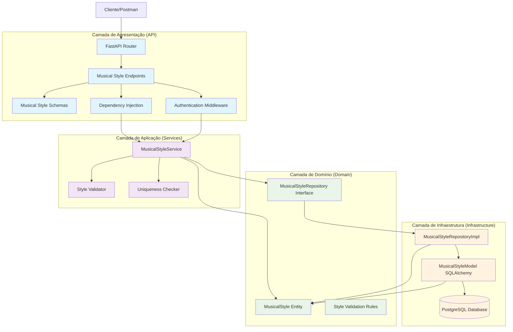
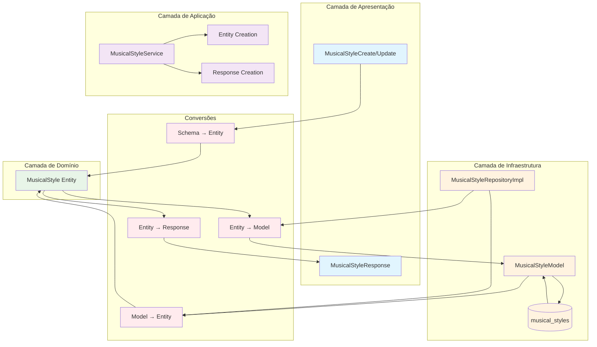
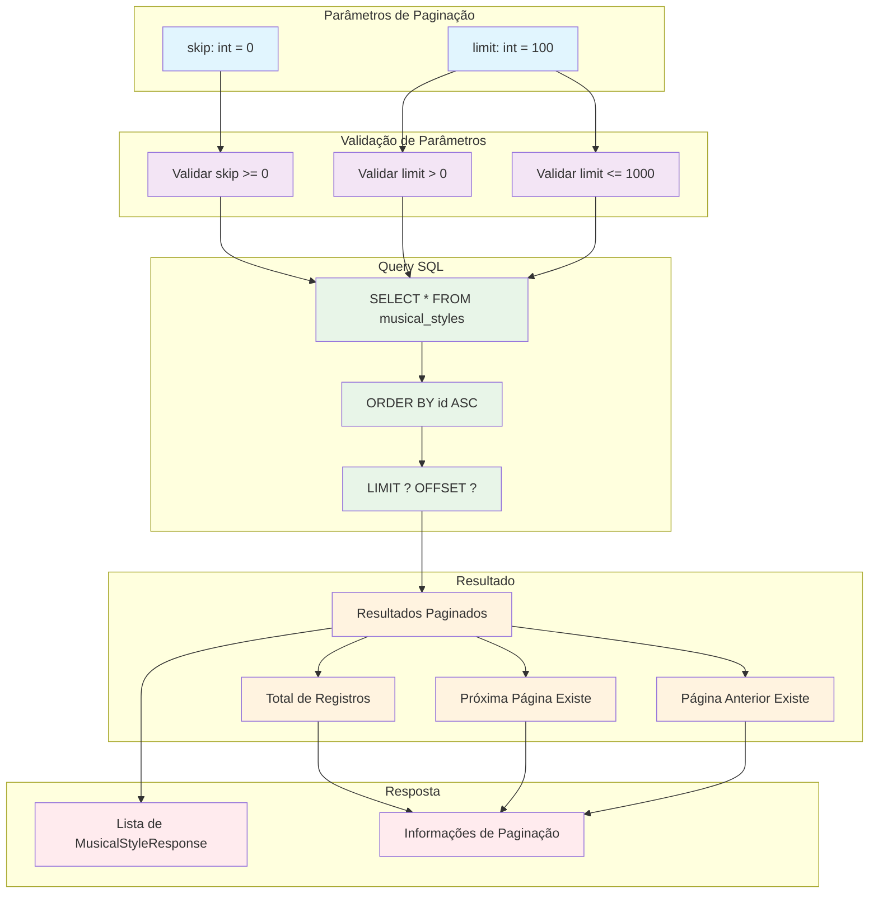

### **Arquitetura Implementada**

O endpoint musical_styles implementa uma **arquitetura simples e eficiente para gerenciamento de estilos musicais** seguindo os princípios da **Clean Architecture**:

1. **Camada de Apresentação**: FastAPI com endpoints CRUD padrão e autenticação obrigatória
2. **Camada de Aplicação**: MusicalStyleService com lógica de validação de unicidade
3. **Camada de Domínio**: Entidade MusicalStyle simples e interface de repositório
4. **Camada de Infraestrutura**: Implementação de repositório com SQLAlchemy

### **Características Principais**

- **CRUD Completo**: Operações de criação, leitura, atualização e exclusão
- **Validação de Unicidade**: Garantia de que cada estilo musical é único
- **Paginação**: Suporte a paginação com skip e limit
- **Autenticação**: Todos os endpoints requerem autenticação
- **Validação de Schema**: Validação de entrada com Pydantic
- **Simplicidade**: Estrutura direta e fácil de manter

### **Endpoints Disponíveis**

#### **CRUD Básico:**
1. **POST /musical-styles/** - Criar novo estilo musical
2. **GET /musical-styles/** - Listar estilos musicais (com paginação)
3. **GET /musical-styles/{id}** - Buscar estilo musical por ID
4. **PUT /musical-styles/{id}** - Atualizar estilo musical
5. **DELETE /musical-styles/{id}** - Deletar estilo musical

### **Regras de Negócio**

- **Unicidade**: Cada estilo musical deve ser único no sistema
- **Validação de Tamanho**: Nome do estilo deve ter entre 1 e 100 caracteres
- **Obrigatoriedade**: Nome do estilo é obrigatório
- **Autenticação**: Todas as operações requerem usuário autenticado

### **Validações Implementadas**

#### **Schema Validation:**
- **style**: String obrigatória com 1-100 caracteres
- **id**: Integer para identificação única
- **created_at/updated_at**: Timestamps automáticos

#### **Validações de Negócio:**
- **Unicidade**: Verificação de estilo já existente antes de criar/atualizar
- **Existência**: Verificação de existência antes de atualizar/deletar
- **Integridade**: Validação de dados antes de persistir

### **Estrutura de Dados**

#### **Entidade de Domínio:**
- **MusicalStyle**: Entidade simples com id, estyle, created_at, updated_at

#### **Schemas Pydantic:**
- **MusicalStyleBase**: Schema base com validação de estilo
- **MusicalStyleCreate**: Para criação de novos estilos
- **MusicalStyleUpdate**: Para atualização (campos opcionais)
- **MusicalStyleResponse**: Para resposta da API

#### **Modelo SQLAlchemy:**
- **MusicalStyleModel**: Mapeamento para tabela musical_styles
- **Constraints**: UNIQUE no campo estyle, NOT NULL
- **Índices**: Índice único no campo estyle

### **Campos Principais**

- **id**: Identificador único (INTEGER PRIMARY KEY)
- **estyle**: Nome do estilo musical (VARCHAR(50) UNIQUE NOT NULL)
- **created_at**: Data de criação (TIMESTAMP DEFAULT NOW())
- **updated_at**: Data de atualização (TIMESTAMP DEFAULT NOW())

### **Fluxos Especiais**

#### **Criação de Estilo Musical:**
1. Validar schema de entrada
2. Verificar se estilo já existe
3. Criar entidade MusicalStyle
4. Persistir no banco de dados
5. Retornar MusicalStyleResponse

#### **Atualização de Estilo Musical:**
1. Validar schema de entrada
2. Verificar se estilo existe
3. Verificar unicidade do novo nome (se diferente)
4. Atualizar entidade
5. Persistir mudanças
6. Retornar MusicalStyleResponse

#### **Listagem com Paginação:**
1. Validar parâmetros skip e limit
2. Executar query com LIMIT e OFFSET
3. Converter resultados para entidades
4. Retornar lista de MusicalStyleResponse

### **Validação de Unicidade**

- **Criação**: Verifica se estilo já existe antes de criar
- **Atualização**: Verifica se novo nome já existe (exceto próprio ID)
- **Consulta**: Usa índice único para performance
- **Erro**: Retorna ValueError se violação de unicidade

### **Paginação**

- **skip**: Número de registros a pular (padrão: 0)
- **limit**: Número máximo de registros (padrão: 100)
- **Query**: Usa LIMIT e OFFSET no SQL
- **Performance**: Índices otimizam consultas paginadas

### **Tratamento de Erros**

- **400 Bad Request**: Dados inválidos ou violação de unicidade
- **404 Not Found**: Estilo não encontrado
- **500 Internal Server Error**: Erros internos do servidor
- **Validação**: Mensagens de erro descritivas

### **Relacionamentos**

- **N:N com Artists**: Através da tabela artist_musical_style
- **Referenciado por**: ArtistMusicalStyle para relacionamentos com artistas
- **Integridade**: Constraints garantem consistência dos dados

### **Otimizações**

- **Índice Único**: No campo estyle para consultas rápidas
- **Paginação**: Para listagens grandes
- **Validação**: No nível de schema e aplicação
- **Transações**: Para operações de escrita

# Diagrama de Fluxo - Endpoint Musical Styles

  

## Fluxo Detalhado da Arquitetura em Camadas

  



  

## Fluxo Detalhado por Operação

```mermaid

sequenceDiagram

participant C as Cliente

participant API as API Layer

participant Service as MusicalStyle Service

participant Repo as Repository

participant DB as Database

%% Criação de Musical Style

Note over C,DB: POST /musical-styles/ - Criar Musical Style

C->>API: POST /musical-styles/ {"style": "Rock"}

API->>API: Validar MusicalStyleCreate schema

API->>Service: create_musical_style(style_data)

%% Verificar unicidade

Service->>Repo: get_by_estyle("Rock")

Repo->>DB: SELECT * FROM musical_styles WHERE estyle = 'Rock'

DB-->>Repo: MusicalStyleModel or None

alt Estilo já existe

Repo-->>Service: MusicalStyle entity

Service-->>API: ValueError("Estilo musical já existe")

API-->>C: 400 Bad Request

else Estilo não existe

Repo-->>Service: None

Service->>Service: Criar MusicalStyle entity

Service->>Repo: create(musical_style)

Repo->>Repo: Criar MusicalStyleModel

Repo->>DB: INSERT INTO musical_styles (estyle) VALUES ('Rock')

DB-->>Repo: Created MusicalStyleModel com ID

Repo->>Repo: Converter para MusicalStyle entity

Repo-->>Service: MusicalStyle entity

Service->>Service: Converter para MusicalStyleResponse

Service-->>API: MusicalStyleResponse

API-->>C: 201 Created + MusicalStyleResponse

end

%% Listagem de Musical Styles

Note over C,DB: GET /musical-styles/ - Listar Musical Styles

C->>API: GET /musical-styles/?skip=0&limit=10

API->>Service: get_musical_styles(skip=0, limit=10)

Service->>Repo: get_all(skip=0, limit=10)

Repo->>DB: SELECT * FROM musical_styles LIMIT 10 OFFSET 0

DB-->>Repo: [MusicalStyleModel]

Repo->>Repo: Converter para [MusicalStyle entities]

Repo-->>Service: [MusicalStyle entities]

Service->>Service: Converter para [MusicalStyleResponse]

Service-->>API: [MusicalStyleResponse]

API-->>C: 200 OK + [MusicalStyleResponse]

%% Busca por ID

Note over C,DB: GET /musical-styles/{id} - Buscar Musical Style por ID

C->>API: GET /musical-styles/1

API->>Service: get_musical_style_by_id(1)

Service->>Repo: get_by_id(1)

Repo->>DB: SELECT * FROM musical_styles WHERE id = 1

DB-->>Repo: MusicalStyleModel or None

alt Musical Style encontrado

Repo->>Repo: Converter para MusicalStyle entity

Repo-->>Service: MusicalStyle entity

Service->>Service: Converter para MusicalStyleResponse

Service-->>API: MusicalStyleResponse

API-->>C: 200 OK + MusicalStyleResponse

else Musical Style não encontrado

Repo-->>Service: None

Service-->>API: None

API-->>C: 404 Not Found

end

%% Atualização de Musical Style

Note over C,DB: PUT /musical-styles/{id} - Atualizar Musical Style

C->>API: PUT /musical-styles/1 {"style": "Rock Alternativo"}

API->>API: Validar MusicalStyleUpdate schema

API->>Service: update_musical_style(1, style_data)

%% Verificar existência

Service->>Repo: get_by_id(1)

Repo->>DB: SELECT * FROM musical_styles WHERE id = 1

DB-->>Repo: MusicalStyleModel or None

alt Musical Style não encontrado

Repo-->>Service: None

Service-->>API: None

API-->>C: 404 Not Found

else Musical Style encontrado

Repo->>Repo: Converter para MusicalStyle entity

Repo-->>Service: MusicalStyle entity

%% Verificar unicidade do novo nome

Service->>Repo: get_by_estyle("Rock Alternativo")

Repo->>DB: SELECT * FROM musical_styles WHERE estyle = 'Rock Alternativo'

DB-->>Repo: MusicalStyleModel or None

alt Estilo já existe com ID diferente

Repo-->>Service: MusicalStyle entity

Service-->>API: ValueError("Estilo musical já existe")

API-->>C: 400 Bad Request

else Estilo não existe ou é o mesmo

Repo-->>Service: None ou mesmo ID

Service->>Service: Atualizar estilo

Service->>Repo: update(musical_style)

Repo->>DB: UPDATE musical_styles SET estyle = 'Rock Alternativo', updated_at = NOW() WHERE id = 1

DB-->>Repo: Updated MusicalStyleModel

Repo->>Repo: Converter para MusicalStyle entity

Repo-->>Service: MusicalStyle entity

Service->>Service: Converter para MusicalStyleResponse

Service-->>API: MusicalStyleResponse

API-->>C: 200 OK + MusicalStyleResponse

end

end

%% Exclusão de Musical Style

Note over C,DB: DELETE /musical-styles/{id} - Deletar Musical Style

C->>API: DELETE /musical-styles/1

API->>Service: delete_musical_style(1)

Service->>Repo: delete(1)

Repo->>DB: SELECT * FROM musical_styles WHERE id = 1

DB-->>Repo: MusicalStyleModel or None

alt Musical Style não encontrado

Repo-->>Service: false

Service-->>API: false

API-->>C: 404 Not Found

else Musical Style encontrado

Repo->>DB: DELETE FROM musical_styles WHERE id = 1

DB-->>Repo: Confirmação

Repo-->>Service: true

Service-->>API: true

API-->>C: 200 OK + {"message": "Musical Style deletado com sucesso"}

end

```

  



  

## Arquitetura de Validação e Unicidade

  

```mermaid

graph TD

subgraph "Endpoints CRUD"

CreateEndpoint[POST /musical-styles/]

GetByIdEndpoint[GET /musical-styles/{id}]

GetAllEndpoint[GET /musical-styles/]

UpdateEndpoint[PUT /musical-styles/{id}]

DeleteEndpoint[DELETE /musical-styles/{id}]

end

subgraph "Validações"

SchemaValidation[Schema Validation]

UniquenessValidation[Uniqueness Validation]

ExistenceValidation[Existence Validation]

LengthValidation[Length Validation]

end

subgraph "Regras de Negócio"

UniqueStyleRule[Estilo deve ser único]

StyleLengthRule[Estilo deve ter 1-100 caracteres]

StyleRequiredRule[Estilo é obrigatório]

end

subgraph "Operações"

CreateOp[Criar Musical Style]

ReadOp[Ler Musical Style]

ReadAllOp[Listar Musical Styles]

UpdateOp[Atualizar Musical Style]

DeleteOp[Deletar Musical Style]

end

CreateEndpoint --> CreateOp

GetByIdEndpoint --> ReadOp

GetAllEndpoint --> ReadAllOp

UpdateEndpoint --> UpdateOp

DeleteEndpoint --> DeleteOp

CreateOp --> SchemaValidation

CreateOp --> UniquenessValidation

UpdateOp --> SchemaValidation

UpdateOp --> UniquenessValidation

UpdateOp --> ExistenceValidation

DeleteOp --> ExistenceValidation

SchemaValidation --> LengthValidation

SchemaValidation --> StyleRequiredRule

UniquenessValidation --> UniqueStyleRule

LengthValidation --> StyleLengthRule

%% Estilos

classDef endpoint fill:#e1f5fe

classDef validation fill:#f3e5f5

classDef rule fill:#e8f5e8

classDef operation fill:#fff3e0

class CreateEndpoint,GetByIdEndpoint,GetAllEndpoint,UpdateEndpoint,DeleteEndpoint endpoint

class SchemaValidation,UniquenessValidation,ExistenceValidation,LengthValidation validation

class UniqueStyleRule,StyleLengthRule,StyleRequiredRule rule

class CreateOp,ReadOp,ReadAllOp,UpdateOp,DeleteOp operation

```

  

## Estrutura de Dados e Modelo de Banco

  

```mermaid

graph TD

subgraph "Entidade de Domínio"

MusicalStyleEntity[MusicalStyle Entity]

IdField[id: Optional[int]]

StyleField[estyle: str]

CreatedAtField[created_at: datetime]

UpdatedAtField[updated_at: datetime]

end

subgraph "Schema Pydantic"

MusicalStyleBase[MusicalStyleBase]

MusicalStyleCreate[MusicalStyleCreate]

MusicalStyleUpdate[MusicalStyleUpdate]

MusicalStyleResponse[MusicalStyleResponse]

end

subgraph "Modelo SQLAlchemy"

MusicalStyleModel[MusicalStyleModel]

IdColumn[id: INTEGER PRIMARY KEY]

StyleColumn[estyle: STRING(50) UNIQUE NOT NULL]

CreatedAtColumn[created_at: TIMESTAMP DEFAULT NOW()]

UpdatedAtColumn[updated_at: TIMESTAMP DEFAULT NOW()]

end

subgraph "Tabela do Banco"

MusicalStylesTable[(musical_styles)]

IdTableField[id: INTEGER PRIMARY KEY]

StyleTableField[estyle: VARCHAR(50) UNIQUE NOT NULL]

CreatedAtTableField[created_at: TIMESTAMP DEFAULT NOW()]

UpdatedAtTableField[updated_at: TIMESTAMP DEFAULT NOW()]

end

subgraph "Constraints"

PrimaryKey[PRIMARY KEY (id)]

UniqueStyle[UNIQUE (estyle)]

NotNullStyle[NOT NULL (estyle)]

CheckLength[CHECK (LENGTH(estyle) >= 1 AND LENGTH(estyle) <= 100)]

end

subgraph "Índices"

IndexId[INDEX (id)]

IndexStyle[INDEX (estyle)]

end

MusicalStyleEntity --> IdField

MusicalStyleEntity --> StyleField

MusicalStyleEntity --> CreatedAtField

MusicalStyleEntity --> UpdatedAtField

MusicalStyleBase --> StyleField

MusicalStyleCreate --> MusicalStyleBase

MusicalStyleUpdate --> StyleField

MusicalStyleResponse --> MusicalStyleBase

MusicalStyleResponse --> IdField

MusicalStyleResponse --> CreatedAtField

MusicalStyleResponse --> UpdatedAtField

MusicalStyleModel --> IdColumn

MusicalStyleModel --> StyleColumn

MusicalStyleModel --> CreatedAtColumn

MusicalStyleModel --> UpdatedAtColumn

IdColumn --> IndexId

StyleColumn --> IndexStyle

StyleColumn --> UniqueStyle

StyleColumn --> NotNullStyle

StyleColumn --> CheckLength

MusicalStyleModel --> MusicalStylesTable

IdColumn --> IdTableField

StyleColumn --> StyleTableField

CreatedAtColumn --> CreatedAtTableField

UpdatedAtColumn --> UpdatedAtTableField

IdTableField --> PrimaryKey

StyleTableField --> UniqueStyle

StyleTableField --> NotNullStyle

StyleTableField --> CheckLength

IdTableField --> IndexId

StyleTableField --> IndexStyle

%% Estilos

classDef entity fill:#e8f5e8

classDef schema fill:#e1f5fe

classDef model fill:#f3e5f5

classDef table fill:#fff3e0

classDef constraint fill:#ffebee

classDef index fill:#f1f8e9

class MusicalStyleEntity,IdField,StyleField,CreatedAtField,UpdatedAtField entity

class MusicalStyleBase,MusicalStyleCreate,MusicalStyleUpdate,MusicalStyleResponse schema

class MusicalStyleModel,IdColumn,StyleColumn,CreatedAtColumn,UpdatedAtColumn model

class MusicalStylesTable,IdTableField,StyleTableField,CreatedAtTableField,UpdatedAtTableField table

class PrimaryKey,UniqueStyle,NotNullStyle,CheckLength constraint

class IndexId,IndexStyle index

```

  

## Fluxo de Validação de Unicidade

  

```mermaid

graph TD

subgraph "Entrada"

StyleName[Nome do Estilo]

StyleId[ID do Estilo (para updates)]

end

subgraph "Verificação de Unicidade"

CheckExisting[Verificar se estilo existe]

ExistingQuery[SELECT * FROM musical_styles WHERE estyle = ?]

ExistingResult[Resultado da consulta]

end

subgraph "Lógica de Validação"

CreateValidation[Validação para Criação]

UpdateValidation[Validação para Atualização]

SameIdCheck[Verificar se é o mesmo ID]

end

subgraph "Resultados"

StyleExists[Estilo já existe]

StyleNotExists[Estilo não existe]

SameStyle[Mesmo estilo (mesmo ID)]

DifferentStyle[Estilo diferente (ID diferente)]

end

subgraph "Ações"

AllowCreate[Permitir criação]

AllowUpdate[Permitir atualização]

BlockCreate[Bloquear criação]

BlockUpdate[Bloquear atualização]

end

StyleName --> CheckExisting

StyleId --> CheckExisting

CheckExisting --> ExistingQuery

ExistingQuery --> ExistingResult

ExistingResult --> StyleExists

ExistingResult --> StyleNotExists

StyleExists --> CreateValidation

StyleExists --> UpdateValidation

StyleNotExists --> CreateValidation

StyleNotExists --> UpdateValidation

CreateValidation --> BlockCreate

UpdateValidation --> SameIdCheck

SameIdCheck --> SameStyle

SameIdCheck --> DifferentStyle

SameStyle --> AllowUpdate

DifferentStyle --> BlockUpdate

StyleNotExists --> AllowCreate

%% Estilos

classDef input fill:#e1f5fe

classDef check fill:#f3e5f5

classDef validation fill:#e8f5e8

classDef result fill:#fff3e0

classDef action fill:#ffebee

class StyleName,StyleId input

class CheckExisting,ExistingQuery,ExistingResult check

class CreateValidation,UpdateValidation,SameIdCheck validation

class StyleExists,StyleNotExists,SameStyle,DifferentStyle result

class AllowCreate,AllowUpdate,BlockCreate,BlockUpdate action

```

  

## Endpoints e Operações CRUD

  

```mermaid

graph LR

subgraph "Endpoints CRUD"

CreateEndpoint[POST /musical-styles/]

GetByIdEndpoint[GET /musical-styles/{id}]

GetAllEndpoint[GET /musical-styles/]

UpdateEndpoint[PUT /musical-styles/{id}]

DeleteEndpoint[DELETE /musical-styles/{id}]

end

subgraph "Operações"

CreateOp[Criar Musical Style]

ReadOp[Ler Musical Style]

ReadAllOp[Listar Musical Styles]

UpdateOp[Atualizar Musical Style]

DeleteOp[Deletar Musical Style]

end

subgraph "Validações"

SchemaValidation[Schema Validation]

UniquenessValidation[Uniqueness Validation]

ExistenceValidation[Existence Validation]

end

subgraph "Respostas"

CreatedResponse[201 Created]

OkResponse[200 OK]

NotFoundResponse[404 Not Found]

BadRequestResponse[400 Bad Request]

end

CreateEndpoint --> CreateOp

GetByIdEndpoint --> ReadOp

GetAllEndpoint --> ReadAllOp

UpdateEndpoint --> UpdateOp

DeleteEndpoint --> DeleteOp

CreateOp --> SchemaValidation

CreateOp --> UniquenessValidation

ReadOp --> ExistenceValidation

UpdateOp --> SchemaValidation

UpdateOp --> UniquenessValidation

UpdateOp --> ExistenceValidation

DeleteOp --> ExistenceValidation

CreateOp --> CreatedResponse

ReadOp --> OkResponse

ReadAllOp --> OkResponse

UpdateOp --> OkResponse

DeleteOp --> OkResponse

ReadOp --> NotFoundResponse

UpdateOp --> NotFoundResponse

DeleteOp --> NotFoundResponse

CreateOp --> BadRequestResponse

UpdateOp --> BadRequestResponse

%% Estilos

classDef endpoint fill:#e1f5fe

classDef operation fill:#f3e5f5

classDef validation fill:#e8f5e8

classDef response fill:#fff3e0

class CreateEndpoint,GetByIdEndpoint,GetAllEndpoint,UpdateEndpoint,DeleteEndpoint endpoint

class CreateOp,ReadOp,ReadAllOp,UpdateOp,DeleteOp operation

class SchemaValidation,UniquenessValidation,ExistenceValidation validation

class CreatedResponse,OkResponse,NotFoundResponse,BadRequestResponse response

```

  

## Fluxo de Conversão de Dados

  



  

## Modelo de Banco de Dados

  

```mermaid

graph TD

subgraph "Tabela musical_styles"

IdColumn[id: INTEGER PRIMARY KEY]

StyleColumn[estyle: VARCHAR(50) UNIQUE NOT NULL]

CreatedAtColumn[created_at: TIMESTAMP DEFAULT NOW()]

UpdatedAtColumn[updated_at: TIMESTAMP DEFAULT NOW()]

end

subgraph "Constraints"

PrimaryKeyConstraint[PRIMARY KEY (id)]

UniqueStyleConstraint[UNIQUE (estyle)]

NotNullStyleConstraint[NOT NULL (estyle)]

CheckLengthConstraint[CHECK (LENGTH(estyle) >= 1 AND LENGTH(estyle) <= 100)]

end

subgraph "Índices"

PrimaryIndex[PRIMARY KEY INDEX (id)]

UniqueStyleIndex[UNIQUE INDEX (estyle)]

end

subgraph "Operações SQL"

InsertOp[INSERT INTO musical_styles (estyle) VALUES (?)]

SelectByIdOp[SELECT * FROM musical_styles WHERE id = ?]

SelectByStyleOp[SELECT * FROM musical_styles WHERE estyle = ?]

SelectAllOp[SELECT * FROM musical_styles LIMIT ? OFFSET ?]

UpdateOp[UPDATE musical_styles SET estyle = ?, updated_at = NOW() WHERE id = ?]

DeleteOp[DELETE FROM musical_styles WHERE id = ?]

end

subgraph "Relacionamentos"

ArtistMusicalStyle[artist_musical_style (N:N)]

ArtistTable[artists]

MusicalStyleTable[musical_styles]

end

IdColumn --> PrimaryKeyConstraint

StyleColumn --> UniqueStyleConstraint

StyleColumn --> NotNullStyleConstraint

StyleColumn --> CheckLengthConstraint

IdColumn --> PrimaryIndex

StyleColumn --> UniqueStyleIndex

InsertOp --> StyleColumn

SelectByIdOp --> IdColumn

SelectByStyleOp --> StyleColumn

SelectAllOp --> IdColumn

UpdateOp --> StyleColumn

UpdateOp --> IdColumn

DeleteOp --> IdColumn

MusicalStyleTable --> ArtistMusicalStyle

ArtistTable --> ArtistMusicalStyle

%% Estilos

classDef column fill:#e1f5fe

classDef constraint fill:#f3e5f5

classDef index fill:#e8f5e8

classDef operation fill:#fff3e0

classDef relationship fill:#ffebee

class IdColumn,StyleColumn,CreatedAtColumn,UpdatedAtColumn column

class PrimaryKeyConstraint,UniqueStyleConstraint,NotNullStyleConstraint,CheckLengthConstraint constraint

class PrimaryIndex,UniqueStyleIndex index

class InsertOp,SelectByIdOp,SelectByStyleOp,SelectAllOp,UpdateOp,DeleteOp operation

class ArtistMusicalStyle,ArtistTable,MusicalStyleTable relationship

```

  

## Fluxo de Paginação

  

