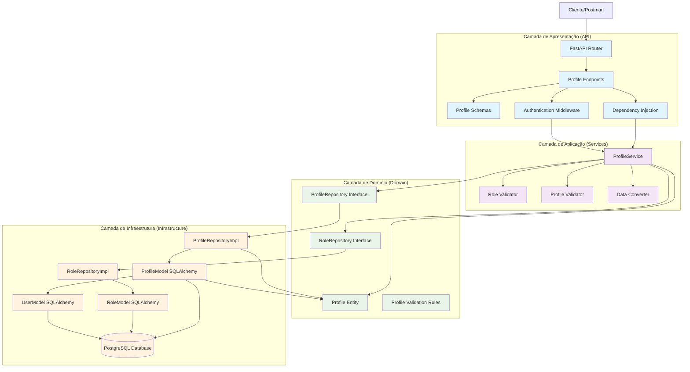
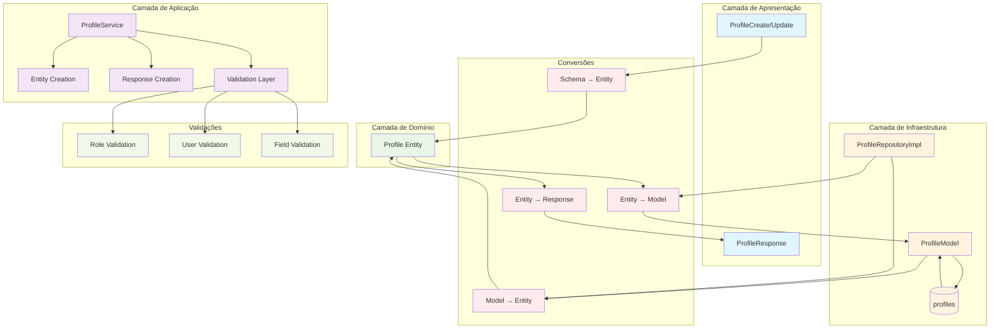
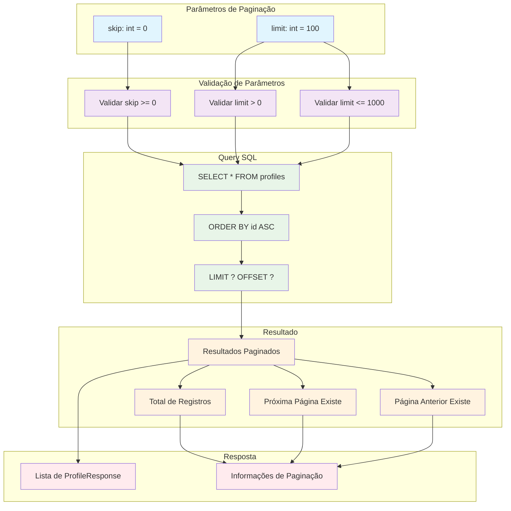

### **Arquitetura Implementada**

O endpoint profiles implementa uma **arquitetura robusta para gerenciamento de perfis de usuários** seguindo os princípios da **Clean Architecture**:

1. **Camada de Apresentação**: FastAPI com endpoints CRUD e busca especializada por role
2. **Camada de Aplicação**: ProfileService com validações de role e conversão de dados
3. **Camada de Domínio**: Entidade Profile com relacionamentos e interface de repositório
4. **Camada de Infraestrutura**: Implementação de repositório com múltiplos relacionamentos

### **Características Principais**

- **CRUD Completo**: Operações de criação, leitura, atualização e exclusão
- **Validação de Role**: Verificação de existência do role antes de criar/atualizar
- **Relacionamentos Múltiplos**: Conexões com users, roles, artists e spaces
- **Paginação**: Suporte a paginação com skip e limit
- **Autenticação**: Todos os endpoints requerem autenticação
- **Validação de Schema**: Validação extensiva de entrada com Pydantic
- **Dados Geográficos**: Suporte a latitude/longitude para localização

### **Endpoints Disponíveis**

#### **CRUD Básico:**
1. **POST /profiles/** - Criar novo profile
2. **GET /profiles/** - Listar profiles (com paginação)
3. **GET /profiles/{id}** - Buscar profile por ID
4. **PUT /profiles/{id}** - Atualizar profile
5. **DELETE /profiles/{id}** - Deletar profile

#### **Busca Especializada:**
6. **GET /profiles/role/{role_id}** - Buscar profiles por role

### **Regras de Negócio**

- **Validação de Role**: Role deve existir antes de criar/atualizar profile
- **Validação de User**: User é opcional mas deve existir se fornecido
- **Campos Obrigatórios**: role_id, full_name, artistic_name, bio, cep, logradouro, numero, cidade, uf, telefone_movel
- **Campos Opcionais**: user_id, complemento, telefone_fixo, whatsapp, latitude, longitude
- **Autenticação**: Todas as operações requerem usuário autenticado

### **Validações Implementadas**

#### **Schema Validation:**
- **role_id**: Integer obrigatório
- **full_name**: String 1-255 caracteres (obrigatório)
- **artistic_name**: String 1-255 caracteres (obrigatório)
- **bio**: String obrigatória
- **cep**: String 8-10 caracteres (obrigatório)
- **logradouro**: String 1-255 caracteres (obrigatório)
- **numero**: String 1-20 caracteres (obrigatório)
- **complemento**: String opcional até 100 caracteres
- **cidade**: String 1-100 caracteres (obrigatório)
- **uf**: String exatamente 2 caracteres (obrigatório)
- **telefone_fixo**: String opcional até 20 caracteres
- **telefone_movel**: String 1-20 caracteres (obrigatório)
- **whatsapp**: String opcional até 20 caracteres
- **latitude/longitude**: Float opcional

#### **Validações de Negócio:**
- **Role Exists**: Verificação de existência do role antes de criar/atualizar
- **User Exists**: Verificação de existência do user se fornecido
- **Profile Exists**: Verificação de existência antes de atualizar/deletar

### **Estrutura de Dados**

#### **Entidade de Domínio:**
- **Profile**: Entidade complexa com múltiplos campos e relacionamentos

#### **Schemas Pydantic:**
- **ProfileBase**: Schema base com validações de todos os campos
- **ProfileCreate**: Para criação de novos profiles
- **ProfileUpdate**: Para atualização (todos os campos opcionais)
- **ProfileResponse**: Para resposta da API

#### **Modelo SQLAlchemy:**
- **ProfileModel**: Mapeamento para tabela profiles
- **Constraints**: FK para users e roles, NOT NULL em campos obrigatórios
- **Índices**: Índices em id, user_id, role_id
- **Relacionamentos**: Com users, roles, artists, spaces

### **Campos Principais**

- **id**: Identificador único (INTEGER PRIMARY KEY)
- **user_id**: FK para users (INTEGER FK NOT NULL)
- **role_id**: FK para roles (INTEGER FK NOT NULL)
- **full_name**: Nome completo/Razão Social (VARCHAR(255) NOT NULL)
- **artistic_name**: Nome artístico/Nome de Fantasia (VARCHAR(255) NOT NULL)
- **bio**: Biografia/apresentação (TEXT NOT NULL)
- **cep**: CEP (VARCHAR(10) NOT NULL)
- **logradouro**: Endereço (VARCHAR(255) NOT NULL)
- **numero**: Número (VARCHAR(20) NOT NULL)
- **complemento**: Complemento opcional (VARCHAR(100) NULL)
- **cidade**: Cidade (VARCHAR(100) NOT NULL)
- **uf**: UF (VARCHAR(2) NOT NULL)
- **telefone_fixo**: Telefone fixo opcional (VARCHAR(20) NULL)
- **telefone_movel**: Telefone móvel (VARCHAR(20) NOT NULL)
- **whatsapp**: WhatsApp opcional (VARCHAR(20) NULL)
- **latitude/longitude**: Coordenadas geográficas (FLOAT NULL)

### **Fluxos Especiais**

#### **Criação de Profile:**
1. Validar schema de entrada
2. Verificar se role existe
3. Verificar se user existe (se fornecido)
4. Criar entidade Profile
5. Persistir no banco de dados
6. Retornar ProfileResponse

#### **Atualização de Profile:**
1. Validar schema de entrada
2. Verificar se profile existe
3. Verificar se novo role existe (se fornecido)
4. Atualizar campos fornecidos
5. Persistir mudanças
6. Retornar ProfileResponse

#### **Busca por Role:**
1. Validar role_id
2. Executar query filtrada por role_id
3. Converter resultados para entidades
4. Retornar lista de ProfileResponse

### **Relacionamentos**

- **users**: Referenciado pela tabela profiles (FK obrigatório)
- **roles**: Referenciado pela tabela profiles (FK obrigatório)
- **artists**: Referencia a tabela profiles (1:1)
- **spaces**: Referencia a tabela profiles (1:N)

### **Validação de Dependências**

- **Role Validation**: Verificação de existência do role antes de operações
- **User Validation**: Verificação de existência do user se fornecido
- **Profile Integrity**: Validação de integridade dos dados do profile

### **Paginação**

- **skip**: Número de registros a pular (padrão: 0)
- **limit**: Número máximo de registros (padrão: 100)
- **Query**: Usa LIMIT e OFFSET no SQL
- **Performance**: Índices otimizam consultas paginadas

### **Tratamento de Erros**

- **400 Bad Request**: Dados inválidos ou role/user não encontrado
- **404 Not Found**: Profile não encontrado
- **500 Internal Server Error**: Erros internos do servidor
- **Validação**: Mensagens de erro descritivas

### **Otimizações**

- **Índices**: Em id, user_id, role_id para consultas rápidas
- **Paginação**: Para listagens grandes
- **Validação**: No nível de schema e aplicação
- **Transações**: Para operações de escrita
- **Relacionamentos**: Eager loading quando necessário

# Diagrama de Fluxo - Endpoint Profiles

  

## Fluxo Detalhado da Arquitetura em Camadas

  



  

## Fluxo Detalhado por Operação

```mermaid

sequenceDiagram

participant C as Cliente

participant API as API Layer

participant Service as Profile Service

participant ProfileRepo as Profile Repository

participant RoleRepo as Role Repository

participant DB as Database

%% Criação de Profile

Note over C,DB: POST /profiles/ - Criar Profile

C->>API: POST /profiles/ {role_id, full_name, artistic_name, bio, cep, ...}

API->>API: Validar ProfileCreate schema

API->>Service: create_profile(profile_data)

%% Verificar se role existe

Service->>RoleRepo: get_by_id(profile_data.role_id)

RoleRepo->>DB: SELECT * FROM roles WHERE id = ?

DB-->>RoleRepo: RoleModel or None

alt Role não encontrado

RoleRepo-->>Service: None

Service-->>API: ValueError("Role não encontrado")

API-->>C: 400 Bad Request

else Role encontrado

RoleRepo-->>Service: Role entity

Service->>Service: Criar Profile entity

Service->>ProfileRepo: create(profile)

ProfileRepo->>ProfileRepo: Criar ProfileModel

ProfileRepo->>DB: INSERT INTO profiles (user_id, role_id, full_name, ...) VALUES (...)

DB-->>ProfileRepo: Created ProfileModel com ID

ProfileRepo->>ProfileRepo: Converter para Profile entity

ProfileRepo-->>Service: Profile entity

Service->>Service: Converter para ProfileResponse

Service-->>API: ProfileResponse

API-->>C: 201 Created + ProfileResponse

end

%% Listagem de Profiles

Note over C,DB: GET /profiles/ - Listar Profiles

C->>API: GET /profiles/?skip=0&limit=10

API->>Service: get_profiles(skip=0, limit=10)

Service->>ProfileRepo: get_all(skip=0, limit=10)

ProfileRepo->>DB: SELECT * FROM profiles LIMIT 10 OFFSET 0

DB-->>ProfileRepo: [ProfileModel]

ProfileRepo->>ProfileRepo: Converter para [Profile entities]

ProfileRepo-->>Service: [Profile entities]

Service->>Service: Converter para [ProfileResponse]

Service-->>API: [ProfileResponse]

API-->>C: 200 OK + [ProfileResponse]

%% Busca por ID

Note over C,DB: GET /profiles/{id} - Buscar Profile por ID

C->>API: GET /profiles/1

API->>Service: get_profile_by_id(1)

Service->>ProfileRepo: get_by_id(1)

ProfileRepo->>DB: SELECT * FROM profiles WHERE id = 1

DB-->>ProfileRepo: ProfileModel or None

alt Profile encontrado

ProfileRepo->>ProfileRepo: Converter para Profile entity

ProfileRepo-->>Service: Profile entity

Service->>Service: Converter para ProfileResponse

Service-->>API: ProfileResponse

API-->>C: 200 OK + ProfileResponse

else Profile não encontrado

ProfileRepo-->>Service: None

Service-->>API: None

API-->>C: 404 Not Found

end

%% Busca por Role ID

Note over C,DB: GET /profiles/role/{role_id} - Buscar Profiles por Role

C->>API: GET /profiles/role/2

API->>Service: get_profiles_by_role_id(2)

Service->>ProfileRepo: get_by_role_id(2)

ProfileRepo->>DB: SELECT * FROM profiles WHERE role_id = 2

DB-->>ProfileRepo: [ProfileModel]

ProfileRepo->>ProfileRepo: Converter para [Profile entities]

ProfileRepo-->>Service: [Profile entities]

Service->>Service: Converter para [ProfileResponse]

Service-->>API: [ProfileResponse]

API-->>C: 200 OK + [ProfileResponse]

%% Atualização de Profile

Note over C,DB: PUT /profiles/{id} - Atualizar Profile

C->>API: PUT /profiles/1 {full_name: "Novo Nome", artistic_name: "Novo Nome Artístico"}

API->>API: Validar ProfileUpdate schema

API->>Service: update_profile(1, profile_data)

%% Verificar existência

Service->>ProfileRepo: get_by_id(1)

ProfileRepo->>DB: SELECT * FROM profiles WHERE id = 1

DB-->>ProfileRepo: ProfileModel or None

alt Profile não encontrado

ProfileRepo-->>Service: None

Service-->>API: None

API-->>C: 404 Not Found

else Profile encontrado

ProfileRepo->>ProfileRepo: Converter para Profile entity

ProfileRepo-->>Service: Profile entity

%% Verificar role se fornecido

alt role_id fornecido

Service->>RoleRepo: get_by_id(profile_data.role_id)

RoleRepo->>DB: SELECT * FROM roles WHERE id = ?

DB-->>RoleRepo: RoleModel or None

alt Role não encontrado

RoleRepo-->>Service: None

Service-->>API: ValueError("Role não encontrado")

API-->>C: 400 Bad Request

else Role encontrado

RoleRepo-->>Service: Role entity

Service->>Service: Atualizar campos fornecidos

Service->>ProfileRepo: update(profile)

ProfileRepo->>DB: UPDATE profiles SET full_name = ?, artistic_name = ?, updated_at = NOW() WHERE id = 1

DB-->>ProfileRepo: Updated ProfileModel

ProfileRepo->>ProfileRepo: Converter para Profile entity

ProfileRepo-->>Service: Profile entity

Service->>Service: Converter para ProfileResponse

Service-->>API: ProfileResponse

API-->>C: 200 OK + ProfileResponse

end

else role_id não fornecido

Service->>Service: Atualizar campos fornecidos

Service->>ProfileRepo: update(profile)

ProfileRepo->>DB: UPDATE profiles SET full_name = ?, artistic_name = ?, updated_at = NOW() WHERE id = 1

DB-->>ProfileRepo: Updated ProfileModel

ProfileRepo->>ProfileRepo: Converter para Profile entity

ProfileRepo-->>Service: Profile entity

Service->>Service: Converter para ProfileResponse

Service-->>API: ProfileResponse

API-->>C: 200 OK + ProfileResponse

end

end

%% Exclusão de Profile

Note over C,DB: DELETE /profiles/{id} - Deletar Profile

C->>API: DELETE /profiles/1

API->>Service: delete_profile(1)

Service->>ProfileRepo: delete(1)

ProfileRepo->>DB: SELECT * FROM profiles WHERE id = 1

DB-->>ProfileRepo: ProfileModel or None

alt Profile não encontrado

ProfileRepo-->>Service: false

Service-->>API: false

API-->>C: 404 Not Found

else Profile encontrado

ProfileRepo->>DB: DELETE FROM profiles WHERE id = 1

DB-->>ProfileRepo: Confirmação

ProfileRepo-->>Service: true

Service-->>API: true

API-->>C: 200 OK + {"message": "Profile deletado com sucesso"}

end

```

  



  

## Arquitetura de Validação e Relacionamentos

  

```mermaid

graph TD

subgraph "Endpoints CRUD"

CreateEndpoint[POST /profiles/]

GetByIdEndpoint[GET /profiles/{id}]

GetAllEndpoint[GET /profiles/]

GetByRoleEndpoint[GET /profiles/role/{role_id}]

UpdateEndpoint[PUT /profiles/{id}]

DeleteEndpoint[DELETE /profiles/{id}]

end

subgraph "Validações"

SchemaValidation[Schema Validation]

RoleValidation[Role Validation]

UserValidation[User Validation]

RequiredFieldValidation[Required Field Validation]

LengthValidation[Length Validation]

end

subgraph "Regras de Negócio"

RoleExistsRule[Role deve existir]

UserExistsRule[User deve existir (opcional)]

RequiredFieldsRule[Campos obrigatórios]

FieldLengthRule[Limites de tamanho dos campos]

end

subgraph "Operações"

CreateOp[Criar Profile]

ReadOp[Ler Profile]

ReadAllOp[Listar Profiles]

ReadByRoleOp[Buscar por Role]

UpdateOp[Atualizar Profile]

DeleteOp[Deletar Profile]

end

CreateEndpoint --> CreateOp

GetByIdEndpoint --> ReadOp

GetAllEndpoint --> ReadAllOp

GetByRoleEndpoint --> ReadByRoleOp

UpdateEndpoint --> UpdateOp

DeleteEndpoint --> DeleteOp

CreateOp --> SchemaValidation

CreateOp --> RoleValidation

UpdateOp --> SchemaValidation

UpdateOp --> RoleValidation

UpdateOp --> UserValidation

SchemaValidation --> RequiredFieldValidation

SchemaValidation --> LengthValidation

RoleValidation --> RoleExistsRule

UserValidation --> UserExistsRule

RequiredFieldValidation --> RequiredFieldsRule

LengthValidation --> FieldLengthRule

%% Estilos

classDef endpoint fill:#e1f5fe

classDef validation fill:#f3e5f5

classDef rule fill:#e8f5e8

classDef operation fill:#fff3e0

class CreateEndpoint,GetByIdEndpoint,GetAllEndpoint,GetByRoleEndpoint,UpdateEndpoint,DeleteEndpoint endpoint

class SchemaValidation,RoleValidation,UserValidation,RequiredFieldValidation,LengthValidation validation

class RoleExistsRule,UserExistsRule,RequiredFieldsRule,FieldLengthRule rule

class CreateOp,ReadOp,ReadAllOp,ReadByRoleOp,UpdateOp,DeleteOp operation

```

  

## Estrutura de Dados e Modelo de Banco

  

```mermaid

graph TD

subgraph "Entidade de Domínio"

ProfileEntity[Profile Entity]

IdField[id: Optional[int]]

UserIdField[user_id: Optional[int]]

RoleIdField[role_id: int]

FullNameField[full_name: str]

ArtisticNameField[artistic_name: str]

BioField[bio: str]

CepField[cep: str]

LogradouroField[logradouro: str]

NumeroField[numero: str]

ComplementoField[complemento: Optional[str]]

CidadeField[cidade: str]

UfField[uf: str]

TelefoneFixoField[telefone_fixo: Optional[str]]

TelefoneMovelField[telefone_movel: str]

WhatsappField[whatsapp: Optional[str]]

LatitudeField[latitude: Optional[float]]

LongitudeField[longitude: Optional[float]]

CreatedAtField[created_at: datetime]

UpdatedAtField[updated_at: datetime]

end

subgraph "Schema Pydantic"

ProfileBase[ProfileBase]

ProfileCreate[ProfileCreate]

ProfileUpdate[ProfileUpdate]

ProfileResponse[ProfileResponse]

end

subgraph "Modelo SQLAlchemy"

ProfileModel[ProfileModel]

IdColumn[id: INTEGER PRIMARY KEY]

UserIdColumn[user_id: INTEGER FK NOT NULL]

RoleIdColumn[role_id: INTEGER FK NOT NULL]

FullNameColumn[full_name: VARCHAR(255) NOT NULL]

ArtisticNameColumn[artistic_name: VARCHAR(255) NOT NULL]

BioColumn[bio: TEXT NOT NULL]

CepColumn[cep: VARCHAR(10) NOT NULL]

LogradouroColumn[logradouro: VARCHAR(255) NOT NULL]

NumeroColumn[numero: VARCHAR(20) NOT NULL]

ComplementoColumn[complemento: VARCHAR(100) NULL]

CidadeColumn[cidade: VARCHAR(100) NOT NULL]

UfColumn[uf: VARCHAR(2) NOT NULL]

TelefoneFixoColumn[telefone_fixo: VARCHAR(20) NULL]

TelefoneMovelColumn[telefone_movel: VARCHAR(20) NOT NULL]

WhatsappColumn[whatsapp: VARCHAR(20) NULL]

LatitudeColumn[latitude: FLOAT NULL]

LongitudeColumn[longitude: FLOAT NULL]

CreatedAtColumn[created_at: TIMESTAMP DEFAULT NOW()]

UpdatedAtColumn[updated_at: TIMESTAMP DEFAULT NOW()]

end

subgraph "Tabela do Banco"

ProfilesTable[(profiles)]

IdTableField[id: INTEGER PRIMARY KEY]

UserIdTableField[user_id: INTEGER FK NOT NULL]

RoleIdTableField[role_id: INTEGER FK NOT NULL]

FullNameTableField[full_name: VARCHAR(255) NOT NULL]

ArtisticNameTableField[artistic_name: VARCHAR(255) NOT NULL]

BioTableField[bio: TEXT NOT NULL]

CepTableField[cep: VARCHAR(10) NOT NULL]

LogradouroTableField[logradouro: VARCHAR(255) NOT NULL]

NumeroTableField[numero: VARCHAR(20) NOT NULL]

ComplementoTableField[complemento: VARCHAR(100) NULL]

CidadeTableField[cidade: VARCHAR(100) NOT NULL]

UfTableField[uf: VARCHAR(2) NOT NULL]

TelefoneFixoTableField[telefone_fixo: VARCHAR(20) NULL]

TelefoneMovelTableField[telefone_movel: VARCHAR(20) NOT NULL]

WhatsappTableField[whatsapp: VARCHAR(20) NULL]

LatitudeTableField[latitude: FLOAT NULL]

LongitudeTableField[longitude: FLOAT NULL]

CreatedAtTableField[created_at: TIMESTAMP DEFAULT NOW()]

UpdatedAtTableField[updated_at: TIMESTAMP DEFAULT NOW()]

end

subgraph "Constraints"

PrimaryKey[PRIMARY KEY (id)]

ForeignKeyUser[FOREIGN KEY (user_id) REFERENCES users(id)]

ForeignKeyRole[FOREIGN KEY (role_id) REFERENCES roles(id)]

NotNullFields[NOT NULL (role_id, full_name, artistic_name, bio, cep, logradouro, numero, cidade, uf, telefone_movel)]

end

subgraph "Índices"

IndexId[INDEX (id)]

IndexUserId[INDEX (user_id)]

IndexRoleId[INDEX (role_id)]

end

ProfileEntity --> IdField

ProfileEntity --> UserIdField

ProfileEntity --> RoleIdField

ProfileEntity --> FullNameField

ProfileEntity --> ArtisticNameField

ProfileEntity --> BioField

ProfileEntity --> CepField

ProfileEntity --> LogradouroField

ProfileEntity --> NumeroField

ProfileEntity --> ComplementoField

ProfileEntity --> CidadeField

ProfileEntity --> UfField

ProfileEntity --> TelefoneFixoField

ProfileEntity --> TelefoneMovelField

ProfileEntity --> WhatsappField

ProfileEntity --> LatitudeField

ProfileEntity --> LongitudeField

ProfileEntity --> CreatedAtField

ProfileEntity --> UpdatedAtField

ProfileBase --> RoleIdField

ProfileBase --> FullNameField

ProfileBase --> ArtisticNameField

ProfileBase --> BioField

ProfileBase --> CepField

ProfileBase --> LogradouroField

ProfileBase --> NumeroField

ProfileBase --> ComplementoField

ProfileBase --> CidadeField

ProfileBase --> UfField

ProfileBase --> TelefoneFixoField

ProfileBase --> TelefoneMovelField

ProfileBase --> WhatsappField

ProfileBase --> LatitudeField

ProfileBase --> LongitudeField

ProfileCreate --> ProfileBase

ProfileCreate --> UserIdField

ProfileUpdate --> UserIdField

ProfileUpdate --> RoleIdField

ProfileUpdate --> FullNameField

ProfileUpdate --> ArtisticNameField

ProfileUpdate --> BioField

ProfileUpdate --> CepField

ProfileUpdate --> LogradouroField

ProfileUpdate --> NumeroField

ProfileUpdate --> ComplementoField

ProfileUpdate --> CidadeField

ProfileUpdate --> UfField

ProfileUpdate --> TelefoneFixoField

ProfileUpdate --> TelefoneMovelField

ProfileUpdate --> WhatsappField

ProfileUpdate --> LatitudeField

ProfileUpdate --> LongitudeField

ProfileResponse --> ProfileBase

ProfileResponse --> IdField

ProfileResponse --> UserIdField

ProfileResponse --> CreatedAtField

ProfileResponse --> UpdatedAtField

ProfileModel --> IdColumn

ProfileModel --> UserIdColumn

ProfileModel --> RoleIdColumn

ProfileModel --> FullNameColumn

ProfileModel --> ArtisticNameColumn

ProfileModel --> BioColumn

ProfileModel --> CepColumn

ProfileModel --> LogradouroColumn

ProfileModel --> NumeroColumn

ProfileModel --> ComplementoColumn

ProfileModel --> CidadeColumn

ProfileModel --> UfColumn

ProfileModel --> TelefoneFixoColumn

ProfileModel --> TelefoneMovelColumn

ProfileModel --> WhatsappColumn

ProfileModel --> LatitudeColumn

ProfileModel --> LongitudeColumn

ProfileModel --> CreatedAtColumn

ProfileModel --> UpdatedAtColumn

IdColumn --> IndexId

UserIdColumn --> IndexUserId

RoleIdColumn --> IndexRoleId

UserIdColumn --> ForeignKeyUser

RoleIdColumn --> ForeignKeyRole

IdColumn --> PrimaryKey

ProfileModel --> ProfilesTable

IdColumn --> IdTableField

UserIdColumn --> UserIdTableField

RoleIdColumn --> RoleIdTableField

FullNameColumn --> FullNameTableField

ArtisticNameColumn --> ArtisticNameTableField

BioColumn --> BioTableField

CepColumn --> CepTableField

LogradouroColumn --> LogradouroTableField

NumeroColumn --> NumeroTableField

ComplementoColumn --> ComplementoTableField

CidadeColumn --> CidadeTableField

UfColumn --> UfTableField

TelefoneFixoColumn --> TelefoneFixoTableField

TelefoneMovelColumn --> TelefoneMovelTableField

WhatsappColumn --> WhatsappTableField

LatitudeColumn --> LatitudeTableField

LongitudeColumn --> LongitudeTableField

CreatedAtColumn --> CreatedAtTableField

UpdatedAtColumn --> UpdatedAtTableField

IdTableField --> PrimaryKey

UserIdTableField --> ForeignKeyUser

RoleIdTableField --> ForeignKeyRole

IdTableField --> IndexId

UserIdTableField --> IndexUserId

RoleIdTableField --> IndexRoleId

%% Estilos

classDef entity fill:#e8f5e8

classDef schema fill:#e1f5fe

classDef model fill:#f3e5f5

classDef table fill:#fff3e0

classDef constraint fill:#ffebee

classDef index fill:#f1f8e9

class ProfileEntity,IdField,UserIdField,RoleIdField,FullNameField,ArtisticNameField,BioField,CepField,LogradouroField,NumeroField,ComplementoField,CidadeField,UfField,TelefoneFixoField,TelefoneMovelField,WhatsappField,LatitudeField,LongitudeField,CreatedAtField,UpdatedAtField entity

class ProfileBase,ProfileCreate,ProfileUpdate,ProfileResponse schema

class ProfileModel,IdColumn,UserIdColumn,RoleIdColumn,FullNameColumn,ArtisticNameColumn,BioColumn,CepColumn,LogradouroColumn,NumeroColumn,ComplementoColumn,CidadeColumn,UfColumn,TelefoneFixoColumn,TelefoneMovelColumn,WhatsappColumn,LatitudeColumn,LongitudeColumn,CreatedAtColumn,UpdatedAtColumn model

class ProfilesTable,IdTableField,UserIdTableField,RoleIdTableField,FullNameTableField,ArtisticNameTableField,BioTableField,CepTableField,LogradouroTableField,NumeroTableField,ComplementoTableField,CidadeTableField,UfTableField,TelefoneFixoTableField,TelefoneMovelTableField,WhatsappTableField,LatitudeTableField,LongitudeTableField,CreatedAtTableField,UpdatedAtTableField table

class PrimaryKey,ForeignKeyUser,ForeignKeyRole,NotNullFields constraint

class IndexId,IndexUserId,IndexRoleId index

```

  

## Relacionamentos e Dependências

  

```mermaid

graph TD

subgraph "Entidades Relacionadas"

ProfileEntity[Profile Entity]

UserEntity[User Entity]

RoleEntity[Role Entity]

ArtistEntity[Artist Entity]

SpaceEntity[Space Entity]

end

subgraph "Relacionamentos"

ProfileToUser[Profile → User (N:1)]

ProfileToRole[Profile → Role (N:1)]

ProfileToArtist[Profile → Artist (1:1)]

ProfileToSpace[Profile → Space (1:N)]

end

subgraph "Tabelas do Banco"

ProfilesTable[(profiles)]

UsersTable[(users)]

RolesTable[(roles)]

ArtistsTable[(artists)]

SpacesTable[(spaces)]

end

subgraph "Foreign Keys"

UserIdFK[user_id → users.id]

RoleIdFK[role_id → roles.id]

ArtistProfileFK[artist.profile_id → profiles.id]

SpaceProfileFK[space.profile_id → profiles.id]

end

subgraph "Validações de Dependência"

UserExistsValidation[Validar se User existe]

RoleExistsValidation[Validar se Role existe]

ProfileIntegrityValidation[Validar integridade do Profile]

end

ProfileEntity --> ProfileToUser

ProfileEntity --> ProfileToRole

ProfileEntity --> ProfileToArtist

ProfileEntity --> ProfileToSpace

UserEntity --> ProfileToUser

RoleEntity --> ProfileToRole

ArtistEntity --> ProfileToArtist

SpaceEntity --> ProfileToSpace

ProfilesTable --> UsersTable

ProfilesTable --> RolesTable

ArtistsTable --> ProfilesTable

SpacesTable --> ProfilesTable

UserIdFK --> UsersTable

RoleIdFK --> RolesTable

ArtistProfileFK --> ProfilesTable

SpaceProfileFK --> ProfilesTable

UserExistsValidation --> UserEntity

RoleExistsValidation --> RoleEntity

ProfileIntegrityValidation --> ProfileEntity

%% Estilos

classDef entity fill:#e8f5e8

classDef relationship fill:#e1f5fe

classDef table fill:#f3e5f5

classDef fk fill:#fff3e0

classDef validation fill:#ffebee

class ProfileEntity,UserEntity,RoleEntity,ArtistEntity,SpaceEntity entity

class ProfileToUser,ProfileToRole,ProfileToArtist,ProfileToSpace relationship

class ProfilesTable,UsersTable,RolesTable,ArtistsTable,SpacesTable table

class UserIdFK,RoleIdFK,ArtistProfileFK,SpaceProfileFK fk

class UserExistsValidation,RoleExistsValidation,ProfileIntegrityValidation validation

```

  

## Endpoints e Operações CRUD

  

```mermaid

graph LR

subgraph "Endpoints CRUD"

CreateEndpoint[POST /profiles/]

GetByIdEndpoint[GET /profiles/{id}]

GetAllEndpoint[GET /profiles/]

GetByRoleEndpoint[GET /profiles/role/{role_id}]

UpdateEndpoint[PUT /profiles/{id}]

DeleteEndpoint[DELETE /profiles/{id}]

end

subgraph "Operações"

CreateOp[Criar Profile]

ReadOp[Ler Profile]

ReadAllOp[Listar Profiles]

ReadByRoleOp[Buscar por Role]

UpdateOp[Atualizar Profile]

DeleteOp[Deletar Profile]

end

subgraph "Validações"

SchemaValidation[Schema Validation]

RoleValidation[Role Validation]

UserValidation[User Validation]

ExistenceValidation[Existence Validation]

end

subgraph "Respostas"

CreatedResponse[201 Created]

OkResponse[200 OK]

NotFoundResponse[404 Not Found]

BadRequestResponse[400 Bad Request]

end

CreateEndpoint --> CreateOp

GetByIdEndpoint --> ReadOp

GetAllEndpoint --> ReadAllOp

GetByRoleEndpoint --> ReadByRoleOp

UpdateEndpoint --> UpdateOp

DeleteEndpoint --> DeleteOp

CreateOp --> SchemaValidation

CreateOp --> RoleValidation

CreateOp --> UserValidation

ReadOp --> ExistenceValidation

ReadByRoleOp --> ExistenceValidation

UpdateOp --> SchemaValidation

UpdateOp --> RoleValidation

UpdateOp --> UserValidation

UpdateOp --> ExistenceValidation

DeleteOp --> ExistenceValidation

CreateOp --> CreatedResponse

ReadOp --> OkResponse

ReadAllOp --> OkResponse

ReadByRoleOp --> OkResponse

UpdateOp --> OkResponse

DeleteOp --> OkResponse

ReadOp --> NotFoundResponse

ReadByRoleOp --> NotFoundResponse

UpdateOp --> NotFoundResponse

DeleteOp --> NotFoundResponse

CreateOp --> BadRequestResponse

UpdateOp --> BadRequestResponse

%% Estilos

classDef endpoint fill:#e1f5fe

classDef operation fill:#f3e5f5

classDef validation fill:#e8f5e8

classDef response fill:#fff3e0

class CreateEndpoint,GetByIdEndpoint,GetAllEndpoint,GetByRoleEndpoint,UpdateEndpoint,DeleteEndpoint endpoint

class CreateOp,ReadOp,ReadAllOp,ReadByRoleOp,UpdateOp,DeleteOp operation

class SchemaValidation,RoleValidation,UserValidation,ExistenceValidation validation

class CreatedResponse,OkResponse,NotFoundResponse,BadRequestResponse response

```

  

## Fluxo de Conversão de Dados

  



  

## Modelo de Banco de Dados

  

```mermaid

graph TD

subgraph "Tabela profiles"

IdColumn[id: INTEGER PRIMARY KEY]

UserIdColumn[user_id: INTEGER FK NOT NULL]

RoleIdColumn[role_id: INTEGER FK NOT NULL]

FullNameColumn[full_name: VARCHAR(255) NOT NULL]

ArtisticNameColumn[artistic_name: VARCHAR(255) NOT NULL]

BioColumn[bio: TEXT NOT NULL]

CepColumn[cep: VARCHAR(10) NOT NULL]

LogradouroColumn[logradouro: VARCHAR(255) NOT NULL]

NumeroColumn[numero: VARCHAR(20) NOT NULL]

ComplementoColumn[complemento: VARCHAR(100) NULL]

CidadeColumn[cidade: VARCHAR(100) NOT NULL]

UfColumn[uf: VARCHAR(2) NOT NULL]

TelefoneFixoColumn[telefone_fixo: VARCHAR(20) NULL]

TelefoneMovelColumn[telefone_movel: VARCHAR(20) NOT NULL]

WhatsappColumn[whatsapp: VARCHAR(20) NULL]

LatitudeColumn[latitude: FLOAT NULL]

LongitudeColumn[longitude: FLOAT NULL]

CreatedAtColumn[created_at: TIMESTAMP DEFAULT NOW()]

UpdatedAtColumn[updated_at: TIMESTAMP DEFAULT NOW()]

end

subgraph "Constraints"

PrimaryKeyConstraint[PRIMARY KEY (id)]

ForeignKeyUserConstraint[FOREIGN KEY (user_id) REFERENCES users(id)]

ForeignKeyRoleConstraint[FOREIGN KEY (role_id) REFERENCES roles(id)]

NotNullFieldsConstraint[NOT NULL (role_id, full_name, artistic_name, bio, cep, logradouro, numero, cidade, uf, telefone_movel)]

end

subgraph "Índices"

PrimaryIndex[PRIMARY KEY INDEX (id)]

UserIdIndex[INDEX (user_id)]

RoleIdIndex[INDEX (role_id)]

end

subgraph "Operações SQL"

InsertOp[INSERT INTO profiles (user_id, role_id, full_name, ...) VALUES (...)]

SelectByIdOp[SELECT * FROM profiles WHERE id = ?]

SelectByUserIdOp[SELECT * FROM profiles WHERE user_id = ?]

SelectByRoleIdOp[SELECT * FROM profiles WHERE role_id = ?]

SelectAllOp[SELECT * FROM profiles LIMIT ? OFFSET ?]

UpdateOp[UPDATE profiles SET ... WHERE id = ?]

DeleteOp[DELETE FROM profiles WHERE id = ?]

end

subgraph "Relacionamentos"

UsersTable[users]

RolesTable[roles]

ArtistsTable[artists]

SpacesTable[spaces]

end

IdColumn --> PrimaryKeyConstraint

UserIdColumn --> ForeignKeyUserConstraint

RoleIdColumn --> ForeignKeyRoleConstraint

IdColumn --> PrimaryIndex

UserIdColumn --> UserIdIndex

RoleIdColumn --> RoleIdIndex

InsertOp --> UserIdColumn

InsertOp --> RoleIdColumn

InsertOp --> FullNameColumn

InsertOp --> ArtisticNameColumn

InsertOp --> BioColumn

InsertOp --> CepColumn

InsertOp --> LogradouroColumn

InsertOp --> NumeroColumn

InsertOp --> ComplementoColumn

InsertOp --> CidadeColumn

InsertOp --> UfColumn

InsertOp --> TelefoneFixoColumn

InsertOp --> TelefoneMovelColumn

InsertOp --> WhatsappColumn

InsertOp --> LatitudeColumn

InsertOp --> LongitudeColumn

SelectByIdOp --> IdColumn

SelectByUserIdOp --> UserIdColumn

SelectByRoleIdOp --> RoleIdColumn

SelectAllOp --> IdColumn

UpdateOp --> IdColumn

DeleteOp --> IdColumn

UsersTable --> ForeignKeyUserConstraint

RolesTable --> ForeignKeyRoleConstraint

ArtistsTable --> IdColumn

SpacesTable --> IdColumn

%% Estilos

classDef column fill:#e1f5fe

classDef constraint fill:#f3e5f5

classDef index fill:#e8f5e8

classDef operation fill:#fff3e0

classDef relationship fill:#ffebee

class IdColumn,UserIdColumn,RoleIdColumn,FullNameColumn,ArtisticNameColumn,BioColumn,CepColumn,LogradouroColumn,NumeroColumn,ComplementoColumn,CidadeColumn,UfColumn,TelefoneFixoColumn,TelefoneMovelColumn,WhatsappColumn,LatitudeColumn,LongitudeColumn,CreatedAtColumn,UpdatedAtColumn column

class PrimaryKeyConstraint,ForeignKeyUserConstraint,ForeignKeyRoleConstraint,NotNullFieldsConstraint constraint

class PrimaryIndex,UserIdIndex,RoleIdIndex index

class InsertOp,SelectByIdOp,SelectByUserIdOp,SelectByRoleIdOp,SelectAllOp,UpdateOp,DeleteOp operation

class UsersTable,RolesTable,ArtistsTable,SpacesTable relationship

```

  

## Fluxo de Paginação

  

