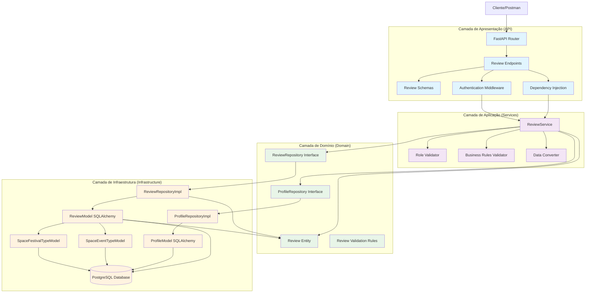

### **Arquitetura Implementada**

O endpoint reviews implementa uma **arquitetura robusta para sistema de avaliações** seguindo os princípios da **Clean Architecture** com **regras de negócio complexas baseadas em roles**:

1. **Camada de Apresentação**: FastAPI com endpoints CRUD, busca especializada e estatísticas
2. **Camada de Aplicação**: ReviewService com validações de role e regras de negócio específicas
3. **Camada de Domínio**: Entidade Review com validações e interface de repositório
4. **Camada de Infraestrutura**: Implementação de repositório com relacionamentos múltiplos

### **Características Principais**

- **CRUD Completo**: Operações de criação, leitura, atualização e exclusão
- **Regras de Negócio por Role**: Validações específicas baseadas no role do usuário
- **Relacionamentos Múltiplos**: Conexões com profiles, space_event_types e space_festival_types
- **Busca Avançada**: Filtros por profile, tipo de evento/festival, nota, período
- **Estatísticas**: Cálculo de média de avaliações por profile
- **Autenticação**: Todos os endpoints requerem autenticação
- **Validação de Schema**: Validação extensiva de entrada com Pydantic
- **Eager Loading**: Suporte a `include_relations` para carregar dados relacionados

### **Endpoints Disponíveis**

#### **CRUD Básico:**
1. **POST /reviews/** - Criar nova avaliação
2. **GET /reviews/{id}** - Buscar avaliação por ID
3. **GET /reviews/** - Listar todas as avaliações
4. **PUT /reviews/{id}** - Atualizar avaliação
5. **DELETE /reviews/{id}** - Deletar avaliação

#### **Busca Especializada:**
6. **GET /reviews/profile/{id}** - Avaliações de um profile
7. **GET /reviews/space-event-type/{id}** - Avaliações de um tipo de evento
8. **GET /reviews/space-festival-type/{id}** - Avaliações de um tipo de festival
9. **GET /reviews/rating/{nota}** - Avaliações com nota específica
10. **GET /reviews/date-range/** - Avaliações em período específico

#### **Estatísticas:**
11. **GET /reviews/profile/{id}/average** - Média de avaliações de um profile

### **Regras de Negócio Implementadas**

#### **Regras por Role:**
- **ADMIN (role_id=1)**: NUNCA pode fazer avaliações nem ser avaliado
- **ARTISTA (role_id=2)**: SEMPRE avalia ESPAÇO (role_id=3)
- **ESPAÇO (role_id=3)**: SEMPRE avalia ARTISTA (role_id=2)

#### **Regras de Relacionamento:**
- Apenas um tipo de relacionamento por review (space_event_type_id OU space_festival_type_id)
- Pelo menos um relacionamento deve ser especificado
- Relacionamentos devem existir no banco de dados

#### **Validações de Dados:**
- **nota**: Integer entre 1 e 5
- **depoimento**: String entre 10 e 1000 caracteres
- **data_hora**: DateTime válido
- **profile_id**: Deve existir no banco

### **Validações Implementadas**

#### **Schema Validation:**
- **nota**: Integer 1-5 (obrigatório)
- **depoimento**: String 10-1000 caracteres (obrigatório)
- **data_hora**: DateTime (obrigatório)
- **space_event_type_id**: Integer > 0 (opcional)
- **space_festival_type_id**: Integer > 0 (opcional)

#### **Validações de Negócio:**
- **Role Validation**: Verificação de permissões baseadas no role
- **Relationship Validation**: Validação de relacionamentos únicos
- **Existence Validation**: Verificação de existência de entidades relacionadas
- **Business Rules Validation**: Validação de regras específicas do domínio

### **Estrutura de Dados**

#### **Entidade de Domínio:**
- **Review**: Entidade complexa com validações internas

#### **Schemas Pydantic:**
- **ReviewBase**: Schema base com validações
- **ReviewCreate**: Para criação de novas avaliações
- **ReviewUpdate**: Para atualização (todos os campos opcionais)
- **ReviewResponse**: Para resposta básica
- **ReviewWithRelations**: Para resposta com dados relacionados
- **ProfileAverageRating**: Para estatísticas de média

#### **Modelo SQLAlchemy:**
- **ReviewModel**: Mapeamento para tabela reviews
- **Constraints**: FK para profiles, space_event_types, space_festival_types
- **Índices**: Em id, profile_id, nota, data_hora
- **Relacionamentos**: Com profiles, space_event_types, space_festival_types

### **Campos Principais**

- **id**: Identificador único (INTEGER PRIMARY KEY)
- **profile_id**: FK para profiles (INTEGER FK NOT NULL) - Quem está sendo avaliado
- **space_event_type_id**: FK para space_event_types (INTEGER FK NULL)
- **space_festival_type_id**: FK para space_festival_types (INTEGER FK NULL)
- **data_hora**: Data/hora da avaliação (TIMESTAMP NOT NULL)
- **nota**: Nota da avaliação 1-5 (INTEGER NOT NULL)
- **depoimento**: Texto da avaliação (TEXT NOT NULL)
- **created_at/updated_at**: Timestamps de auditoria

### **Fluxos Especiais**

#### **Criação de Review:**
1. Verificar autenticação do usuário
2. Obter profile do usuário logado
3. Validar regras de role (ADMIN não pode avaliar)
4. Validar regras de negócio (relacionamentos únicos)
5. Validar relacionamentos (deve existir no banco)
6. Criar entidade Review
7. Persistir no banco de dados
8. Retornar ReviewResponse

#### **Validação de Role:**
1. Obter profile do usuário que está avaliando
2. Verificar se role é ADMIN (não pode avaliar)
3. Se ARTISTA: verificar se está avaliando ESPAÇO
4. Se ESPAÇO: verificar se está avaliando ARTISTA
5. Validar relacionamentos através de space_event_type ou space_festival_type

#### **Busca com Relacionamentos:**
1. Usar `joinedload` para carregar dados relacionados
2. Configurar query com `_configure_relations`
3. Retornar ReviewModel com relações ou Review entity simples
4. Converter para schema apropriado (ReviewResponse ou ReviewWithRelations)

#### **Cálculo de Média:**
1. Usar `func.avg()` do SQLAlchemy
2. Filtrar por profile_id
3. Calcular total de reviews
4. Retornar ProfileAverageRating com média e total

### **Relacionamentos**

- **profiles**: Referenciado pela tabela reviews (FK obrigatório)
- **space_event_types**: Referenciado pela tabela reviews (FK opcional)
- **space_festival_types**: Referenciado pela tabela reviews (FK opcional)

### **Validação de Dependências**

- **Profile Validation**: Verificação de existência do profile
- **Space Event Type Validation**: Verificação de existência do space_event_type
- **Space Festival Type Validation**: Verificação de existência do space_festival_type
- **Role Validation**: Validação de permissões baseadas no role

### **Tratamento de Erros**

- **400 Bad Request**: Dados inválidos, regras de negócio violadas, role inválido
- **404 Not Found**: Review não encontrado
- **500 Internal Server Error**: Erros internos do servidor
- **Validação**: Mensagens de erro descritivas para cada regra violada

### **Otimizações**

- **Índices**: Em id, profile_id, nota, data_hora para consultas rápidas
- **Eager Loading**: `joinedload` para carregar relacionamentos quando necessário
- **Validação**: No nível de schema, domínio e aplicação
- **Transações**: Para operações de escrita
- **Relacionamentos**: Configuração dinâmica baseada em `include_relations`

# Diagrama de Fluxo - Endpoint Reviews

  

## Fluxo Detalhado da Arquitetura em Camadas

  



  

## Fluxo Detalhado por Operação

```mermaid

sequenceDiagram

participant C as Cliente

participant API as API Layer

participant Service as Review Service

participant ProfileRepo as Profile Repository

participant ReviewRepo as Review Repository

participant DB as Database

%% Criação de Review

Note over C,DB: POST /reviews/ - Criar Review

C->>API: POST /reviews/ {space_event_type_id, nota, depoimento, data_hora}

API->>API: Verificar autenticação (get_current_active_user)

API->>ProfileRepo: get_by_user_id(current_user.id)

ProfileRepo->>DB: SELECT * FROM profiles WHERE user_id = ?

DB-->>ProfileRepo: ProfileModel

ProfileRepo-->>API: Profile entity

alt Profile não encontrado

API-->>C: 400 Bad Request - "Usuários ADMIN não podem fazer avaliações"

else Profile encontrado

alt Role é ADMIN (role_id = 1)

API-->>C: 400 Bad Request - "ADMIN não pode fazer avaliações"

else Role não é ADMIN

API->>Service: create_review_with_profile(review_data, profile.id)

%% Validar regras de negócio

Service->>Service: validate_business_rules_with_profile(review_data, profile.id)

Service->>Service: _validate_role_rules_with_profile(review_data, profile.id)

%% Verificar relacionamentos

Service->>Service: _get_space_profile_from_review(review_data)

Service->>DB: SELECT * FROM space_event_types WHERE id = ?

DB-->>Service: SpaceEventTypeModel

Service->>DB: SELECT * FROM spaces WHERE id = ?

DB-->>Service: SpaceModel

Service->>ProfileRepo: get_by_id(space.profile_id)

ProfileRepo->>DB: SELECT * FROM profiles WHERE id = ?

DB-->>ProfileRepo: ProfileModel

ProfileRepo-->>Service: Profile entity

alt Regras de negócio violadas

Service-->>API: ValueError com lista de erros

API-->>C: 400 Bad Request

else Regras de negócio válidas

Service->>Service: Criar Review entity

Service->>ReviewRepo: create(review)

ReviewRepo->>ReviewRepo: Criar ReviewModel

ReviewRepo->>DB: INSERT INTO reviews (profile_id, space_event_type_id, nota, depoimento, data_hora) VALUES (...)

DB-->>ReviewRepo: Created ReviewModel com ID

ReviewRepo->>ReviewRepo: Converter para Review entity

ReviewRepo-->>Service: Review entity

Service->>Service: Converter para ReviewResponse

Service-->>API: ReviewResponse

API-->>C: 201 Created + ReviewResponse

end

end

end

%% Busca por ID

Note over C,DB: GET /reviews/{id} - Buscar Review por ID

C->>API: GET /reviews/1?include_relations=true

API->>Service: get_review_by_id(1, include_relations=true)

Service->>ReviewRepo: get_by_id(1, include_relations=true)

ReviewRepo->>DB: SELECT * FROM reviews LEFT JOIN profiles LEFT JOIN space_event_types WHERE id = 1

DB-->>ReviewRepo: ReviewModel with relations or None

alt Review encontrado

ReviewRepo->>ReviewRepo: Converter para Review entity ou retornar modelo com relações

ReviewRepo-->>Service: Review entity/ReviewModel

Service-->>API: Review entity/ReviewModel

API->>API: Converter para ReviewResponse/ReviewWithRelations

API-->>C: 200 OK + ReviewResponse/ReviewWithRelations

else Review não encontrado

ReviewRepo-->>Service: None

Service-->>API: None

API-->>C: 404 Not Found

end

%% Busca por Profile

Note over C,DB: GET /reviews/profile/{id} - Reviews por Profile

C->>API: GET /reviews/profile/1

API->>Service: get_reviews_by_profile_id(1)

Service->>ReviewRepo: get_by_profile_id(1)

ReviewRepo->>DB: SELECT * FROM reviews WHERE profile_id = 1

DB-->>ReviewRepo: [ReviewModel]

ReviewRepo->>ReviewRepo: Converter para [Review entities]

ReviewRepo-->>Service: [Review entities]

Service-->>API: [Review entities]

API->>API: Converter para ReviewListResponse

API-->>C: 200 OK + ReviewListResponse

%% Média de Avaliações

Note over C,DB: GET /reviews/profile/{id}/average - Média de Avaliações

C->>API: GET /reviews/profile/1/average

API->>Service: get_average_rating_by_profile(1)

Service->>ReviewRepo: get_average_rating_by_profile(1)

ReviewRepo->>DB: SELECT AVG(nota) FROM reviews WHERE profile_id = 1

DB-->>ReviewRepo: Average rating

Service->>ReviewRepo: get_by_profile_id(1)

ReviewRepo->>DB: SELECT * FROM reviews WHERE profile_id = 1

DB-->>ReviewRepo: [ReviewModel]

ReviewRepo-->>Service: [Review entities]

Service->>Service: Calcular total_reviews

Service->>Service: Criar ProfileAverageRating

Service-->>API: ProfileAverageRating

API-->>C: 200 OK + ProfileAverageRating

%% Busca por Nota

Note over C,DB: GET /reviews/rating/{nota} - Reviews por Nota

C->>API: GET /reviews/rating/5

API->>API: Validar nota (1-5)

API->>Service: get_reviews_by_nota(5)

Service->>ReviewRepo: get_by_nota(5)

ReviewRepo->>DB: SELECT * FROM reviews WHERE nota = 5

DB-->>ReviewRepo: [ReviewModel]

ReviewRepo->>ReviewRepo: Converter para [Review entities]

ReviewRepo-->>Service: [Review entities]

Service-->>API: [Review entities]

API->>API: Converter para ReviewListResponse

API-->>C: 200 OK + ReviewListResponse

%% Busca por Período

Note over C,DB: GET /reviews/date-range/ - Reviews por Período

C->>API: GET /reviews/date-range/?data_inicio=2024-01-01&data_fim=2024-01-31

API->>API: Validar data_inicio < data_fim

API->>Service: get_reviews_by_date_range(data_inicio, data_fim)

Service->>ReviewRepo: get_by_date_range(data_inicio, data_fim)

ReviewRepo->>DB: SELECT * FROM reviews WHERE data_hora BETWEEN ? AND ?

DB-->>ReviewRepo: [ReviewModel]

ReviewRepo->>ReviewRepo: Converter para [Review entities]

ReviewRepo-->>Service: [Review entities]

Service-->>API: [Review entities]

API->>API: Converter para ReviewListResponse

API-->>C: 200 OK + ReviewListResponse

%% Atualização

Note over C,DB: PUT /reviews/{id} - Atualizar Review

C->>API: PUT /reviews/1 {nota: 4, depoimento: "Novo depoimento"}

API->>Service: update_review(1, review_data)

Service->>ReviewRepo: get_by_id(1)

ReviewRepo->>DB: SELECT * FROM reviews WHERE id = 1

DB-->>ReviewRepo: ReviewModel or None

alt Review não encontrado

ReviewRepo-->>Service: None

Service-->>API: None

API-->>C: 404 Not Found

else Review encontrado

ReviewRepo->>ReviewRepo: Converter para Review entity

ReviewRepo-->>Service: Review entity

%% Validar regras se relacionamentos alterados

Service->>Service: validate_business_rules(temp_data)

Service->>Service: _validate_role_rules(temp_data)

alt Regras violadas

Service-->>API: ValueError com lista de erros

API-->>C: 400 Bad Request

else Regras válidas

Service->>Service: Atualizar campos

Service->>ReviewRepo: update(1, updated_review)

ReviewRepo->>DB: UPDATE reviews SET nota = ?, depoimento = ?, updated_at = NOW() WHERE id = 1

DB-->>ReviewRepo: Updated ReviewModel

ReviewRepo->>ReviewRepo: Converter para Review entity

ReviewRepo-->>Service: Review entity

Service->>Service: Converter para ReviewResponse

Service-->>API: ReviewResponse

API-->>C: 200 OK + ReviewResponse

end

end

%% Exclusão

Note over C,DB: DELETE /reviews/{id} - Deletar Review

C->>API: DELETE /reviews/1

API->>Service: delete_review(1)

Service->>ReviewRepo: delete(1)

ReviewRepo->>DB: SELECT * FROM reviews WHERE id = 1

DB-->>ReviewRepo: ReviewModel or None

alt Review não encontrado

ReviewRepo-->>Service: false

Service-->>API: false

API-->>C: 404 Not Found

else Review encontrado

ReviewRepo->>DB: DELETE FROM reviews WHERE id = 1

DB-->>ReviewRepo: Confirmação

ReviewRepo-->>Service: true

Service-->>API: true

API-->>C: 200 OK + {"message": "Review deletado com sucesso"}

end

```

  



  

## Arquitetura de Regras de Negócio por Role

  

```mermaid

graph TD

subgraph "Regras de Negócio por Role"

AdminRule[ADMIN (role_id=1): NUNCA avalia nem é avaliado]

ArtistRule[ARTISTA (role_id=2): SEMPRE avalia ESPAÇO (role_id=3)]

SpaceRule[ESPAÇO (role_id=3): SEMPRE avalia ARTISTA (role_id=2)]

end

subgraph "Validações de Relacionamento"

SingleRelationshipValidation[Apenas um relacionamento por review]

RequiredRelationshipValidation[Pelo menos um relacionamento obrigatório]

ValidRelationshipValidation[Relacionamento deve existir no banco]

end

subgraph "Validações de Dados"

NotaValidation[Nota entre 1 e 5]

DepoimentoValidation[Depoimento 10-1000 caracteres]

DataHoraValidation[Data/hora válida]

end

subgraph "Permissões de Ação"

CreatePermission[Qualquer usuário autenticado pode criar]

UpdatePermission[Apenas quem criou pode atualizar]

DeletePermission[Apenas quem criou pode deletar]

ReadPermission[Qualquer usuário autenticado pode ler]

end

AdminRule --> SingleRelationshipValidation

ArtistRule --> SingleRelationshipValidation

SpaceRule --> SingleRelationshipValidation

SingleRelationshipValidation --> RequiredRelationshipValidation

RequiredRelationshipValidation --> ValidRelationshipValidation

ValidRelationshipValidation --> NotaValidation

ValidRelationshipValidation --> DepoimentoValidation

ValidRelationshipValidation --> DataHoraValidation

NotaValidation --> CreatePermission

DepoimentoValidation --> CreatePermission

DataHoraValidation --> CreatePermission

CreatePermission --> UpdatePermission

CreatePermission --> DeletePermission

CreatePermission --> ReadPermission

%% Estilos

classDef rule fill:#ffebee

classDef validation fill:#e3f2fd

classDef dataValidation fill:#e8f5e8

classDef permission fill:#fff3e0

class AdminRule,ArtistRule,SpaceRule rule

class SingleRelationshipValidation,RequiredRelationshipValidation,ValidRelationshipValidation validation

class NotaValidation,DepoimentoValidation,DataHoraValidation dataValidation

class CreatePermission,UpdatePermission,DeletePermission,ReadPermission permission

```

  

## Estrutura de Dados e Modelo de Banco

  

```mermaid

graph TD

subgraph "Entidade de Domínio"

ReviewEntity[Review Entity]

IdField[id: Optional[int]]

ProfileIdField[profile_id: int]

SpaceEventTypeIdField[space_event_type_id: Optional[int]]

SpaceFestivalTypeIdField[space_festival_type_id: Optional[int]]

DataHoraField[data_hora: datetime]

NotaField[nota: int]

DepoimentoField[depoimento: str]

CreatedAtField[created_at: datetime]

UpdatedAtField[updated_at: datetime]

end

subgraph "Schema Pydantic"

ReviewBase[ReviewBase]

ReviewCreate[ReviewCreate]

ReviewUpdate[ReviewUpdate]

ReviewResponse[ReviewResponse]

ReviewWithRelations[ReviewWithRelations]

ProfileAverageRating[ProfileAverageRating]

end

subgraph "Modelo SQLAlchemy"

ReviewModel[ReviewModel]

IdColumn[id: INTEGER PRIMARY KEY]

ProfileIdColumn[profile_id: INTEGER FK NOT NULL]

SpaceEventTypeIdColumn[space_event_type_id: INTEGER FK NULL]

SpaceFestivalTypeIdColumn[space_festival_type_id: INTEGER FK NULL]

DataHoraColumn[data_hora: TIMESTAMP NOT NULL]

NotaColumn[nota: INTEGER NOT NULL]

DepoimentoColumn[depoimento: TEXT NOT NULL]

CreatedAtColumn[created_at: TIMESTAMP DEFAULT NOW()]

UpdatedAtColumn[updated_at: TIMESTAMP DEFAULT NOW()]

end

subgraph "Tabela do Banco"

ReviewsTable[(reviews)]

IdTableField[id: INTEGER PRIMARY KEY]

ProfileIdTableField[profile_id: INTEGER FK NOT NULL]

SpaceEventTypeIdTableField[space_event_type_id: INTEGER FK NULL]

SpaceFestivalTypeIdTableField[space_festival_type_id: INTEGER FK NULL]

DataHoraTableField[data_hora: TIMESTAMP NOT NULL]

NotaTableField[nota: INTEGER NOT NULL]

DepoimentoTableField[depoimento: TEXT NOT NULL]

CreatedAtTableField[created_at: TIMESTAMP DEFAULT NOW()]

UpdatedAtTableField[updated_at: TIMESTAMP DEFAULT NOW()]

end

subgraph "Constraints"

PrimaryKey[PRIMARY KEY (id)]

ForeignKeyProfile[FOREIGN KEY (profile_id) REFERENCES profiles(id)]

ForeignKeyEventType[FOREIGN KEY (space_event_type_id) REFERENCES space_event_types(id)]

ForeignKeyFestivalType[FOREIGN KEY (space_festival_type_id) REFERENCES space_festival_types(id)]

CheckNota[CHECK (nota >= 1 AND nota <= 5)]

end

subgraph "Índices"

IndexId[INDEX (id)]

IndexProfileId[INDEX (profile_id)]

IndexNota[INDEX (nota)]

IndexDataHora[INDEX (data_hora)]

end

ReviewEntity --> IdField

ReviewEntity --> ProfileIdField

ReviewEntity --> SpaceEventTypeIdField

ReviewEntity --> SpaceFestivalTypeIdField

ReviewEntity --> DataHoraField

ReviewEntity --> NotaField

ReviewEntity --> DepoimentoField

ReviewEntity --> CreatedAtField

ReviewEntity --> UpdatedAtField

ReviewBase --> SpaceEventTypeIdField

ReviewBase --> SpaceFestivalTypeIdField

ReviewBase --> DataHoraField

ReviewBase --> NotaField

ReviewBase --> DepoimentoField

ReviewCreate --> ReviewBase

ReviewUpdate --> SpaceEventTypeIdField

ReviewUpdate --> SpaceFestivalTypeIdField

ReviewUpdate --> DataHoraField

ReviewUpdate --> NotaField

ReviewUpdate --> DepoimentoField

ReviewResponse --> ReviewBase

ReviewResponse --> ProfileIdField

ReviewResponse --> IdField

ReviewResponse --> CreatedAtField

ReviewResponse --> UpdatedAtField

ReviewWithRelations --> ReviewResponse

ProfileAverageRating --> ProfileIdField

ReviewModel --> IdColumn

ReviewModel --> ProfileIdColumn

ReviewModel --> SpaceEventTypeIdColumn

ReviewModel --> SpaceFestivalTypeIdColumn

ReviewModel --> DataHoraColumn

ReviewModel --> NotaColumn

ReviewModel --> DepoimentoColumn

ReviewModel --> CreatedAtColumn

ReviewModel --> UpdatedAtColumn

IdColumn --> IndexId

ProfileIdColumn --> IndexProfileId

NotaColumn --> IndexNota

DataHoraColumn --> IndexDataHora

ProfileIdColumn --> ForeignKeyProfile

SpaceEventTypeIdColumn --> ForeignKeyEventType

SpaceFestivalTypeIdColumn --> ForeignKeyFestivalType

NotaColumn --> CheckNota

ReviewModel --> ReviewsTable

IdColumn --> IdTableField

ProfileIdColumn --> ProfileIdTableField

SpaceEventTypeIdColumn --> SpaceEventTypeIdTableField

SpaceFestivalTypeIdColumn --> SpaceFestivalTypeIdTableField

DataHoraColumn --> DataHoraTableField

NotaColumn --> NotaTableField

DepoimentoColumn --> DepoimentoTableField

CreatedAtColumn --> CreatedAtTableField

UpdatedAtColumn --> UpdatedAtTableField

IdTableField --> PrimaryKey

ProfileIdTableField --> ForeignKeyProfile

SpaceEventTypeIdTableField --> ForeignKeyEventType

SpaceFestivalTypeIdTableField --> ForeignKeyFestivalType

NotaTableField --> CheckNota

IdTableField --> IndexId

ProfileIdTableField --> IndexProfileId

NotaTableField --> IndexNota

DataHoraTableField --> IndexDataHora

%% Estilos

classDef entity fill:#e8f5e8

classDef schema fill:#e1f5fe

classDef model fill:#f3e5f5

classDef table fill:#fff3e0

classDef constraint fill:#ffebee

classDef index fill:#f1f8e9

class ReviewEntity,IdField,ProfileIdField,SpaceEventTypeIdField,SpaceFestivalTypeIdField,DataHoraField,NotaField,DepoimentoField,CreatedAtField,UpdatedAtField entity

class ReviewBase,ReviewCreate,ReviewUpdate,ReviewResponse,ReviewWithRelations,ProfileAverageRating schema

class ReviewModel,IdColumn,ProfileIdColumn,SpaceEventTypeIdColumn,SpaceFestivalTypeIdColumn,DataHoraColumn,NotaColumn,DepoimentoColumn,CreatedAtColumn,UpdatedAtColumn model

class ReviewsTable,IdTableField,ProfileIdTableField,SpaceEventTypeIdTableField,SpaceFestivalTypeIdTableField,DataHoraTableField,NotaTableField,DepoimentoTableField,CreatedAtTableField,UpdatedAtTableField table

class PrimaryKey,ForeignKeyProfile,ForeignKeyEventType,ForeignKeyFestivalType,CheckNota constraint

class IndexId,IndexProfileId,IndexNota,IndexDataHora index

```

  

## Endpoints e Operações CRUD

  

```mermaid

graph LR

subgraph "Endpoints CRUD"

CreateEndpoint[POST /reviews/]

GetByIdEndpoint[GET /reviews/{id}]

GetAllEndpoint[GET /reviews/]

UpdateEndpoint[PUT /reviews/{id}]

DeleteEndpoint[DELETE /reviews/{id}]

end

subgraph "Endpoints de Busca"

GetByProfileEndpoint[GET /reviews/profile/{id}]

GetByEventTypeEndpoint[GET /reviews/space-event-type/{id}]

GetByFestivalTypeEndpoint[GET /reviews/space-festival-type/{id}]

GetByRatingEndpoint[GET /reviews/rating/{nota}]

GetByDateRangeEndpoint[GET /reviews/date-range/]

end

subgraph "Endpoints de Estatísticas"

GetAverageRatingEndpoint[GET /reviews/profile/{id}/average]

end

subgraph "Operações"

CreateOp[Criar Review]

ReadOp[Ler Review]

ReadAllOp[Listar Reviews]

UpdateOp[Atualizar Review]

DeleteOp[Deletar Review]

SearchOp[Buscar por Critérios]

StatsOp[Gerar Estatísticas]

end

subgraph "Validações"

RoleValidation[Validação por Role]

BusinessRulesValidation[Validação de Regras de Negócio]

DataValidation[Validação de Dados]

ExistenceValidation[Validação de Existência]

end

CreateEndpoint --> CreateOp

GetByIdEndpoint --> ReadOp

GetAllEndpoint --> ReadAllOp

UpdateEndpoint --> UpdateOp

DeleteEndpoint --> DeleteOp

GetByProfileEndpoint --> SearchOp

GetByEventTypeEndpoint --> SearchOp

GetByFestivalTypeEndpoint --> SearchOp

GetByRatingEndpoint --> SearchOp

GetByDateRangeEndpoint --> SearchOp

GetAverageRatingEndpoint --> StatsOp

CreateOp --> RoleValidation

CreateOp --> BusinessRulesValidation

CreateOp --> DataValidation

UpdateOp --> RoleValidation

UpdateOp --> BusinessRulesValidation

UpdateOp --> DataValidation

UpdateOp --> ExistenceValidation

DeleteOp --> ExistenceValidation

SearchOp --> DataValidation

%% Estilos

classDef crudEndpoint fill:#e1f5fe

classDef searchEndpoint fill:#f3e5f5

classDef statsEndpoint fill:#e8f5e8

classDef operation fill:#fff3e0

classDef validation fill:#ffebee

class CreateEndpoint,GetByIdEndpoint,GetAllEndpoint,UpdateEndpoint,DeleteEndpoint crudEndpoint

class GetByProfileEndpoint,GetByEventTypeEndpoint,GetByFestivalTypeEndpoint,GetByRatingEndpoint,GetByDateRangeEndpoint searchEndpoint

class GetAverageRatingEndpoint statsEndpoint

class CreateOp,ReadOp,ReadAllOp,UpdateOp,DeleteOp,SearchOp,StatsOp operation

class RoleValidation,BusinessRulesValidation,DataValidation,ExistenceValidation validation

```