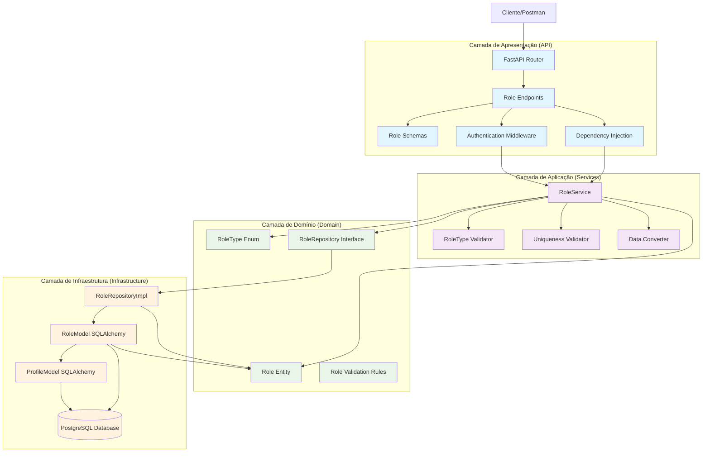
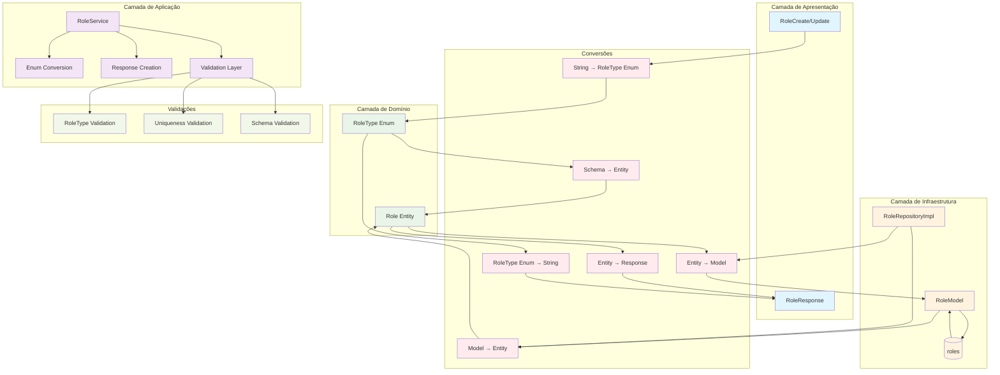
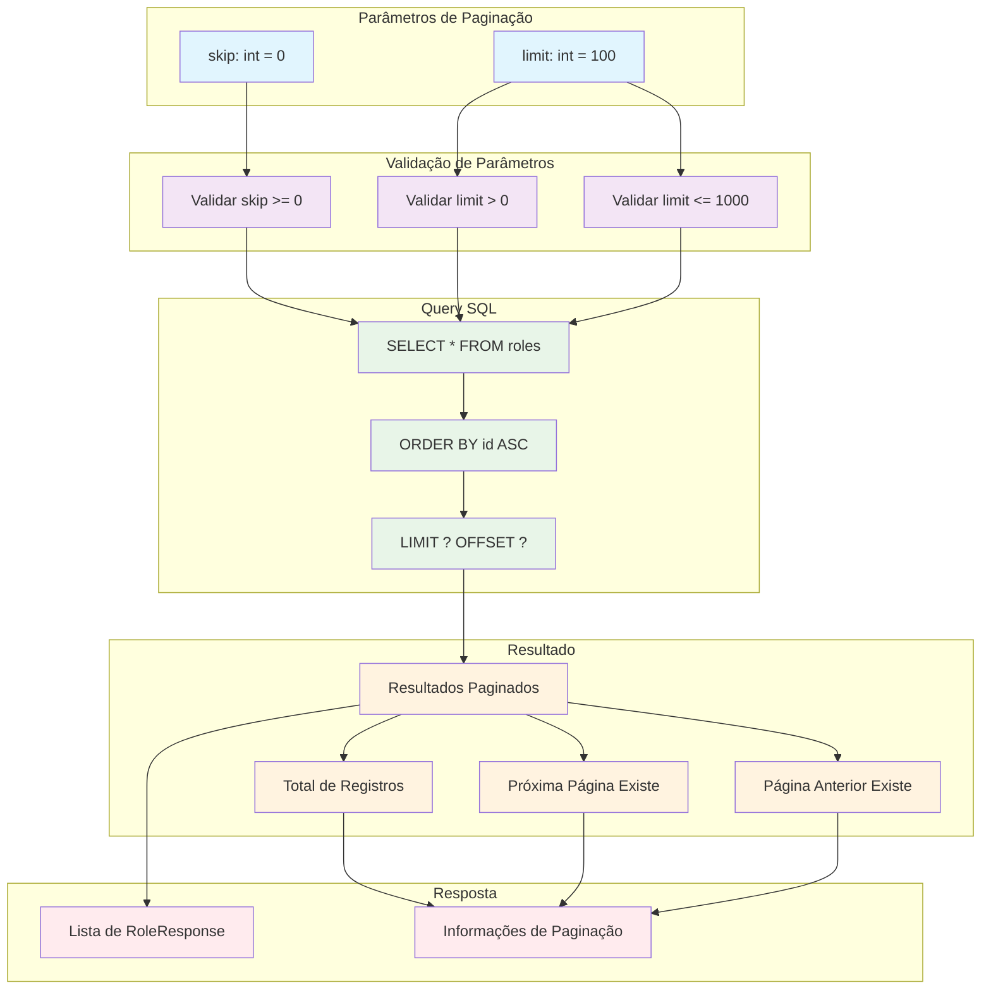

### **Arquitetura Implementada**

O endpoint roles implementa uma **arquitetura robusta para gerenciamento de roles de usuários** seguindo os princípios da **Clean Architecture** com **validação baseada em enum**:

1. **Camada de Apresentação**: FastAPI com endpoints CRUD padrão
2. **Camada de Aplicação**: RoleService com validação de enum e unicidade
3. **Camada de Domínio**: Entidade Role com enum RoleType e interface de repositório
4. **Camada de Infraestrutura**: Implementação de repositório com constraints únicos

### **Características Principais**

- **CRUD Completo**: Operações de criação, leitura, atualização e exclusão
- **Enum RoleType**: Validação baseada em enum com valores predefinidos
- **Unicidade**: Garantia de que cada role é único no sistema
- **Paginação**: Suporte a paginação com skip e limit
- **Autenticação**: Todos os endpoints requerem autenticação
- **Validação de Schema**: Validação extensiva de entrada com Pydantic
- **Conversão de Dados**: Conversão entre string e enum RoleType

### **Endpoints Disponíveis**

#### **CRUD Básico:**
1. **POST /roles/** - Criar novo role
2. **GET /roles/** - Listar roles (com paginação)
3. **GET /roles/{id}** - Buscar role por ID
4. **PUT /roles/{id}** - Atualizar role
5. **DELETE /roles/{id}** - Deletar role

### **Regras de Negócio**

- **RoleType Válido**: Role deve ser um dos valores do enum (ADMIN, ARTISTA, ESPAÇO)
- **Unicidade**: Cada role deve ser único no sistema
- **Existência**: Role deve existir antes de atualizar/deletar
- **Validação de Schema**: Nome do role deve ter entre 1 e 50 caracteres

### **Validações Implementadas**

#### **Schema Validation:**
- **name**: String 1-50 caracteres (obrigatório)

#### **Validações de Negócio:**
- **RoleType Validation**: Verificação se o role é um valor válido do enum
- **Uniqueness Validation**: Verificação de unicidade do role
- **Existence Validation**: Verificação de existência antes de operações

### **Estrutura de Dados**

#### **Entidade de Domínio:**
- **Role**: Entidade simples com enum RoleType
- **RoleType**: Enum com valores ADMIN, ARTISTA, ESPAÇO

#### **Schemas Pydantic:**
- **RoleBase**: Schema base com validação de nome
- **RoleCreate**: Para criação de novos roles
- **RoleUpdate**: Para atualização (campo opcional)
- **RoleResponse**: Para resposta da API

#### **Modelo SQLAlchemy:**
- **RoleModel**: Mapeamento para tabela roles
- **Constraints**: UNIQUE em role, NOT NULL em role
- **Índices**: Em id e role
- **Relacionamentos**: Com profiles (1:N)

### **Campos Principais**

- **id**: Identificador único (INTEGER PRIMARY KEY)
- **role**: Tipo do role (ENUM UNIQUE NOT NULL)
- **created_at**: Timestamp de criação (TIMESTAMP DEFAULT NOW())
- **updated_at**: Timestamp de atualização (TIMESTAMP DEFAULT NOW())

### **Fluxos Especiais**

#### **Criação de Role:**
1. Validar schema de entrada
2. Converter string para RoleType enum
3. Verificar se role já existe
4. Criar entidade Role
5. Persistir no banco de dados
6. Retornar RoleResponse

#### **Validação de RoleType:**
1. Tentar converter string para RoleType enum
2. Se falhar, retornar erro com valores válidos
3. Se sucesso, prosseguir com operação

#### **Verificação de Unicidade:**
1. Buscar role por tipo no banco
2. Se encontrado, retornar erro de duplicação
3. Se não encontrado, prosseguir com criação

#### **Atualização de Role:**
1. Verificar se role existe
2. Validar novo RoleType se fornecido
3. Verificar unicidade do novo role
4. Atualizar campos
5. Persistir mudanças
6. Retornar RoleResponse

### **Relacionamentos**

- **profiles**: Referenciado pela tabela roles (1:N)
- **users**: Relacionamento indireto através de profiles

### **Validação de Dependências**

- **Role Existence**: Verificação de existência antes de operações
- **Role Uniqueness**: Verificação de unicidade antes de criar/atualizar
- **RoleType Validation**: Validação de valores válidos do enum

### **Tratamento de Erros**

- **400 Bad Request**: RoleType inválido, role duplicado, dados inválidos
- **404 Not Found**: Role não encontrado
- **500 Internal Server Error**: Erros internos do servidor
- **Validação**: Mensagens de erro descritivas com valores válidos

### **Otimizações**

- **Índices**: Em id e role para consultas rápidas
- **Constraints**: UNIQUE em role para garantir unicidade
- **Validação**: No nível de schema, aplicação e banco
- **Transações**: Para operações de escrita
- **Enum**: Para garantir valores válidos em tempo de compilação

### **Enum RoleType**

```python
class RoleType(Enum):
    ADMIN = "Admin"
    ARTISTA = "Artista"
    ESPAÇO = "Espaço"
```

### **Operações SQL Principais**

- **INSERT**: Criar novo role
- **SELECT**: Buscar por ID, tipo ou listar todos
- **UPDATE**: Atualizar role existente
- **DELETE**: Remover role

# Diagrama de Fluxo - Endpoint Roles

  

## Fluxo Detalhado da Arquitetura em Camadas

  



  

## Fluxo Detalhado por Operação

```mermaid

sequenceDiagram

participant C as Cliente

participant API as API Layer

participant Service as Role Service

participant RoleRepo as Role Repository

participant DB as Database

%% Criação de Role

Note over C,DB: POST /roles/ - Criar Role

C->>API: POST /roles/ {name: "Admin"}

API->>API: Validar RoleCreate schema

API->>Service: create_role(role_data)

%% Validar RoleType

Service->>Service: RoleType(role_data.name)

alt RoleType inválido

Service-->>API: ValueError("Role 'Admin' não é válido. Roles válidos: ['Admin', 'Artista', 'Espaço']")

API-->>C: 400 Bad Request

else RoleType válido

Service->>RoleRepo: get_by_role(role_type)

RoleRepo->>DB: SELECT * FROM roles WHERE role = 'Admin'

DB-->>RoleRepo: RoleModel or None

alt Role já existe

RoleRepo-->>Service: Role entity

Service-->>API: ValueError("Role já existe")

API-->>C: 400 Bad Request

else Role não existe

RoleRepo-->>Service: None

Service->>Service: Criar Role entity

Service->>RoleRepo: create(role)

RoleRepo->>RoleRepo: Criar RoleModel

RoleRepo->>DB: INSERT INTO roles (role) VALUES ('Admin')

DB-->>RoleRepo: Created RoleModel com ID

RoleRepo->>RoleRepo: Converter para Role entity

RoleRepo-->>Service: Role entity

Service->>Service: Converter para RoleResponse

Service-->>API: RoleResponse

API-->>C: 201 Created + RoleResponse

end

end

%% Listagem de Roles

Note over C,DB: GET /roles/ - Listar Roles

C->>API: GET /roles/?skip=0&limit=10

API->>Service: get_roles(skip=0, limit=10)

Service->>RoleRepo: get_all(skip=0, limit=10)

RoleRepo->>DB: SELECT * FROM roles LIMIT 10 OFFSET 0

DB-->>RoleRepo: [RoleModel]

RoleRepo->>RoleRepo: Converter para [Role entities]

RoleRepo-->>Service: [Role entities]

Service->>Service: Converter para [RoleResponse]

Service-->>API: [RoleResponse]

API-->>C: 200 OK + [RoleResponse]

%% Busca por ID

Note over C,DB: GET /roles/{id} - Buscar Role por ID

C->>API: GET /roles/1

API->>Service: get_role_by_id(1)

Service->>RoleRepo: get_by_id(1)

RoleRepo->>DB: SELECT * FROM roles WHERE id = 1

DB-->>RoleRepo: RoleModel or None

alt Role encontrado

RoleRepo->>RoleRepo: Converter para Role entity

RoleRepo-->>Service: Role entity

Service->>Service: Converter para RoleResponse

Service-->>API: RoleResponse

API-->>C: 200 OK + RoleResponse

else Role não encontrado

RoleRepo-->>Service: None

Service-->>API: None

API-->>C: 404 Not Found

end

%% Atualização de Role

Note over C,DB: PUT /roles/{id} - Atualizar Role

C->>API: PUT /roles/1 {name: "Artista"}

API->>API: Validar RoleUpdate schema

API->>Service: update_role(1, role_data)

%% Verificar existência

Service->>RoleRepo: get_by_id(1)

RoleRepo->>DB: SELECT * FROM roles WHERE id = 1

DB-->>RoleRepo: RoleModel or None

alt Role não encontrado

RoleRepo-->>Service: None

Service-->>API: None

API-->>C: 404 Not Found

else Role encontrado

RoleRepo->>RoleRepo: Converter para Role entity

RoleRepo-->>Service: Role entity

%% Validar novo RoleType

Service->>Service: RoleType(role_data.name)

alt RoleType inválido

Service-->>API: ValueError("Role 'Artista' não é válido")

API-->>C: 400 Bad Request

else RoleType válido

%% Verificar unicidade

Service->>RoleRepo: get_by_role(role_type)

RoleRepo->>DB: SELECT * FROM roles WHERE role = 'Artista'

DB-->>RoleRepo: RoleModel or None

alt Role já existe (diferente ID)

RoleRepo-->>Service: Role entity

Service-->>API: ValueError("Role já existe")

API-->>C: 400 Bad Request

else Role não existe ou mesmo ID

RoleRepo-->>Service: Role entity or None

Service->>Service: Atualizar role.role

Service->>RoleRepo: update(role)

RoleRepo->>DB: UPDATE roles SET role = 'Artista', updated_at = NOW() WHERE id = 1

DB-->>RoleRepo: Updated RoleModel

RoleRepo->>RoleRepo: Converter para Role entity

RoleRepo-->>Service: Role entity

Service->>Service: Converter para RoleResponse

Service-->>API: RoleResponse

API-->>C: 200 OK + RoleResponse

end

end

end

%% Exclusão de Role

Note over C,DB: DELETE /roles/{id} - Deletar Role

C->>API: DELETE /roles/1

API->>Service: delete_role(1)

Service->>RoleRepo: delete(1)

RoleRepo->>DB: SELECT * FROM roles WHERE id = 1

DB-->>RoleRepo: RoleModel or None

alt Role não encontrado

RoleRepo-->>Service: false

Service-->>API: false

API-->>C: 404 Not Found

else Role encontrado

RoleRepo->>DB: DELETE FROM roles WHERE id = 1

DB-->>RoleRepo: Confirmação

RoleRepo-->>Service: true

Service-->>API: true

API-->>C: 200 OK + {"message": "Role deletado com sucesso"}

end

```

  



  

## Arquitetura de Validação e Enum

  

```mermaid

graph TD

subgraph "RoleType Enum"

AdminRole[ADMIN = "Admin"]

ArtistaRole[ARTISTA = "Artista"]

EspacoRole[ESPAÇO = "Espaço"]

end

subgraph "Validações"

RoleTypeValidation[RoleType Validation]

UniquenessValidation[Uniqueness Validation]

ExistenceValidation[Existence Validation]

SchemaValidation[Schema Validation]

end

subgraph "Regras de Negócio"

UniqueRoleRule[Role deve ser único]

ValidRoleTypeRule[Role deve ser um tipo válido]

RoleExistsRule[Role deve existir para operações]

end

subgraph "Operações"

CreateOp[Criar Role]

ReadOp[Ler Role]

ReadAllOp[Listar Roles]

UpdateOp[Atualizar Role]

DeleteOp[Deletar Role]

end

AdminRole --> RoleTypeValidation

ArtistaRole --> RoleTypeValidation

EspacoRole --> RoleTypeValidation

RoleTypeValidation --> ValidRoleTypeRule

UniquenessValidation --> UniqueRoleRule

ExistenceValidation --> RoleExistsRule

SchemaValidation --> ValidRoleTypeRule

ValidRoleTypeRule --> CreateOp

UniqueRoleRule --> CreateOp

ValidRoleTypeRule --> UpdateOp

UniqueRoleRule --> UpdateOp

RoleExistsRule --> UpdateOp

RoleExistsRule --> DeleteOp

CreateOp --> ReadOp

CreateOp --> ReadAllOp

CreateOp --> UpdateOp

CreateOp --> DeleteOp

%% Estilos

classDef enum fill:#e1f5fe

classDef validation fill:#f3e5f5

classDef rule fill:#e8f5e8

classDef operation fill:#fff3e0

class AdminRole,ArtistaRole,EspacoRole enum

class RoleTypeValidation,UniquenessValidation,ExistenceValidation,SchemaValidation validation

class UniqueRoleRule,ValidRoleTypeRule,RoleExistsRule rule

class CreateOp,ReadOp,ReadAllOp,UpdateOp,DeleteOp operation

```

  

## Estrutura de Dados e Modelo de Banco

  

```mermaid

graph TD

subgraph "Entidade de Domínio"

RoleEntity[Role Entity]

IdField[id: Optional[int]]

RoleField[role: RoleType]

CreatedAtField[created_at: datetime]

UpdatedAtField[updated_at: datetime]

end

subgraph "Enum RoleType"

RoleTypeEnum[RoleType Enum]

AdminEnum[ADMIN = "Admin"]

ArtistaEnum[ARTISTA = "Artista"]

EspacoEnum[ESPAÇO = "Espaço"]

end

subgraph "Schema Pydantic"

RoleBase[RoleBase]

RoleCreate[RoleCreate]

RoleUpdate[RoleUpdate]

RoleResponse[RoleResponse]

end

subgraph "Modelo SQLAlchemy"

RoleModel[RoleModel]

IdColumn[id: INTEGER PRIMARY KEY]

RoleColumn[role: ENUM UNIQUE NOT NULL]

CreatedAtColumn[created_at: TIMESTAMP DEFAULT NOW()]

UpdatedAtColumn[updated_at: TIMESTAMP DEFAULT NOW()]

end

subgraph "Tabela do Banco"

RolesTable[(roles)]

IdTableField[id: INTEGER PRIMARY KEY]

RoleTableField[role: ENUM UNIQUE NOT NULL]

CreatedAtTableField[created_at: TIMESTAMP DEFAULT NOW()]

UpdatedAtTableField[updated_at: TIMESTAMP DEFAULT NOW()]

end

subgraph "Constraints"

PrimaryKey[PRIMARY KEY (id)]

UniqueRole[UNIQUE (role)]

NotNullRole[NOT NULL (role)]

end

subgraph "Índices"

IndexId[INDEX (id)]

IndexRole[INDEX (role)]

end

RoleEntity --> IdField

RoleEntity --> RoleField

RoleEntity --> CreatedAtField

RoleEntity --> UpdatedAtField

RoleTypeEnum --> AdminEnum

RoleTypeEnum --> ArtistaEnum

RoleTypeEnum --> EspacoEnum

RoleField --> RoleTypeEnum

RoleBase --> RoleField

RoleCreate --> RoleBase

RoleUpdate --> RoleField

RoleResponse --> RoleBase

RoleResponse --> IdField

RoleResponse --> CreatedAtField

RoleResponse --> UpdatedAtField

RoleModel --> IdColumn

RoleModel --> RoleColumn

RoleModel --> CreatedAtColumn

RoleModel --> UpdatedAtColumn

IdColumn --> IndexId

RoleColumn --> IndexRole

RoleColumn --> UniqueRole

RoleColumn --> NotNullRole

RoleModel --> RolesTable

IdColumn --> IdTableField

RoleColumn --> RoleTableField

CreatedAtColumn --> CreatedAtTableField

UpdatedAtColumn --> UpdatedAtTableField

IdTableField --> PrimaryKey

RoleTableField --> UniqueRole

RoleTableField --> NotNullRole

IdTableField --> IndexId

RoleTableField --> IndexRole

%% Estilos

classDef entity fill:#e8f5e8

classDef enum fill:#e1f5fe

classDef schema fill:#f3e5f5

classDef model fill:#fff3e0

classDef table fill:#ffebee

classDef constraint fill:#f1f8e9

classDef index fill:#e0f2f1

class RoleEntity,IdField,RoleField,CreatedAtField,UpdatedAtField entity

class RoleTypeEnum,AdminEnum,ArtistaEnum,EspacoEnum enum

class RoleBase,RoleCreate,RoleUpdate,RoleResponse schema

class RoleModel,IdColumn,RoleColumn,CreatedAtColumn,UpdatedAtColumn model

class RolesTable,IdTableField,RoleTableField,CreatedAtTableField,UpdatedAtTableField table

class PrimaryKey,UniqueRole,NotNullRole constraint

class IndexId,IndexRole index

```

  

## Endpoints e Operações CRUD

  

```mermaid

graph LR

subgraph "Endpoints CRUD"

CreateEndpoint[POST /roles/]

GetByIdEndpoint[GET /roles/{id}]

GetAllEndpoint[GET /roles/]

UpdateEndpoint[PUT /roles/{id}]

DeleteEndpoint[DELETE /roles/{id}]

end

subgraph "Operações"

CreateOp[Criar Role]

ReadOp[Ler Role]

ReadAllOp[Listar Roles]

UpdateOp[Atualizar Role]

DeleteOp[Deletar Role]

end

subgraph "Validações"

RoleTypeValidation[RoleType Validation]

UniquenessValidation[Uniqueness Validation]

ExistenceValidation[Existence Validation]

SchemaValidation[Schema Validation]

end

subgraph "Respostas"

CreatedResponse[201 Created]

OkResponse[200 OK]

NotFoundResponse[404 Not Found]

BadRequestResponse[400 Bad Request]

end

CreateEndpoint --> CreateOp

GetByIdEndpoint --> ReadOp

GetAllEndpoint --> ReadAllOp

UpdateEndpoint --> UpdateOp

DeleteEndpoint --> DeleteOp

CreateOp --> RoleTypeValidation

CreateOp --> UniquenessValidation

CreateOp --> SchemaValidation

UpdateOp --> RoleTypeValidation

UpdateOp --> UniquenessValidation

UpdateOp --> SchemaValidation

UpdateOp --> ExistenceValidation

DeleteOp --> ExistenceValidation

CreateOp --> CreatedResponse

ReadOp --> OkResponse

ReadAllOp --> OkResponse

UpdateOp --> OkResponse

DeleteOp --> OkResponse

ReadOp --> NotFoundResponse

UpdateOp --> NotFoundResponse

DeleteOp --> NotFoundResponse

CreateOp --> BadRequestResponse

UpdateOp --> BadRequestResponse

%% Estilos

classDef endpoint fill:#e1f5fe

classDef operation fill:#f3e5f5

classDef validation fill:#e8f5e8

classDef response fill:#fff3e0

class CreateEndpoint,GetByIdEndpoint,GetAllEndpoint,UpdateEndpoint,DeleteEndpoint endpoint

class CreateOp,ReadOp,ReadAllOp,UpdateOp,DeleteOp operation

class RoleTypeValidation,UniquenessValidation,ExistenceValidation,SchemaValidation validation

class CreatedResponse,OkResponse,NotFoundResponse,BadRequestResponse response

```

  

## Fluxo de Conversão de Dados

  



  

## Modelo de Banco de Dados

  

```mermaid

graph TD

subgraph "Tabela roles"

IdColumn[id: INTEGER PRIMARY KEY]

RoleColumn[role: ENUM UNIQUE NOT NULL]

CreatedAtColumn[created_at: TIMESTAMP DEFAULT NOW()]

UpdatedAtColumn[updated_at: TIMESTAMP DEFAULT NOW()]

end

subgraph "Constraints"

PrimaryKeyConstraint[PRIMARY KEY (id)]

UniqueRoleConstraint[UNIQUE (role)]

NotNullRoleConstraint[NOT NULL (role)]

end

subgraph "Índices"

PrimaryIndex[PRIMARY KEY INDEX (id)]

RoleIndex[INDEX (role)]

end

subgraph "Operações SQL"

InsertOp[INSERT INTO roles (role) VALUES (?)]

SelectByIdOp[SELECT * FROM roles WHERE id = ?]

SelectByRoleOp[SELECT * FROM roles WHERE role = ?]

SelectAllOp[SELECT * FROM roles LIMIT ? OFFSET ?]

UpdateOp[UPDATE roles SET role = ?, updated_at = NOW() WHERE id = ?]

DeleteOp[DELETE FROM roles WHERE id = ?]

end

subgraph "Relacionamentos"

ProfilesTable[profiles]

UsersTable[users]

end

IdColumn --> PrimaryKeyConstraint

RoleColumn --> UniqueRoleConstraint

RoleColumn --> NotNullRoleConstraint

IdColumn --> PrimaryIndex

RoleColumn --> RoleIndex

InsertOp --> RoleColumn

SelectByIdOp --> IdColumn

SelectByRoleOp --> RoleColumn

SelectAllOp --> IdColumn

UpdateOp --> IdColumn

UpdateOp --> RoleColumn

DeleteOp --> IdColumn

ProfilesTable --> IdColumn

UsersTable --> IdColumn

%% Estilos

classDef column fill:#e1f5fe

classDef constraint fill:#f3e5f5

classDef index fill:#e8f5e8

classDef operation fill:#fff3e0

classDef relationship fill:#ffebee

class IdColumn,RoleColumn,CreatedAtColumn,UpdatedAtColumn column

class PrimaryKeyConstraint,UniqueRoleConstraint,NotNullRoleConstraint constraint

class PrimaryIndex,RoleIndex index

class InsertOp,SelectByIdOp,SelectByRoleOp,SelectAllOp,UpdateOp,DeleteOp operation

class ProfilesTable,UsersTable relationship

```

  

## Fluxo de Paginação

  

