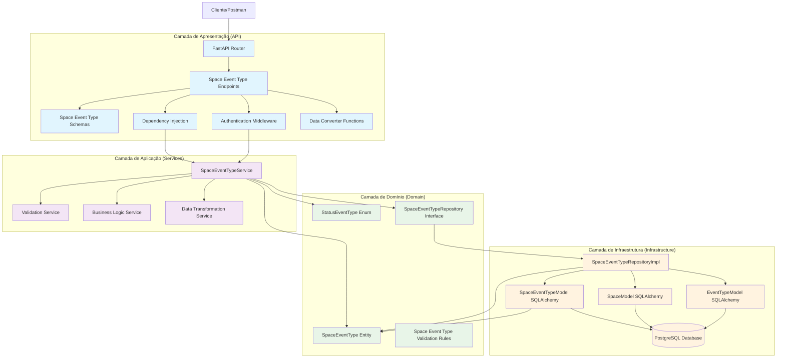

### **Arquitetura Implementada**

O endpoint space_event_types implementa uma **arquitetura robusta para gerenciamento de relacionamentos N:N entre espaços e tipos de eventos** seguindo os princípios da **Clean Architecture**:

1. **Camada de Apresentação**: FastAPI com endpoints CRUD, busca especializada e operações em lote
2. **Camada de Aplicação**: SpaceEventTypeService com validações de dependências e conversão de dados
3. **Camada de Domínio**: Entidade SpaceEventType com enum StatusEventType e interface de repositório
4. **Camada de Infraestrutura**: Implementação de repositório com validações de existência

### **Características Principais**

- **CRUD Completo**: Operações de criação, leitura, atualização e exclusão
- **Relacionamento N:N**: Gerencia relacionamentos entre spaces e event_types
- **Status Management**: Sistema de status com enum (CONTRATANDO, FECHADO, SUSPENSO, CANCELADO)
- **Busca Avançada**: Filtros por space, event_type, combinação de ambos
- **Operações em Lote**: Exclusão de todos os relacionamentos por space ou event_type
- **Validação de Dependências**: Verificação de existência de space e event_type
- **Autenticação**: Todos os endpoints requerem autenticação
- **Conversão de Dados**: Funções específicas para conversão entre camadas

### **Endpoints Disponíveis**

#### **CRUD Básico:**
1. **POST /space-event-types/** - Criar novo relacionamento
2. **GET /space-event-types/{id}** - Buscar relacionamento por ID
3. **GET /space-event-types/** - Listar todos os relacionamentos
4. **PUT /space-event-types/{id}** - Atualizar relacionamento
5. **DELETE /space-event-types/{id}** - Deletar relacionamento

#### **Operações Especiais:**
6. **PATCH /space-event-types/{id}/status** - Atualizar apenas o status

#### **Busca Especializada:**
7. **GET /space-event-types/space/{id}** - Event types de um space
8. **GET /space-event-types/event-type/{id}** - Spaces de um event type
9. **GET /space-event-types/space/{id}/event-type/{id}** - Relacionamento específico

#### **Exclusão em Lote:**
10. **DELETE /space-event-types/space/{id}** - Deletar todos os relacionamentos de um space
11. **DELETE /space-event-types/event-type/{id}** - Deletar todos os relacionamentos de um event type

### **Regras de Negócio Implementadas**

#### **Validações de Dependência:**
- **Space Exists**: Space deve existir antes de criar relacionamento
- **Event Type Exists**: Event type deve existir antes de criar relacionamento
- **Required Fields**: Campos obrigatórios (tema, descricao, data, horario)

#### **Status Management:**
- **Status Default**: Status padrão é CONTRATANDO
- **Status Validation**: Status deve ser um valor válido do enum
- **Status Update**: Operação específica para atualizar apenas o status

### **Validações Implementadas**

#### **Schema Validation:**
- **space_id**: Integer > 0 (obrigatório)
- **event_type_id**: Integer > 0 (obrigatório)
- **tema**: String obrigatório
- **descricao**: String obrigatório
- **status**: StatusEventType enum (padrão: CONTRATANDO)
- **data**: DateTime obrigatório
- **horario**: String obrigatório
- **link_divulgacao**: String opcional
- **banner**: String opcional (path da imagem)

#### **Validações de Negócio:**
- **Space Validation**: Verificação de existência do space
- **Event Type Validation**: Verificação de existência do event type
- **Existence Validation**: Verificação de existência antes de operações

### **Estrutura de Dados**

#### **Entidade de Domínio:**
- **SpaceEventType**: Entidade complexa com relacionamentos e validações
- **StatusEventType**: Enum com valores CONTRATANDO, FECHADO, SUSPENSO, CANCELADO

#### **Schemas Pydantic:**
- **SpaceEventTypeBase**: Schema base com validações
- **SpaceEventTypeCreate**: Para criação de novos relacionamentos
- **SpaceEventTypeUpdate**: Para atualização (campos opcionais)
- **SpaceEventTypeStatusUpdate**: Para atualização específica de status
- **SpaceEventTypeResponse**: Para resposta básica
- **SpaceEventTypeListResponse**: Para resposta de lista

#### **Modelo SQLAlchemy:**
- **SpaceEventTypeModel**: Mapeamento para tabela space_event_types
- **Constraints**: FK para spaces e event_types, NOT NULL em campos obrigatórios
- **Índices**: Em id, space_id, event_type_id, status
- **Relacionamentos**: Com spaces e event_types

### **Campos Principais**

- **id**: Identificador único (INTEGER PRIMARY KEY)
- **space_id**: FK para spaces (INTEGER FK NOT NULL)
- **event_type_id**: FK para event_types (INTEGER FK NOT NULL)
- **tema**: Tema do evento (VARCHAR(200) NOT NULL)
- **descricao**: Descrição do evento (TEXT NOT NULL)
- **status**: Status do evento (ENUM NOT NULL DEFAULT CONTRATANDO)
- **link_divulgacao**: Link de divulgação (VARCHAR(500) NULL)
- **banner**: Path do banner (VARCHAR(500) NULL)
- **data**: Data do evento (TIMESTAMP NOT NULL)
- **horario**: Horário do evento (VARCHAR(50) NOT NULL)
- **created_at**: Timestamp de criação

### **Fluxos Especiais**

#### **Criação de Relacionamento:**
1. Validar schema de entrada
2. Verificar se space existe
3. Verificar se event type existe
4. Criar entidade SpaceEventType
5. Persistir no banco de dados
6. Retornar SpaceEventTypeResponse

#### **Atualização de Status:**
1. Verificar se relacionamento existe
2. Validar novo status
3. Atualizar apenas o campo status
4. Retornar SpaceEventTypeResponse

#### **Busca por Critérios:**
1. Validar parâmetros de busca
2. Executar query filtrada
3. Converter resultados para entidades
4. Retornar SpaceEventTypeListResponse

#### **Exclusão em Lote:**
1. Executar DELETE com filtro
2. Retornar número de registros afetados
3. Confirmar sucesso da operação

### **Relacionamentos**

- **spaces**: Referenciado pela tabela space_event_types (N:1)
- **event_types**: Referenciado pela tabela space_event_types (N:1)
- **profiles**: Relacionamento indireto através de spaces

### **Validação de Dependências**

- **Space Validation**: Verificação de existência do space antes de operações
- **Event Type Validation**: Verificação de existência do event type antes de operações
- **Profile Validation**: Relacionamento indireto através de space.profile_id

### **Tratamento de Erros**

- **400 Bad Request**: Dados inválidos, space/event_type não encontrado
- **404 Not Found**: Relacionamento não encontrado
- **500 Internal Server Error**: Erros internos do servidor
- **Validação**: Mensagens de erro descritivas para cada validação

### **Otimizações**

- **Índices**: Em id, space_id, event_type_id, status para consultas rápidas
- **Validação**: No nível de schema, domínio e aplicação
- **Transações**: Para operações de escrita
- **Relacionamentos**: Validação de existência antes de operações
- **Conversão**: Funções específicas para conversão entre camadas

### **Enum StatusEventType**

```python
class StatusEventType(Enum):
    CONTRATANDO = "CONTRATANDO"
    FECHADO = "FECHADO"
    SUSPENSO = "SUSPENSO"
    CANCELADO = "CANCELADO"
```

### **Operações SQL Principais**

- **INSERT**: Criar novo relacionamento
- **SELECT**: Buscar por ID, space_id, event_type_id, combinações
- **UPDATE**: Atualizar relacionamento ou apenas status
- **DELETE**: Deletar relacionamento específico ou em lote

# Diagrama de Fluxo - Endpoint Space Event Types

  

## Fluxo Detalhado da Arquitetura em Camadas

  



  

## Fluxo Detalhado por Operação

```mermaid

sequenceDiagram

participant C as Cliente

participant API as API Layer

participant Service as Space Event Type Service

participant SpaceRepo as Space Repository

participant EventTypeRepo as Event Type Repository

participant SpaceEventTypeRepo as Space Event Type Repository

participant DB as Database

%% Criação de Space Event Type

Note over C,DB: POST /space-event-types/ - Criar Relacionamento

C->>API: POST /space-event-types/ {space_id, event_type_id, tema, descricao, data, horario, status}

API->>API: Validar SpaceEventTypeCreate schema

API->>Service: create_space_event_type(space_event_type_data)

%% Verificar se space existe

Service->>SpaceRepo: Verificar se space existe

SpaceRepo->>DB: SELECT * FROM spaces WHERE id = ?

DB-->>SpaceRepo: SpaceModel or None

alt Space não encontrado

SpaceRepo-->>Service: None

Service-->>API: ValueError("Espaço com ID X não encontrado")

API-->>C: 400 Bad Request

else Space encontrado

SpaceRepo-->>Service: SpaceModel

%% Verificar se event_type existe

Service->>EventTypeRepo: Verificar se event_type existe

EventTypeRepo->>DB: SELECT * FROM event_types WHERE id = ?

DB-->>EventTypeRepo: EventTypeModel or None

alt Event Type não encontrado

EventTypeRepo-->>Service: None

Service-->>API: ValueError("Tipo de evento com ID X não encontrado")

API-->>C: 400 Bad Request

else Event Type encontrado

EventTypeRepo-->>Service: EventTypeModel

%% Criar relacionamento

Service->>Service: Criar SpaceEventType entity

Service->>SpaceEventTypeRepo: create(space_event_type)

SpaceEventTypeRepo->>SpaceEventTypeRepo: Criar SpaceEventTypeModel

SpaceEventTypeRepo->>DB: INSERT INTO space_event_types (space_id, event_type_id, tema, descricao, status, data, horario) VALUES (...)

DB-->>SpaceEventTypeRepo: Created SpaceEventTypeModel com ID

SpaceEventTypeRepo->>SpaceEventTypeRepo: Converter para SpaceEventType entity

SpaceEventTypeRepo-->>Service: SpaceEventType entity

Service-->>API: SpaceEventType entity

API->>API: Converter para SpaceEventTypeResponse

API-->>C: 201 Created + SpaceEventTypeResponse

end

end

%% Listagem de Space Event Types

Note over C,DB: GET /space-event-types/ - Listar Relacionamentos

C->>API: GET /space-event-types/

API->>Service: get_all_space_event_types()

Service->>SpaceEventTypeRepo: get_all()

SpaceEventTypeRepo->>DB: SELECT * FROM space_event_types

DB-->>SpaceEventTypeRepo: [SpaceEventTypeModel]

SpaceEventTypeRepo->>SpaceEventTypeRepo: Converter para [SpaceEventType entities]

SpaceEventTypeRepo-->>Service: [SpaceEventType entities]

Service-->>API: [SpaceEventType entities]

API->>API: Converter para SpaceEventTypeListResponse

API-->>C: 200 OK + SpaceEventTypeListResponse

%% Busca por Space ID

Note over C,DB: GET /space-event-types/space/{id} - Event Types por Space

C->>API: GET /space-event-types/space/1

API->>Service: get_event_types_by_space(1)

Service->>SpaceEventTypeRepo: get_by_space_id(1)

SpaceEventTypeRepo->>DB: SELECT * FROM space_event_types WHERE space_id = 1

DB-->>SpaceEventTypeRepo: [SpaceEventTypeModel]

SpaceEventTypeRepo->>SpaceEventTypeRepo: Converter para [SpaceEventType entities]

SpaceEventTypeRepo-->>Service: [SpaceEventType entities]

Service-->>API: [SpaceEventType entities]

API->>API: Converter para SpaceEventTypeListResponse

API-->>C: 200 OK + SpaceEventTypeListResponse

%% Busca por Event Type ID

Note over C,DB: GET /space-event-types/event-type/{id} - Spaces por Event Type

C->>API: GET /space-event-types/event-type/2

API->>Service: get_spaces_by_event_type(2)

Service->>SpaceEventTypeRepo: get_by_event_type_id(2)

SpaceEventTypeRepo->>DB: SELECT * FROM space_event_types WHERE event_type_id = 2

DB-->>SpaceEventTypeRepo: [SpaceEventTypeModel]

SpaceEventTypeRepo->>SpaceEventTypeRepo: Converter para [SpaceEventType entities]

SpaceEventTypeRepo-->>Service: [SpaceEventType entities]

Service-->>API: [SpaceEventType entities]

API->>API: Converter para SpaceEventTypeListResponse

API-->>C: 200 OK + SpaceEventTypeListResponse

%% Busca por Space e Event Type

Note over C,DB: GET /space-event-types/space/{id}/event-type/{id} - Relacionamento Específico

C->>API: GET /space-event-types/space/1/event-type/2

API->>Service: get_space_event_types_by_space_and_event_type(1, 2)

Service->>SpaceEventTypeRepo: get_by_space_and_event_type(1, 2)

SpaceEventTypeRepo->>DB: SELECT * FROM space_event_types WHERE space_id = 1 AND event_type_id = 2

DB-->>SpaceEventTypeRepo: [SpaceEventTypeModel]

SpaceEventTypeRepo->>SpaceEventTypeRepo: Converter para [SpaceEventType entities]

SpaceEventTypeRepo-->>Service: [SpaceEventType entities]

Service-->>API: [SpaceEventType entities]

API->>API: Converter para SpaceEventTypeListResponse

API-->>C: 200 OK + SpaceEventTypeListResponse

%% Busca por ID

Note over C,DB: GET /space-event-types/{id} - Buscar por ID

C->>API: GET /space-event-types/1

API->>Service: get_space_event_type_by_id(1)

Service->>SpaceEventTypeRepo: get_by_id(1)

SpaceEventTypeRepo->>DB: SELECT * FROM space_event_types WHERE id = 1

DB-->>SpaceEventTypeRepo: SpaceEventTypeModel or None

alt Relacionamento encontrado

SpaceEventTypeRepo->>SpaceEventTypeRepo: Converter para SpaceEventType entity

SpaceEventTypeRepo-->>Service: SpaceEventType entity

Service-->>API: SpaceEventType entity

API->>API: Converter para SpaceEventTypeResponse

API-->>C: 200 OK + SpaceEventTypeResponse

else Relacionamento não encontrado

SpaceEventTypeRepo-->>Service: None

Service-->>API: None

API-->>C: 404 Not Found

end

%% Atualização

Note over C,DB: PUT /space-event-types/{id} - Atualizar Relacionamento

C->>API: PUT /space-event-types/1 {tema: "Novo Tema", descricao: "Nova Descrição"}

API->>API: Validar SpaceEventTypeUpdate schema

API->>Service: update_space_event_type(1, space_event_type_data)

%% Verificar existência

Service->>SpaceEventTypeRepo: get_by_id(1)

SpaceEventTypeRepo->>DB: SELECT * FROM space_event_types WHERE id = 1

DB-->>SpaceEventTypeRepo: SpaceEventTypeModel or None

alt Relacionamento não encontrado

SpaceEventTypeRepo-->>Service: None

Service-->>API: None

API-->>C: 404 Not Found

else Relacionamento encontrado

SpaceEventTypeRepo->>SpaceEventTypeRepo: Converter para SpaceEventType entity

SpaceEventTypeRepo-->>Service: SpaceEventType entity

Service->>Service: Atualizar campos fornecidos

Service->>SpaceEventTypeRepo: update(1, updated_space_event_type)

SpaceEventTypeRepo->>DB: UPDATE space_event_types SET tema = ?, descricao = ?, updated_at = NOW() WHERE id = 1

DB-->>SpaceEventTypeRepo: Updated SpaceEventTypeModel

SpaceEventTypeRepo->>SpaceEventTypeRepo: Converter para SpaceEventType entity

SpaceEventTypeRepo-->>Service: SpaceEventType entity

Service-->>API: SpaceEventType entity

API->>API: Converter para SpaceEventTypeResponse

API-->>C: 200 OK + SpaceEventTypeResponse

end

%% Atualização de Status

Note over C,DB: PATCH /space-event-types/{id}/status - Atualizar Status

C->>API: PATCH /space-event-types/1/status {status: "FECHADO"}

API->>API: Validar SpaceEventTypeStatusUpdate schema

API->>Service: update_space_event_type_status(1, status)

Service->>SpaceEventTypeRepo: update_status(1, status)

SpaceEventTypeRepo->>DB: SELECT * FROM space_event_types WHERE id = 1

DB-->>SpaceEventTypeRepo: SpaceEventTypeModel or None

alt Relacionamento não encontrado

SpaceEventTypeRepo-->>Service: None

Service-->>API: None

API-->>C: 404 Not Found

else Relacionamento encontrado

SpaceEventTypeRepo->>DB: UPDATE space_event_types SET status = 'FECHADO' WHERE id = 1

DB-->>SpaceEventTypeRepo: Updated SpaceEventTypeModel

SpaceEventTypeRepo->>SpaceEventTypeRepo: Converter para SpaceEventType entity

SpaceEventTypeRepo-->>Service: SpaceEventType entity

Service-->>API: SpaceEventType entity

API->>API: Converter para SpaceEventTypeResponse

API-->>C: 200 OK + SpaceEventTypeResponse

end

%% Exclusão por ID

Note over C,DB: DELETE /space-event-types/{id} - Deletar Relacionamento

C->>API: DELETE /space-event-types/1

API->>Service: delete_space_event_type(1)

Service->>SpaceEventTypeRepo: delete(1)

SpaceEventTypeRepo->>DB: SELECT * FROM space_event_types WHERE id = 1

DB-->>SpaceEventTypeRepo: SpaceEventTypeModel or None

alt Relacionamento não encontrado

SpaceEventTypeRepo-->>Service: false

Service-->>API: false

API-->>C: 404 Not Found

else Relacionamento encontrado

SpaceEventTypeRepo->>DB: DELETE FROM space_event_types WHERE id = 1

DB-->>SpaceEventTypeRepo: Confirmação

SpaceEventTypeRepo-->>Service: true

Service-->>API: true

API-->>C: 200 OK + {"message": "Relacionamento deletado com sucesso"}

end

%% Exclusão por Space ID

Note over C,DB: DELETE /space-event-types/space/{id} - Deletar por Space

C->>API: DELETE /space-event-types/space/1

API->>Service: delete_all_space_event_types_by_space(1)

Service->>SpaceEventTypeRepo: delete_by_space_id(1)

SpaceEventTypeRepo->>DB: DELETE FROM space_event_types WHERE space_id = 1

DB-->>SpaceEventTypeRepo: Número de registros deletados

SpaceEventTypeRepo-->>Service: true/false

Service-->>API: true/false

API-->>C: 200 OK + {"message": "Todos os relacionamentos do espaço deletados"}

%% Exclusão por Event Type ID

Note over C,DB: DELETE /space-event-types/event-type/{id} - Deletar por Event Type

C->>API: DELETE /space-event-types/event-type/2

API->>Service: delete_all_space_event_types_by_event_type(2)

Service->>SpaceEventTypeRepo: delete_by_event_type_id(2)

SpaceEventTypeRepo->>DB: DELETE FROM space_event_types WHERE event_type_id = 2

DB-->>SpaceEventTypeRepo: Número de registros deletados

SpaceEventTypeRepo-->>Service: true/false

Service-->>API: true/false

API-->>C: 200 OK + {"message": "Todos os relacionamentos do tipo de evento deletados"}

```

  



  

## Arquitetura de Status e Validações

  

```mermaid

graph TD

subgraph "StatusEventType Enum"

ContratandoStatus[CONTRATANDO = "CONTRATANDO"]

FechadoStatus[FECHADO = "FECHADO"]

SuspensoStatus[SUSPENSO = "SUSPENSO"]

CanceladoStatus[CANCELADO = "CANCELADO"]

end

subgraph "Validações"

SpaceIdValidation[Space ID Validation]

EventTypeIdValidation[Event Type ID Validation]

TemaValidation[Tema Validation]

DescricaoValidation[Descrição Validation]

HorarioValidation[Horário Validation]

StatusValidation[Status Validation]

end

subgraph "Regras de Negócio"

SpaceExistsRule[Space deve existir]

EventTypeExistsRule[Event Type deve existir]

RequiredFieldsRule[Campos obrigatórios]

StatusDefaultRule[Status padrão CONTRATANDO]

end

subgraph "Operações"

CreateOp[Criar Relacionamento]

ReadOp[Ler Relacionamento]

ReadAllOp[Listar Relacionamentos]

UpdateOp[Atualizar Relacionamento]

UpdateStatusOp[Atualizar Status]

DeleteOp[Deletar Relacionamento]

DeleteBySpaceOp[Deletar por Space]

DeleteByEventTypeOp[Deletar por Event Type]

end

ContratandoStatus --> StatusValidation

FechadoStatus --> StatusValidation

SuspensoStatus --> StatusValidation

CanceladoStatus --> StatusValidation

SpaceIdValidation --> SpaceExistsRule

EventTypeIdValidation --> EventTypeExistsRule

TemaValidation --> RequiredFieldsRule

DescricaoValidation --> RequiredFieldsRule

HorarioValidation --> RequiredFieldsRule

StatusValidation --> StatusDefaultRule

SpaceExistsRule --> CreateOp

EventTypeExistsRule --> CreateOp

RequiredFieldsRule --> CreateOp

StatusDefaultRule --> CreateOp

CreateOp --> ReadOp

CreateOp --> ReadAllOp

CreateOp --> UpdateOp

CreateOp --> UpdateStatusOp

CreateOp --> DeleteOp

CreateOp --> DeleteBySpaceOp

CreateOp --> DeleteByEventTypeOp

%% Estilos

classDef status fill:#ffebee

classDef validation fill:#e3f2fd

classDef rule fill:#e8f5e8

classDef operation fill:#fff3e0

class ContratandoStatus,FechadoStatus,SuspensoStatus,CanceladoStatus status

class SpaceIdValidation,EventTypeIdValidation,TemaValidation,DescricaoValidation,HorarioValidation,StatusValidation validation

class SpaceExistsRule,EventTypeExistsRule,RequiredFieldsRule,StatusDefaultRule rule

class CreateOp,ReadOp,ReadAllOp,UpdateOp,UpdateStatusOp,DeleteOp,DeleteBySpaceOp,DeleteByEventTypeOp operation

```

  

## Estrutura de Dados e Modelo de Banco

  

```mermaid

graph TD

subgraph "Entidade de Domínio"

SpaceEventTypeEntity[SpaceEventType Entity]

IdField[id: Optional[int]]

SpaceIdField[space_id: int]

EventTypeIdField[event_type_id: int]

TemaField[tema: str]

DescricaoField[descricao: str]

StatusField[status: StatusEventType]

LinkDivulgacaoField[link_divulgacao: Optional[str]]

BannerField[banner: Optional[str]]

DataField[data: datetime]

HorarioField[horario: str]

CreatedAtField[created_at: Optional[datetime]]

end

subgraph "Enum StatusEventType"

StatusEventTypeEnum[StatusEventType Enum]

ContratandoEnum[CONTRATANDO]

FechadoEnum[FECHADO]

SuspensoEnum[SUSPENSO]

CanceladoEnum[CANCELADO]

end

subgraph "Schema Pydantic"

SpaceEventTypeBase[SpaceEventTypeBase]

SpaceEventTypeCreate[SpaceEventTypeCreate]

SpaceEventTypeUpdate[SpaceEventTypeUpdate]

SpaceEventTypeStatusUpdate[SpaceEventTypeStatusUpdate]

SpaceEventTypeResponse[SpaceEventTypeResponse]

SpaceEventTypeListResponse[SpaceEventTypeListResponse]

end

subgraph "Modelo SQLAlchemy"

SpaceEventTypeModel[SpaceEventTypeModel]

IdColumn[id: INTEGER PRIMARY KEY]

SpaceIdColumn[space_id: INTEGER FK NOT NULL]

EventTypeIdColumn[event_type_id: INTEGER FK NOT NULL]

TemaColumn[tema: VARCHAR(200) NOT NULL]

DescricaoColumn[descricao: TEXT NOT NULL]

StatusColumn[status: ENUM NOT NULL DEFAULT CONTRATANDO]

LinkDivulgacaoColumn[link_divulgacao: VARCHAR(500) NULL]

BannerColumn[banner: VARCHAR(500) NULL]

DataColumn[data: TIMESTAMP NOT NULL]

HorarioColumn[horario: VARCHAR(50) NOT NULL]

CreatedAtColumn[created_at: TIMESTAMP DEFAULT NOW()]

end

subgraph "Tabela do Banco"

SpaceEventTypesTable[(space_event_types)]

IdTableField[id: INTEGER PRIMARY KEY]

SpaceIdTableField[space_id: INTEGER FK NOT NULL]

EventTypeIdTableField[event_type_id: INTEGER FK NOT NULL]

TemaTableField[tema: VARCHAR(200) NOT NULL]

DescricaoTableField[descricao: TEXT NOT NULL]

StatusTableField[status: ENUM NOT NULL DEFAULT CONTRATANDO]

LinkDivulgacaoTableField[link_divulgacao: VARCHAR(500) NULL]

BannerTableField[banner: VARCHAR(500) NULL]

DataTableField[data: TIMESTAMP NOT NULL]

HorarioTableField[horario: VARCHAR(50) NOT NULL]

CreatedAtTableField[created_at: TIMESTAMP DEFAULT NOW()]

end

subgraph "Constraints"

PrimaryKey[PRIMARY KEY (id)]

ForeignKeySpace[FOREIGN KEY (space_id) REFERENCES spaces(id)]

ForeignKeyEventType[FOREIGN KEY (event_type_id) REFERENCES event_types(id)]

NotNullFields[NOT NULL (space_id, event_type_id, tema, descricao, status, data, horario)]

end

subgraph "Índices"

IndexId[INDEX (id)]

IndexSpaceId[INDEX (space_id)]

IndexEventTypeId[INDEX (event_type_id)]

IndexStatus[INDEX (status)]

end

SpaceEventTypeEntity --> IdField

SpaceEventTypeEntity --> SpaceIdField

SpaceEventTypeEntity --> EventTypeIdField

SpaceEventTypeEntity --> TemaField

SpaceEventTypeEntity --> DescricaoField

SpaceEventTypeEntity --> StatusField

SpaceEventTypeEntity --> LinkDivulgacaoField

SpaceEventTypeEntity --> BannerField

SpaceEventTypeEntity --> DataField

SpaceEventTypeEntity --> HorarioField

SpaceEventTypeEntity --> CreatedAtField

StatusEventTypeEnum --> ContratandoEnum

StatusEventTypeEnum --> FechadoEnum

StatusEventTypeEnum --> SuspensoEnum

StatusEventTypeEnum --> CanceladoEnum

StatusField --> StatusEventTypeEnum

SpaceEventTypeBase --> SpaceIdField

SpaceEventTypeBase --> EventTypeIdField

SpaceEventTypeBase --> TemaField

SpaceEventTypeBase --> DescricaoField

SpaceEventTypeBase --> StatusField

SpaceEventTypeBase --> LinkDivulgacaoField

SpaceEventTypeBase --> BannerField

SpaceEventTypeBase --> DataField

SpaceEventTypeBase --> HorarioField

SpaceEventTypeCreate --> SpaceEventTypeBase

SpaceEventTypeUpdate --> TemaField

SpaceEventTypeUpdate --> DescricaoField

SpaceEventTypeUpdate --> StatusField

SpaceEventTypeUpdate --> LinkDivulgacaoField

SpaceEventTypeUpdate --> BannerField

SpaceEventTypeUpdate --> DataField

SpaceEventTypeUpdate --> HorarioField

SpaceEventTypeStatusUpdate --> StatusField

SpaceEventTypeResponse --> SpaceEventTypeBase

SpaceEventTypeResponse --> IdField

SpaceEventTypeResponse --> CreatedAtField

SpaceEventTypeListResponse --> SpaceEventTypeResponse

SpaceEventTypeModel --> IdColumn

SpaceEventTypeModel --> SpaceIdColumn

SpaceEventTypeModel --> EventTypeIdColumn

SpaceEventTypeModel --> TemaColumn

SpaceEventTypeModel --> DescricaoColumn

SpaceEventTypeModel --> StatusColumn

SpaceEventTypeModel --> LinkDivulgacaoColumn

SpaceEventTypeModel --> BannerColumn

SpaceEventTypeModel --> DataColumn

SpaceEventTypeModel --> HorarioColumn

SpaceEventTypeModel --> CreatedAtColumn

IdColumn --> IndexId

SpaceIdColumn --> IndexSpaceId

EventTypeIdColumn --> IndexEventTypeId

StatusColumn --> IndexStatus

SpaceIdColumn --> ForeignKeySpace

EventTypeIdColumn --> ForeignKeyEventType

SpaceEventTypeModel --> SpaceEventTypesTable

IdColumn --> IdTableField

SpaceIdColumn --> SpaceIdTableField

EventTypeIdColumn --> EventTypeIdTableField

TemaColumn --> TemaTableField

DescricaoColumn --> DescricaoTableField

StatusColumn --> StatusTableField

LinkDivulgacaoColumn --> LinkDivulgacaoTableField

BannerColumn --> BannerTableField

DataColumn --> DataTableField

HorarioColumn --> HorarioTableField

CreatedAtColumn --> CreatedAtTableField

IdTableField --> PrimaryKey

SpaceIdTableField --> ForeignKeySpace

EventTypeIdTableField --> ForeignKeyEventType

IdTableField --> IndexId

SpaceIdTableField --> IndexSpaceId

EventTypeIdTableField --> IndexEventTypeId

StatusTableField --> IndexStatus

%% Estilos

classDef entity fill:#e8f5e8

classDef enum fill:#e1f5fe

classDef schema fill:#f3e5f5

classDef model fill:#fff3e0

classDef table fill:#ffebee

classDef constraint fill:#f1f8e9

classDef index fill:#e0f2f1

class SpaceEventTypeEntity,IdField,SpaceIdField,EventTypeIdField,TemaField,DescricaoField,StatusField,LinkDivulgacaoField,BannerField,DataField,HorarioField,CreatedAtField entity

class StatusEventTypeEnum,ContratandoEnum,FechadoEnum,SuspensoEnum,CanceladoEnum enum

class SpaceEventTypeBase,SpaceEventTypeCreate,SpaceEventTypeUpdate,SpaceEventTypeStatusUpdate,SpaceEventTypeResponse,SpaceEventTypeListResponse schema

class SpaceEventTypeModel,IdColumn,SpaceIdColumn,EventTypeIdColumn,TemaColumn,DescricaoColumn,StatusColumn,LinkDivulgacaoColumn,BannerColumn,DataColumn,HorarioColumn,CreatedAtColumn model

class SpaceEventTypesTable,IdTableField,SpaceIdTableField,EventTypeIdTableField,TemaTableField,DescricaoTableField,StatusTableField,LinkDivulgacaoTableField,BannerTableField,DataTableField,HorarioTableField,CreatedAtTableField table

class PrimaryKey,ForeignKeySpace,ForeignKeyEventType,NotNullFields constraint

class IndexId,IndexSpaceId,IndexEventTypeId,IndexStatus index

```

  

## Endpoints e Operações CRUD

  

```mermaid

graph LR

subgraph "Endpoints CRUD"

CreateEndpoint[POST /space-event-types/]

GetByIdEndpoint[GET /space-event-types/{id}]

GetAllEndpoint[GET /space-event-types/]

UpdateEndpoint[PUT /space-event-types/{id}]

UpdateStatusEndpoint[PATCH /space-event-types/{id}/status]

DeleteEndpoint[DELETE /space-event-types/{id}]

end

subgraph "Endpoints de Busca"

GetBySpaceEndpoint[GET /space-event-types/space/{id}]

GetByEventTypeEndpoint[GET /space-event-types/event-type/{id}]

GetBySpaceAndEventTypeEndpoint[GET /space-event-types/space/{id}/event-type/{id}]

end

subgraph "Endpoints de Exclusão em Lote"

DeleteBySpaceEndpoint[DELETE /space-event-types/space/{id}]

DeleteByEventTypeEndpoint[DELETE /space-event-types/event-type/{id}]

end

subgraph "Operações"

CreateOp[Criar Relacionamento]

ReadOp[Ler Relacionamento]

ReadAllOp[Listar Relacionamentos]

UpdateOp[Atualizar Relacionamento]

UpdateStatusOp[Atualizar Status]

DeleteOp[Deletar Relacionamento]

SearchOp[Buscar por Critérios]

BulkDeleteOp[Deletar em Lote]

end

subgraph "Validações"

SpaceValidation[Space Validation]

EventTypeValidation[Event Type Validation]

SchemaValidation[Schema Validation]

ExistenceValidation[Existence Validation]

end

CreateEndpoint --> CreateOp

GetByIdEndpoint --> ReadOp

GetAllEndpoint --> ReadAllOp

UpdateEndpoint --> UpdateOp

UpdateStatusEndpoint --> UpdateStatusOp

DeleteEndpoint --> DeleteOp

GetBySpaceEndpoint --> SearchOp

GetByEventTypeEndpoint --> SearchOp

GetBySpaceAndEventTypeEndpoint --> SearchOp

DeleteBySpaceEndpoint --> BulkDeleteOp

DeleteByEventTypeEndpoint --> BulkDeleteOp

CreateOp --> SpaceValidation

CreateOp --> EventTypeValidation

CreateOp --> SchemaValidation

UpdateOp --> SchemaValidation

UpdateOp --> ExistenceValidation

UpdateStatusOp --> ExistenceValidation

DeleteOp --> ExistenceValidation

SearchOp --> ExistenceValidation

%% Estilos

classDef crudEndpoint fill:#e1f5fe

classDef searchEndpoint fill:#f3e5f5

classDef bulkEndpoint fill:#e8f5e8

classDef operation fill:#fff3e0

classDef validation fill:#ffebee

class CreateEndpoint,GetByIdEndpoint,GetAllEndpoint,UpdateEndpoint,UpdateStatusEndpoint,DeleteEndpoint crudEndpoint

class GetBySpaceEndpoint,GetByEventTypeEndpoint,GetBySpaceAndEventTypeEndpoint searchEndpoint

class DeleteBySpaceEndpoint,DeleteByEventTypeEndpoint bulkEndpoint

class CreateOp,ReadOp,ReadAllOp,UpdateOp,UpdateStatusOp,DeleteOp,SearchOp,BulkDeleteOp operation

class SpaceValidation,EventTypeValidation,SchemaValidation,ExistenceValidation validation

```

  

## Relacionamentos e Dependências

  

```mermaid

graph TD

subgraph "Entidades Relacionadas"

SpaceEventTypeEntity[Space Event Type Entity]

SpaceEntity[Space Entity]

EventTypeEntity[Event Type Entity]

ProfileEntity[Profile Entity]

end

subgraph "Relacionamentos"

SpaceEventTypeToSpace[Space Event Type → Space (N:1)]

SpaceEventTypeToEventType[Space Event Type → Event Type (N:1)]

SpaceToProfile[Space → Profile (N:1)]

end

subgraph "Tabelas do Banco"

SpaceEventTypesTable[(space_event_types)]

SpacesTable[(spaces)]

EventTypesTable[(event_types)]

ProfilesTable[(profiles)]

end

subgraph "Foreign Keys"

SpaceIdFK[space_id → spaces.id]

EventTypeIdFK[event_type_id → event_types.id]

SpaceProfileFK[space.profile_id → profiles.id]

end

subgraph "Validações de Dependência"

SpaceExistsValidation[Validar se Space existe]

EventTypeExistsValidation[Validar se Event Type existe]

ProfileExistsValidation[Validar se Profile existe]

end

SpaceEventTypeEntity --> SpaceEventTypeToSpace

SpaceEventTypeEntity --> SpaceEventTypeToEventType

SpaceEntity --> SpaceEventTypeToSpace

EventTypeEntity --> SpaceEventTypeToEventType

SpaceEntity --> SpaceToProfile

ProfileEntity --> SpaceToProfile

SpaceEventTypesTable --> SpacesTable

SpaceEventTypesTable --> EventTypesTable

SpacesTable --> ProfilesTable

SpaceIdFK --> SpacesTable

EventTypeIdFK --> EventTypesTable

SpaceProfileFK --> ProfilesTable

SpaceExistsValidation --> SpaceEntity

EventTypeExistsValidation --> EventTypeEntity

ProfileExistsValidation --> ProfileEntity

%% Estilos

classDef entity fill:#e8f5e8

classDef relationship fill:#e1f5fe

classDef table fill:#f3e5f5

classDef fk fill:#fff3e0

classDef validation fill:#ffebee

class SpaceEventTypeEntity,SpaceEntity,EventTypeEntity,ProfileEntity entity

class SpaceEventTypeToSpace,SpaceEventTypeToEventType,SpaceToProfile relationship

class SpaceEventTypesTable,SpacesTable,EventTypesTable,ProfilesTable table

class SpaceIdFK,EventTypeIdFK,SpaceProfileFK fk

class SpaceExistsValidation,EventTypeExistsValidation,ProfileExistsValidation validation

```

  

## Fluxo de Conversão de Dados

```mermaid

graph TD

subgraph "Camada de Apresentação"

RequestSchema[SpaceEventTypeCreate/Update]

ResponseSchema[SpaceEventTypeResponse]

ListResponseSchema[SpaceEventTypeListResponse]

end

subgraph "Camada de Aplicação"

ServiceLayer[SpaceEventTypeService]

EntityCreation[Entity Creation]

ResponseCreation[Response Creation]

ValidationLayer[Validation Layer]

end

subgraph "Camada de Domínio"

DomainEntity[SpaceEventType Entity]

StatusEnum[StatusEventType Enum]

end

subgraph "Camada de Infraestrutura"

RepositoryLayer[SpaceEventTypeRepositoryImpl]

DatabaseModel[SpaceEventTypeModel]

DatabaseTable[(space_event_types)]

end

subgraph "Conversões"

SchemaToEntity[Schema → Entity]

EntityToModel[Entity → Model]

ModelToEntity[Model → Entity]

EntityToResponse[Entity → Response]

EntityToListResponse[Entity → List Response]

end

subgraph "Validações"

SpaceValidation[Space Validation]

EventTypeValidation[Event Type Validation]

SchemaValidation[Schema Validation]

end

RequestSchema --> SchemaToEntity

SchemaToEntity --> DomainEntity

DomainEntity --> EntityToModel

EntityToModel --> DatabaseModel

DatabaseModel --> DatabaseTable

DatabaseTable --> DatabaseModel

DatabaseModel --> ModelToEntity

ModelToEntity --> DomainEntity

DomainEntity --> EntityToResponse

DomainEntity --> EntityToListResponse

EntityToResponse --> ResponseSchema

EntityToListResponse --> ListResponseSchema

ServiceLayer --> EntityCreation

ServiceLayer --> ResponseCreation

ServiceLayer --> ValidationLayer

RepositoryLayer --> EntityToModel

RepositoryLayer --> ModelToEntity

ValidationLayer --> SpaceValidation

ValidationLayer --> EventTypeValidation

ValidationLayer --> SchemaValidation

%% Estilos

classDef presentation fill:#e1f5fe

classDef application fill:#f3e5f5

classDef domain fill:#e8f5e8

classDef infrastructure fill:#fff3e0

classDef conversion fill:#ffebee

classDef validation fill:#f1f8e9

class RequestSchema,ResponseSchema,ListResponseSchema presentation

class ServiceLayer,EntityCreation,ResponseCreation,ValidationLayer application

class DomainEntity,StatusEnum domain

class RepositoryLayer,DatabaseModel,DatabaseTable infrastructure

class SchemaToEntity,EntityToModel,ModelToEntity,EntityToResponse,EntityToListResponse conversion

class SpaceValidation,EventTypeValidation,SchemaValidation validation

```

  

