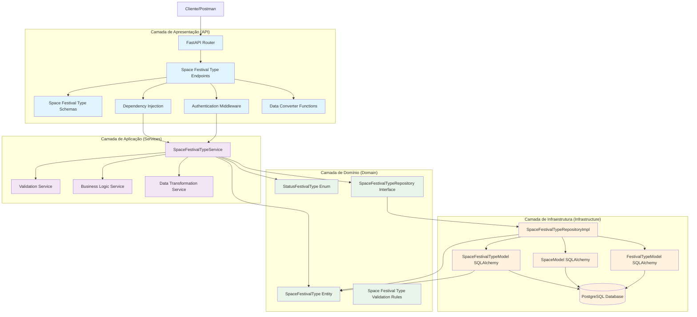

### **Arquitetura Implementada**

O endpoint space_festival_types implementa uma **arquitetura robusta para gerenciamento de relacionamentos N:N entre espaços e tipos de festivais** seguindo os princípios da **Clean Architecture**:

1. **Camada de Apresentação**: FastAPI com endpoints CRUD, busca especializada e operações em lote
2. **Camada de Aplicação**: SpaceFestivalTypeService com validações de dependências e conversão de dados
3. **Camada de Domínio**: Entidade SpaceFestivalType com enum StatusFestivalType e interface de repositório
4. **Camada de Infraestrutura**: Implementação de repositório com validações de existência

### **Características Principais**

- **CRUD Completo**: Operações de criação, leitura, atualização e exclusão
- **Relacionamento N:N**: Gerencia relacionamentos entre spaces e festival_types
- **Status Management**: Sistema de status com enum (CONTRATANDO, FECHADO, SUSPENSO, CANCELADO)
- **Busca Avançada**: Filtros por space, festival_type, combinação de ambos
- **Operações em Lote**: Exclusão de todos os relacionamentos por space ou festival_type
- **Validação de Dependências**: Verificação de existência de space e festival_type
- **Autenticação**: Todos os endpoints requerem autenticação
- **Conversão de Dados**: Funções específicas para conversão entre camadas

### **Endpoints Disponíveis**

#### **CRUD Básico:**
1. **POST /space-festival-types/** - Criar novo relacionamento
2. **GET /space-festival-types/{id}** - Buscar relacionamento por ID
3. **GET /space-festival-types/** - Listar todos os relacionamentos
4. **PUT /space-festival-types/{id}** - Atualizar relacionamento
5. **DELETE /space-festival-types/{id}** - Deletar relacionamento

#### **Operações Especiais:**
6. **PATCH /space-festival-types/{id}/status** - Atualizar apenas o status

#### **Busca Especializada:**
7. **GET /space-festival-types/space/{id}** - Festival types de um space
8. **GET /space-festival-types/festival-type/{id}** - Spaces de um festival type
9. **GET /space-festival-types/space/{id}/festival-type/{id}** - Relacionamento específico

#### **Exclusão em Lote:**
10. **DELETE /space-festival-types/space/{id}** - Deletar todos os relacionamentos de um space
11. **DELETE /space-festival-types/festival-type/{id}** - Deletar todos os relacionamentos de um festival type

### **Regras de Negócio Implementadas**

#### **Validações de Dependência:**
- **Space Exists**: Space deve existir antes de criar relacionamento
- **Festival Type Exists**: Festival type deve existir antes de criar relacionamento
- **Required Fields**: Campos obrigatórios (tema, descricao, data, horario)

#### **Status Management:**
- **Status Default**: Status padrão é CONTRATANDO
- **Status Validation**: Status deve ser um valor válido do enum
- **Status Update**: Operação específica para atualizar apenas o status

### **Validações Implementadas**

#### **Schema Validation:**
- **space_id**: Integer > 0 (obrigatório)
- **festival_type_id**: Integer > 0 (obrigatório)
- **tema**: String obrigatório
- **descricao**: String obrigatório
- **status**: StatusFestivalType enum (padrão: CONTRATANDO)
- **data**: DateTime obrigatório
- **horario**: String obrigatório
- **link_divulgacao**: String opcional
- **banner**: String opcional (path da imagem)

#### **Validações de Negócio:**
- **Space Validation**: Verificação de existência do space
- **Festival Type Validation**: Verificação de existência do festival type
- **Existence Validation**: Verificação de existência antes de operações

### **Estrutura de Dados**

#### **Entidade de Domínio:**
- **SpaceFestivalType**: Entidade complexa com relacionamentos e validações
- **StatusFestivalType**: Enum com valores CONTRATANDO, FECHADO, SUSPENSO, CANCELADO

#### **Schemas Pydantic:**
- **SpaceFestivalTypeBase**: Schema base com validações
- **SpaceFestivalTypeCreate**: Para criação de novos relacionamentos
- **SpaceFestivalTypeUpdate**: Para atualização (campos opcionais)
- **SpaceFestivalTypeStatusUpdate**: Para atualização específica de status
- **SpaceFestivalTypeResponse**: Para resposta básica
- **SpaceFestivalTypeListResponse**: Para resposta de lista

#### **Modelo SQLAlchemy:**
- **SpaceFestivalTypeModel**: Mapeamento para tabela space_festival_types
- **Constraints**: FK para spaces e festival_types, NOT NULL em campos obrigatórios
- **Índices**: Em id, space_id, festival_type_id, status
- **Relacionamentos**: Com spaces e festival_types

### **Campos Principais**

- **id**: Identificador único (INTEGER PRIMARY KEY)
- **space_id**: FK para spaces (INTEGER FK NOT NULL)
- **festival_type_id**: FK para festival_types (INTEGER FK NOT NULL)
- **tema**: Tema do festival (VARCHAR(200) NOT NULL)
- **descricao**: Descrição do festival (TEXT NOT NULL)
- **status**: Status do festival (ENUM NOT NULL DEFAULT CONTRATANDO)
- **link_divulgacao**: Link de divulgação (VARCHAR(500) NULL)
- **banner**: Path do banner (VARCHAR(500) NULL)
- **data**: Data do festival (TIMESTAMP NOT NULL)
- **horario**: Horário do festival (VARCHAR(50) NOT NULL)
- **created_at**: Timestamp de criação

### **Fluxos Especiais**

#### **Criação de Relacionamento:**
1. Validar schema de entrada
2. Verificar se space existe
3. Verificar se festival type existe
4. Criar entidade SpaceFestivalType
5. Persistir no banco de dados
6. Retornar SpaceFestivalTypeResponse

#### **Atualização de Status:**
1. Verificar se relacionamento existe
2. Validar novo status
3. Atualizar apenas o campo status
4. Retornar SpaceFestivalTypeResponse

#### **Busca por Critérios:**
1. Validar parâmetros de busca
2. Executar query filtrada
3. Converter resultados para entidades
4. Retornar SpaceFestivalTypeListResponse

#### **Exclusão em Lote:**
1. Executar DELETE com filtro
2. Retornar número de registros afetados
3. Confirmar sucesso da operação

### **Relacionamentos**

- **spaces**: Referenciado pela tabela space_festival_types (N:1)
- **festival_types**: Referenciado pela tabela space_festival_types (N:1)
- **profiles**: Relacionamento indireto através de spaces

### **Validação de Dependências**

- **Space Validation**: Verificação de existência do space antes de operações
- **Festival Type Validation**: Verificação de existência do festival type antes de operações
- **Profile Validation**: Relacionamento indireto através de space.profile_id

### **Tratamento de Erros**

- **400 Bad Request**: Dados inválidos, space/festival_type não encontrado
- **404 Not Found**: Relacionamento não encontrado
- **500 Internal Server Error**: Erros internos do servidor
- **Validação**: Mensagens de erro descritivas para cada validação

### **Otimizações**

- **Índices**: Em id, space_id, festival_type_id, status para consultas rápidas
- **Validação**: No nível de schema, domínio e aplicação
- **Transações**: Para operações de escrita
- **Relacionamentos**: Validação de existência antes de operações
- **Conversão**: Funções específicas para conversão entre camadas

### **Enum StatusFestivalType**

```python
class StatusFestivalType(Enum):
    CONTRATANDO = "CONTRATANDO"
    FECHADO = "FECHADO"
    SUSPENSO = "SUSPENSO"
    CANCELADO = "CANCELADO"
```

### **Operações SQL Principais**

- **INSERT**: Criar novo relacionamento
- **SELECT**: Buscar por ID, space_id, festival_type_id, combinações
- **UPDATE**: Atualizar relacionamento ou apenas status
- **DELETE**: Deletar relacionamento específico ou em lote

# Diagrama de Fluxo - Endpoint Space Festival Types

  

## Fluxo Detalhado da Arquitetura em Camadas

  



  

## Fluxo Detalhado por Operação

```mermaid

sequenceDiagram

participant C as Cliente

participant API as API Layer

participant Service as Space Festival Type Service

participant SpaceRepo as Space Repository

participant FestivalTypeRepo as Festival Type Repository

participant SpaceFestivalTypeRepo as Space Festival Type Repository

participant DB as Database

%% Criação de Space Festival Type

Note over C,DB: POST /space-festival-types/ - Criar Relacionamento

C->>API: POST /space-festival-types/ {space_id, festival_type_id, tema, descricao, data, horario, status}

API->>API: Validar SpaceFestivalTypeCreate schema

API->>Service: create_space_festival_type(space_festival_type_data)

%% Verificar se space existe

Service->>SpaceRepo: Verificar se space existe

SpaceRepo->>DB: SELECT * FROM spaces WHERE id = ?

DB-->>SpaceRepo: SpaceModel or None

alt Space não encontrado

SpaceRepo-->>Service: None

Service-->>API: ValueError("Espaço com ID X não encontrado")

API-->>C: 400 Bad Request

else Space encontrado

SpaceRepo-->>Service: SpaceModel

%% Verificar se festival_type existe

Service->>FestivalTypeRepo: Verificar se festival_type existe

FestivalTypeRepo->>DB: SELECT * FROM festival_types WHERE id = ?

DB-->>FestivalTypeRepo: FestivalTypeModel or None

alt Festival Type não encontrado

FestivalTypeRepo-->>Service: None

Service-->>API: ValueError("Tipo de festival com ID X não encontrado")

API-->>C: 400 Bad Request

else Festival Type encontrado

FestivalTypeRepo-->>Service: FestivalTypeModel

%% Criar relacionamento

Service->>Service: Criar SpaceFestivalType entity

Service->>SpaceFestivalTypeRepo: create(space_festival_type)

SpaceFestivalTypeRepo->>SpaceFestivalTypeRepo: Criar SpaceFestivalTypeModel

SpaceFestivalTypeRepo->>DB: INSERT INTO space_festival_types (space_id, festival_type_id, tema, descricao, status, data, horario) VALUES (...)

DB-->>SpaceFestivalTypeRepo: Created SpaceFestivalTypeModel com ID

SpaceFestivalTypeRepo->>SpaceFestivalTypeRepo: Converter para SpaceFestivalType entity

SpaceFestivalTypeRepo-->>Service: SpaceFestivalType entity

Service-->>API: SpaceFestivalType entity

API->>API: Converter para SpaceFestivalTypeResponse

API-->>C: 201 Created + SpaceFestivalTypeResponse

end

end

%% Listagem de Space Festival Types

Note over C,DB: GET /space-festival-types/ - Listar Relacionamentos

C->>API: GET /space-festival-types/

API->>Service: get_all_space_festival_types()

Service->>SpaceFestivalTypeRepo: get_all()

SpaceFestivalTypeRepo->>DB: SELECT * FROM space_festival_types

DB-->>SpaceFestivalTypeRepo: [SpaceFestivalTypeModel]

SpaceFestivalTypeRepo->>SpaceFestivalTypeRepo: Converter para [SpaceFestivalType entities]

SpaceFestivalTypeRepo-->>Service: [SpaceFestivalType entities]

Service-->>API: [SpaceFestivalType entities]

API->>API: Converter para SpaceFestivalTypeListResponse

API-->>C: 200 OK + SpaceFestivalTypeListResponse

%% Busca por Space ID

Note over C,DB: GET /space-festival-types/space/{id} - Festival Types por Space

C->>API: GET /space-festival-types/space/1

API->>Service: get_festival_types_by_space(1)

Service->>SpaceFestivalTypeRepo: get_by_space_id(1)

SpaceFestivalTypeRepo->>DB: SELECT * FROM space_festival_types WHERE space_id = 1

DB-->>SpaceFestivalTypeRepo: [SpaceFestivalTypeModel]

SpaceFestivalTypeRepo->>SpaceFestivalTypeRepo: Converter para [SpaceFestivalType entities]

SpaceFestivalTypeRepo-->>Service: [SpaceFestivalType entities]

Service-->>API: [SpaceFestivalType entities]

API->>API: Converter para SpaceFestivalTypeListResponse

API-->>C: 200 OK + SpaceFestivalTypeListResponse

%% Busca por Festival Type ID

Note over C,DB: GET /space-festival-types/festival-type/{id} - Spaces por Festival Type

C->>API: GET /space-festival-types/festival-type/2

API->>Service: get_spaces_by_festival_type(2)

Service->>SpaceFestivalTypeRepo: get_by_festival_type_id(2)

SpaceFestivalTypeRepo->>DB: SELECT * FROM space_festival_types WHERE festival_type_id = 2

DB-->>SpaceFestivalTypeRepo: [SpaceFestivalTypeModel]

SpaceFestivalTypeRepo->>SpaceFestivalTypeRepo: Converter para [SpaceFestivalType entities]

SpaceFestivalTypeRepo-->>Service: [SpaceFestivalType entities]

Service-->>API: [SpaceFestivalType entities]

API->>API: Converter para SpaceFestivalTypeListResponse

API-->>C: 200 OK + SpaceFestivalTypeListResponse

%% Busca por Space e Festival Type

Note over C,DB: GET /space-festival-types/space/{id}/festival-type/{id} - Relacionamento Específico

C->>API: GET /space-festival-types/space/1/festival-type/2

API->>Service: get_space_festival_types_by_space_and_festival_type(1, 2)

Service->>SpaceFestivalTypeRepo: get_by_space_and_festival_type(1, 2)

SpaceFestivalTypeRepo->>DB: SELECT * FROM space_festival_types WHERE space_id = 1 AND festival_type_id = 2

DB-->>SpaceFestivalTypeRepo: [SpaceFestivalTypeModel]

SpaceFestivalTypeRepo->>SpaceFestivalTypeRepo: Converter para [SpaceFestivalType entities]

SpaceFestivalTypeRepo-->>Service: [SpaceFestivalType entities]

Service-->>API: [SpaceFestivalType entities]

API->>API: Converter para SpaceFestivalTypeListResponse

API-->>C: 200 OK + SpaceFestivalTypeListResponse

%% Busca por ID

Note over C,DB: GET /space-festival-types/{id} - Buscar por ID

C->>API: GET /space-festival-types/1

API->>Service: get_space_festival_type_by_id(1)

Service->>SpaceFestivalTypeRepo: get_by_id(1)

SpaceFestivalTypeRepo->>DB: SELECT * FROM space_festival_types WHERE id = 1

DB-->>SpaceFestivalTypeRepo: SpaceFestivalTypeModel or None

alt Relacionamento encontrado

SpaceFestivalTypeRepo->>SpaceFestivalTypeRepo: Converter para SpaceFestivalType entity

SpaceFestivalTypeRepo-->>Service: SpaceFestivalType entity

Service-->>API: SpaceFestivalType entity

API->>API: Converter para SpaceFestivalTypeResponse

API-->>C: 200 OK + SpaceFestivalTypeResponse

else Relacionamento não encontrado

SpaceFestivalTypeRepo-->>Service: None

Service-->>API: None

API-->>C: 404 Not Found

end

%% Atualização

Note over C,DB: PUT /space-festival-types/{id} - Atualizar Relacionamento

C->>API: PUT /space-festival-types/1 {tema: "Novo Tema", descricao: "Nova Descrição"}

API->>API: Validar SpaceFestivalTypeUpdate schema

API->>Service: update_space_festival_type(1, space_festival_type_data)

%% Verificar existência

Service->>SpaceFestivalTypeRepo: get_by_id(1)

SpaceFestivalTypeRepo->>DB: SELECT * FROM space_festival_types WHERE id = 1

DB-->>SpaceFestivalTypeRepo: SpaceFestivalTypeModel or None

alt Relacionamento não encontrado

SpaceFestivalTypeRepo-->>Service: None

Service-->>API: None

API-->>C: 404 Not Found

else Relacionamento encontrado

SpaceFestivalTypeRepo->>SpaceFestivalTypeRepo: Converter para SpaceFestivalType entity

SpaceFestivalTypeRepo-->>Service: SpaceFestivalType entity

Service->>Service: Atualizar campos fornecidos

Service->>SpaceFestivalTypeRepo: update(1, updated_space_festival_type)

SpaceFestivalTypeRepo->>DB: UPDATE space_festival_types SET tema = ?, descricao = ?, updated_at = NOW() WHERE id = 1

DB-->>SpaceFestivalTypeRepo: Updated SpaceFestivalTypeModel

SpaceFestivalTypeRepo->>SpaceFestivalTypeRepo: Converter para SpaceFestivalType entity

SpaceFestivalTypeRepo-->>Service: SpaceFestivalType entity

Service-->>API: SpaceFestivalType entity

API->>API: Converter para SpaceFestivalTypeResponse

API-->>C: 200 OK + SpaceFestivalTypeResponse

end

%% Atualização de Status

Note over C,DB: PATCH /space-festival-types/{id}/status - Atualizar Status

C->>API: PATCH /space-festival-types/1/status {status: "FECHADO"}

API->>API: Validar SpaceFestivalTypeStatusUpdate schema

API->>Service: update_space_festival_type_status(1, status)

Service->>SpaceFestivalTypeRepo: update_status(1, status)

SpaceFestivalTypeRepo->>DB: SELECT * FROM space_festival_types WHERE id = 1

DB-->>SpaceFestivalTypeRepo: SpaceFestivalTypeModel or None

alt Relacionamento não encontrado

SpaceFestivalTypeRepo-->>Service: None

Service-->>API: None

API-->>C: 404 Not Found

else Relacionamento encontrado

SpaceFestivalTypeRepo->>DB: UPDATE space_festival_types SET status = 'FECHADO' WHERE id = 1

DB-->>SpaceFestivalTypeRepo: Updated SpaceFestivalTypeModel

SpaceFestivalTypeRepo->>SpaceFestivalTypeRepo: Converter para SpaceFestivalType entity

SpaceFestivalTypeRepo-->>Service: SpaceFestivalType entity

Service-->>API: SpaceFestivalType entity

API->>API: Converter para SpaceFestivalTypeResponse

API-->>C: 200 OK + SpaceFestivalTypeResponse

end

%% Exclusão por ID

Note over C,DB: DELETE /space-festival-types/{id} - Deletar Relacionamento

C->>API: DELETE /space-festival-types/1

API->>Service: delete_space_festival_type(1)

Service->>SpaceFestivalTypeRepo: delete(1)

SpaceFestivalTypeRepo->>DB: SELECT * FROM space_festival_types WHERE id = 1

DB-->>SpaceFestivalTypeRepo: SpaceFestivalTypeModel or None

alt Relacionamento não encontrado

SpaceFestivalTypeRepo-->>Service: false

Service-->>API: false

API-->>C: 404 Not Found

else Relacionamento encontrado

SpaceFestivalTypeRepo->>DB: DELETE FROM space_festival_types WHERE id = 1

DB-->>SpaceFestivalTypeRepo: Confirmação

SpaceFestivalTypeRepo-->>Service: true

Service-->>API: true

API-->>C: 200 OK + {"message": "Relacionamento deletado com sucesso"}

end

%% Exclusão por Space ID

Note over C,DB: DELETE /space-festival-types/space/{id} - Deletar por Space

C->>API: DELETE /space-festival-types/space/1

API->>Service: delete_all_space_festival_types_by_space(1)

Service->>SpaceFestivalTypeRepo: delete_by_space_id(1)

SpaceFestivalTypeRepo->>DB: DELETE FROM space_festival_types WHERE space_id = 1

DB-->>SpaceFestivalTypeRepo: Número de registros deletados

SpaceFestivalTypeRepo-->>Service: true/false

Service-->>API: true/false

API-->>C: 200 OK + {"message": "Todos os relacionamentos do espaço deletados"}

%% Exclusão por Festival Type ID

Note over C,DB: DELETE /space-festival-types/festival-type/{id} - Deletar por Festival Type

C->>API: DELETE /space-festival-types/festival-type/2

API->>Service: delete_all_space_festival_types_by_festival_type(2)

Service->>SpaceFestivalTypeRepo: delete_by_festival_type_id(2)

SpaceFestivalTypeRepo->>DB: DELETE FROM space_festival_types WHERE festival_type_id = 2

DB-->>SpaceFestivalTypeRepo: Número de registros deletados

SpaceFestivalTypeRepo-->>Service: true/false

Service-->>API: true/false

API-->>C: 200 OK + {"message": "Todos os relacionamentos do tipo de festival deletados"}

```

  



  

## Arquitetura de Status e Validações

  

```mermaid

graph TD

subgraph "StatusFestivalType Enum"

ContratandoStatus[CONTRATANDO = "CONTRATANDO"]

FechadoStatus[FECHADO = "FECHADO"]

SuspensoStatus[SUSPENSO = "SUSPENSO"]

CanceladoStatus[CANCELADO = "CANCELADO"]

end

subgraph "Validações"

SpaceIdValidation[Space ID Validation]

FestivalTypeIdValidation[Festival Type ID Validation]

TemaValidation[Tema Validation]

DescricaoValidation[Descrição Validation]

HorarioValidation[Horário Validation]

StatusValidation[Status Validation]

end

subgraph "Regras de Negócio"

SpaceExistsRule[Space deve existir]

FestivalTypeExistsRule[Festival Type deve existir]

RequiredFieldsRule[Campos obrigatórios]

StatusDefaultRule[Status padrão CONTRATANDO]

end

subgraph "Operações"

CreateOp[Criar Relacionamento]

ReadOp[Ler Relacionamento]

ReadAllOp[Listar Relacionamentos]

UpdateOp[Atualizar Relacionamento]

UpdateStatusOp[Atualizar Status]

DeleteOp[Deletar Relacionamento]

DeleteBySpaceOp[Deletar por Space]

DeleteByFestivalTypeOp[Deletar por Festival Type]

end

ContratandoStatus --> StatusValidation

FechadoStatus --> StatusValidation

SuspensoStatus --> StatusValidation

CanceladoStatus --> StatusValidation

SpaceIdValidation --> SpaceExistsRule

FestivalTypeIdValidation --> FestivalTypeExistsRule

TemaValidation --> RequiredFieldsRule

DescricaoValidation --> RequiredFieldsRule

HorarioValidation --> RequiredFieldsRule

StatusValidation --> StatusDefaultRule

SpaceExistsRule --> CreateOp

FestivalTypeExistsRule --> CreateOp

RequiredFieldsRule --> CreateOp

StatusDefaultRule --> CreateOp

CreateOp --> ReadOp

CreateOp --> ReadAllOp

CreateOp --> UpdateOp

CreateOp --> UpdateStatusOp

CreateOp --> DeleteOp

CreateOp --> DeleteBySpaceOp

CreateOp --> DeleteByFestivalTypeOp

%% Estilos

classDef status fill:#ffebee

classDef validation fill:#e3f2fd

classDef rule fill:#e8f5e8

classDef operation fill:#fff3e0

class ContratandoStatus,FechadoStatus,SuspensoStatus,CanceladoStatus status

class SpaceIdValidation,FestivalTypeIdValidation,TemaValidation,DescricaoValidation,HorarioValidation,StatusValidation validation

class SpaceExistsRule,FestivalTypeExistsRule,RequiredFieldsRule,StatusDefaultRule rule

class CreateOp,ReadOp,ReadAllOp,UpdateOp,UpdateStatusOp,DeleteOp,DeleteBySpaceOp,DeleteByFestivalTypeOp operation

```

  

## Estrutura de Dados e Modelo de Banco

  

```mermaid

graph TD

subgraph "Entidade de Domínio"

SpaceFestivalTypeEntity[SpaceFestivalType Entity]

IdField[id: Optional[int]]

SpaceIdField[space_id: int]

FestivalTypeIdField[festival_type_id: int]

TemaField[tema: str]

DescricaoField[descricao: str]

StatusField[status: StatusFestivalType]

LinkDivulgacaoField[link_divulgacao: Optional[str]]

BannerField[banner: Optional[str]]

DataField[data: datetime]

HorarioField[horario: str]

CreatedAtField[created_at: Optional[datetime]]

end

subgraph "Enum StatusFestivalType"

StatusFestivalTypeEnum[StatusFestivalType Enum]

ContratandoEnum[CONTRATANDO]

FechadoEnum[FECHADO]

SuspensoEnum[SUSPENSO]

CanceladoEnum[CANCELADO]

end

subgraph "Schema Pydantic"

SpaceFestivalTypeBase[SpaceFestivalTypeBase]

SpaceFestivalTypeCreate[SpaceFestivalTypeCreate]

SpaceFestivalTypeUpdate[SpaceFestivalTypeUpdate]

SpaceFestivalTypeStatusUpdate[SpaceFestivalTypeStatusUpdate]

SpaceFestivalTypeResponse[SpaceFestivalTypeResponse]

SpaceFestivalTypeListResponse[SpaceFestivalTypeListResponse]

end

subgraph "Modelo SQLAlchemy"

SpaceFestivalTypeModel[SpaceFestivalTypeModel]

IdColumn[id: INTEGER PRIMARY KEY]

SpaceIdColumn[space_id: INTEGER FK NOT NULL]

FestivalTypeIdColumn[festival_type_id: INTEGER FK NOT NULL]

TemaColumn[tema: VARCHAR(200) NOT NULL]

DescricaoColumn[descricao: TEXT NOT NULL]

StatusColumn[status: ENUM NOT NULL DEFAULT CONTRATANDO]

LinkDivulgacaoColumn[link_divulgacao: VARCHAR(500) NULL]

BannerColumn[banner: VARCHAR(500) NULL]

DataColumn[data: TIMESTAMP NOT NULL]

HorarioColumn[horario: VARCHAR(50) NOT NULL]

CreatedAtColumn[created_at: TIMESTAMP DEFAULT NOW()]

end

subgraph "Tabela do Banco"

SpaceFestivalTypesTable[(space_festival_types)]

IdTableField[id: INTEGER PRIMARY KEY]

SpaceIdTableField[space_id: INTEGER FK NOT NULL]

FestivalTypeIdTableField[festival_type_id: INTEGER FK NOT NULL]

TemaTableField[tema: VARCHAR(200) NOT NULL]

DescricaoTableField[descricao: TEXT NOT NULL]

StatusTableField[status: ENUM NOT NULL DEFAULT CONTRATANDO]

LinkDivulgacaoTableField[link_divulgacao: VARCHAR(500) NULL]

BannerTableField[banner: VARCHAR(500) NULL]

DataTableField[data: TIMESTAMP NOT NULL]

HorarioTableField[horario: VARCHAR(50) NOT NULL]

CreatedAtTableField[created_at: TIMESTAMP DEFAULT NOW()]

end

subgraph "Constraints"

PrimaryKey[PRIMARY KEY (id)]

ForeignKeySpace[FOREIGN KEY (space_id) REFERENCES spaces(id)]

ForeignKeyFestivalType[FOREIGN KEY (festival_type_id) REFERENCES festival_types(id)]

NotNullFields[NOT NULL (space_id, festival_type_id, tema, descricao, status, data, horario)]

end

subgraph "Índices"

IndexId[INDEX (id)]

IndexSpaceId[INDEX (space_id)]

IndexFestivalTypeId[INDEX (festival_type_id)]

IndexStatus[INDEX (status)]

end

SpaceFestivalTypeEntity --> IdField

SpaceFestivalTypeEntity --> SpaceIdField

SpaceFestivalTypeEntity --> FestivalTypeIdField

SpaceFestivalTypeEntity --> TemaField

SpaceFestivalTypeEntity --> DescricaoField

SpaceFestivalTypeEntity --> StatusField

SpaceFestivalTypeEntity --> LinkDivulgacaoField

SpaceFestivalTypeEntity --> BannerField

SpaceFestivalTypeEntity --> DataField

SpaceFestivalTypeEntity --> HorarioField

SpaceFestivalTypeEntity --> CreatedAtField

StatusFestivalTypeEnum --> ContratandoEnum

StatusFestivalTypeEnum --> FechadoEnum

StatusFestivalTypeEnum --> SuspensoEnum

StatusFestivalTypeEnum --> CanceladoEnum

StatusField --> StatusFestivalTypeEnum

SpaceFestivalTypeBase --> SpaceIdField

SpaceFestivalTypeBase --> FestivalTypeIdField

SpaceFestivalTypeBase --> TemaField

SpaceFestivalTypeBase --> DescricaoField

SpaceFestivalTypeBase --> StatusField

SpaceFestivalTypeBase --> LinkDivulgacaoField

SpaceFestivalTypeBase --> BannerField

SpaceFestivalTypeBase --> DataField

SpaceFestivalTypeBase --> HorarioField

SpaceFestivalTypeCreate --> SpaceFestivalTypeBase

SpaceFestivalTypeUpdate --> TemaField

SpaceFestivalTypeUpdate --> DescricaoField

SpaceFestivalTypeUpdate --> StatusField

SpaceFestivalTypeUpdate --> LinkDivulgacaoField

SpaceFestivalTypeUpdate --> BannerField

SpaceFestivalTypeUpdate --> DataField

SpaceFestivalTypeUpdate --> HorarioField

SpaceFestivalTypeStatusUpdate --> StatusField

SpaceFestivalTypeResponse --> SpaceFestivalTypeBase

SpaceFestivalTypeResponse --> IdField

SpaceFestivalTypeResponse --> CreatedAtField

SpaceFestivalTypeListResponse --> SpaceFestivalTypeResponse

SpaceFestivalTypeModel --> IdColumn

SpaceFestivalTypeModel --> SpaceIdColumn

SpaceFestivalTypeModel --> FestivalTypeIdColumn

SpaceFestivalTypeModel --> TemaColumn

SpaceFestivalTypeModel --> DescricaoColumn

SpaceFestivalTypeModel --> StatusColumn

SpaceFestivalTypeModel --> LinkDivulgacaoColumn

SpaceFestivalTypeModel --> BannerColumn

SpaceFestivalTypeModel --> DataColumn

SpaceFestivalTypeModel --> HorarioColumn

SpaceFestivalTypeModel --> CreatedAtColumn

IdColumn --> IndexId

SpaceIdColumn --> IndexSpaceId

FestivalTypeIdColumn --> IndexFestivalTypeId

StatusColumn --> IndexStatus

SpaceIdColumn --> ForeignKeySpace

FestivalTypeIdColumn --> ForeignKeyFestivalType

SpaceFestivalTypeModel --> SpaceFestivalTypesTable

IdColumn --> IdTableField

SpaceIdColumn --> SpaceIdTableField

FestivalTypeIdColumn --> FestivalTypeIdTableField

TemaColumn --> TemaTableField

DescricaoColumn --> DescricaoTableField

StatusColumn --> StatusTableField

LinkDivulgacaoColumn --> LinkDivulgacaoTableField

BannerColumn --> BannerTableField

DataColumn --> DataTableField

HorarioColumn --> HorarioTableField

CreatedAtColumn --> CreatedAtTableField

IdTableField --> PrimaryKey

SpaceIdTableField --> ForeignKeySpace

FestivalTypeIdTableField --> ForeignKeyFestivalType

IdTableField --> IndexId

SpaceIdTableField --> IndexSpaceId

FestivalTypeIdTableField --> IndexFestivalTypeId

StatusTableField --> IndexStatus

%% Estilos

classDef entity fill:#e8f5e8

classDef enum fill:#e1f5fe

classDef schema fill:#f3e5f5

classDef model fill:#fff3e0

classDef table fill:#ffebee

classDef constraint fill:#f1f8e9

classDef index fill:#e0f2f1

class SpaceFestivalTypeEntity,IdField,SpaceIdField,FestivalTypeIdField,TemaField,DescricaoField,StatusField,LinkDivulgacaoField,BannerField,DataField,HorarioField,CreatedAtField entity

class StatusFestivalTypeEnum,ContratandoEnum,FechadoEnum,SuspensoEnum,CanceladoEnum enum

class SpaceFestivalTypeBase,SpaceFestivalTypeCreate,SpaceFestivalTypeUpdate,SpaceFestivalTypeStatusUpdate,SpaceFestivalTypeResponse,SpaceFestivalTypeListResponse schema

class SpaceFestivalTypeModel,IdColumn,SpaceIdColumn,FestivalTypeIdColumn,TemaColumn,DescricaoColumn,StatusColumn,LinkDivulgacaoColumn,BannerColumn,DataColumn,HorarioColumn,CreatedAtColumn model

class SpaceFestivalTypesTable,IdTableField,SpaceIdTableField,FestivalTypeIdTableField,TemaTableField,DescricaoTableField,StatusTableField,LinkDivulgacaoTableField,BannerTableField,DataTableField,HorarioTableField,CreatedAtTableField table

class PrimaryKey,ForeignKeySpace,ForeignKeyFestivalType,NotNullFields constraint

class IndexId,IndexSpaceId,IndexFestivalTypeId,IndexStatus index

```

  

## Endpoints e Operações CRUD

  

```mermaid

graph LR

subgraph "Endpoints CRUD"

CreateEndpoint[POST /space-festival-types/]

GetByIdEndpoint[GET /space-festival-types/{id}]

GetAllEndpoint[GET /space-festival-types/]

UpdateEndpoint[PUT /space-festival-types/{id}]

UpdateStatusEndpoint[PATCH /space-festival-types/{id}/status]

DeleteEndpoint[DELETE /space-festival-types/{id}]

end

subgraph "Endpoints de Busca"

GetBySpaceEndpoint[GET /space-festival-types/space/{id}]

GetByFestivalTypeEndpoint[GET /space-festival-types/festival-type/{id}]

GetBySpaceAndFestivalTypeEndpoint[GET /space-festival-types/space/{id}/festival-type/{id}]

end

subgraph "Endpoints de Exclusão em Lote"

DeleteBySpaceEndpoint[DELETE /space-festival-types/space/{id}]

DeleteByFestivalTypeEndpoint[DELETE /space-festival-types/festival-type/{id}]

end

subgraph "Operações"

CreateOp[Criar Relacionamento]

ReadOp[Ler Relacionamento]

ReadAllOp[Listar Relacionamentos]

UpdateOp[Atualizar Relacionamento]

UpdateStatusOp[Atualizar Status]

DeleteOp[Deletar Relacionamento]

SearchOp[Buscar por Critérios]

BulkDeleteOp[Deletar em Lote]

end

subgraph "Validações"

SpaceValidation[Space Validation]

FestivalTypeValidation[Festival Type Validation]

SchemaValidation[Schema Validation]

ExistenceValidation[Existence Validation]

end

CreateEndpoint --> CreateOp

GetByIdEndpoint --> ReadOp

GetAllEndpoint --> ReadAllOp

UpdateEndpoint --> UpdateOp

UpdateStatusEndpoint --> UpdateStatusOp

DeleteEndpoint --> DeleteOp

GetBySpaceEndpoint --> SearchOp

GetByFestivalTypeEndpoint --> SearchOp

GetBySpaceAndFestivalTypeEndpoint --> SearchOp

DeleteBySpaceEndpoint --> BulkDeleteOp

DeleteByFestivalTypeEndpoint --> BulkDeleteOp

CreateOp --> SpaceValidation

CreateOp --> FestivalTypeValidation

CreateOp --> SchemaValidation

UpdateOp --> SchemaValidation

UpdateOp --> ExistenceValidation

UpdateStatusOp --> ExistenceValidation

DeleteOp --> ExistenceValidation

SearchOp --> ExistenceValidation

%% Estilos

classDef crudEndpoint fill:#e1f5fe

classDef searchEndpoint fill:#f3e5f5

classDef bulkEndpoint fill:#e8f5e8

classDef operation fill:#fff3e0

classDef validation fill:#ffebee

class CreateEndpoint,GetByIdEndpoint,GetAllEndpoint,UpdateEndpoint,UpdateStatusEndpoint,DeleteEndpoint crudEndpoint

class GetBySpaceEndpoint,GetByFestivalTypeEndpoint,GetBySpaceAndFestivalTypeEndpoint searchEndpoint

class DeleteBySpaceEndpoint,DeleteByFestivalTypeEndpoint bulkEndpoint

class CreateOp,ReadOp,ReadAllOp,UpdateOp,UpdateStatusOp,DeleteOp,SearchOp,BulkDeleteOp operation

class SpaceValidation,FestivalTypeValidation,SchemaValidation,ExistenceValidation validation

```

  

## Relacionamentos e Dependências

  

```mermaid

graph TD

subgraph "Entidades Relacionadas"

SpaceFestivalTypeEntity[Space Festival Type Entity]

SpaceEntity[Space Entity]

FestivalTypeEntity[Festival Type Entity]

ProfileEntity[Profile Entity]

end

subgraph "Relacionamentos"

SpaceFestivalTypeToSpace[Space Festival Type → Space (N:1)]

SpaceFestivalTypeToFestivalType[Space Festival Type → Festival Type (N:1)]

SpaceToProfile[Space → Profile (N:1)]

end

subgraph "Tabelas do Banco"

SpaceFestivalTypesTable[(space_festival_types)]

SpacesTable[(spaces)]

FestivalTypesTable[(festival_types)]

ProfilesTable[(profiles)]

end

subgraph "Foreign Keys"

SpaceIdFK[space_id → spaces.id]

FestivalTypeIdFK[festival_type_id → festival_types.id]

SpaceProfileFK[space.profile_id → profiles.id]

end

subgraph "Validações de Dependência"

SpaceExistsValidation[Validar se Space existe]

FestivalTypeExistsValidation[Validar se Festival Type existe]

ProfileExistsValidation[Validar se Profile existe]

end

SpaceFestivalTypeEntity --> SpaceFestivalTypeToSpace

SpaceFestivalTypeEntity --> SpaceFestivalTypeToFestivalType

SpaceEntity --> SpaceFestivalTypeToSpace

FestivalTypeEntity --> SpaceFestivalTypeToFestivalType

SpaceEntity --> SpaceToProfile

ProfileEntity --> SpaceToProfile

SpaceFestivalTypesTable --> SpacesTable

SpaceFestivalTypesTable --> FestivalTypesTable

SpacesTable --> ProfilesTable

SpaceIdFK --> SpacesTable

FestivalTypeIdFK --> FestivalTypesTable

SpaceProfileFK --> ProfilesTable

SpaceExistsValidation --> SpaceEntity

FestivalTypeExistsValidation --> FestivalTypeEntity

ProfileExistsValidation --> ProfileEntity

%% Estilos

classDef entity fill:#e8f5e8

classDef relationship fill:#e1f5fe

classDef table fill:#f3e5f5

classDef fk fill:#fff3e0

classDef validation fill:#ffebee

class SpaceFestivalTypeEntity,SpaceEntity,FestivalTypeEntity,ProfileEntity entity

class SpaceFestivalTypeToSpace,SpaceFestivalTypeToFestivalType,SpaceToProfile relationship

class SpaceFestivalTypesTable,SpacesTable,FestivalTypesTable,ProfilesTable table

class SpaceIdFK,FestivalTypeIdFK,SpaceProfileFK fk

class SpaceExistsValidation,FestivalTypeExistsValidation,ProfileExistsValidation validation

```

  

## Fluxo de Conversão de Dados

```mermaid

graph TD

subgraph "Camada de Apresentação"

RequestSchema[SpaceFestivalTypeCreate/Update]

ResponseSchema[SpaceFestivalTypeResponse]

ListResponseSchema[SpaceFestivalTypeListResponse]

end

subgraph "Camada de Aplicação"

ServiceLayer[SpaceFestivalTypeService]

EntityCreation[Entity Creation]

ResponseCreation[Response Creation]

ValidationLayer[Validation Layer]

end

subgraph "Camada de Domínio"

DomainEntity[SpaceFestivalType Entity]

StatusEnum[StatusFestivalType Enum]

end

subgraph "Camada de Infraestrutura"

RepositoryLayer[SpaceFestivalTypeRepositoryImpl]

DatabaseModel[SpaceFestivalTypeModel]

DatabaseTable[(space_festival_types)]

end

subgraph "Conversões"

SchemaToEntity[Schema → Entity]

EntityToModel[Entity → Model]

ModelToEntity[Model → Entity]

EntityToResponse[Entity → Response]

EntityToListResponse[Entity → List Response]

end

subgraph "Validações"

SpaceValidation[Space Validation]

FestivalTypeValidation[Festival Type Validation]

SchemaValidation[Schema Validation]

end

RequestSchema --> SchemaToEntity

SchemaToEntity --> DomainEntity

DomainEntity --> EntityToModel

EntityToModel --> DatabaseModel

DatabaseModel --> DatabaseTable

DatabaseTable --> DatabaseModel

DatabaseModel --> ModelToEntity

ModelToEntity --> DomainEntity

DomainEntity --> EntityToResponse

DomainEntity --> EntityToListResponse

EntityToResponse --> ResponseSchema

EntityToListResponse --> ListResponseSchema

ServiceLayer --> EntityCreation

ServiceLayer --> ResponseCreation

ServiceLayer --> ValidationLayer

RepositoryLayer --> EntityToModel

RepositoryLayer --> ModelToEntity

ValidationLayer --> SpaceValidation

ValidationLayer --> FestivalTypeValidation

ValidationLayer --> SchemaValidation

%% Estilos

classDef presentation fill:#e1f5fe

classDef application fill:#f3e5f5

classDef domain fill:#e8f5e8

classDef infrastructure fill:#fff3e0

classDef conversion fill:#ffebee

classDef validation fill:#f1f8e9

class RequestSchema,ResponseSchema,ListResponseSchema presentation

class ServiceLayer,EntityCreation,ResponseCreation,ValidationLayer application

class DomainEntity,StatusEnum domain

class RepositoryLayer,DatabaseModel,DatabaseTable infrastructure

class SchemaToEntity,EntityToModel,ModelToEntity,EntityToResponse,EntityToListResponse conversion

class SpaceValidation,FestivalTypeValidation,SchemaValidation validation

```

  

