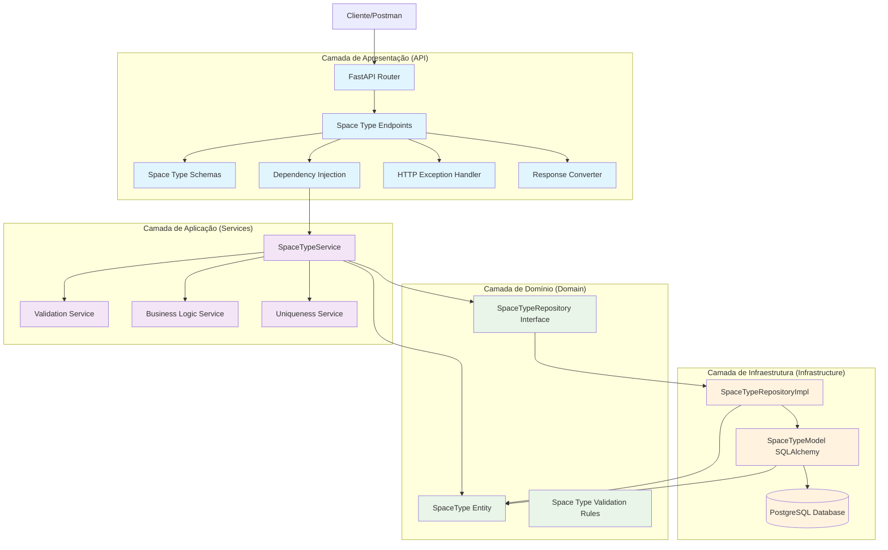
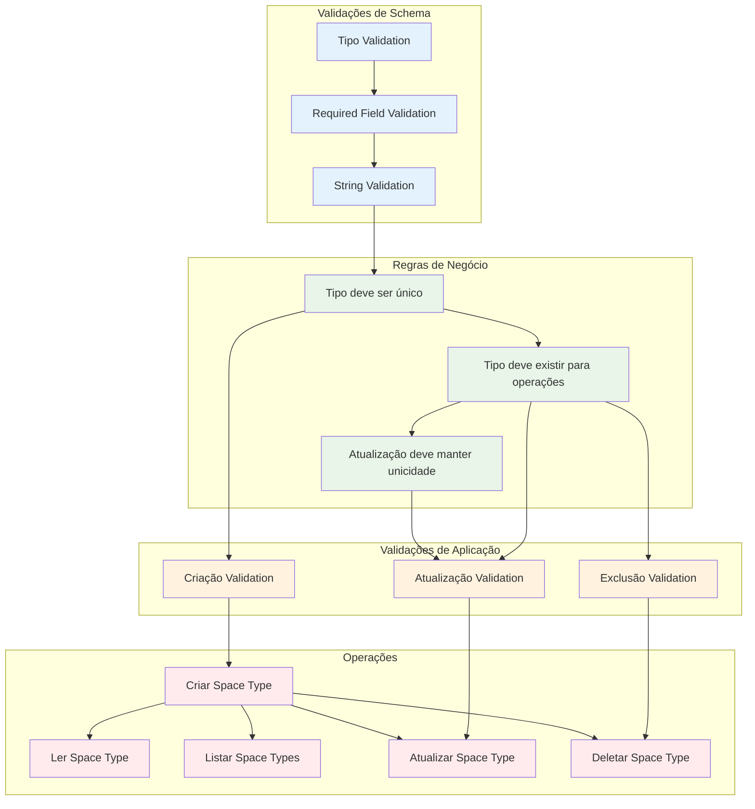

### **Arquitetura Implementada**

O endpoint space_types implementa uma **arquitetura simples e eficiente para gerenciamento de tipos de espaços** seguindo os princípios da **Clean Architecture**:

1. **Camada de Apresentação**: FastAPI com endpoints CRUD básicos e paginação
2. **Camada de Aplicação**: SpaceTypeService com validações de unicidade e regras de negócio
3. **Camada de Domínio**: Entidade SpaceType simples e interface de repositório
4. **Camada de Infraestrutura**: Implementação de repositório com operações SQL básicas

### **Características Principais**

- **CRUD Completo**: Operações de criação, leitura, atualização e exclusão
- **Validação de Unicidade**: Garantia de que cada tipo de espaço seja único
- **Paginação**: Suporte a skip e limit para listagem
- **Simplicidade**: Estrutura simples e direta
- **Performance**: Índices em id e tipo para consultas rápidas
- **Integridade**: Constraints de unicidade e NOT NULL no banco

### **Endpoints Disponíveis**

#### **CRUD Básico:**
1. **POST /space-types/** - Criar novo tipo de espaço
2. **GET /space-types/{id}** - Buscar tipo por ID
3. **GET /space-types/** - Listar todos os tipos (com paginação)
4. **PUT /space-types/{id}** - Atualizar tipo de espaço
5. **DELETE /space-types/{id}** - Deletar tipo de espaço

### **Regras de Negócio Implementadas**

#### **Validações de Unicidade:**
- **Tipo Único**: Cada tipo de espaço deve ser único no sistema
- **Verificação na Criação**: Não permite criar tipos duplicados
- **Verificação na Atualização**: Permite atualizar o próprio registro, mas não para um tipo já existente

#### **Validações de Existência:**
- **Existência para Atualização**: Tipo deve existir para ser atualizado
- **Existência para Exclusão**: Tipo deve existir para ser deletado
- **Existência para Leitura**: Retorna 404 se tipo não encontrado

### **Validações Implementadas**

#### **Schema Validation:**
- **tipo**: String obrigatório (validado pelo Pydantic)
- **id**: Integer para operações de busca/atualização/exclusão

#### **Validações de Negócio:**
- **Uniqueness Validation**: Verificação de unicidade do tipo
- **Existence Validation**: Verificação de existência antes de operações
- **String Validation**: Validação de tipo de dados

### **Estrutura de Dados**

#### **Entidade de Domínio:**
- **SpaceType**: Entidade simples com id, tipo, created_at, updated_at

#### **Schemas Pydantic:**
- **SpaceTypeBase**: Schema base com campo tipo
- **SpaceTypeCreate**: Para criação de novos tipos
- **SpaceTypeUpdate**: Para atualização de tipos
- **SpaceTypeResponse**: Para resposta com todos os campos

#### **Modelo SQLAlchemy:**
- **SpaceTypeModel**: Mapeamento para tabela space_types
- **Constraints**: UNIQUE em tipo, NOT NULL em tipo
- **Índices**: Em id e tipo
- **Timestamps**: created_at e updated_at automáticos

### **Campos Principais**

- **id**: Identificador único (INTEGER PRIMARY KEY)
- **tipo**: Tipo do espaço (VARCHAR UNIQUE NOT NULL)
- **created_at**: Timestamp de criação (TIMESTAMP DEFAULT NOW())
- **updated_at**: Timestamp de atualização (TIMESTAMP DEFAULT NOW() ON UPDATE NOW())

### **Fluxos Especiais**

#### **Criação de Tipo:**
1. Validar schema de entrada
2. Verificar se tipo já existe
3. Se não existe, criar novo tipo
4. Se existe, retornar erro 400
5. Retornar SpaceTypeResponse

#### **Atualização de Tipo:**
1. Verificar se tipo existe
2. Verificar se novo tipo já existe (excluindo o próprio)
3. Se não existe conflito, atualizar
4. Se existe conflito, retornar erro 400
5. Retornar SpaceTypeResponse

#### **Listagem com Paginação:**
1. Aplicar skip e limit
2. Executar query paginada
3. Converter resultados para entidades
4. Retornar lista de SpaceTypeResponse

#### **Exclusão:**
1. Verificar se tipo existe
2. Se existe, deletar e retornar sucesso
3. Se não existe, retornar 404

### **Relacionamentos**

- **spaces**: Referenciado pela tabela spaces através de space_type_id (N:1)
- **profiles**: Relacionamento indireto através de spaces

### **Validação de Dependências**

- **Space Type Validation**: Verificação de existência do space_type antes de operações em spaces
- **Profile Validation**: Relacionamento indireto através de space.profile_id

### **Tratamento de Erros**

- **400 Bad Request**: Tipo duplicado, dados inválidos
- **404 Not Found**: Tipo não encontrado
- **500 Internal Server Error**: Erros internos do servidor
- **Validação**: Mensagens de erro descritivas para cada validação

### **Otimizações**

- **Índices**: Em id e tipo para consultas rápidas
- **Constraints**: UNIQUE e NOT NULL no banco
- **Paginação**: Para listagens grandes
- **Validação**: No nível de schema e aplicação
- **Conversão**: Funções específicas para conversão entre camadas

### **Operações SQL Principais**

- **INSERT**: Criar novo tipo (com verificação de unicidade)
- **SELECT**: Buscar por ID, tipo, ou listar com paginação
- **UPDATE**: Atualizar tipo (com verificação de unicidade)
- **DELETE**: Deletar tipo específico

### **Parâmetros de Paginação**

- **skip**: Número de registros para pular (padrão: 0)
- **limit**: Número máximo de registros (padrão: 100)

# Diagrama de Fluxo - Endpoint Space Types

  

## Fluxo Detalhado da Arquitetura em Camadas

  



  

## Fluxo Detalhado por Operação

```mermaid

sequenceDiagram

participant C as Cliente

participant API as API Layer

participant Service as Space Type Service

participant SpaceTypeRepo as Space Type Repository

participant DB as Database

%% Criação de Space Type

Note over C,DB: POST /space-types/ - Criar Tipo de Espaço

C->>API: POST /space-types/ {tipo: "Bar"}

API->>API: Validar SpaceTypeCreate schema

API->>Service: create_space_type("Bar")

%% Verificar unicidade

Service->>SpaceTypeRepo: get_by_tipo("Bar")

SpaceTypeRepo->>DB: SELECT * FROM space_types WHERE tipo = 'Bar'

DB-->>SpaceTypeRepo: SpaceTypeModel or None

alt Tipo já existe

SpaceTypeRepo-->>Service: SpaceType entity

Service-->>API: ValueError("SpaceType with tipo 'Bar' already exists")

API-->>C: 400 Bad Request

else Tipo não existe

SpaceTypeRepo-->>Service: None

%% Criar novo tipo

Service->>Service: Criar SpaceType entity

Service->>SpaceTypeRepo: create(space_type)

SpaceTypeRepo->>SpaceTypeRepo: Criar SpaceTypeModel

SpaceTypeRepo->>DB: INSERT INTO space_types (tipo) VALUES ('Bar')

DB-->>SpaceTypeRepo: Created SpaceTypeModel com ID

SpaceTypeRepo->>SpaceTypeRepo: Converter para SpaceType entity

SpaceTypeRepo-->>Service: SpaceType entity

Service-->>API: SpaceType entity

API->>API: Converter para SpaceTypeResponse

API-->>C: 201 Created + SpaceTypeResponse

end

%% Busca por ID

Note over C,DB: GET /space-types/{id} - Buscar por ID

C->>API: GET /space-types/1

API->>Service: get_space_type_by_id(1)

Service->>SpaceTypeRepo: get_by_id(1)

SpaceTypeRepo->>DB: SELECT * FROM space_types WHERE id = 1

DB-->>SpaceTypeRepo: SpaceTypeModel or None

alt Tipo encontrado

SpaceTypeRepo->>SpaceTypeRepo: Converter para SpaceType entity

SpaceTypeRepo-->>Service: SpaceType entity

Service-->>API: SpaceType entity

API->>API: Converter para SpaceTypeResponse

API-->>C: 200 OK + SpaceTypeResponse

else Tipo não encontrado

SpaceTypeRepo-->>Service: None

Service-->>API: None

API-->>C: 404 Not Found

end

%% Listagem com Paginação

Note over C,DB: GET /space-types/ - Listar Tipos

C->>API: GET /space-types/?skip=0&limit=10

API->>Service: get_all_space_types(skip=0, limit=10)

Service->>SpaceTypeRepo: get_all(skip=0, limit=10)

SpaceTypeRepo->>DB: SELECT * FROM space_types OFFSET 0 LIMIT 10

DB-->>SpaceTypeRepo: [SpaceTypeModel]

SpaceTypeRepo->>SpaceTypeRepo: Converter para [SpaceType entities]

SpaceTypeRepo-->>Service: [SpaceType entities]

Service-->>API: [SpaceType entities]

API->>API: Converter para [SpaceTypeResponse]

API-->>C: 200 OK + [SpaceTypeResponse]

%% Atualização

Note over C,DB: PUT /space-types/{id} - Atualizar Tipo

C->>API: PUT /space-types/1 {tipo: "Restaurante"}

API->>API: Validar SpaceTypeUpdate schema

API->>Service: update_space_type(1, "Restaurante")

%% Verificar existência

Service->>SpaceTypeRepo: get_by_id(1)

SpaceTypeRepo->>DB: SELECT * FROM space_types WHERE id = 1

DB-->>SpaceTypeRepo: SpaceTypeModel or None

alt Tipo não encontrado

SpaceTypeRepo-->>Service: None

Service-->>API: ValueError("SpaceType with id 1 not found")

API-->>C: 400 Bad Request

else Tipo encontrado

SpaceTypeRepo->>SpaceTypeRepo: Converter para SpaceType entity

SpaceTypeRepo-->>Service: SpaceType entity

%% Verificar unicidade do novo tipo

Service->>SpaceTypeRepo: get_by_tipo("Restaurante")

SpaceTypeRepo->>DB: SELECT * FROM space_types WHERE tipo = 'Restaurante'

DB-->>SpaceTypeRepo: SpaceTypeModel or None

alt Novo tipo já existe (diferente ID)

SpaceTypeRepo-->>Service: SpaceType entity (diferente ID)

Service-->>API: ValueError("SpaceType with tipo 'Restaurante' already exists")

API-->>C: 400 Bad Request

else Novo tipo não existe ou é o mesmo

SpaceTypeRepo-->>Service: None ou mesmo entity

Service->>Service: Atualizar tipo

Service->>SpaceTypeRepo: update(updated_space_type)

SpaceTypeRepo->>DB: UPDATE space_types SET tipo = 'Restaurante', updated_at = NOW() WHERE id = 1

DB-->>SpaceTypeRepo: Updated SpaceTypeModel

SpaceTypeRepo->>SpaceTypeRepo: Converter para SpaceType entity

SpaceTypeRepo-->>Service: SpaceType entity

Service-->>API: SpaceType entity

API->>API: Converter para SpaceTypeResponse

API-->>C: 200 OK + SpaceTypeResponse

end

end

%% Exclusão

Note over C,DB: DELETE /space-types/{id} - Deletar Tipo

C->>API: DELETE /space-types/1

API->>Service: delete_space_type(1)

Service->>SpaceTypeRepo: delete(1)

SpaceTypeRepo->>DB: SELECT * FROM space_types WHERE id = 1

DB-->>SpaceTypeRepo: SpaceTypeModel or None

alt Tipo não encontrado

SpaceTypeRepo-->>Service: false

Service-->>API: false

API-->>C: 404 Not Found

else Tipo encontrado

SpaceTypeRepo->>DB: DELETE FROM space_types WHERE id = 1

DB-->>SpaceTypeRepo: Confirmação

SpaceTypeRepo-->>Service: true

Service-->>API: true

API-->>C: 200 OK + {"message": "SpaceType deletado com sucesso"}

end

```

  



  

## Arquitetura de Validações e Regras de Negócio

  



  

## Estrutura de Dados e Modelo de Banco

  

```mermaid

graph TD

subgraph "Entidade de Domínio"

SpaceTypeEntity[SpaceType Entity]

IdField[id: Optional[int]]

TipoField[tipo: str]

CreatedAtField[created_at: Optional[datetime]]

UpdatedAtField[updated_at: Optional[datetime]]

end

subgraph "Schema Pydantic"

SpaceTypeBase[SpaceTypeBase]

SpaceTypeCreate[SpaceTypeCreate]

SpaceTypeUpdate[SpaceTypeUpdate]

SpaceTypeResponse[SpaceTypeResponse]

end

subgraph "Modelo SQLAlchemy"

SpaceTypeModel[SpaceTypeModel]

IdColumn[id: INTEGER PRIMARY KEY]

TipoColumn[tipo: VARCHAR UNIQUE NOT NULL]

CreatedAtColumn[created_at: TIMESTAMP DEFAULT NOW()]

UpdatedAtColumn[updated_at: TIMESTAMP DEFAULT NOW() ON UPDATE NOW()]

end

subgraph "Tabela do Banco"

SpaceTypesTable[(space_types)]

IdTableField[id: INTEGER PRIMARY KEY]

TipoTableField[tipo: VARCHAR UNIQUE NOT NULL]

CreatedAtTableField[created_at: TIMESTAMP DEFAULT NOW()]

UpdatedAtTableField[updated_at: TIMESTAMP DEFAULT NOW() ON UPDATE NOW()]

end

subgraph "Constraints"

PrimaryKey[PRIMARY KEY (id)]

UniqueTipo[UNIQUE (tipo)]

NotNullTipo[NOT NULL (tipo)]

end

subgraph "Índices"

IndexId[INDEX (id)]

IndexTipo[INDEX (tipo)]

end

SpaceTypeEntity --> IdField

SpaceTypeEntity --> TipoField

SpaceTypeEntity --> CreatedAtField

SpaceTypeEntity --> UpdatedAtField

SpaceTypeBase --> TipoField

SpaceTypeCreate --> SpaceTypeBase

SpaceTypeUpdate --> TipoField

SpaceTypeResponse --> SpaceTypeBase

SpaceTypeResponse --> IdField

SpaceTypeResponse --> CreatedAtField

SpaceTypeResponse --> UpdatedAtField

SpaceTypeModel --> IdColumn

SpaceTypeModel --> TipoColumn

SpaceTypeModel --> CreatedAtColumn

SpaceTypeModel --> UpdatedAtColumn

IdColumn --> IndexId

TipoColumn --> IndexTipo

TipoColumn --> UniqueTipo

TipoColumn --> NotNullTipo

SpaceTypeModel --> SpaceTypesTable

IdColumn --> IdTableField

TipoColumn --> TipoTableField

CreatedAtColumn --> CreatedAtTableField

UpdatedAtColumn --> UpdatedAtTableField

IdTableField --> PrimaryKey

TipoTableField --> UniqueTipo

TipoTableField --> NotNullTipo

IdTableField --> IndexId

TipoTableField --> IndexTipo

%% Estilos

classDef entity fill:#e8f5e8

classDef schema fill:#f3e5f5

classDef model fill:#fff3e0

classDef table fill:#ffebee

classDef constraint fill:#f1f8e9

classDef index fill:#e0f2f1

class SpaceTypeEntity,IdField,TipoField,CreatedAtField,UpdatedAtField entity

class SpaceTypeBase,SpaceTypeCreate,SpaceTypeUpdate,SpaceTypeResponse schema

class SpaceTypeModel,IdColumn,TipoColumn,CreatedAtColumn,UpdatedAtColumn model

class SpaceTypesTable,IdTableField,TipoTableField,CreatedAtTableField,UpdatedAtTableField table

class PrimaryKey,UniqueTipo,NotNullTipo constraint

class IndexId,IndexTipo index

```

  

## Endpoints e Operações CRUD

  

```mermaid

graph LR

subgraph "Endpoints CRUD"

CreateEndpoint[POST /space-types/]

GetByIdEndpoint[GET /space-types/{id}]

GetAllEndpoint[GET /space-types/]

UpdateEndpoint[PUT /space-types/{id}]

DeleteEndpoint[DELETE /space-types/{id}]

end

subgraph "Operações"

CreateOp[Criar Space Type]

ReadOp[Ler Space Type]

ReadAllOp[Listar Space Types]

UpdateOp[Atualizar Space Type]

DeleteOp[Deletar Space Type]

end

subgraph "Validações"

TipoValidation[Tipo Validation]

UniquenessValidation[Uniqueness Validation]

ExistenceValidation[Existence Validation]

SchemaValidation[Schema Validation]

end

subgraph "Parâmetros"

SkipParam[skip: int = 0]

LimitParam[limit: int = 100]

IdParam[id: int]

TipoParam[tipo: str]

end

CreateEndpoint --> CreateOp

GetByIdEndpoint --> ReadOp

GetAllEndpoint --> ReadAllOp

UpdateEndpoint --> UpdateOp

DeleteEndpoint --> DeleteOp

CreateOp --> TipoValidation

CreateOp --> UniquenessValidation

CreateOp --> SchemaValidation

UpdateOp --> TipoValidation

UpdateOp --> UniquenessValidation

UpdateOp --> ExistenceValidation

UpdateOp --> SchemaValidation

DeleteOp --> ExistenceValidation

ReadOp --> ExistenceValidation

GetAllEndpoint --> SkipParam

GetAllEndpoint --> LimitParam

GetByIdEndpoint --> IdParam

UpdateEndpoint --> IdParam

UpdateEndpoint --> TipoParam

DeleteEndpoint --> IdParam

CreateEndpoint --> TipoParam

%% Estilos

classDef endpoint fill:#e1f5fe

classDef operation fill:#f3e5f5

classDef validation fill:#e8f5e8

classDef parameter fill:#fff3e0

class CreateEndpoint,GetByIdEndpoint,GetAllEndpoint,UpdateEndpoint,DeleteEndpoint endpoint

class CreateOp,ReadOp,ReadAllOp,UpdateOp,DeleteOp operation

class TipoValidation,UniquenessValidation,ExistenceValidation,SchemaValidation validation

class SkipParam,LimitParam,IdParam,TipoParam parameter

```

  

## Fluxo de Conversão de Dados

  

```mermaid

graph TD

subgraph "Camada de Apresentação"

RequestSchema[SpaceTypeCreate/Update]

ResponseSchema[SpaceTypeResponse]

ListResponseSchema[List[SpaceTypeResponse]]

end

subgraph "Camada de Aplicação"

ServiceLayer[SpaceTypeService]

EntityCreation[Entity Creation]

ResponseCreation[Response Creation]

ValidationLayer[Validation Layer]

end

subgraph "Camada de Domínio"

DomainEntity[SpaceType Entity]

end

subgraph "Camada de Infraestrutura"

RepositoryLayer[SpaceTypeRepositoryImpl]

DatabaseModel[SpaceTypeModel]

DatabaseTable[(space_types)]

end

subgraph "Conversões"

SchemaToEntity[Schema → Entity]

EntityToModel[Entity → Model]

ModelToEntity[Model → Entity]

EntityToResponse[Entity → Response]

EntityToListResponse[Entity → List Response]

end

subgraph "Validações"

TipoValidation[Tipo Validation]

UniquenessValidation[Uniqueness Validation]

ExistenceValidation[Existence Validation]

end

RequestSchema --> SchemaToEntity

SchemaToEntity --> DomainEntity

DomainEntity --> EntityToModel

EntityToModel --> DatabaseModel

DatabaseModel --> DatabaseTable

DatabaseTable --> DatabaseModel

DatabaseModel --> ModelToEntity

ModelToEntity --> DomainEntity

DomainEntity --> EntityToResponse

DomainEntity --> EntityToListResponse

EntityToResponse --> ResponseSchema

EntityToListResponse --> ListResponseSchema

ServiceLayer --> EntityCreation

ServiceLayer --> ResponseCreation

ServiceLayer --> ValidationLayer

RepositoryLayer --> EntityToModel

RepositoryLayer --> ModelToEntity

ValidationLayer --> TipoValidation

ValidationLayer --> UniquenessValidation

ValidationLayer --> ExistenceValidation

%% Estilos

classDef presentation fill:#e1f5fe

classDef application fill:#f3e5f5

classDef domain fill:#e8f5e8

classDef infrastructure fill:#fff3e0

classDef conversion fill:#ffebee

classDef validation fill:#f1f8e9

class RequestSchema,ResponseSchema,ListResponseSchema presentation

class ServiceLayer,EntityCreation,ResponseCreation,ValidationLayer application

class DomainEntity domain

class RepositoryLayer,DatabaseModel,DatabaseTable infrastructure

class SchemaToEntity,EntityToModel,ModelToEntity,EntityToResponse,EntityToListResponse conversion

class TipoValidation,UniquenessValidation,ExistenceValidation validation

```

  

## Relacionamentos e Dependências

  

```mermaid

graph TD

subgraph "Entidades Relacionadas"

SpaceTypeEntity[Space Type Entity]

SpaceEntity[Space Entity]

ProfileEntity[Profile Entity]

end

subgraph "Relacionamentos"

SpaceToSpaceType[Space → Space Type (N:1)]

SpaceToProfile[Space → Profile (N:1)]

end

subgraph "Tabelas do Banco"

SpaceTypesTable[(space_types)]

SpacesTable[(spaces)]

ProfilesTable[(profiles)]

end

subgraph "Foreign Keys"

SpaceSpaceTypeFK[space.space_type_id → space_types.id]

SpaceProfileFK[space.profile_id → profiles.id]

end

subgraph "Validações de Dependência"

SpaceTypeExistsValidation[Validar se Space Type existe]

ProfileExistsValidation[Validar se Profile existe]

end

SpaceEntity --> SpaceToSpaceType

SpaceTypeEntity --> SpaceToSpaceType

SpaceEntity --> SpaceToProfile

ProfileEntity --> SpaceToProfile

SpacesTable --> SpaceTypesTable

SpacesTable --> ProfilesTable

SpaceSpaceTypeFK --> SpaceTypesTable

SpaceProfileFK --> ProfilesTable

SpaceTypeExistsValidation --> SpaceTypeEntity

ProfileExistsValidation --> ProfileEntity

%% Estilos

classDef entity fill:#e8f5e8

classDef relationship fill:#e1f5fe

classDef table fill:#f3e5f5

classDef fk fill:#fff3e0

classDef validation fill:#ffebee

class SpaceTypeEntity,SpaceEntity,ProfileEntity entity

class SpaceToSpaceType,SpaceToProfile relationship

class SpaceTypesTable,SpacesTable,ProfilesTable table

class SpaceSpaceTypeFK,SpaceProfileFK fk

class SpaceTypeExistsValidation,ProfileExistsValidation validation

```

  

## Fluxo de Validação de Unicidade

  

```mermaid

graph TD

subgraph "Criação"

CreateRequest[POST /space-types/]

CreateValidation[Validar tipo único]

CreateCheck[Verificar se tipo existe]

CreateSuccess[Criar se não existe]

CreateError[Erro se já existe]

end

subgraph "Atualização"

UpdateRequest[PUT /space-types/{id}]

UpdateValidation[Validar tipo único]

UpdateCheck[Verificar se tipo existe]

UpdateSelfCheck[Verificar se é o mesmo registro]

UpdateSuccess[Atualizar se único]

UpdateError[Erro se já existe]

end

subgraph "Operações de Banco"

SelectByTipo[SELECT * FROM space_types WHERE tipo = ?]

InsertTipo[INSERT INTO space_types (tipo) VALUES (?)]

UpdateTipo[UPDATE space_types SET tipo = ? WHERE id = ?]

end

subgraph "Validações"

TipoEmptyValidation[Tipo não pode estar vazio]

TipoStringValidation[Tipo deve ser string]

TipoUniquenessValidation[Tipo deve ser único]

end

CreateRequest --> CreateValidation

CreateValidation --> TipoEmptyValidation

CreateValidation --> TipoStringValidation

CreateValidation --> TipoUniquenessValidation

TipoUniquenessValidation --> CreateCheck

CreateCheck --> SelectByTipo

SelectByTipo --> CreateSuccess

SelectByTipo --> CreateError

CreateSuccess --> InsertTipo

CreateError --> CreateRequest

UpdateRequest --> UpdateValidation

UpdateValidation --> TipoEmptyValidation

UpdateValidation --> TipoStringValidation

UpdateValidation --> TipoUniquenessValidation

TipoUniquenessValidation --> UpdateCheck

UpdateCheck --> SelectByTipo

SelectByTipo --> UpdateSelfCheck

UpdateSelfCheck --> UpdateSuccess

UpdateSelfCheck --> UpdateError

UpdateSuccess --> UpdateTipo

UpdateError --> UpdateRequest

%% Estilos

classDef create fill:#e1f5fe

classDef update fill:#f3e5f5

classDef database fill:#e8f5e8

classDef validation fill:#fff3e0

class CreateRequest,CreateValidation,CreateCheck,CreateSuccess,CreateError create

class UpdateRequest,UpdateValidation,UpdateCheck,UpdateSelfCheck,UpdateSuccess,UpdateError update

class SelectByTipo,InsertTipo,UpdateTipo database

class TipoEmptyValidation,TipoStringValidation,TipoUniquenessValidation validation

```

  

## Operações SQL Principais

  

```mermaid

graph TD

subgraph "Operações de Leitura"

SelectById[SELECT * FROM space_types WHERE id = ?]

SelectByTipo[SELECT * FROM space_types WHERE tipo = ?]

SelectAll[SELECT * FROM space_types OFFSET ? LIMIT ?]

end

subgraph "Operações de Escrita"

InsertTipo[INSERT INTO space_types (tipo) VALUES (?) RETURNING *]

UpdateTipo[UPDATE space_types SET tipo = ?, updated_at = NOW() WHERE id = ? RETURNING *]

DeleteTipo[DELETE FROM space_types WHERE id = ?]

end

subgraph "Constraints"

PrimaryKeyConstraint[PRIMARY KEY (id)]

UniqueTipoConstraint[UNIQUE (tipo)]

NotNullTipoConstraint[NOT NULL (tipo)]

end

subgraph "Índices"

IdIndex[INDEX (id)]

TipoIndex[INDEX (tipo)]

end

subgraph "Triggers"

CreatedAtTrigger[created_at DEFAULT NOW()]

UpdatedAtTrigger[updated_at DEFAULT NOW() ON UPDATE NOW()]

end

SelectById --> IdIndex

SelectByTipo --> TipoIndex

SelectAll --> IdIndex

InsertTipo --> PrimaryKeyConstraint

InsertTipo --> UniqueTipoConstraint

InsertTipo --> NotNullTipoConstraint

InsertTipo --> CreatedAtTrigger

UpdateTipo --> PrimaryKeyConstraint

UpdateTipo --> UniqueTipoConstraint

UpdateTipo --> NotNullTipoConstraint

UpdateTipo --> UpdatedAtTrigger

DeleteTipo --> PrimaryKeyConstraint

%% Estilos

classDef read fill:#e1f5fe

classDef write fill:#f3e5f5

classDef constraint fill:#e8f5e8

classDef index fill:#fff3e0

classDef trigger fill:#ffebee

class SelectById,SelectByTipo,SelectAll read

class InsertTipo,UpdateTipo,DeleteTipo write

class PrimaryKeyConstraint,UniqueTipoConstraint,NotNullTipoConstraint constraint

class IdIndex,TipoIndex index

class CreatedAtTrigger,UpdatedAtTrigger trigger

```