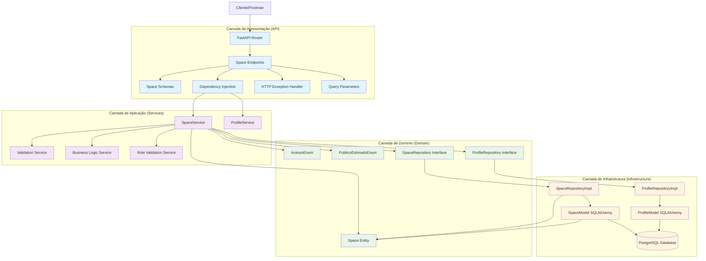

### **Arquitetura Implementada**

O endpoint spaces implementa uma **arquitetura complexa e robusta para gerenciamento de espaços de eventos** seguindo os princípios da **Clean Architecture**:

1. **Camada de Apresentação**: FastAPI com endpoints CRUD, busca especializada e suporte a relacionamentos
2. **Camada de Aplicação**: SpaceService com validações de role, dependências e regras de negócio complexas
3. **Camada de Domínio**: Entidade Space com enums e relacionamentos múltiplos
4. **Camada de Infraestrutura**: Implementação de repositório com joinedload e validações de dependências

### **Características Principais**

- **CRUD Completo**: Operações de criação, leitura, atualização e exclusão
- **Validação de Role**: Apenas perfis com role ESPACO podem criar/atualizar espaços
- **Relacionamentos Múltiplos**: Com profiles, space_types, event_types, festival_types
- **Busca Avançada**: Filtros por profile, space_type, event_type, festival_type
- **Eager Loading**: Suporte a include_relations para carregar dados relacionados
- **Paginação**: Suporte a skip e limit para listagem
- **Atualização Parcial**: Campos opcionais para atualização
- **Enums Complexos**: AcessoEnum e PublicoEstimadoEnum com valores específicos
- **JSON Storage**: Arrays armazenados como JSON (dias_apresentacao, fotos_ambiente)

### **Endpoints Disponíveis**

#### **CRUD Básico:**
1. **POST /spaces/** - Criar novo espaço
2. **GET /spaces/{id}** - Buscar espaço por ID
3. **GET /spaces/** - Listar todos os espaços (com paginação)
4. **PUT /spaces/{id}** - Atualizar espaço
5. **DELETE /spaces/{id}** - Deletar espaço

#### **Busca Especializada:**
6. **GET /spaces/profile/{id}** - Espaços por profile ID
7. **GET /spaces/space-type/{id}** - Espaços por tipo de espaço
8. **GET /spaces/event-type/{id}** - Espaços por tipo de evento
9. **GET /spaces/festival-type/{id}** - Espaços por tipo de festival

### **Regras de Negócio Implementadas**

#### **Validações de Role:**
- **Role ESPACO**: Apenas perfis com role_id = 3 (ESPACO) podem criar espaços
- **Role Validation**: Verificação na criação e atualização
- **Profile Existence**: Profile deve existir antes de criar/atualizar espaço

#### **Validações de Dependências:**
- **Profile Exists**: Profile deve existir
- **Space Type Exists**: Space type deve existir
- **Event Type Exists**: Event type deve existir (opcional)
- **Festival Type Exists**: Festival type deve existir (opcional)

#### **Validações de Dados:**
- **Campos Obrigatórios**: Todos os campos principais são obrigatórios
- **Campos Opcionais**: Redes sociais e tipos de evento/festival são opcionais
- **Atualização Parcial**: Suporte a atualização de campos específicos

### **Validações Implementadas**

#### **Schema Validation:**
- **profile_id**: Integer obrigatório
- **space_type_id**: Integer obrigatório
- **acesso**: AcessoEnum (Público, Privado)
- **dias_apresentacao**: List[str] obrigatório
- **duracao_apresentacao**: Float obrigatório
- **valor_hora**: Float obrigatório
- **valor_couvert**: Float obrigatório
- **requisitos_minimos**: String obrigatório
- **oferecimentos**: String obrigatório
- **estrutura_apresentacao**: String obrigatório
- **publico_estimado**: PublicoEstimadoEnum obrigatório
- **fotos_ambiente**: List[str] obrigatório
- **redes_sociais**: String opcional

#### **Validações de Negócio:**
- **Role Validation**: Verificação de role ESPACO
- **Profile Validation**: Verificação de existência do profile
- **Space Type Validation**: Verificação de existência do space type
- **Event Type Validation**: Verificação de existência do event type (opcional)
- **Festival Type Validation**: Verificação de existência do festival type (opcional)

### **Estrutura de Dados**

#### **Entidade de Domínio:**
- **Space**: Entidade complexa com múltiplos relacionamentos e enums
- **AcessoEnum**: Público, Privado
- **PublicoEstimadoEnum**: Faixas de público (<50, 51-100, 101-500, etc.)

#### **Schemas Pydantic:**
- **SpaceBase**: Schema base com todos os campos
- **SpaceCreate**: Para criação de novos espaços
- **SpaceUpdate**: Para atualização (campos opcionais)
- **SpaceResponse**: Para resposta básica
- **SpaceResponseWithRelations**: Para resposta com dados relacionados

#### **Modelo SQLAlchemy:**
- **SpaceModel**: Mapeamento para tabela spaces
- **Constraints**: FK para profiles, space_types, event_types, festival_types
- **JSON Columns**: dias_apresentacao e fotos_ambiente como JSON
- **Relacionamentos**: Com profiles, space_types, event_types, festival_types

### **Campos Principais**

- **id**: Identificador único (INTEGER PRIMARY KEY)
- **profile_id**: FK para profiles (INTEGER FK NOT NULL)
- **space_type_id**: FK para space_types (INTEGER FK NOT NULL)
- **event_type_id**: FK para event_types (INTEGER FK NULL)
- **festival_type_id**: FK para festival_types (INTEGER FK NULL)
- **acesso**: Tipo de acesso (VARCHAR NOT NULL)
- **dias_apresentacao**: Dias de apresentação (JSON NOT NULL)
- **duracao_apresentacao**: Duração em horas (FLOAT NOT NULL)
- **valor_hora**: Valor por hora (FLOAT NOT NULL)
- **valor_couvert**: Valor do couvert (FLOAT NOT NULL)
- **requisitos_minimos**: Requisitos mínimos (TEXT NOT NULL)
- **oferecimentos**: O que oferece (TEXT NOT NULL)
- **estrutura_apresentacao**: Estrutura (TEXT NOT NULL)
- **publico_estimado**: Público estimado (VARCHAR NOT NULL)
- **fotos_ambiente**: Fotos do ambiente (JSON NOT NULL)
- **redes_sociais**: Instagram, TikTok, YouTube, Facebook (VARCHAR NULL)

### **Fluxos Especiais**

#### **Criação de Espaço:**
1. Validar schema de entrada
2. Verificar se profile existe
3. Verificar se profile tem role ESPACO
4. Criar entidade Space
5. Persistir no banco de dados
6. Retornar SpaceResponse

#### **Atualização de Espaço:**
1. Verificar se espaço existe
2. Se profile_id está sendo alterado, validar role ESPACO
3. Atualizar apenas os campos fornecidos
4. Retornar SpaceResponse

#### **Busca com Relacionamentos:**
1. Configurar joinedload se include_relations=true
2. Executar query com relacionamentos
3. Retornar SpaceResponseWithRelations ou SpaceResponse

#### **Busca por Critérios:**
1. Aplicar filtros específicos (profile, space_type, event_type, festival_type)
2. Configurar joinedload se necessário
3. Retornar lista de espaços

### **Relacionamentos**

- **profiles**: Referenciado pela tabela spaces (N:1)
- **space_types**: Referenciado pela tabela spaces (N:1)
- **event_types**: Referenciado pela tabela spaces (N:1, opcional)
- **festival_types**: Referenciado pela tabela spaces (N:1, opcional)
- **users**: Relacionamento indireto através de profiles
- **roles**: Relacionamento indireto através de profiles

### **Validação de Dependências**

- **Profile Validation**: Verificação de existência do profile antes de operações
- **Space Type Validation**: Verificação de existência do space type
- **Event Type Validation**: Verificação de existência do event type (opcional)
- **Festival Type Validation**: Verificação de existência do festival type (opcional)
- **Role Validation**: Verificação de role ESPACO para criação/atualização

### **Tratamento de Erros**

- **400 Bad Request**: Dados inválidos, role incorreto, profile não encontrado
- **404 Not Found**: Espaço não encontrado
- **500 Internal Server Error**: Erros internos do servidor
- **Validação**: Mensagens de erro descritivas para cada validação

### **Otimizações**

- **Joinedload**: Para carregar relacionamentos eficientemente
- **Índices**: Em id, profile_id, space_type_id para consultas rápidas
- **Paginação**: Para listagens grandes
- **Validação**: No nível de schema, aplicação e domínio
- **Conversão**: Funções específicas para conversão entre camadas
- **JSON Storage**: Para arrays complexos (dias_apresentacao, fotos_ambiente)

### **Enums Implementados**

#### **AcessoEnum:**
```python
class AcessoEnum(str, Enum):
    PUBLICO = "Público"
    PRIVADO = "Privado"
```

#### **PublicoEstimadoEnum:**
```python
class PublicoEstimadoEnum(str, Enum):
    MENOS_50 = "<50"
    CINQUENTA_A_CEM = "51-100"
    CEM_A_QUINHENTOS = "101-500"
    QUINHENTOS_A_MIL = "501-1000"
    MIL_A_TRES_MIL = "1001-3000"
    TRES_MIL_A_CINCO_MIL = "3001-5000"
    CINCO_MIL_A_DEZ_MIL = "5001-10000"
    MAIS_DEZ_MIL = "> 10000"
```

### **Operações SQL Principais**

- **INSERT**: Criar novo espaço (com validações de role e dependências)
- **SELECT**: Buscar por ID, profile, space_type, event_type, festival_type
- **SELECT com JOIN**: Para include_relations
- **UPDATE**: Atualizar espaço (com validações de role)
- **DELETE**: Deletar espaço específico

### **Parâmetros de Query**

- **skip**: Número de registros para pular (padrão: 0)
- **limit**: Número máximo de registros (padrão: 100)
- **include_relations**: Incluir dados relacionados (padrão: false)

# Diagrama de Fluxo - Endpoint Spaces

  

## Fluxo Detalhado da Arquitetura em Camadas

  



  

## Fluxo Detalhado por Operação

```mermaid

sequenceDiagram

participant C as Cliente

participant API as API Layer

participant Service as Space Service

participant ProfileService as Profile Service

participant SpaceRepo as Space Repository

participant ProfileRepo as Profile Repository

participant DB as Database

%% Criação de Space

Note over C,DB: POST /spaces/ - Criar Espaço

C->>API: POST /spaces/ {profile_id, space_type_id, acesso, dias_apresentacao, ...}

API->>API: Validar SpaceCreate schema

API->>Service: create_space(space_data)

%% Verificar role do profile

Service->>ProfileRepo: get_by_id(profile_id)

ProfileRepo->>DB: SELECT * FROM profiles WHERE id = ?

DB-->>ProfileRepo: ProfileModel or None

alt Profile não encontrado

ProfileRepo-->>Service: None

Service-->>API: ValueError("Profile não encontrado")

API-->>C: 400 Bad Request

else Profile encontrado

ProfileRepo-->>Service: Profile entity

Service->>Service: Verificar role_id == 3 (ESPACO)

alt Role não é ESPACO

Service-->>API: ValueError("Apenas perfis com role 'ESPACO' podem cadastrar espaços")

API-->>C: 400 Bad Request

else Role é ESPACO

Service->>Service: Criar Space entity

Service->>SpaceRepo: create(space)

SpaceRepo->>SpaceRepo: Criar SpaceModel

SpaceRepo->>DB: INSERT INTO spaces (profile_id, space_type_id, acesso, ...) VALUES (...)

DB-->>SpaceRepo: Created SpaceModel com ID

SpaceRepo->>SpaceRepo: Converter para Space entity

SpaceRepo-->>Service: Space entity

Service-->>API: Space entity

API->>API: Converter para SpaceResponse

API-->>C: 201 Created + SpaceResponse

end

end

%% Busca por ID

Note over C,DB: GET /spaces/{id} - Buscar por ID

C->>API: GET /spaces/1?include_relations=true

API->>Service: get_space_by_id(1, include_relations=true)

Service->>SpaceRepo: get_by_id(1, include_relations=true)

SpaceRepo->>DB: SELECT * FROM spaces WHERE id = 1

DB-->>SpaceRepo: SpaceModel or None

alt Space encontrado

SpaceRepo->>SpaceRepo: Configurar joinedload se include_relations

SpaceRepo-->>Service: SpaceModel com relações ou Space entity

Service-->>API: SpaceModel ou Space entity

API->>API: Converter para SpaceResponse ou SpaceResponseWithRelations

API-->>C: 200 OK + Response

else Space não encontrado

SpaceRepo-->>Service: None

Service-->>API: None

API-->>C: 404 Not Found

end

%% Listagem com Paginação

Note over C,DB: GET /spaces/ - Listar Espaços

C->>API: GET /spaces/?skip=0&limit=10&include_relations=true

API->>Service: get_all_spaces(skip=0, limit=10, include_relations=true)

Service->>SpaceRepo: get_all(skip=0, limit=10, include_relations=true)

SpaceRepo->>DB: SELECT * FROM spaces OFFSET 0 LIMIT 10

DB-->>SpaceRepo: [SpaceModel]

SpaceRepo->>SpaceRepo: Configurar joinedload se include_relations

SpaceRepo-->>Service: [SpaceModel] ou [Space entities]

Service-->>API: [SpaceModel] ou [Space entities]

API->>API: Converter para [SpaceResponse] ou [SpaceResponseWithRelations]

API-->>C: 200 OK + Response

%% Busca por Profile ID

Note over C,DB: GET /spaces/profile/{id} - Espaços por Profile

C->>API: GET /spaces/profile/1?include_relations=true

API->>Service: get_spaces_by_profile_id(1, include_relations=true)

Service->>SpaceRepo: get_by_profile_id(1, include_relations=true)

SpaceRepo->>DB: SELECT * FROM spaces WHERE profile_id = 1

DB-->>SpaceRepo: [SpaceModel]

SpaceRepo->>SpaceRepo: Configurar joinedload se include_relations

SpaceRepo-->>Service: [SpaceModel] ou [Space entities]

Service-->>API: [SpaceModel] ou [Space entities]

API->>API: Converter para Response

API-->>C: 200 OK + Response

%% Atualização

Note over C,DB: PUT /spaces/{id} - Atualizar Espaço

C->>API: PUT /spaces/1 {profile_id: 2, acesso: "Privado"}

API->>API: Validar SpaceUpdate schema

API->>Service: update_space(1, space_data)

%% Verificar existência

Service->>SpaceRepo: get_by_id(1)

SpaceRepo->>DB: SELECT * FROM spaces WHERE id = 1

DB-->>SpaceRepo: SpaceModel or None

alt Space não encontrado

SpaceRepo-->>Service: None

Service-->>API: ValueError("Space not found")

API-->>C: 400 Bad Request

else Space encontrado

SpaceRepo->>SpaceRepo: Converter para Space entity

SpaceRepo-->>Service: Space entity

%% Verificar role se profile_id estiver sendo alterado

alt profile_id está sendo alterado

Service->>ProfileRepo: get_by_id(novo_profile_id)

ProfileRepo->>DB: SELECT * FROM profiles WHERE id = ?

DB-->>ProfileRepo: ProfileModel or None

alt Profile não encontrado

ProfileRepo-->>Service: None

Service-->>API: ValueError("Profile não encontrado")

API-->>C: 400 Bad Request

else Profile encontrado

ProfileRepo-->>Service: Profile entity

Service->>Service: Verificar role_id == 3 (ESPACO)

alt Role não é ESPACO

Service-->>API: ValueError("Apenas perfis com role 'ESPACO' podem cadastrar espaços")

API-->>C: 400 Bad Request

else Role é ESPACO

Service->>Service: Atualizar campos fornecidos

Service->>SpaceRepo: update(updated_space)

SpaceRepo->>DB: UPDATE spaces SET profile_id = ?, acesso = ?, updated_at = NOW() WHERE id = 1

DB-->>SpaceRepo: Updated SpaceModel

SpaceRepo->>SpaceRepo: Converter para Space entity

SpaceRepo-->>Service: Space entity

Service-->>API: Space entity

API->>API: Converter para SpaceResponse

API-->>C: 200 OK + SpaceResponse

end

end

else profile_id não está sendo alterado

Service->>Service: Atualizar campos fornecidos

Service->>SpaceRepo: update(updated_space)

SpaceRepo->>DB: UPDATE spaces SET acesso = ?, updated_at = NOW() WHERE id = 1

DB-->>SpaceRepo: Updated SpaceModel

SpaceRepo->>SpaceRepo: Converter para Space entity

SpaceRepo-->>Service: Space entity

Service-->>API: Space entity

API->>API: Converter para SpaceResponse

API-->>C: 200 OK + SpaceResponse

end

end

%% Exclusão

Note over C,DB: DELETE /spaces/{id} - Deletar Espaço

C->>API: DELETE /spaces/1

API->>Service: delete_space(1)

Service->>SpaceRepo: delete(1)

SpaceRepo->>DB: SELECT * FROM spaces WHERE id = 1

DB-->>SpaceRepo: SpaceModel or None

alt Space não encontrado

SpaceRepo-->>Service: false

Service-->>API: false

API-->>C: 404 Not Found

else Space encontrado

SpaceRepo->>DB: DELETE FROM spaces WHERE id = 1

DB-->>SpaceRepo: Confirmação

SpaceRepo-->>Service: true

Service-->>API: true

API-->>C: 200 OK + {"message": "Space deletado com sucesso"}

end

```

  



  

## Arquitetura de Validações e Regras de Negócio

  

```mermaid

graph TD

subgraph "Validações de Schema"

ProfileIdValidation[Profile ID Validation]

SpaceTypeIdValidation[Space Type ID Validation]

AcessoValidation[Acesso Validation]

DiasApresentacaoValidation[Dias Apresentação Validation]

ValoresValidation[Valores Validation]

RedesSociaisValidation[Redes Sociais Validation]

end

subgraph "Regras de Negócio"

RoleValidationRule[Apenas role ESPACO pode criar espaços]

ProfileExistsRule[Profile deve existir]

SpaceTypeExistsRule[Space Type deve existir]

EventTypeExistsRule[Event Type deve existir (opcional)]

FestivalTypeExistsRule[Festival Type deve existir (opcional)]

end

subgraph "Validações de Aplicação"

CreateValidation[Criação Validation]

UpdateValidation[Atualização Validation]

DeleteValidation[Exclusão Validation]

RoleCheckValidation[Role Check Validation]

end

subgraph "Operações"

CreateOp[Criar Space]

ReadOp[Ler Space]

ReadAllOp[Listar Spaces]

ReadByProfileOp[Buscar por Profile]

ReadByTypeOp[Buscar por Tipo]

UpdateOp[Atualizar Space]

DeleteOp[Deletar Space]

end

ProfileIdValidation --> ProfileExistsRule

SpaceTypeIdValidation --> SpaceTypeExistsRule

AcessoValidation --> CreateValidation

DiasApresentacaoValidation --> CreateValidation

ValoresValidation --> CreateValidation

RedesSociaisValidation --> CreateValidation

ProfileExistsRule --> RoleValidationRule

RoleValidationRule --> RoleCheckValidation

RoleCheckValidation --> CreateValidation

RoleCheckValidation --> UpdateValidation

ProfileExistsRule --> UpdateValidation

SpaceTypeExistsRule --> UpdateValidation

CreateValidation --> CreateOp

UpdateValidation --> UpdateOp

DeleteValidation --> DeleteOp

CreateOp --> ReadOp

CreateOp --> ReadAllOp

CreateOp --> ReadByProfileOp

CreateOp --> ReadByTypeOp

CreateOp --> UpdateOp

CreateOp --> DeleteOp

%% Estilos

classDef validation fill:#e3f2fd

classDef rule fill:#e8f5e8

classDef appValidation fill:#fff3e0

classDef operation fill:#ffebee

class ProfileIdValidation,SpaceTypeIdValidation,AcessoValidation,DiasApresentacaoValidation,ValoresValidation,RedesSociaisValidation validation

class RoleValidationRule,ProfileExistsRule,SpaceTypeExistsRule,EventTypeExistsRule,FestivalTypeExistsRule rule

class CreateValidation,UpdateValidation,DeleteValidation,RoleCheckValidation appValidation

class CreateOp,ReadOp,ReadAllOp,ReadByProfileOp,ReadByTypeOp,UpdateOp,DeleteOp operation

```

  

## Estrutura de Dados e Modelo de Banco

  

```mermaid

graph TD

subgraph "Entidade de Domínio"

SpaceEntity[Space Entity]

IdField[id: Optional[int]]

ProfileIdField[profile_id: int]

SpaceTypeIdField[space_type_id: int]

EventTypeIdField[event_type_id: Optional[int]]

FestivalTypeIdField[festival_type_id: Optional[int]]

AcessoField[acesso: AcessoEnum]

DiasApresentacaoField[dias_apresentacao: List[str]]

DuracaoApresentacaoField[duracao_apresentacao: float]

ValorHoraField[valor_hora: float]

ValorCouvertField[valor_couvert: float]

RequisitosMinimosField[requisitos_minimos: str]

OferecimentosField[oferecimentos: str]

EstruturaApresentacaoField[estrutura_apresentacao: str]

PublicoEstimadoField[publico_estimado: PublicoEstimadoEnum]

FotosAmbienteField[fotos_ambiente: List[str]]

RedesSociaisField[redes_sociais: Optional[str]]

TimestampsField[timestamps: datetime]

end

subgraph "Enums"

AcessoEnum[AcessoEnum]

PublicoEstimadoEnum[PublicoEstimadoEnum]

PublicoValue[Público]

PrivadoValue[Privado]

Menos50Value[<50]

CinquentaA100Value[51-100]

CemA500Value[101-500]

QuinhentosA1000Value[501-1000]

MilA3000Value[1001-3000]

TresMilA5000Value[3001-5000]

CincoMilA10MilValue[5001-10000]

Mais10MilValue[> 10000]

end

subgraph "Schema Pydantic"

SpaceBase[SpaceBase]

SpaceCreate[SpaceCreate]

SpaceUpdate[SpaceUpdate]

SpaceResponse[SpaceResponse]

SpaceResponseWithRelations[SpaceResponseWithRelations]

end

subgraph "Modelo SQLAlchemy"

SpaceModel[SpaceModel]

IdColumn[id: INTEGER PRIMARY KEY]

ProfileIdColumn[profile_id: INTEGER FK NOT NULL]

SpaceTypeIdColumn[space_type_id: INTEGER FK NOT NULL]

EventTypeIdColumn[event_type_id: INTEGER FK NULL]

FestivalTypeIdColumn[festival_type_id: INTEGER FK NULL]

AcessoColumn[acesso: VARCHAR NOT NULL]

DiasApresentacaoColumn[dias_apresentacao: JSON NOT NULL]

DuracaoApresentacaoColumn[duracao_apresentacao: FLOAT NOT NULL]

ValorHoraColumn[valor_hora: FLOAT NOT NULL]

ValorCouvertColumn[valor_couvert: FLOAT NOT NULL]

RequisitosMinimosColumn[requisitos_minimos: TEXT NOT NULL]

OferecimentosColumn[oferecimentos: TEXT NOT NULL]

EstruturaApresentacaoColumn[estrutura_apresentacao: TEXT NOT NULL]

PublicoEstimadoColumn[publico_estimado: VARCHAR NOT NULL]

FotosAmbienteColumn[fotos_ambiente: JSON NOT NULL]

RedesSociaisColumn[redes_sociais: VARCHAR NULL]

TimestampsColumn[timestamps: TIMESTAMP]

end

subgraph "Tabela do Banco"

SpacesTable[(spaces)]

IdTableField[id: INTEGER PRIMARY KEY]

ProfileIdTableField[profile_id: INTEGER FK NOT NULL]

SpaceTypeIdTableField[space_type_id: INTEGER FK NOT NULL]

EventTypeIdTableField[event_type_id: INTEGER FK NULL]

FestivalTypeIdTableField[festival_type_id: INTEGER FK NULL]

AcessoTableField[acesso: VARCHAR NOT NULL]

DiasApresentacaoTableField[dias_apresentacao: JSON NOT NULL]

DuracaoApresentacaoTableField[duracao_apresentacao: FLOAT NOT NULL]

ValorHoraTableField[valor_hora: FLOAT NOT NULL]

ValorCouvertTableField[valor_couvert: FLOAT NOT NULL]

RequisitosMinimosTableField[requisitos_minimos: TEXT NOT NULL]

OferecimentosTableField[oferecimentos: TEXT NOT NULL]

EstruturaApresentacaoTableField[estrutura_apresentacao: TEXT NOT NULL]

PublicoEstimadoTableField[publico_estimado: VARCHAR NOT NULL]

FotosAmbienteTableField[fotos_ambiente: JSON NOT NULL]

RedesSociaisTableField[redes_sociais: VARCHAR NULL]

TimestampsTableField[timestamps: TIMESTAMP]

end

SpaceEntity --> IdField

SpaceEntity --> ProfileIdField

SpaceEntity --> SpaceTypeIdField

SpaceEntity --> EventTypeIdField

SpaceEntity --> FestivalTypeIdField

SpaceEntity --> AcessoField

SpaceEntity --> DiasApresentacaoField

SpaceEntity --> DuracaoApresentacaoField

SpaceEntity --> ValorHoraField

SpaceEntity --> ValorCouvertField

SpaceEntity --> RequisitosMinimosField

SpaceEntity --> OferecimentosField

SpaceEntity --> EstruturaApresentacaoField

SpaceEntity --> PublicoEstimadoField

SpaceEntity --> FotosAmbienteField

SpaceEntity --> RedesSociaisField

SpaceEntity --> TimestampsField

AcessoEnum --> PublicoValue

AcessoEnum --> PrivadoValue

PublicoEstimadoEnum --> Menos50Value

PublicoEstimadoEnum --> CinquentaA100Value

PublicoEstimadoEnum --> CemA500Value

PublicoEstimadoEnum --> QuinhentosA1000Value

PublicoEstimadoEnum --> MilA3000Value

PublicoEstimadoEnum --> TresMilA5000Value

PublicoEstimadoEnum --> CincoMilA10MilValue

PublicoEstimadoEnum --> Mais10MilValue

AcessoField --> AcessoEnum

PublicoEstimadoField --> PublicoEstimadoEnum

SpaceBase --> ProfileIdField

SpaceBase --> SpaceTypeIdField

SpaceBase --> EventTypeIdField

SpaceBase --> FestivalTypeIdField

SpaceBase --> AcessoField

SpaceBase --> DiasApresentacaoField

SpaceBase --> DuracaoApresentacaoField

SpaceBase --> ValorHoraField

SpaceBase --> ValorCouvertField

SpaceBase --> RequisitosMinimosField

SpaceBase --> OferecimentosField

SpaceBase --> EstruturaApresentacaoField

SpaceBase --> PublicoEstimadoField

SpaceBase --> FotosAmbienteField

SpaceBase --> RedesSociaisField

SpaceCreate --> SpaceBase

SpaceUpdate --> ProfileIdField

SpaceUpdate --> SpaceTypeIdField

SpaceUpdate --> EventTypeIdField

SpaceUpdate --> FestivalTypeIdField

SpaceUpdate --> AcessoField

SpaceUpdate --> DiasApresentacaoField

SpaceUpdate --> DuracaoApresentacaoField

SpaceUpdate --> ValorHoraField

SpaceUpdate --> ValorCouvertField

SpaceUpdate --> RequisitosMinimosField

SpaceUpdate --> OferecimentosField

SpaceUpdate --> EstruturaApresentacaoField

SpaceUpdate --> PublicoEstimadoField

SpaceUpdate --> FotosAmbienteField

SpaceUpdate --> RedesSociaisField

SpaceResponse --> SpaceBase

SpaceResponse --> IdField

SpaceResponse --> TimestampsField

SpaceResponseWithRelations --> SpaceResponse

SpaceModel --> IdColumn

SpaceModel --> ProfileIdColumn

SpaceModel --> SpaceTypeIdColumn

SpaceModel --> EventTypeIdColumn

SpaceModel --> FestivalTypeIdColumn

SpaceModel --> AcessoColumn

SpaceModel --> DiasApresentacaoColumn

SpaceModel --> DuracaoApresentacaoColumn

SpaceModel --> ValorHoraColumn

SpaceModel --> ValorCouvertColumn

SpaceModel --> RequisitosMinimosColumn

SpaceModel --> OferecimentosColumn

SpaceModel --> EstruturaApresentacaoColumn

SpaceModel --> PublicoEstimadoColumn

SpaceModel --> FotosAmbienteColumn

SpaceModel --> RedesSociaisColumn

SpaceModel --> TimestampsColumn

SpaceModel --> SpacesTable

IdColumn --> IdTableField

ProfileIdColumn --> ProfileIdTableField

SpaceTypeIdColumn --> SpaceTypeIdTableField

EventTypeIdColumn --> EventTypeIdTableField

FestivalTypeIdColumn --> FestivalTypeIdTableField

AcessoColumn --> AcessoTableField

DiasApresentacaoColumn --> DiasApresentacaoTableField

DuracaoApresentacaoColumn --> DuracaoApresentacaoTableField

ValorHoraColumn --> ValorHoraTableField

ValorCouvertColumn --> ValorCouvertTableField

RequisitosMinimosColumn --> RequisitosMinimosTableField

OferecimentosColumn --> OferecimentosTableField

EstruturaApresentacaoColumn --> EstruturaApresentacaoTableField

PublicoEstimadoColumn --> PublicoEstimadoTableField

FotosAmbienteColumn --> FotosAmbienteTableField

RedesSociaisColumn --> RedesSociaisTableField

TimestampsColumn --> TimestampsTableField

%% Estilos

classDef entity fill:#e8f5e8

classDef enum fill:#e1f5fe

classDef schema fill:#f3e5f5

classDef model fill:#fff3e0

classDef table fill:#ffebee

class SpaceEntity,IdField,ProfileIdField,SpaceTypeIdField,EventTypeIdField,FestivalTypeIdField,AcessoField,DiasApresentacaoField,DuracaoApresentacaoField,ValorHoraField,ValorCouvertField,RequisitosMinimosField,OferecimentosField,EstruturaApresentacaoField,PublicoEstimadoField,FotosAmbienteField,RedesSociaisField,TimestampsField entity

class AcessoEnum,PublicoEstimadoEnum,PublicoValue,PrivadoValue,Menos50Value,CinquentaA100Value,CemA500Value,QuinhentosA1000Value,MilA3000Value,TresMilA5000Value,CincoMilA10MilValue,Mais10MilValue enum

class SpaceBase,SpaceCreate,SpaceUpdate,SpaceResponse,SpaceResponseWithRelations schema

class SpaceModel,IdColumn,ProfileIdColumn,SpaceTypeIdColumn,EventTypeIdColumn,FestivalTypeIdColumn,AcessoColumn,DiasApresentacaoColumn,DuracaoApresentacaoColumn,ValorHoraColumn,ValorCouvertColumn,RequisitosMinimosColumn,OferecimentosColumn,EstruturaApresentacaoColumn,PublicoEstimadoColumn,FotosAmbienteColumn,RedesSociaisColumn,TimestampsColumn model

class SpacesTable,IdTableField,ProfileIdTableField,SpaceTypeIdTableField,EventTypeIdTableField,FestivalTypeIdTableField,AcessoTableField,DiasApresentacaoTableField,DuracaoApresentacaoTableField,ValorHoraTableField,ValorCouvertTableField,RequisitosMinimosTableField,OferecimentosTableField,EstruturaApresentacaoTableField,PublicoEstimadoTableField,FotosAmbienteTableField,RedesSociaisTableField,TimestampsTableField table

```

  

## Endpoints e Operações CRUD

  

```mermaid

graph LR

subgraph "Endpoints CRUD"

CreateEndpoint[POST /spaces/]

GetByIdEndpoint[GET /spaces/{id}]

GetAllEndpoint[GET /spaces/]

UpdateEndpoint[PUT /spaces/{id}]

DeleteEndpoint[DELETE /spaces/{id}]

end

subgraph "Endpoints de Busca"

GetByProfileEndpoint[GET /spaces/profile/{id}]

GetBySpaceTypeEndpoint[GET /spaces/space-type/{id}]

GetByEventTypeEndpoint[GET /spaces/event-type/{id}]

GetByFestivalTypeEndpoint[GET /spaces/festival-type/{id}]

end

subgraph "Operações"

CreateOp[Criar Space]

ReadOp[Ler Space]

ReadAllOp[Listar Spaces]

ReadByProfileOp[Buscar por Profile]

ReadBySpaceTypeOp[Buscar por Space Type]

ReadByEventTypeOp[Buscar por Event Type]

ReadByFestivalTypeOp[Buscar por Festival Type]

UpdateOp[Atualizar Space]

DeleteOp[Deletar Space]

end

subgraph "Validações"

RoleValidation[Role Validation]

ProfileValidation[Profile Validation]

SpaceTypeValidation[Space Type Validation]

EventTypeValidation[Event Type Validation]

FestivalTypeValidation[Festival Type Validation]

SchemaValidation[Schema Validation]

end

subgraph "Parâmetros"

SkipParam[skip: int = 0]

LimitParam[limit: int = 100]

IncludeRelationsParam[include_relations: bool = False]

IdParam[id: int]

end

CreateEndpoint --> CreateOp

GetByIdEndpoint --> ReadOp

GetAllEndpoint --> ReadAllOp

UpdateEndpoint --> UpdateOp

DeleteEndpoint --> DeleteOp

GetByProfileEndpoint --> ReadByProfileOp

GetBySpaceTypeEndpoint --> ReadBySpaceTypeOp

GetByEventTypeEndpoint --> ReadByEventTypeOp

GetByFestivalTypeEndpoint --> ReadByFestivalTypeOp

CreateOp --> RoleValidation

CreateOp --> ProfileValidation

CreateOp --> SpaceTypeValidation

CreateOp --> SchemaValidation

UpdateOp --> RoleValidation

UpdateOp --> ProfileValidation

UpdateOp --> SpaceTypeValidation

UpdateOp --> SchemaValidation

DeleteOp --> ProfileValidation

GetAllEndpoint --> SkipParam

GetAllEndpoint --> LimitParam

GetAllEndpoint --> IncludeRelationsParam

GetByIdEndpoint --> IdParam

GetByIdEndpoint --> IncludeRelationsParam

GetByProfileEndpoint --> IdParam

GetByProfileEndpoint --> IncludeRelationsParam

GetBySpaceTypeEndpoint --> IdParam

GetBySpaceTypeEndpoint --> IncludeRelationsParam

GetByEventTypeEndpoint --> IdParam

GetByEventTypeEndpoint --> IncludeRelationsParam

GetByFestivalTypeEndpoint --> IdParam

GetByFestivalTypeEndpoint --> IncludeRelationsParam

UpdateEndpoint --> IdParam

DeleteEndpoint --> IdParam

%% Estilos

classDef crudEndpoint fill:#e1f5fe

classDef searchEndpoint fill:#f3e5f5

classDef operation fill:#e8f5e8

classDef validation fill:#fff3e0

classDef parameter fill:#ffebee

class CreateEndpoint,GetByIdEndpoint,GetAllEndpoint,UpdateEndpoint,DeleteEndpoint crudEndpoint

class GetByProfileEndpoint,GetBySpaceTypeEndpoint,GetByEventTypeEndpoint,GetByFestivalTypeEndpoint searchEndpoint

class CreateOp,ReadOp,ReadAllOp,ReadByProfileOp,ReadBySpaceTypeOp,ReadByEventTypeOp,ReadByFestivalTypeOp,UpdateOp,DeleteOp operation

class RoleValidation,ProfileValidation,SpaceTypeValidation,EventTypeValidation,FestivalTypeValidation,SchemaValidation validation

class SkipParam,LimitParam,IncludeRelationsParam,IdParam parameter

```

  

## Relacionamentos e Dependências

  

```mermaid

graph TD

subgraph "Entidades Relacionadas"

SpaceEntity[Space Entity]

ProfileEntity[Profile Entity]

SpaceTypeEntity[Space Type Entity]

EventTypeEntity[Event Type Entity]

FestivalTypeEntity[Festival Type Entity]

UserEntity[User Entity]

RoleEntity[Role Entity]

end

subgraph "Relacionamentos"

SpaceToProfile[Space → Profile (N:1)]

SpaceToSpaceType[Space → Space Type (N:1)]

SpaceToEventType[Space → Event Type (N:1)]

SpaceToFestivalType[Space → Festival Type (N:1)]

ProfileToUser[Profile → User (N:1)]

ProfileToRole[Profile → Role (N:1)]

end

subgraph "Tabelas do Banco"

SpacesTable[(spaces)]

ProfilesTable[(profiles)]

SpaceTypesTable[(space_types)]

EventTypesTable[(event_types)]

FestivalTypesTable[(festival_types)]

UsersTable[(users)]

RolesTable[(roles)]

end

subgraph "Foreign Keys"

SpaceProfileFK[space.profile_id → profiles.id]

SpaceSpaceTypeFK[space.space_type_id → space_types.id]

SpaceEventTypeFK[space.event_type_id → event_types.id]

SpaceFestivalTypeFK[space.festival_type_id → festival_types.id]

ProfileUserFK[profile.user_id → users.id]

ProfileRoleFK[profile.role_id → roles.id]

end

subgraph "Validações de Dependência"

ProfileExistsValidation[Validar se Profile existe]

SpaceTypeExistsValidation[Validar se Space Type existe]

EventTypeExistsValidation[Validar se Event Type existe]

FestivalTypeExistsValidation[Validar se Festival Type existe]

RoleValidation[Validar se Role é ESPACO]

end

SpaceEntity --> SpaceToProfile

SpaceEntity --> SpaceToSpaceType

SpaceEntity --> SpaceToEventType

SpaceEntity --> SpaceToFestivalType

ProfileEntity --> SpaceToProfile

SpaceTypeEntity --> SpaceToSpaceType

EventTypeEntity --> SpaceToEventType

FestivalTypeEntity --> SpaceToFestivalType

ProfileEntity --> ProfileToUser

ProfileEntity --> ProfileToRole

UserEntity --> ProfileToUser

RoleEntity --> ProfileToRole

SpacesTable --> ProfilesTable

SpacesTable --> SpaceTypesTable

SpacesTable --> EventTypesTable

SpacesTable --> FestivalTypesTable

ProfilesTable --> UsersTable

ProfilesTable --> RolesTable

SpaceProfileFK --> ProfilesTable

SpaceSpaceTypeFK --> SpaceTypesTable

SpaceEventTypeFK --> EventTypesTable

SpaceFestivalTypeFK --> FestivalTypesTable

ProfileUserFK --> UsersTable

ProfileRoleFK --> RolesTable

ProfileExistsValidation --> ProfileEntity

SpaceTypeExistsValidation --> SpaceTypeEntity

EventTypeExistsValidation --> EventTypeEntity

FestivalTypeExistsValidation --> FestivalTypeEntity

RoleValidation --> RoleEntity

%% Estilos

classDef entity fill:#e8f5e8

classDef relationship fill:#e1f5fe

classDef table fill:#f3e5f5

classDef fk fill:#fff3e0

classDef validation fill:#ffebee

class SpaceEntity,ProfileEntity,SpaceTypeEntity,EventTypeEntity,FestivalTypeEntity,UserEntity,RoleEntity entity

class SpaceToProfile,SpaceToSpaceType,SpaceToEventType,SpaceToFestivalType,ProfileToUser,ProfileToRole relationship

class SpacesTable,ProfilesTable,SpaceTypesTable,EventTypesTable,FestivalTypesTable,UsersTable,RolesTable table

class SpaceProfileFK,SpaceSpaceTypeFK,SpaceEventTypeFK,SpaceFestivalTypeFK,ProfileUserFK,ProfileRoleFK fk

class ProfileExistsValidation,SpaceTypeExistsValidation,EventTypeExistsValidation,FestivalTypeExistsValidation,RoleValidation validation

```

  

## Fluxo de Conversão de Dados

  

```mermaid

graph TD

subgraph "Camada de Apresentação"

RequestSchema[SpaceCreate/Update]

ResponseSchema[SpaceResponse]

ResponseWithRelationsSchema[SpaceResponseWithRelations]

ListResponseSchema[List[SpaceResponse]]

end

subgraph "Camada de Aplicação"

ServiceLayer[SpaceService]

EntityCreation[Entity Creation]

ResponseCreation[Response Creation]

ValidationLayer[Validation Layer]

RoleValidationLayer[Role Validation Layer]

end

subgraph "Camada de Domínio"

DomainEntity[Space Entity]

AcessoEnum[AcessoEnum]

PublicoEstimadoEnum[PublicoEstimadoEnum]

end

subgraph "Camada de Infraestrutura"

RepositoryLayer[SpaceRepositoryImpl]

DatabaseModel[SpaceModel]

DatabaseTable[(spaces)]

JoinedLoadLayer[Joined Load Layer]

end

subgraph "Conversões"

SchemaToEntity[Schema → Entity]

EntityToModel[Entity → Model]

ModelToEntity[Model → Entity]

EntityToResponse[Entity → Response]

EntityToResponseWithRelations[Entity → Response With Relations]

ModelToResponseWithRelations[Model → Response With Relations]

end

subgraph "Validações"

RoleValidation[Role Validation]

ProfileValidation[Profile Validation]

SpaceTypeValidation[Space Type Validation]

EventTypeValidation[Event Type Validation]

FestivalTypeValidation[Festival Type Validation]

end

RequestSchema --> SchemaToEntity

SchemaToEntity --> DomainEntity

DomainEntity --> EntityToModel

EntityToModel --> DatabaseModel

DatabaseModel --> DatabaseTable

DatabaseTable --> DatabaseModel

DatabaseModel --> ModelToEntity

ModelToEntity --> DomainEntity

DomainEntity --> EntityToResponse

DomainEntity --> EntityToResponseWithRelations

EntityToResponse --> ResponseSchema

EntityToResponseWithRelations --> ResponseWithRelationsSchema

ModelToResponseWithRelations --> ResponseWithRelationsSchema

ServiceLayer --> EntityCreation

ServiceLayer --> ResponseCreation

ServiceLayer --> ValidationLayer

ServiceLayer --> RoleValidationLayer

RepositoryLayer --> EntityToModel

RepositoryLayer --> ModelToEntity

RepositoryLayer --> JoinedLoadLayer

ValidationLayer --> RoleValidation

ValidationLayer --> ProfileValidation

ValidationLayer --> SpaceTypeValidation

ValidationLayer --> EventTypeValidation

ValidationLayer --> FestivalTypeValidation

%% Estilos

classDef presentation fill:#e1f5fe

classDef application fill:#f3e5f5

classDef domain fill:#e8f5e8

classDef infrastructure fill:#fff3e0

classDef conversion fill:#ffebee

classDef validation fill:#f1f8e9

class RequestSchema,ResponseSchema,ResponseWithRelationsSchema,ListResponseSchema presentation

class ServiceLayer,EntityCreation,ResponseCreation,ValidationLayer,RoleValidationLayer application

class DomainEntity,AcessoEnum,PublicoEstimadoEnum domain

class RepositoryLayer,DatabaseModel,DatabaseTable,JoinedLoadLayer infrastructure

class SchemaToEntity,EntityToModel,ModelToEntity,EntityToResponse,EntityToResponseWithRelations,ModelToResponseWithRelations conversion

class RoleValidation,ProfileValidation,SpaceTypeValidation,EventTypeValidation,FestivalTypeValidation validation

```