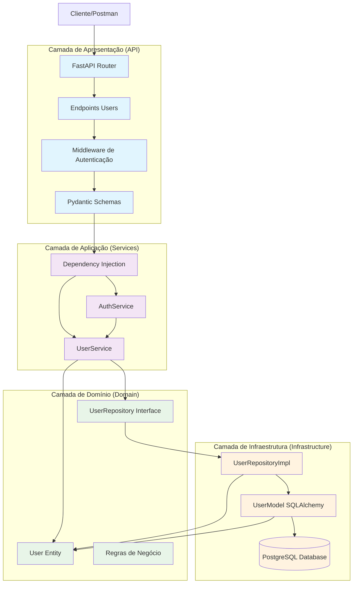
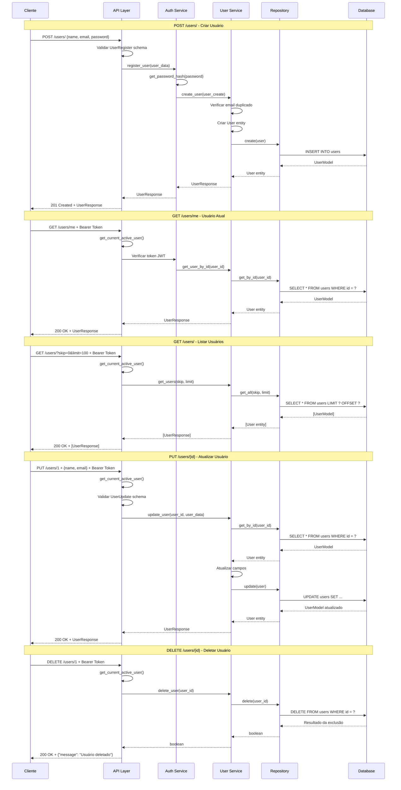
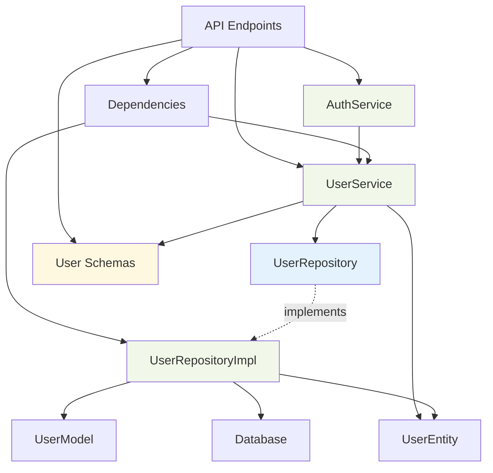
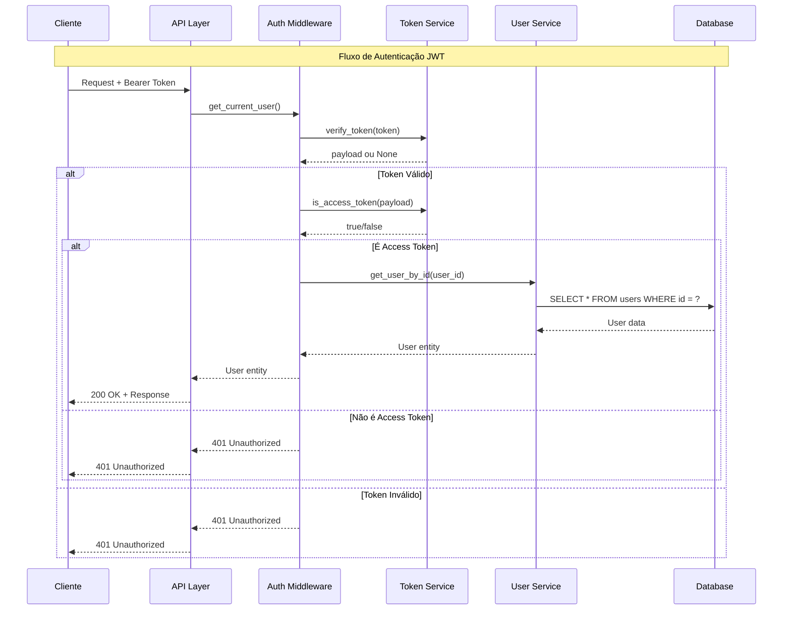

### **Arquitetura em Camadas**

O endpoint users segue uma arquitetura em camadas bem definida, implementando o padrão **Clean Architecture** com as seguintes camadas:

#### **1. Camada de Apresentação (API Layer)**
- **Arquivo**: `app/api/endpoints/users.py`
- **Responsabilidade**: Receber requisições HTTP, validar dados de entrada e retornar respostas
- **Componentes**: FastAPI Router, endpoints HTTP (GET, POST, PUT, DELETE)

#### **2. Camada de Aplicação (Application Layer)**
- **Arquivos**: 
  - `app/application/services/user_service.py`
  - `app/application/services/auth_service.py`
  - `app/application/dependencies.py`
- **Responsabilidade**: Orquestrar a lógica de negócio, coordenar entre domínio e infraestrutura
- **Componentes**: Services, Dependencies (Injeção de Dependência)

#### **3. Camada de Domínio (Domain Layer)**
- **Arquivos**:
  - `domain/entities/user.py`
  - `domain/repositories/user_repository.py`
- **Responsabilidade**: Contém as regras de negócio centrais e interfaces dos repositórios
- **Componentes**: Entidades, Interfaces de Repositório

#### **4. Camada de Infraestrutura (Infrastructure Layer)**
- **Arquivos**:
  - `infrastructure/repositories/user_repository_impl.py`
  - `infrastructure/database/models/user_model.py`
  - `infrastructure/database/database.py`
- **Responsabilidade**: Implementação concreta de persistência e acesso a dados
- **Componentes**: Implementações de Repositório, Modelos SQLAlchemy, Banco de Dados

### **Fluxo Detalhado por Endpoint**

#### **POST /users/ (Criar Usuário)**
1. **Recepção**: FastAPI recebe requisição com dados do usuário
2. **Validação**: Pydantic valida o schema `UserRegister`
3. **Injeção**: Dependency injection fornece `UserService`
4. **Orquestração**: `AuthService.register_user()` é chamado
5. **Hash de Senha**: `get_password_hash()` criptografa a senha
6. **Criação**: `UserService.create_user()` cria entidade de domínio
7. **Persistência**: `UserRepositoryImpl.create()` salva no banco
8. **Resposta**: Retorna `UserResponse` com dados do usuário criado

#### **GET /users/me (Usuário Atual)**
1. **Autenticação**: `get_current_active_user()` valida token JWT
2. **Verificação**: Token é verificado e decodificado
3. **Busca**: Usuário é recuperado do banco
4. **Resposta**: Retorna dados do usuário autenticado

#### **GET /users/ (Listar Usuários)**
1. **Autenticação**: Verifica se usuário está autenticado
2. **Paginação**: Parâmetros `skip` e `limit` são processados
3. **Busca**: `UserService.get_users()` recupera lista paginada
4. **Transformação**: Entidades são convertidas para schemas de resposta
5. **Resposta**: Lista de `UserResponse` é retornada

#### **GET /users/{user_id} (Buscar Usuário Específico)**
1. **Autenticação**: Verifica autenticação do usuário
2. **Busca**: `UserService.get_user_by_id()` busca usuário específico
3. **Validação**: Verifica se usuário existe
4. **Resposta**: Retorna `UserResponse` ou erro 404

#### **PUT /users/{user_id} (Atualizar Usuário)**
1. **Autenticação**: Verifica autenticação
2. **Validação**: Pydantic valida `UserUpdate` schema
3. **Busca**: Recupera usuário existente
4. **Atualização**: Aplica mudanças na entidade
5. **Persistência**: Salva alterações no banco
6. **Resposta**: Retorna usuário atualizado

#### **DELETE /users/{user_id} (Deletar Usuário)**
1. **Autenticação**: Verifica autenticação
2. **Exclusão**: `UserService.delete_user()` remove do banco
3. **Validação**: Verifica se exclusão foi bem-sucedida
4. **Resposta**: Retorna mensagem de confirmação

### **Diagrama de Fluxo em Mermaid**

## Resumo da Análise do Endpoint Users

### **Arquitetura Implementada**

O endpoint users implementa uma **arquitetura em camadas bem estruturada** seguindo os princípios da **Clean Architecture**:

1. **Camada de Apresentação**: FastAPI com endpoints REST, validação Pydantic e middleware de autenticação
2. **Camada de Aplicação**: Services que orquestram a lógica de negócio e dependency injection
3. **Camada de Domínio**: Entidades puras e interfaces de repositório
4. **Camada de Infraestrutura**: Implementações concretas de persistência com SQLAlchemy

### **Características Principais**

- **Separação de Responsabilidades**: Cada camada tem responsabilidades bem definidas
- **Inversão de Dependência**: Interfaces no domínio, implementações na infraestrutura
- **Autenticação JWT**: Sistema robusto de autenticação com tokens
- **Validação de Dados**: Schemas Pydantic para validação de entrada e saída
- **Tratamento de Erros**: HTTP exceptions apropriadas para diferentes cenários
- **Paginação**: Suporte a listagem paginada de usuários

### **Endpoints Disponíveis**

1. **POST /users/** - Criar usuário (com hash de senha)
2. **GET /users/me** - Obter usuário atual autenticado
3. **GET /users/** - Listar usuários (com paginação)
4. **GET /users/{id}** - Buscar usuário específico
5. **PUT /users/{id}** - Atualizar usuário
6. **DELETE /users/{id}** - Deletar usuário

### **Segurança**

- **Hash de Senhas**: Senhas são criptografadas antes do armazenamento
- **Autenticação JWT**: Tokens Bearer para autenticação
- **Validação de Token**: Verificação de validade e tipo de token
- **Blacklist**: Sistema para invalidar tokens (estrutura preparada)

# Diagrama de Fluxo - Endpoint Users

## Fluxo Detalhado da Arquitetura em Camadas

  

  

## Fluxo Detalhado por Operação

  

  

## Arquitetura de Dependências

  

  

## Fluxo de Autenticação JWT

  

